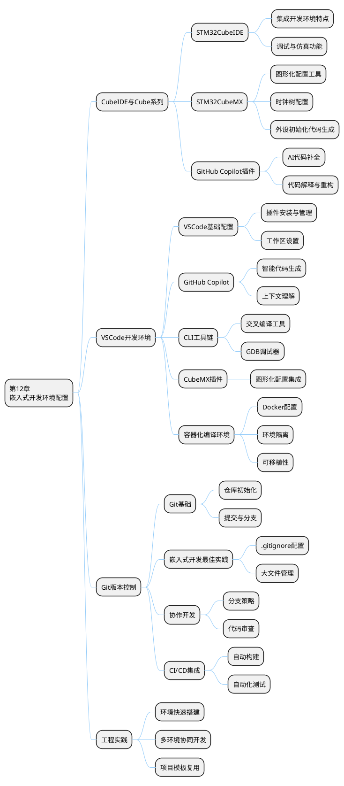
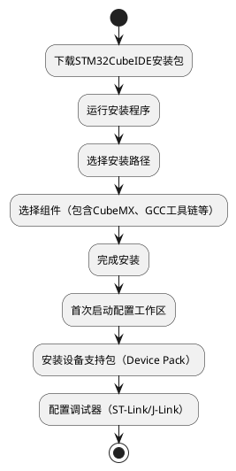
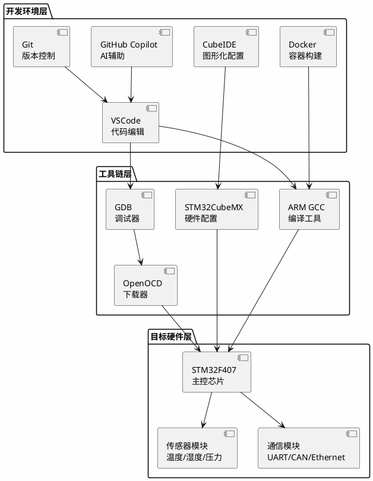

## B 附录 B：实验用容器与开发环境配置

### B.1 本章知识导图



**图 B-1** 
<!-- fig:chB-1  -->

### B.2 章节导入

嵌入式开发环境是进行嵌入式系统开发的基础和前提。一个高效、稳定、易用的开发环境能够显著提升开发效率，降低开发成本，缩短产品上市周期。本章将系统介绍三种主流的嵌入式开发环境配置方案，包括 ST 官方的 CubeIDE 生态系统、VSCode 轻量级开发环境以及 Git 版本控制系统在嵌入式开发中的应用。

通过本章学习，学生将掌握：
- STM32CubeIDE 与 CubeMX 的配置与使用方法

- GitHub Copilot 在嵌入式开发中的 AI 辅助编程技巧
- VSCode 作为嵌入式开发环境的完整配置方案
- 基于 Docker 的容器化嵌入式编译环境构建
- Git 在嵌入式开发中的版本控制最佳实践

---

### B.3 CubeIDE 与 Cube 系列开发环境

#### B.3.1 STM32CubeIDE 概述

STM32CubeIDE 是 STMicroelectronics 推出的一款集成开发环境（IDE），基于 Eclipse 框架，专为 STM32 微控制器和微处理器设计。它将代码编辑、编译、调试、仿真等功能集成于一体，为开发者提供一站式开发体验。

##### 12.3.1.1 STM32CubeIDE 核心特性

**表 B-1** STM32CubeIDE 核心特性
<!-- tab:chB-1 STM32CubeIDE 核心特性 -->

| 特性类别 | 功能描述 | 优势 |
|---------|---------|------|
| 编辑器 | 语法高亮、代码补全、自动格式化 | 提升代码编写效率 |
| 编译器 | 集成GCC ARM工具链 | 无需额外配置编译环境 |
| 调试器 | 集成GDB调试器，支持SWD/JTAG接口 | 硬件级调试能力 |
| 仿真器 | 支持STM32仿真模型 | 硬件无关的功能验证 |
| CubeMX集成 | 内置图形化配置工具 | 无缝衔接硬件配置与代码开发 |

通过上表的对比可以看出，不同方案在特性类别、功能描述、优势等方面各有优劣，实际选型时应结合具体应用场景综合权衡。

##### 12.3.1.2 安装与配置流程

STM32CubeIDE 的安装流程如下：



**图 B-2** 安装与配置流程
<!-- fig:chB-2 安装与配置流程 -->

#### B.3.2 STM32CubeMX 图形化配置

STM32CubeMX 是 STM32CubeIDE 的核心组件之一，提供图形化的芯片配置界面，通过可视化操作完成引脚分配、时钟配置、外设初始化等工作，并自动生成初始化代码。

##### 12.3.2.1 核心功能模块

1. **引脚配置（Pinout & Configuration）**
   - 可视化引脚分配
   - 自动检测引脚冲突
   - 外设功能映射

2. **时钟配置（Clock Configuration）**
   - 图形化时钟树
   - 自动 PLL 计算
   - 时钟源选择与配置

3. **项目管理（Project Manager）**
   - 生成 IDE 项目文件
   - 代码生成选项配置
   - 堆栈大小设置

##### 12.3.2.2 时钟配置示例

以下是 STM32F407 时钟配置的关键代码片段：

```c
void SystemClock_Config(void)
{
  RCC_OscInitTypeDef RCC_OscInitStruct = {0};
  RCC_ClkInitTypeDef RCC_ClkInitStruct = {0};

  // 配置主内部调压器输出电压
  __HAL_RCC_PWR_CLK_ENABLE();
  __HAL_PWR_VOLTAGESCALING_CONFIG(PWR_REGULATOR_VOLTAGE_SCALE1);

  // 初始化HSE、PLL等振荡器
  RCC_OscInitStruct.OscillatorType = RCC_OSCILLATORTYPE_HSE;
  RCC_OscInitStruct.HSEState = RCC_HSE_ON;
  RCC_OscInitStruct.PLL.PLLState = RCC_PLL_ON;
  RCC_OscInitStruct.PLL.PLLSource = RCC_PLLSOURCE_HSE;
  RCC_OscInitStruct.PLL.PLLM = 8;
  RCC_OscInitStruct.PLL.PLLN = 336;
  RCC_OscInitStruct.PLL.PLLP = RCC_PLLP_DIV2;
  RCC_OscInitStruct.PLL.PLLQ = 7;
  if (HAL_RCC_OscConfig(&RCC_OscInitStruct) != HAL_OK)
  {
    Error_Handler();
  }

  // 初始化系统时钟、AHB、APB总线时钟
  RCC_ClkInitStruct.ClockType = RCC_CLOCKTYPE_HCLK|RCC_CLOCKTYPE_SYSCLK
                              |RCC_CLOCKTYPE_PCLK1|RCC_CLOCKTYPE_PCLK2;
  RCC_ClkInitStruct.SYSCLKSource = RCC_SYSCLKSOURCE_PLLCLK;
  RCC_ClkInitStruct.AHBCLKDivider = RCC_SYSCLK_DIV1;
  RCC_ClkInitStruct.APB1CLKDivider = RCC_HCLK_DIV4;
  RCC_ClkInitStruct.APB2CLKDivider = RCC_HCLK_DIV2;

  if (HAL_RCC_ClockConfig(&RCC_ClkInitStruct, FLASH_LATENCY_5) != HAL_OK)
  {
    Error_Handler();
  }
}
```

#### B.3.3 GitHub Copilot 插件配置

GitHub Copilot 是由 OpenAI 和 GitHub 联合开发的 AI 编程助手，通过机器学习模型理解代码上下文，提供智能代码补全、代码生成、代码解释等功能，显著提升嵌入式开发效率。

##### 12.3.3.1 安装步骤

1. 在 STM32CubeIDE 中安装 Eclipse Marketplace 插件
2. 搜索并安装 GitHub Copilot 插件
3. 重启 IDE 并使用 GitHub 账号登录
4. 激活 Copilot 服务

##### 12.3.3.2 嵌入式开发中的应用场景

**表 B-2** 嵌入式开发中的应用场景
<!-- tab:chB-2 嵌入式开发中的应用场景 -->

| 应用场景 | Copilot功能 | 实际效果 |
|---------|------------|---------|
| 外设驱动编写 | 根据注释生成驱动代码 | 减少80%的重复代码编写 |
| 寄存器配置 | 提供寄存器位操作建议 | 降低硬件配置错误率 |
| 中断处理 | 生成中断服务程序框架 | 快速构建中断处理逻辑 |
| 通信协议实现 | 提供协议栈代码模板 | 加速UART/SPI/I2C等开发 |
| 代码重构 | 建议代码优化方案 | 提升代码质量和可维护性 |

上表对嵌入式开发中的应用场景中各方案的特性进行了横向对比，便于读者根据实际需求选择最合适的技术路线。

##### 12.3.3.3 代码生成示例

```c
/**
 * @brief 初始化USART1串口通信
 * @param baudrate 波特率
 * @retval None
 */
void MX_USART1_UART_Init(uint32_t baudrate)
{
  huart1.Instance = USART1;
  huart1.Init.BaudRate = baudrate;
  huart1.Init.WordLength = UART_WORDLENGTH_8B;
  huart1.Init.StopBits = UART_STOPBITS_1;
  huart1.Init.Parity = UART_PARITY_NONE;
  huart1.Init.Mode = UART_MODE_TX_RX;
  huart1.Init.HwFlowCtl = UART_HWCONTROL_NONE;
  huart1.Init.OverSampling = UART_OVERSAMPLING_16;
  if (HAL_UART_Init(&huart1) != HAL_OK)
  {
    Error_Handler();
  }
}

// Copilot根据函数名和上下文生成的发送函数
/**
 * @brief 通过USART1发送数据
 * @param data 数据指针
 * @param len 数据长度
 * @retval HAL状态
 */
HAL_StatusTypeDef USART1_SendData(uint8_t *data, uint16_t len)
{
  return HAL_UART_Transmit(&huart1, data, len, HAL_MAX_DELAY);
}
```

---

### B.4 VSCode 开发环境配置

VSCode 凭借其轻量、灵活、插件丰富的特点，正在成为嵌入式开发的热门选择。本节将介绍如何将 VSCode 打造为功能完备的嵌入式开发环境。

#### B.4.1 VSCode 基础配置

##### 12.4.1.1 核心插件列表

**表 B-3** 核心插件列表
<!-- tab:chB-3 核心插件列表 -->

| 插件名称 | 功能描述 | 必要性 |
|---------|---------|-------|
| C/C++ Extension Pack | C/C++语言支持、智能提示、调试 | 必需 |
| Cortex-Debug | ARM Cortex-M调试支持 | 必需 |
| ARM | ARM汇编语法高亮 | 推荐 |
| DeviceTree | 设备树语法支持（Linux嵌入式） | 可选 |
| PlatformIO IDE | 跨平台嵌入式开发框架 | 推荐 |

通过上表的对比可以看出，不同方案在插件名称、功能描述、必要性等方面各有优劣，实际选型时应结合具体应用场景综合权衡。

##### 12.4.1.2 工作区配置示例

`.vscode/c_cpp_properties.json` 配置：

```json
{
  "configurations": [
    {
      "name": "STM32",
      "includePath": [
        "${workspaceFolder}/**",
        "${workspaceFolder}/Drivers/STM32F4xx_HAL_Driver/Inc",
        "${workspaceFolder}/Drivers/CMSIS/Device/ST/STM32F4xx/Include",
        "${workspaceFolder}/Drivers/CMSIS/Include"
      ],
      "defines": [
        "STM32F407xx",
        "USE_HAL_DRIVER"
      ],
      "compilerPath": "/usr/bin/arm-none-eabi-gcc",
      "cStandard": "c11",
      "cppStandard": "c++17",
      "intelliSenseMode": "clang-arm"
    }
  ],
  "version": 4
}
```

#### B.4.2 GitHub Copilot 与 VSCode 集成

VSCode 是 GitHub Copilot 的原生支持环境，两者的结合能够发挥最大的 AI 辅助编程效果。

##### 12.4.2.1 Copilot Chat 功能

Copilot Chat 提供对话式编程助手，支持以下嵌入式开发场景：

- **代码解释**：解释复杂的寄存器配置代码
- **Bug 修复**：分析代码问题并提供修复建议
- **性能优化**：提供嵌入式代码优化方案
- **文档生成**：自动生成函数注释和代码文档

##### 12.4.2.2 交互示例

```text
用户：解释这段ADC初始化代码的工作原理

Copilot：这段代码配置了STM32的ADC1外设，主要步骤包括：
1. 启用ADC1时钟
2. 配置ADC分辨率为12位
3. 设置采样时间为15个周期
4. 配置单通道连续转换模式
5. 启用ADC并校准

具体每个寄存器的作用是...

用户：如何优化这段UART发送函数以减少CPU占用？

Copilot：可以采用以下优化方案：
1. 使用DMA传输替代阻塞发送
2. 启用UART发送中断
3. 实现环形缓冲区管理

优化后的代码示例：
...
```

#### B.4.3 CLI 工具链配置

命令行工具链是 VSCode 嵌入式开发环境的核心，提供编译、链接、调试等功能。

##### 12.4.3.1 交叉编译工具链安装

```bash
# Ubuntu/Debian系统安装ARM GCC工具链
sudo apt-get update
sudo apt-get install gcc-arm-none-eabi gdb-arm-none-eabi

# 验证安装
arm-none-eabi-gcc --version
arm-none-eabi-gdb --version
```

##### 12.4.3.2 Makefile 构建系统

```makefile
# 项目名称
TARGET = stm32f407_project

# 源文件
SRCS = \
Src/main.c \
Src/stm32f4xx_it.c \
Src/stm32f4xx_hal_msp.c \
Drivers/STM32F4xx_HAL_Driver/Src/stm32f4xx_hal.c \
Drivers/STM32F4xx_HAL_Driver/Src/stm32f4xx_hal_gpio.c \
Drivers/STM32F4xx_HAL_Driver/Src/stm32f4xx_hal_uart.c

# 头文件路径
INCLUDES = \
-IInc \
-IDrivers/STM32F4xx_HAL_Driver/Inc \
-IDrivers/CMSIS/Device/ST/STM32F4xx/Include \
-IDrivers/CMSIS/Include

# 编译器选项
CC = arm-none-eabi-gcc
CFLAGS = -mcpu=cortex-m4 -mthumb -mfpu=fpv4-sp-d16 -mfloat-abi=hard
CFLAGS += -O0 -g3 -Wall -fdata-sections -ffunction-sections
CFLAGS += $(INCLUDES) -DSTM32F407xx -DUSE_HAL_DRIVER

# 链接器选项
LDFLAGS = -mcpu=cortex-m4 -mthumb -mfpu=fpv4-sp-d16 -mfloat-abi=hard
LDFLAGS += -specs=nano.specs -TSTM32F407VGTX_FLASH.ld
LDFLAGS += -Wl,--gc-sections

# 构建目标
all: $(TARGET).elf $(TARGET).hex $(TARGET).bin

$(TARGET).elf: $(SRCS)
	$(CC) $(CFLAGS) $(SRCS) $(LDFLAGS) -o $@

$(TARGET).hex: $(TARGET).elf
	arm-none-eabi-objcopy -O ihex $< $@

$(TARGET).bin: $(TARGET).elf
	arm-none-eabi-objcopy -O binary $< $@

clean:
	rm -f $(TARGET).elf $(TARGET).hex $(TARGET).bin

.PHONY: all clean
```

#### B.4.4 容器化编译环境

Docker 容器技术能够提供一致、可重复、可移植的嵌入式开发环境，解决"在我机器上能编译"的问题。

##### 12.4.4.1 Dockerfile 配置

```dockerfile
# 基础镜像
FROM ubuntu:22.04

# 设置非交互式安装
ENV DEBIAN_FRONTEND=noninteractive

# 安装基础工具
RUN apt-get update && apt-get install -y \
    build-essential \
    git \
    wget \
    curl \
    vim \
    make \
    cmake \
    python3 \
    python3-pip \
    && rm -rf /var/lib/apt/lists/*

# 安装ARM GCC工具链
RUN apt-get update && apt-get install -y \
    gcc-arm-none-eabi \
    gdb-arm-none-eabi \
    && rm -rf /var/lib/apt/lists/*

# 安装OpenOCD
RUN apt-get update && apt-get install -y \
    openocd \
    && rm -rf /var/lib/apt/lists/*

# 设置工作目录
WORKDIR /workspace

# 设置环境变量
ENV PATH="/opt/gcc-arm-none-eabi/bin:${PATH}"

# 默认命令
CMD ["/bin/bash"]
```

##### 12.4.4.2 Docker Compose 配置

```yaml
version: '3.8'

services:
  embedded-dev:
    build: .
    container_name: stm32-dev
    volumes:
      - ./:/workspace
    devices:
      - /dev/bus/usb:/dev/bus/usb
    working_dir: /workspace
    command: tail -f /dev/null
```

##### 12.4.4.3 使用容器进行编译

```bash
# 构建并启动容器
docker-compose up -d

# 进入容器进行编译
docker exec -it stm32-dev bash
cd /workspace
make clean && make -j4

# 或者直接在容器外执行编译命令
docker exec stm32-dev make -C /workspace clean all
```

---

### B.5 Git 在嵌入式开发中的使用

Git 作为分布式版本控制系统，在嵌入式开发中扮演着至关重要的角色。本节将介绍 Git 在嵌入式开发中的最佳实践。

#### B.5.1 Git 基础配置

##### 12.5.1.1 初始化仓库

```bash
# 创建新项目
mkdir stm32-project && cd stm32-project
git init

# 配置用户信息
git config user.name "Your Name"
git config user.email "your.email@example.com"

# 克隆现有项目
git clone https://github.com/username/embedded-project.git
```

##### 12.5.1.2 .gitignore 配置

嵌入式项目的.gitignore 文件需要特别注意以下内容：

```gitignore
# 编译生成的文件
*.o
*.elf
*.hex
*.bin
*.a
*.lib
*.exe
*.out
*.map

# IDE项目文件（如果使用不同IDE协作）
.idea/
.vscode/
*.ioc
*.eww
*.ewp
*.ewd
.cproject
.project
.settings/

# 调试文件
*.log
*.d
*.su

# 操作系统文件
.DS_Store
Thumbs.db

# CubeMX生成文件（可选，视团队协作策略而定）
# Src/stm32f4xx_hal_msp.c
# Inc/stm32f4xx_hal_conf.h

# 大文件（考虑使用Git LFS）
*.pdf
*.zip
*.tar.gz
```

#### B.5.2 嵌入式开发 Git 工作流

##### 12.5.2.1 Git Flow 分支策略

```plantuml
@startuml
skinparam backgroundColor #FEFEFE
skinparam handwritten false

(*) -up-> "main\n(生产环境)"
-up-> "develop\n(开发集成)"
:feature/new-sensor-driver;
:feature/ble-communication;
:release/v1.0.0;
:hotfix/critical-bug-fix;

"main\n(生产环境)" -right-> "release/v1.0.0"
"release/v1.0.0" -down-> "develop\n(开发集成)"
"develop\n(开发集成)" -left-> "feature/new-sensor-driver"
"develop\n(开发集成)" -left-> "feature/ble-communication"
"main\n(生产环境)" -down-> "hotfix/critical-bug-fix"
"hotfix/critical-bug-fix" -right-> "develop\n(开发集成)"

@enduml
```

**图 B-3** Git Flow 分支策略
<!-- fig:chB-3 Git Flow 分支策略 -->

##### 12.5.2.2 分支管理最佳实践

**表 B-4** 分支管理最佳实践
<!-- tab:chB-4 分支管理最佳实践 -->

| 分支类型 | 命名规范 | 用途 | 生命周期 |
|---------|---------|------|---------|
| main | main | 稳定发布版本 | 永久 |
| develop | develop | 开发集成分支 | 永久 |
| feature | feature/* | 新功能开发 | 短期 |
| release | release/* | 发布准备 | 短期 |
| hotfix | hotfix/* | 紧急修复 | 短期 |

上表对分支管理最佳实践中各方案的特性进行了横向对比，便于读者根据实际需求选择最合适的技术路线。

#### B.5.3 大文件管理与 Git LFS

嵌入式项目经常包含二进制文件、固件镜像、PDF 文档等大文件，Git LFS（Large File Storage）是最佳解决方案。

##### 12.5.3.1 Git LFS 配置

```bash
# 安装Git LFS
sudo apt-get install git-lfs

# 初始化Git LFS
git lfs install

# 跟踪大文件类型
git lfs track "*.pdf"
git lfs track "*.bin"
git lfs track "*.hex"
git lfs track "*.zip"

# 查看跟踪的文件类型
git lfs track

# 提交.gitattributes文件
git add .gitattributes
git commit -m "Configure Git LFS for large files"
```

#### B.5.4 CI/CD 集成

持续集成与持续部署（CI/CD）能够自动化嵌入式项目的构建、测试和部署流程。

##### 12.5.4.1 GitHub Actions 示例

```yaml
name: STM32 Build CI

on:
  push:
    branches: [ main, develop ]
  pull_request:
    branches: [ main ]

jobs:
  build:
    runs-on: ubuntu-latest
    
    steps:
    - uses: actions/checkout@v3
    
    - name: Install ARM GCC Toolchain
      run: |
        sudo apt-get update
        sudo apt-get install -y gcc-arm-none-eabi
    
    - name: Build Project
      run: |
        cd project
        make clean
        make -j4
    
    - name: Upload Build Artifacts
      uses: actions/upload-artifact@v3
      with:
        name: firmware
        path: |
          project/build/*.elf
          project/build/*.hex
          project/build/*.bin
```

---

### B.6 工程实践案例

#### B.6.1 案例背景

本案例以工业传感器数据采集系统为应用场景，展示如何从零搭建完整的嵌入式开发环境，包括 CubeIDE 配置、VSCode 环境设置、Git 版本控制以及容器化构建。该系统需实现多传感器数据采集、实时数据处理、通信传输等功能，具有较高的工程实用价值。

#### B.6.2 系统架构



**图 B-4** 
<!-- fig:chB-4  -->

#### B.6.3 环境快速搭建脚本

为了提高开发效率，编写自动化环境搭建脚本：

```bash
#!/bin/bash
# setup_embedded_env.sh - 嵌入式开发环境快速搭建脚本

set -e

echo "========================================="
echo "嵌入式开发环境搭建脚本"
echo "========================================="

# 更新系统包
sudo apt-get update

# 安装基础工具
echo "安装基础开发工具..."
sudo apt-get install -y \
    build-essential \
    git \
    wget \
    curl \
    vim \
    make \
    cmake \
    python3 \
    python3-pip

# 安装ARM GCC工具链
echo "安装ARM GCC交叉编译工具链..."
sudo apt-get install -y gcc-arm-none-eabi gdb-arm-none-eabi

# 安装OpenOCD
echo "安装OpenOCD调试器..."
sudo apt-get install -y openocd

# 安装Git LFS
echo "安装Git LFS..."
sudo apt-get install -y git-lfs
git lfs install

# 配置Git（可选项）
read -p "是否配置Git用户信息? (y/n): " configure_git
if [ "$configure_git" = "y" ]; then
    read -p "请输入Git用户名: " git_name
    read -p "请输入Git邮箱: " git_email
    git config --global user.name "$git_name"
    git config --global user.email "$git_email"
    echo "Git配置完成"
fi

# 安装Docker（可选项）
read -p "是否安装Docker容器环境? (y/n): " install_docker
if [ "$install_docker" = "y" ]; then
    curl -fsSL https://get.docker.com -o get-docker.sh
    sudo sh get-docker.sh
    sudo usermod -aG docker $USER
    sudo systemctl enable docker
    sudo systemctl start docker
    echo "Docker安装完成，请重新登录以使用docker命令"
fi

echo "========================================="
echo "环境搭建完成！"
echo "========================================="
arm-none-eabi-gcc --version
```

#### B.6.4 核心代码示例

```c
/**
 * @file sensor_task.c
 * @brief 传感器数据采集任务
 */

#include "sensor_task.h"
#include "adc.h"
#include "uart.h"
#include <string.h>

typedef struct {
    float temperature;
    float humidity;
    float pressure;
    uint32_t timestamp;
} SensorData;

static SensorData sensor_buffer[BUFFER_SIZE];
static uint16_t buffer_index = 0;

/**
 * @brief 初始化传感器接口
 * @retval None
 */
void Sensor_Init(void)
{
    MX_ADC1_Init();
    MX_USART2_UART_Init();
    HAL_ADC_Start(&hadc1);
}

/**
 * @brief 读取传感器数据
 * @param data 传感器数据结构指针
 * @retval HAL状态
 */
HAL_StatusTypeDef Sensor_ReadData(SensorData *data)
{
    uint32_t adc_value;
    HAL_StatusTypeDef status;

    status = HAL_ADC_PollForConversion(&hadc1, 100);
    if (status != HAL_OK) {
        return status;
    }

    adc_value = HAL_ADC_GetValue(&hadc1);
    
    data->temperature = ((float)adc_value / 4095.0f) * 100.0f;
    data->humidity = 50.0f + ((float)adc_value / 4095.0f) * 30.0f;
    data->pressure = 1013.25f + ((float)adc_value / 4095.0f) * 50.0f;
    data->timestamp = HAL_GetTick();

    return HAL_OK;
}

/**
 * @brief 传感器数据采集任务
 * @retval None
 */
void Sensor_Task(void)
{
    SensorData data;
    char uart_buffer[128];
    
    if (Sensor_ReadData(&data) == HAL_OK) {
        sensor_buffer[buffer_index] = data;
        buffer_index = (buffer_index + 1) % BUFFER_SIZE;
        
        snprintf(uart_buffer, sizeof(uart_buffer),
                 "T:%.1f°C H:%.1f%% P:%.1fhPa\r\n",
                 data.temperature, data.humidity, data.pressure);
        
        HAL_UART_Transmit(&huart2, (uint8_t*)uart_buffer, 
                         strlen(uart_buffer), 100);
    }
}
```

---

### B.7 本章测验

<div class="exam-meta">
  <p><strong>章节测验</strong> | 满分: 100 分 | 建议用时: 45 分钟</p>
</div>

<div id="exam-meta" data-exam-id="chapter12" data-exam-title="附录 B 嵌入式开发环境配置 测验" style="display:none"></div>

<!-- mkdocs-quiz intro -->

<quiz>
1) STM32CubeIDE 基于以下哪个 IDE 框架开发？
- [ ] Visual Studio
- [x] Eclipse
- [ ] IntelliJ IDEA
- [ ] NetBeans

正确。STM32CubeIDE 基于 Eclipse 框架开发，集成了 STM32 开发所需的各种工具链。
</quiz>

<quiz>
2) 在 STM32CubeMX 中，以下哪个功能用于配置系统时钟？
- [ ] Pinout & Configuration
- [x] Clock Configuration
- [ ] Project Manager
- [ ] Middleware

正确。Clock Configuration 界面提供图形化时钟树配置，用于设置系统时钟、PLL、总线分频等参数。
</quiz>

<quiz>
3) GitHub Copilot 在嵌入式开发中的主要应用场景包括？（多选）
- [x] 外设驱动代码生成
- [x] 寄存器配置建议
- [x] 代码解释与重构
- [ ] 硬件电路设计

正确。GitHub Copilot 主要用于代码层面的辅助编程，包括驱动生成、配置建议、代码解释和重构等，但不涉及硬件电路设计。
</quiz>

<quiz>
4) 在 VSCode 中进行 ARM Cortex-M 调试，需要安装以下哪个插件？
- [ ] C/C++ Extension Pack
- [x] Cortex-Debug
- [ ] PlatformIO IDE
- [ ] DeviceTree

正确。Cortex-Debug 插件专门用于 ARM Cortex-M 芯片的调试支持，配合 GDB 和 OpenOCD 使用。
</quiz>

<quiz>
5) Docker 容器化嵌入式开发环境的主要优势是？（多选）
- [x] 环境一致性
- [x] 可移植性
- [x] 依赖隔离
- [ ] 编译速度更快

正确。Docker 容器提供环境一致性、可移植性和依赖隔离，但编译速度通常不会比原生环境更快。
</quiz>

<quiz>
6) 嵌入式项目的.gitignore 文件应包含以下哪些内容？（多选）
- [x] 编译生成的.elf/.hex/.bin 文件
- [x] IDE 项目文件（如.vscode/、.idea/）
- [ ] 源代码文件（.c/.h）
- [x] 操作系统临时文件（.DS_Store、Thumbs.db）

正确。.gitignore 应忽略编译产物、IDE 配置文件和操作系统临时文件，但源代码文件必须纳入版本控制。
</quiz>

<quiz>
7) Git Flow 工作流中，用于集成新功能的长期分支是？
- [ ] main
- [x] develop
- [ ] feature/*
- [ ] release/*

正确。develop 分支是 Git Flow 中的开发集成分支，用于集成本轮迭代的所有 feature 分支。
</quiz>

<quiz>
8) 对于嵌入式项目中的大文件（如固件镜像、PDF 文档），推荐使用以下哪种方式管理？
- [ ] 直接提交到 Git 仓库
- [ ] 使用外部网盘存储
- [x] Git LFS（Large File Storage）
- [ ] 压缩后提交

正确。Git LFS 专门用于管理 Git 仓库中的大文件，将大文件存储在外部服务器，Git 仓库中只保留指针。
</quiz>

<quiz>
9) CI/CD 在嵌入式开发中的主要作用是？（多选）
- [x] 自动化构建
- [x] 自动化测试
- [ ] 替代人工编程
- [x] 持续部署

正确。CI/CD 主要用于自动化构建、自动化测试和持续部署，但不能替代人工编程工作。
</quiz>

<quiz>
10) 在配置 VSCode 的嵌入式开发环境时，c_cpp_properties.json 文件的主要作用是？
- [ ] 配置编译选项
- [x] 配置 IntelliSense 智能提示
- [ ] 配置调试器
- [ ] 配置 Git 仓库

正确。c_cpp_properties.json 文件用于配置 C/C++扩展的 IntelliSense 功能，包括头文件路径、宏定义、编译器路径等。
</quiz>

<!-- mkdocs-quiz results -->

---

### B.8 本章总结

本章系统介绍了三种主流的嵌入式开发环境配置方案：

1. **CubeIDE 与 Cube 系列**：ST 官方提供的一体化开发环境，通过图形化配置大幅简化硬件初始化工作，配合 GitHub Copilot 插件可显著提升开发效率。

2. **VSCode 开发环境**：轻量灵活的开发环境，通过插件系统可实现从代码编辑、编译、调试到容器化构建的完整工作流，适合追求高度定制化的开发者。

3. **Git 版本控制**：嵌入式开发不可或缺的版本管理工具，通过合理的分支策略、大文件管理和 CI/CD 集成，可实现高效的团队协作和质量保证。

通过本章学习，学生应能够根据项目需求选择合适的开发环境，并进行规范配置，为后续的嵌入式系统开发打下坚实基础。

---

本章参考资料：STM32CubeIDE 用户手册、STM32CubeMX 配置指南、GitHub Copilot 官方文档、VSCode 嵌入式开发教程、Git Pro 书籍、Docker 官方文档。