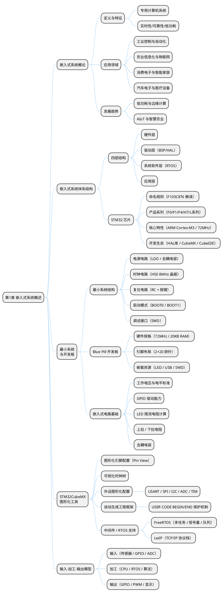

## 1 第 1 章 嵌入式系统概述

### 1.1 本章知识导图



**图 1-1** 本章知识导图涵盖嵌入式系统的核心概念、体系结构、最小系统设计与开发工具链。
<!-- fig:ch1-1 本章知识导图涵盖嵌入式系统的核心概念、体系结构、最小系统设计与开发工具链。 -->

### 1.2 嵌入式系统概论

#### 1.2.1 什么是嵌入式系统

嵌入式系统（Embedded System）是以应用为核心、以计算机技术为基础，软硬件可裁剪，对功能、可靠性、成本、体积、功耗有严格约束的专用计算机系统。与通用计算机不同，嵌入式系统通常"嵌入"在更大的设备或系统中，完成特定的控制、监测或数据处理任务。

**表 1-1** 嵌入式系统与通用计算机的对比
<!-- tab:ch1-1 嵌入式系统与通用计算机的对比 -->

| 特征 | 通用计算机 | 嵌入式系统 |
|------|-----------|-----------|
| 用途 | 多任务、通用场景 | 专用、特定功能 |
| 操作系统 | Windows/Linux/macOS | 裸机/FreeRTOS/嵌入式Linux |
| 实时性 | 非实时 | 通常要求硬/软实时 |
| 资源 | 充裕（GB级内存） | 受限（KB~MB级） |
| 功耗 | 数十~数百瓦 | 毫瓦~数瓦 |
| 交互方式 | 键盘/鼠标/屏幕 | 传感器/按键/LED/串口 |
| 典型示例 | PC、服务器 | STM32控制板、智能传感终端 |

#### 1.2.2 嵌入式系统的应用领域

嵌入式系统无处不在，主要应用领域包括：

- **工业控制与自动化**：PLC 控制器、工业自动化产线、电机驱动与变频器
- **农业信息化**：智能灌溉系统、温室环境监控、土壤传感器节点、农机自动导航
- **消费电子**：智能手机、智能手表、无人机飞控
- **汽车电子**：发动机ECU、ABS制动系统、车载信息终端
- **医疗设备**：便携式血糖仪、心电监护仪、输液泵控制器
- **物联网（IoT）**：智能家居节点、LoRa/NB-IoT 远程采集终端

对于农业信息化方向的研究生而言，嵌入式系统是实现"感知-传输-控制"闭环的核心技术基础。

#### 1.2.3 课程学习的意义

**表 1-2** 学习嵌入式系统能建立从抽象思维到工程实现的认知进阶：
<!-- tab:ch1-2 学习嵌入式系统能建立从抽象思维到工程实现的认知进阶： -->

| 思维层次 | 解题示例 | 核心方法 |
|----------|---------|---------|
| 算法思维 | 软件求解 $y=f(x)$ 极值 | 算法 + 算力 |
| 嵌入式思维 | 温室温度自动调节 | 传感器采集 + PID控制 + 执行器输出 |
| 系统思维 | 智慧农业环境监控 | 多传感器 + 无线通信 + 云平台 + 联动控制 |

---

### 1.3 嵌入式系统的体系结构

嵌入式系统的基本构成是**硬件和软件的综合体**。体系结构框架由下至上分为四个层次：

```bob
  ┌─────────────────────────────────────────────────┐
  │       "应用软件层 (Application Layer)"           │
  │  PID控制 / 数据采集 / 状态机 / 通信协议         │
  ├─────────────────────────────────────────────────┤
  │       "系统软件层 (RTOS Layer)"                  │
  │  FreeRTOS / uCOS-II / 网络栈 / 文件系统         │
  ├─────────────────────────────────────────────────┤
  │       "中间层 (BSP / HAL)"                       │
  │  硬件抽象层 / 设备驱动 / 寄存器封装             │
  ├─────────────────────────────────────────────────┤
  │       "硬件层 (Hardware Layer)"                  │
  │  MCU + 存储器 + 时钟 + 电源 + GPIO + 通信外设   │
  └─────────────────────────────────────────────────┘
```

**图 1-2** 嵌入式系统四层体系结构，由硬件层到应用层逐层抽象。
<!-- fig:ch1-2 嵌入式系统四层体系结构，由硬件层到应用层逐层抽象。 -->

**表 1-3** 嵌入式系统体系结构各层说明
<!-- tab:ch1-3 嵌入式系统体系结构各层说明 -->

| 层次 | 对应通用计算机 | 嵌入式系统中的具体内容 |
|------|--------------|----------------------|
| 硬件层 | 硬件系统 | SOC/MCU、Flash/SRAM、GPIO、ADC/DAC、定时器 |
| 中间层 | 设备驱动 | BSP/HAL 库封装，隐藏寄存器细节 |
| 系统软件层 | 操作系统 | RTOS（FreeRTOS）、LwIP 网络栈、FatFS 文件系统 |
| 应用软件层 | 应用程序 | PID 控制、数据采集滤波、通信协议、状态机逻辑 |

各层具体职责：

1. **硬件层**：包含微处理器（MCU）、存储器（Flash/SRAM）以及外设与 I/O 端口，是整个系统运行的物理基础。
2. **中间层（BSP/HAL 硬件抽象层）**：将硬件接口细节抽象化，为上层操作系统提供统一的虚拟硬件平台，包含底层硬件初始化与设备驱动功能。
3. **系统软件层**：运行嵌入式实时操作系统（如 FreeRTOS）、网络协议栈、文件系统等组件，负责系统资源调度与任务管理。
4. **应用软件层**：直接面向具体应用需求，实现数据采集、控制算法、通信协议和人机交互等功能。

---

### 1.4 最小嵌入式系统结构

**最小系统（Minimum System）** 是指能让微控制器正常上电运行、并可与外部进行基本通信的最简硬件电路集合。它是所有嵌入式产品的设计起点，只要最小系统工作正常，便可在此基础上扩展任意外设。

STM32 的最小系统由以下五个核心部分组成：

**表 1-4** 最小嵌入式系统结构
<!-- tab:ch1-4 最小嵌入式系统结构 -->

| 组成部分 | 作用说明 |
| ---- | ---- |
| **微控制器（MCU）** | 系统核心，执行程序、协调所有外设 |
| **电源电路** | 提供稳定的 3.3V 工作电压，含滤波去耦电容 |
| **时钟电路（晶振）** | 为 MCU 提供精确的工作频率基准 |
| **复位电路** | 上电自动复位或手动按键复位，保证系统从确定状态启动 |
| **输入/输出接口** | 调试烧录接口（SWD）及引出的 GPIO，用于程序下载与外设扩展 |

#### 1.4.1 最小系统结构图

```bob
                    ┌─────────────────────────────────────────────────────────┐
                    │                  STM32 最小系统                          │
                    └─────────────────────────────────────────────────────────┘

  ① 电源电路                          ② MCU 核心                      ③ 时钟电路（晶振）
  ┌──────────────────┐               ┌──────────────────────┐        ┌──────────────────┐
  │ 外部输入"(5V"USB │               │                      │        │  HSE 高速晶振    │
  │"或锂电池)"       │               │    STM32F103C8T6     │        │  8 MHz           │
  │       │          │               │                      │        │   ┌────────┐      │
  │  ┌────▼────┐     │               │  ┌───────────────┐   │◄───────┤   │ XTAL  │      │
  │  │ AMS1117 │     │    VCC 3.3V   │  │  ARM          │   │"OSC_IN"│   │ 8MHz  │      │
  │  │  3.3V   ├─────┼──────────────►│  │  Cortex-M3    │   │        │   └───┬────┘      │
  │  │稳压芯片 │     │               │  │  72 MHz       │   │"OSC_OUT"│      │           │
  │  └────┬────┘     │               │  └───────────────┘   ├───────►│ 负载电容"(20pF)" │
  │       │          │               │                      │        └──────────────────┘
  │  GND ─┴──────────┼──────────────►│ "VCC / GND"          │
  │                  │     GND       │                      │        ┌──────────────────┐
  │  滤波电容:        │               │"(每组VCC-GND引脚"    │        │  LSE 低速晶振    │
  │  100nF + 10uF    │               │  旁接 100nF 去耦     │        │  32.768 kHz      │
  └──────────────────┘               │ "电容至GND)"         │◄───────┤"(供 RTC 使用)"   │
                                     │                      │        └──────────────────┘
  ④ 复位电路                          │                      │
  ┌──────────────────┐               │                      │        ⑤ 启动配置
  │                  │               │                      │        ┌──────────────────┐
  │  VCC ─┬──────────┼──────────────►│  NRST（复位引脚）    │        │  BOOT0 ─── GND   │
  │  10kΩ │          │               │                      │◄───────┤"(从 Flash 启动)" │
  │       │          │               │  BOOT0               │        │                  │
  │  NRST─┼──────────┤               │  BOOT1               │        │  BOOT1 ─── GND   │
  │       │  100nF   │               │                      │        │"(正常运行模式)"  │
  │  按键 ─┤   │      │               └──────────┬───────────┘        └──────────────────┘
  │       ├───┘      │                          │
  │  GND ─┘          │               ┌──────────▼───────────┐
  └──────────────────┘               │  GPIO"/"外设引脚     │
                                     │  PA0~PA15, PB0~PB15  │
  ⑥"调试/烧录接口 (SWD)"              │  PC13~PC15 等        │
  ┌──────────────────┐               └──────────┬───────────┘
  │  ST-Link 调试器   │                          │
  │                  │               ┌──────────▼───────────────────────────┐
  │  SWDIO ──────────┼──────────────►│        外部扩展（可选）              │
  │  SWCLK ──────────┼──────────────►│ 传感器"/"电机驱动"/"通信模块"/"显示屏│
  │  VCC   ──────────┼──────────────►│"(在最小系统基础上按需添加)"          │
  │  GND   ──────────┼──────────────►└──────────────────────────────────────┘
  └──────────────────┘
```

**图 1-3** STM32 最小系统结构图，清晰呈现电源、时钟、复位、启动配置与调试接口的连接关系。
<!-- fig:ch1-3 STM32 最小系统结构图，清晰呈现电源、时钟、复位、启动配置与调试接口的连接关系。 -->

#### 1.4.2 各部分说明

**① 电源电路**

- 通常使用 **AMS1117-3.3** 或同类 LDO 稳压芯片，将 5V（USB 供电）稳压至 3.3V
- 每个 VCC 引脚附近需放置 **100nF 去耦电容**（滤除高频噪声）及 **10μF 电解电容**（稳定低频电压）

**② MCU 核心（STM32）**

- 芯片为整个系统的计算核心，内部已集成 Flash（程序存储）和 SRAM（运行内存），无需外挂独立存储芯片即可运行
- 所有功能模块（定时器、串口、ADC 等）均集成在芯片内部

**③ 时钟电路（晶振）**

- **HSE（高速外部时钟）**：接 **8 MHz 无源晶振**，通过内部 PLL 倍频至最高 **72 MHz** 系统时钟
- **LSE（低速外部时钟）**：接 **32.768 kHz 晶振**，专供实时时钟（RTC）模块使用
- 晶振两端需各接一个 **20 pF 负载电容**至 GND

**④ 复位电路**

- 由 **10 kΩ 上拉电阻 + 100 nF 滤波电容 + 手动复位按键** 构成
- 上电时电容充电，NRST 引脚先保持低电平完成复位，再拉高进入正常运行

**⑤ 启动配置（BOOT 引脚）**

**表 1-5** STM32 启动模式配置
<!-- tab:ch1-5 STM32 启动模式配置 -->

| BOOT0 | BOOT1 | 启动模式 | 说明 |
| :---: | :---: | ---- | ---- |
| 0 | × | **用户 Flash** | 正常运行用户程序（最常用） |
| 1 | 0 | **系统存储器** | 进入 ISP 串口烧录模式 |
| 1 | 1 | **内部 SRAM** | 用于调试，程序仅在 RAM 中运行 |

> 正常使用时 BOOT0 通过 10 kΩ 电阻下拉至 GND，保持 Flash 启动模式。

**⑥ 调试/烧录接口（SWD）**

- **SWD（Serial Wire Debug）** 是 ARM 的两线调试协议，仅需 **SWDIO、SWCLK** 两根信号线即可完成程序烧录与在线调试
- 相比 JTAG 的 5 线方案，SWD 占用引脚更少，是 STM32 开发的标准调试方式

---

### 1.5 嵌入式系统的"输入-加工-输出"模型

嵌入式系统的核心工作模式可概括为"输入→加工→输出"三个环节，它们体现在底层硬件接口、实时操作系统调度以及上层应用逻辑的协同工作上。

#### 1.5.1 输入（Input）

嵌入式系统的输入主要负责感知外部环境、接收用户指令或获取通信数据：

- **传感器采集**：外部物理量通过传感器转化为电信号，经 ADC 采集或数字接口读取。例如超声波测距、温湿度检测、光照强度传感器等。
- **人机交互输入**：通过 GPIO 配置为输入模式读取外部电平变化，如按键（上拉输入 + 软件消抖或中断触发）。
- **通信接口接收**：通过 USART/UART RX 引脚接收外部数据，或通过 I2C、SPI、CAN 等总线接收指令。

#### 1.5.2 加工（Process）

加工是嵌入式系统的核心，负责对输入数据进行运算、决策和任务调度：

- **微处理器硬件机制**：依赖 CPU 内核（ARM Cortex-M3）执行指令，通过中断控制器（NVIC）和 DMA 实现高效数据搬运与实时响应。
- **实时操作系统（RTOS）**：多任务并发、抢占式调度、任务间同步与通信（信号量、消息队列）。
- **软件架构与驱动（中间层）**：BSP/HAL 将底层寄存器操作封装为标准 API，屏蔽硬件细节。
- **控制算法与应用逻辑**：PID 控制、数据滤波、状态机、通信协议解析等。

#### 1.5.3 输出（Output）

输出是系统经过运算后向外界施加影响或展示结果：

- **执行器驱动**：通过定时器输出 PWM 或 GPIO 电平翻转，驱动直流减速电机、步进电机、继电器等。
- **状态显示与反馈**：控制 LED 指示灯、OLED/LCD 屏幕显示、蜂鸣器发声。
- **通信数据发送**：通过串口 TX 引脚、CAN 总线、WiFi/LoRa 等向上位机或云端发送数据。

```bob
 ====== 输入"(Input)"======         ====== 加工"(Process)"======          ====== 输出"(Output)"======

 ┌────────────────────┐          ┌──────────────────────────┐          ┌────────────────────┐
 │  传感器采集        │          │  应用层                  │          │  执行器驱动        │
 │  超声波 / 温湿度   │          │  PID控制 / 状态机 / 滤波 │          │  电机 / 继电器     │
 │  ADC / 红外        ├────────► │                          ├────────► │  PWM / GPIO        │
 └────────────────────┘          ├──────────────────────────┤          └────────────────────┘
 ┌────────────────────┐          │  系统软件层              │          ┌────────────────────┐
 │  人机交互输入      │          │  FreeRTOS 多任务调度     │          │  显示与反馈        │
 │  按键 / 触摸       ├────────► │  信号量 / 消息队列       ├────────► │  LED / OLED / 蜂鸣 │
 └────────────────────┘          ├──────────────────────────┤          └────────────────────┘
 ┌────────────────────┐          │  中间层与硬件            │          ┌────────────────────┐
 │  通信接口接收      │          │  HAL库 / DMA / NVIC      │          │  通信接口发送      │
 │  UART / SPI / CAN  ├────────► │  ARM Cortex-M3 内核      ├────────► │  UART / CAN / WiFi │
 └────────────────────┘          └──────────────────────────┘          └────────────────────┘
```

**图 1-4** 嵌入式系统"输入-加工-输出"模型，展示了信息在系统中的流转路径与各层职责。
<!-- fig:ch1-4 嵌入式系统"输入-加工-输出"模型，展示了信息在系统中的流转路径与各层职责。 -->

---

### 1.6 本章小结

本章介绍了嵌入式系统的基本概念与特征，包括嵌入式系统的定义、应用领域（尤其是农业信息化方向）、四层体系结构、STM32 最小系统的组成，以及输入-加工-输出工作模型。这些内容构成了后续所有章节的基础认知框架。

---

### 1.7 习题

1. 请简述嵌入式系统的定义及其与通用计算机的主要区别。
2. 列举三个农业信息化领域中嵌入式系统的典型应用场景。
3. 简述嵌入式系统四层体系结构各层的职责。
4. 画出 STM32 最小系统的组成框图，并标注各部分功能。
5. 以温室环境监控为例，说明嵌入式系统的"输入-加工-输出"模型。

---

#### 1.7.1 本章在线测试（10 题）

<div id="exam-meta" data-exam-id="chapter1" data-exam-title="第 1 章 嵌入式系统概述 测验" style="display:none"></div>

<!-- mkdocs-quiz intro -->

<quiz>
1) 下列哪项最准确地描述了嵌入式系统的核心特征？
- [ ] 功能丰富、可运行多种应用程序的通用计算机
- [x] 以应用为核心，对功能、可靠性、成本、功耗有严格约束的专用计算机系统
- [ ] 只能使用汇编语言编程的微处理器系统
- [ ] 必须连接互联网才能工作的智能设备

嵌入式系统的核心特征是"专用"——面向特定应用，软硬件可裁剪，资源受限且对实时性和可靠性有要求。
</quiz>

<quiz>
2) 嵌入式系统四层体系结构中，BSP/HAL 层的主要作用是？
- [ ] 运行应用程序的控制算法
- [ ] 直接操作硬件寄存器实现外设功能
- [x] 将硬件接口细节抽象化，为上层提供统一的硬件访问接口
- [ ] 管理多任务调度与系统资源分配

BSP/HAL 层是承上启下的中间层，将底层硬件寄存器操作封装为标准 API，屏蔽不同硬件平台的差异。
</quiz>

<quiz>
3) STM32F103C8T6 型号中，"C8"分别代表什么？
- [ ] C=通用型，8=8MHz主频
- [x] C=48引脚，8=64KB Flash
- [ ] C=256KB Flash，8=8位处理器
- [ ] C=LQFP封装，8=第8代产品

STM32 命名规则中：引脚数 C=48脚/R=64脚/V=100脚，Flash容量 8=64KB/B=128KB/C=256KB。
</quiz>

<quiz>
4) STM32 最小系统中，HSE 高速晶振的典型频率及其作用是？
- [ ] 32.768 kHz，供 RTC 实时时钟使用
- [x] 8 MHz，通过 PLL 倍频至最高 72 MHz 作为系统主时钟
- [ ] 72 MHz，直接作为 CPU 工作频率
- [ ] 16 MHz，作为 USB 通信时钟

HSE 接 8 MHz 无源晶振，通过内部 PLL 倍频至系统所需的 72 MHz，是 MCU 运行的"心跳"。
</quiz>

<quiz>
5) Blue Pill 开发板使用的 MCU 内核及最高主频是？
- [ ] ARM Cortex-M0，48 MHz
- [ ] ARM Cortex-M4（带 FPU），168 MHz
- [x] ARM Cortex-M3，72 MHz
- [ ] ARM Cortex-M7，216 MHz

Blue Pill 搭载 STM32F103C8T6，采用 ARM Cortex-M3 内核，最高主频 72 MHz，是嵌入式入门的经典平台。
</quiz>

<quiz>
6) STM32 的 BOOT0=0 时，系统从哪里启动？
- [x] 用户 Flash（正常运行用户程序）
- [ ] 系统存储器（ISP 串口烧录模式）
- [ ] 内部 SRAM（调试模式）
- [ ] 外部 SD 卡

BOOT0=0 时从用户 Flash 启动，是最常用的正常运行模式。BOOT0=1/BOOT1=0 进入 ISP 烧录模式。
</quiz>

<quiz>
7) SWD 调试接口相比 JTAG 的主要优势是？
- [ ] 传输速度更快
- [ ] 支持多核调试
- [x] 仅需两根信号线（SWDIO、SWCLK），占用引脚更少
- [ ] 不需要调试器硬件

SWD 是 ARM 的两线调试协议，仅需 SWDIO 和 SWCLK 两根信号线，相比 JTAG 的 5 线方案大幅节省引脚资源。
</quiz>

<quiz>
8) 嵌入式系统"输入-加工-输出"模型中，以下哪项属于"加工"环节？
- [ ] 超声波传感器检测距离
- [ ] OLED 屏幕显示温度值
- [ ] 按键检测用户输入
- [x] FreeRTOS 任务调度与 PID 控制算法运算

"加工"环节包括 CPU 运算、RTOS 调度、控制算法等数据处理与决策过程，是输入到输出的桥梁。
</quiz>

<quiz>
9) 在 STM32 最小系统中，每个 VCC 引脚附近放置 100nF 去耦电容的目的是？
- [ ] 提供备用电源
- [x] 滤除高频电源噪声，保证 MCU 供电稳定
- [ ] 限制电源电流
- [ ] 保护 MCU 免受过压损坏

100nF 去耦电容用于滤除 MCU 工作时产生的高频电源噪声，10μF 电解电容稳定低频电压波动。
</quiz>

<quiz>
10) 以下哪个不属于嵌入式系统在农业信息化中的典型应用？
- [ ] 温室环境温湿度自动监控
- [ ] 土壤墒情传感器数据采集节点
- [ ] 智能灌溉系统的电磁阀控制
- [x] 大型数据中心的服务器集群管理

大型数据中心管理属于通用计算领域，不是嵌入式系统的典型应用。嵌入式系统侧重于专用、资源受限的控制与采集场景。
</quiz>

<!-- mkdocs-quiz results -->
