# 第1章 机器人基础
## 机器人控制技术
成都信息工程大学 软件工程学院

## 本章知识导图

```plantuml
@startmindmap
skinparam mindmapNodeBackgroundColor<<root>>    #1565C0
skinparam mindmapNodeFontColor<<root>>          white
skinparam mindmapNodeBackgroundColor<<l1>>      #1976D2
skinparam mindmapNodeFontColor<<l1>>            white
skinparam mindmapNodeBackgroundColor<<l1r>>     #0277BD
skinparam mindmapNodeFontColor<<l1r>>           white
skinparam ArrowColor                            #90CAF9
skinparam mindmapNodeBorderColor                #90CAF9

* 第1章\n机器人基础

** 机器人概论
*** 定义与历史
**** 多种定义（ISO / 感知-决策-执行）
**** 发展历程：古代→早期→现代→当代
*** 机器人结构
**** 本体（执行机构）
**** 感知系统（传感器）
**** 控制系统（嵌入式处理器）
**** 决策系统（AI / 算法）
*** 机器人分类
**** 按运动方式
**** 按智能程度
**** 按用途 / 驱动方式
*** 产业与前景
**** 我国四大区域集群
**** 现存问题与发展展望

** 嵌入式系统基础
*** 体系结构
**** 硬件层
**** 驱动层
**** 系统软件层（RTOS）
**** 应用层
*** STM32 芯片
**** 命名规则（F103C8T6 解读）
**** 产品系列（F0/F1/F4/H7/L系列）
**** 核心特性（ARM Cortex-M3 / 72MHz）
**** 开发生态（HAL库 / CubeMX / CubeIDE）

** 最小系统\n与开发板
*** 最小系统结构
**** 电源电路（LDO / 去耦电容）
**** 时钟电路（HSE 8MHz 晶振）
**** 复位电路（RC + 按键）
**** 启动模式（BOOT0 / BOOT1）
**** 调试接口（SWD）
*** Blue Pill 开发板
**** 硬件规格（72MHz / 20KB RAM）
**** 引脚布局（2×20 排针）
**** 板载资源（LED / USB / SWD）
*** 电路图解读
**** LED 电路局部分析
**** 芯片引脚→板上排针追踪
**** 看懂电路图的6个要点
*** 嵌入式电路基础
**** 工作电压与电平标准
**** GPIO 驱动能力
**** LED 限流电阻计算
**** 上拉 / 下拉电阻
**** 去耦电容

** STM32CubeMX\n图形化工具
*** 图形化引脚配置（Pin View）
**** 点击引脚选择功能
**** 设置 GPIO 模式 / 速率 / User Label
*** 可视化时钟树
**** 填目标频率自动计算 PLL
*** 外设图形化配置
**** USART / SPI / I2C / ADC / TIM
**** 自动检测引脚冲突
*** 自动生成工程框架
**** USER CODE BEGIN/END 保护机制
**** .ioc 文件可重复编辑
*** 中间件 / RTOS 支持
**** FreeRTOS（多任务 / 信号量 / 队列）
**** LwIP（TCP/IP 协议栈）
**** FatFS（文件系统）

** 第一个程序\nLED 闪烁
*** 程序基本结构
**** 头文件包含
**** 函数声明
**** main()：初始化 + while(1)
**** SystemClock_Config()
**** MX_GPIO_Init()
*** 从电路图确定引脚
**** LED 阴极 → PC13
**** 低电平点亮逻辑
*** GPIO 工作模式（8种）
**** 输入：浮空 / 上拉 / 下拉 / 模拟
**** 输出：推挽(PP) / 开漏(OD)
**** 复用：复用推挽 / 复用开漏
**** 本程序使用：推挽输出(PP)
*** 程序实现
**** HAL 库版本（WritePin / Delay）
**** 寄存器版本（CRH / BSRR）

** STM32 外设\n与 I/O 模型
*** 核心外设接口
**** GPIO / USART / SPI / I2C
**** ADC / DAC / TIM / USB
*** 串行通信对比
**** UART / SPI / I2C / CAN
*** 输入-加工-输出模型
**** 输入（传感器 / GPIO / ADC）
**** 加工（CPU / RTOS / 算法）
**** 输出（GPIO / PWM / 显示）
@endmindmap
```




## 2016年机器人行业十大新闻事件
1. 人机大战：AlphaGo以4：1战胜李世石，上演"人工智能PK人类智慧"
2. 中国发布机器人产业白皮书，中国机器人产业已形成环渤海、珠三角、长三角和中西部四大区域集群
3. 中科大发布我国首台特有体验交互机器人佳佳
4. "十三五"机器人产业规划出炉，工业和信息化部、国家发展改革委、财政部等三部委联合印发《机器人产业发展规划(2016-2020年)》
5. Google出售波士顿动力
6. 美的以40亿欧元收购德国机器人龙头KUKA
7. 达拉斯机器人杀人事件
8. 英国正式公布机器人道德标准
9. 2026世界机器人大会于10月21-25日在北京举行，含论坛、博览会、机器人大赛等环节
10. 富士康已在郑州、成都、昆山以及嘉善的工厂部署4万机器人以取代人工

## 行业名家观点与科学家预言
### 名家观点
1. 中国工程院原院长宋键：机器人学的进步和应用是20世纪自动控制最有说服力的成就，是当代最高意义上的自动化。
2. 美国机器人学专家W.E.斯耐德：尽管只有少数人能成为机器人的设计者，但是几乎所有的人都会成为机器人的使用者，其中很多人将作出购买和应用机器人的决策。

### 科学家预言
1. 机器人产业将成为继汽车、计算机之后的第三大产业
2. 未来的战争将是一场机器人的战争
3. 21世纪将是机器人与人和谐共处的时代

## 课程学习的意义
学习机器人控制技术，能建立从**普通思维**到**计算机思维**，再到**机器人思维**的认知升级，不同思维解决问题的方式存在显著差异：

- **普通思维**：用代数方法求解y=f(x)极值、解决鸡兔同笼问题
- **计算机思维**：用暴力搜索法求解y=f(x)极值、改进的爬山法（梯度下降法），使用随机函数完成房间遍历
- **机器人思维**：让小车沿着黑色轨道前进的PID闭环控制方法（融合控制+传感器技术）

---

# 1.1 机器人的定义及发展历史
## 机器人的多种定义
机器人的概念处于发展中，定义也不断变化，各权威机构给出了不同界定，同时也有通俗化定义：

| 定义机构 | 机器人定义 |
| ---- | ---- |
| 美国机器协会（RIA） | 一种用于移动各种材料、零件、工具或专用装置的、通过程序动作来执行各种任务，并具有编程能力的多功能操作机 |
| 日本工业机器人协会 | 一种装备有记忆装置和末端执行装置的能够完成各种移动作业来代替人类劳动的通用机器 |
| 美国国家标准局（NBS） | 一种能够进行编程并在自动控制下执行某种操作和移动作业任务的机械装备 |
| 国际标准化组织（ISO） | 一种自动的、位置可控的、具有编程能力的多功能操作机，这种操作机具有几个轴，能够借助可编程操作来处理各种材料、零件、工具和专用装置，以执行各种任务 |
| 通俗化定义 | 若不刻意追求严格定义，可认为是具有拟人功能的、可编程的、自动化的机械电子装置 |

## 机器人的发展历史
机器人的发展历经**古代机器人**、**早期机器人**、**现代机器人**、**当代机器人**四个阶段，各阶段有其标志性的技术和产物：

### 1. 古代机器人
古代机器人以手工机械为核心，体现了古人的科学幻想与机械设计能力，典型代表有：

- 中国《列子·汤问篇》中木偶工匠偃师制作的能歌善舞的"美男子"伶人（传说故事，体现设计构想）
- 东汉张衡发明的**记里鼓车**：可自动报告行驶里程，车每行驶一里，小人击一下鼓；每行十里，敲一下钟，无需人工测量计程
- 东汉张衡发明的**指南车**：被认为是世界上最早的机器人之一
- 三国诸葛亮发明的**木牛流马**：可在羊肠小道运输粮草，机关在舌头上，是现代步行机的雏形
- 古罗马的**特洛伊木马**：欺骗型机器装置，成为军事战术应用的经典构想
- 1768-1774年瑞士钟表匠德罗斯父子设计制造的写字偶人、绘图偶人和弹风琴偶人：由凸轮控制和弹簧驱动的自动机器，现保存于瑞士纳切特尔市艺术和历史博物馆
- 1893年加拿大摩尔设计的蒸汽动力行走机器人"安德罗丁"

### 2. 早期机器人
这一阶段的核心是机器人概念的哲学与理论奠基，同时诞生了机器人相关的核心概念和定律：

- **欧洲思想背景**：古罗马后欧洲受封建神学统治，17世纪后科学家、哲学家从宗教神学中摆脱，开始科学思考人的结构
- **核心哲学观点**
    - 法国数学家笛卡尔提出"人是机器"的科学命题
    - 英国哲学家霍布斯进一步指出，人不过是一架正立行走的机器：心脏是汲筒，四肢是杠杆，关节是齿轮，神经是游丝……该思想说明人与机器无本质区别，为机器人研究奠定理论基础
- **关键概念与定律诞生**
    1. 1920年：捷克戏剧作家卡勒鲁·查培克在科幻戏剧《罗萨姆万能机器人制造公司RUR》中，首次使用"机器人（robot）"一词，该词源于捷克语"robota"（劳动），可译为人造人、机器奴仆
    2. 1950年：美国科幻大师艾萨克·阿西莫夫（Isaac Asimov）在《I, Robot（我是机器人）》中提出**机器人三定律**，被誉为"机器人之父"
    3. 1954年：美国戴沃尔最早提出工业机器人概念并申请专利
    4. 1956年：A.恩格尔伯格（A.Engelberger）开始机器人研究，被称为"当之无愧的机器人之父"
    5. 1961年：完成世界上第一台工业机器人，60年代George Devol为其设计连杆+数控伺服轴结构

#### 机器人三定律
1. 机器人不得伤害人类，或袖手旁观让人类受到伤害；
2. 在不违反第一定律的情况下，机器人必须服从人类给予的任何命令；
3. 在不违反第一及第二定律的情况下，机器人必须尽力保护自己。

### 3. 现代机器人
20世纪70年代迎来发展高峰，核心为**第二代感觉型机器人**，具备力觉、触觉和视觉等感知能力，能对外界信息进行反馈调整并投入实际应用，典型代表为1973年日本日立公司开发的、用于混凝土桩和钢管业的自动抽苔机器人，同时国内也有自主研发成果（如上大研制的上海II号工业机器人）。

### 4. 当代机器人
进入21世纪，发展为**第三代智能机器人**，在感觉能力基础上，具备独立判断、行动、记忆、推理和决策能力，能完成复杂动作，核心特征为中央电脑统筹控制，可实现自然语言人机对话，典型代表有：解魔方机器人、美国机器人"大狗"、Atlas机器人、日本本田ASIMO（阿西莫）、机器人"R2"、各类人工智能机器人。

---

# 1.2 机器人的结构与分类
## 1 机器人的结构
机器人的整体结构由**机器人本体**、**机器人感知系统**、**机器人控制系统**、**机器人决策系统**四大部分组成，各部分分工明确、相互配合：

### 机器人本体
多自由度的关节式机械系统，是机器人的物理基础，一般包括：

1. 驱动装置：提供能源和动力
2. 减速器：将高速运动转换为低速运动
3. 运动传动机构：传递动力和运动
4. 关节部分机构：相当于人类手臂，形成空间的多自由度运动
5. 把持机构（末端执行器/端拾器）：相当于人类手爪，实现作业抓取等动作
6. 移动机构（走行机构）：相当于人类腿脚，实现机器人位置移动
7. 变位机等周边设备：配合机器人工作的辅助装置

### 机器人感知系统
分为内部传感器和外部传感器，实现机器人对自身和外部环境的信息检测：

1. **内部传感器**：检测机器人自身状态（内部信息），如关节的运动状态，是机器人自身运动与正常工作的必需装置
2. **外部传感器**：感知外部世界，检测作业对象与作业环境的状态（外部信息），如视觉、听觉、触觉等，是机器人适应特定环境、完成特定任务的必需装置

### 机器人控制系统
是机器人的"运动指挥中心"，分为三级控制器，层层协调控制：

1. 驱动控制器：即伺服控制器（单关节），控制各关节驱动电机
2. 运动控制器：规划、协调机器人各关节的运动，实现轨迹控制
3. 作业控制器：进行环境检测、任务规划，确定所要进行的作业流程

### 机器人决策系统
机器人的"大脑"，通过感知和思维，规划和确定机器人的任务，且具备学习能力，是机器人智能的核心体现。

## 2 机器人的分类
机器人的分类方式多样，不同分类维度对应不同的机器人类型，其中**按用途分类**是当前最常用、最常见的分类方法，各分类维度具体如下：

### 按机器人运动方式分类
- 固定式机器人
- 移动机器人：细分为轮式、履带式、足式、飞行、水下机器人等

### 按机器人智能程度分类
- 一般机器人
- 智能机器人：根据智能水平又分为传感型机器人、半自主机器人、自主型机器人

### 按替代人的器官类型分类
- 操作机器人（对应手，manipulator）
- 移动机器人（对应腿，locomotive robot）
- 视觉机器人（对应眼，visual robot）

### 按对环境自主程度分类
- 固定臂机器人（Fixed Arm Robot）
- 可行走机器人（Mobile Robot）：如AGV小车
- 自主式机器人（Mobile Autonomous Robot）：如太空机器人
- 蛇行机器人（snake-like robot）

### 按构成机构的不同分类
- 直角坐标机器人（Cartesian coordinate）
- 圆柱坐标机器人（Cylindrical coordinate）
- 极坐标机器人（Polar coordinate）
- 多关节型机器人（Articulated robot）
- 并联关节机器人（Parallel linked robot）
- 串并联关节机器人（Hybrid linked robot）

### 按驱动方式的不同分类
- 液压机器人（Hydraulic robot）
- 气动机器人（Pneumatic robot）
- 电动机器人（Electrical robot）

### 按机器人用途分类
这是最主流的分类方式，覆盖工业、农业、医疗、军事等多个领域，具体包括：

1. 农业机器人：采摘、嫁接等
2. 排险救灾机器人：排雷、除匪、爆炸物处理等
3. 医用机器人：肠内窥镜、血管疏通、脑外科手术等微型机器人，DNA微驱动系统等
4. 娱乐机器人：迎宾机器人、智能宠物、AIBO、影视特效机器人等
5. 军用机器人：无人飞机U-2、机器人部队、先锋号无人机等
6. 极限作业机器人：核反应堆作业、空间机器人等
7. 水下机器人：水下6000米无缆自治机器人、阿尔文号载人潜水艇等
8. 工业机器人：搬运、制造、装配、焊接、喷漆、铸造、码垛、井下作业等

### 我国对机器人的官方分类
我国将机器人简化为两大类别，清晰界定应用范围：

1. **工业机器人**：面向工业领域的多关节机械手或多自由度机器人
2. **特种机器人**：除工业机器人之外的、用于非制造业并服务于人类的各种先进机器人，包括服务机器人、水下机器人、娱乐机器人、军用机器人、农业机器人、机器人化机器等

---

# 1.3 机器人控制的基本要求
机器人控制涉及内容繁多，因机器人种类各异，控制方式也有所不同，核心是把握**共性问题**，并分为**底层控制**和**上层控制**两大模块，各模块涵盖核心内容如下：

- **底层控制**：包括机器人本体（机械部分）、驱动电路部分、传感器部分，以及PID控制等控制策略
- **上层控制**：包括机器人的运动分析、路径规划以及机器人的软件部分

## 嵌入式系统的体系结构

依据计算机系统的基本构成，一个完整的通用计算机系统是由硬件系统和软件系统两部分组成的，软件建立在硬件的基础之上，并通过操作系统等系统软件对底层的硬件资源进行管理，从而为上层的应用软件提供运行环境。

嵌入式系统作为一种专用的计算机系统，其基本构成同样是**硬件和软件的综合体**。从计算机系统的层次结构推导并结合嵌入式系统的专用性与微型化特点，嵌入式系统的体系结构框架一般被细化为由下至上的四个层次：**硬件层、中间层、系统软件层、应用软件层**。

具体组成推导如下：

1. **硬件层**：相当于计算机的硬件系统。在嵌入式系统中，它主要包含微处理器（如SOC单片机）、存储器（ROM、RAM/Flash）以及外部设备和I/O端口等，是整个系统运行的物理与物质基础。
2. **中间层（BSP/HAL硬件抽象层）**：这是嵌入式系统特有的承上启下层。由于嵌入式硬件种类繁多，中间层负责将硬件接口细节隐藏抽象化，相当于为上层的操作系统提供了一个统一的虚拟硬件平台，包含了底层硬件的初始化、设备驱动等功能。
3. **系统软件层**：对应通用计算机的操作系统。在嵌入式系统中，主要运行嵌入式实时操作系统（如 uCOS Ⅱ、FreeRTOS）、网络系统、文件系统及各种通用组件模块，负责系统资源的高速、并行调度及容错处理。
4. **应用软件层**：对应通用计算机的应用软件。它直接面向具体的应用需求，例如包含诸如机器学习、人工智能等"大脑"功能算法，或者PID、卡尔曼滤波器、运动姿态控制等"小脑"功能算法。

---

## STM32芯片简介

**STM32** 是意法半导体（STMicroelectronics，简称 ST）推出的一系列基于 **ARM Cortex-M 内核**的 32 位微控制器（MCU）产品线，广泛应用于工业控制、消费电子、机器人及物联网等领域。

### 命名规则

STM32 的型号名称遵循一套规律性命名约定，以常见型号 **STM32F103C8T6** 为例：

| 字段 | 含义 | 示例说明 |
| ---- | ---- | ---- |
| `STM32` | 产品系列，32位 ARM 微控制器 | — |
| `F` | 产品子系列（F=通用型，H=高性能，L=低功耗，G=主流型等） | F 通用型 |
| `103` | 具体产品线编号（103为基础型，407为高性能型等） | 基础型 |
| `C` | 引脚数量（C=48脚，R=64脚，V=100脚，Z=144脚） | 48 引脚 |
| `8` | Flash 容量（6=32KB，8=64KB，B=128KB，C=256KB，E=512KB） | 64 KB |
| `T` | 封装类型（T=LQFP，H=BGA，U=VFQFPN） | LQFP 封装 |
| `6` | 工作温度范围（6=−40～85°C，7=−40～105°C） | 工业级 |

### 主要产品系列

ST 根据性能与应用场景，将 STM32 划分为多个子系列：

| 系列 | 内核 | 主频 | 特点 | 典型型号 |
| ---- | ---- | ---- | ---- | ---- |
| **STM32F1**（基础型） | Cortex-M3 | 72 MHz | 性价比高，入门首选 | STM32F103C8T6 |
| **STM32F4**（高性能型） | Cortex-M4（带FPU） | 168 MHz | 浮点运算，适合复杂控制算法 | STM32F407ZGT6 |
| **STM32F7**（高级型） | Cortex-M7 | 216 MHz | 双精度FPU，高速外设 | STM32F767IGT6 |
| **STM32H7**（旗舰型） | Cortex-M7 | 480 MHz | 最高性能，双核可选 | STM32H743IIT6 |
| **STM32L**（低功耗型） | Cortex-M0/M3/M4 | 32～80 MHz | 超低功耗，适合电池供电设备 | STM32L476RGT6 |
| **STM32G**（主流型） | Cortex-M0+/M4 | 64～170 MHz | 替代 F1/F3，高集成度 | STM32G431CBU6 |

> 在机器人控制课程中，以 **STM32F103** 系列作为核心学习平台，其 72 MHz 主频和丰富外设足以满足绝大多数底层控制任务。

### 核心特性

STM32 相较于传统 8 位单片机（如 51 系列、AVR）具有显著优势：

- **32 位处理能力**：一条指令可处理 32 位数据，运算效率远高于 8/16 位 MCU，适合执行 PID、矩阵运算等控制算法
- **丰富的片上外设**：集成 GPIO、USART、SPI、I2C、CAN、USB、ADC、DAC、定时器/PWM 等，减少外部芯片需求
- **中断系统（NVIC）**：嵌套向量中断控制器支持多达 240 个外部中断，优先级可灵活配置，实现强实时响应
- **DMA 控制器**：直接内存访问，无需 CPU 介入即可完成数据搬运，显著降低 CPU 占用率
- **低功耗模式**：支持多种睡眠/待机模式，适用于对功耗敏感的移动机器人应用
- **完善的生态**：官方 HAL/LL 库、STM32CubeMX 图形化配置工具及大量开源例程，学习资源丰富

### 开发生态

| 工具/资源 | 说明 |
| ---- | ---- |
| **STM32CubeMX** | ST 官方图形化初始化代码生成工具，可自动配置时钟、外设，生成 HAL 初始化代码 |
| **STM32CubeIDE** | 基于 Eclipse 的官方集成开发环境，集成编译、调试、烧录功能 |
| **Keil MDK** | 业界主流的 ARM 开发工具，广泛用于嵌入式项目 |
| **HAL 库** | 硬件抽象层库，屏蔽寄存器细节，提供统一 API，便于跨型号移植 |
| **LL 库** | 底层驱动库，接近寄存器操作，效率更高，适合对性能要求严苛的场景 |
| **ST-Link** | ST 官方调试/烧录器，支持 SWD 和 JTAG 调试接口 |

---

## 最小系统结构

**最小系统（Minimum System）** 是指能让微控制器正常上电运行、并可与外部进行基本通信的最简硬件电路集合。它是所有嵌入式产品的设计起点，只要最小系统工作正常，便可在此基础上扩展任意外设。

STM32 的最小系统由以下五个核心部分组成：

| 组成部分 | 作用说明 |
| ---- | ---- |
| **微控制器（MCU）** | 系统核心，执行程序、协调所有外设 |
| **电源电路** | 提供稳定的 3.3V 工作电压，含滤波去耦电容 |
| **时钟电路（晶振）** | 为 MCU 提供精确的工作频率基准 |
| **复位电路** | 上电自动复位或手动按键复位，保证系统从确定状态启动 |
| **输入/输出接口** | 调试烧录接口（SWD）及引出的 GPIO，用于程序下载与外设扩展 |

### 最小系统结构图

```text
                    ┌─────────────────────────────────────────────────────────┐
                    │                  STM32 最小系统                          │
                    └─────────────────────────────────────────────────────────┘

  ① 电源电路                          ② MCU 核心                      ③ 时钟电路（晶振）
  ┌──────────────────┐               ┌──────────────────────┐        ┌──────────────────┐
  │  外部输入 (5V USB │               │                      │        │  HSE 高速晶振     │
  │  或锂电池)        │               │    STM32F103C8T6     │        │  8 MHz           │
  │       │          │               │                      │        │   ┌────────┐      │
  │  ┌────▼────┐     │               │  ┌───────────────┐   │◄───────┤   │ XTAL  │      │
  │  │ AMS1117 │     │    VCC 3.3V   │  │  ARM          │   │  OSC_IN│   │ 8MHz  │      │
  │  │  3.3V   ├─────┼──────────────►│  │  Cortex-M3    │   │        │   └───┬────┘      │
  │  │稳压芯片 │     │               │  │  72 MHz       │   │OSC_OUT │       │           │
  │  └────┬────┘     │               │  └───────────────┘   ├───────►│  负载电容 (20pF) │
  │       │          │               │                      │        └──────────────────┘
  │  GND ─┴──────────┼──────────────►│  VCC  /  GND         │
  │                  │     GND       │                      │        ┌──────────────────┐
  │  滤波电容:        │               │  (每组VCC-GND引脚    │        │  LSE 低速晶振     │
  │  100nF + 10uF    │               │   旁接 100nF 去耦    │        │  32.768 kHz      │
  └──────────────────┘               │   电容至GND)         │◄───────┤  (供 RTC 使用)   │
                                     │                      │        └──────────────────┘
  ④ 复位电路                          │                      │
  ┌──────────────────┐               │                      │        ⑤ 启动配置
  │                  │               │                      │        ┌──────────────────┐
  │  VCC ─┬──────────┼──────────────►│  NRST（复位引脚）    │        │  BOOT0 ─── GND   │
  │  10kΩ │          │               │                      │◄───────┤  (从 Flash 启动) │
  │       │          │               │  BOOT0               │        │                  │
  │  NRST─┼──────────┤               │  BOOT1               │        │  BOOT1 ─── GND   │
  │       │  100nF   │               │                      │        │  (正常运行模式)   │
  │  按键 ─┤   │      │               └──────────┬───────────┘        └──────────────────┘
  │       ├───┘      │                          │
  │  GND ─┘          │               ┌──────────▼───────────┐
  └──────────────────┘               │   GPIO / 外设引脚     │
                                     │  PA0~PA15, PB0~PB15  │
  ⑥ 调试/烧录接口 (SWD)               │  PC13~PC15 等        │
  ┌──────────────────┐               └──────────┬───────────┘
  │  ST-Link 调试器   │                          │
  │                  │               ┌──────────▼───────────────────────────┐
  │  SWDIO ──────────┼──────────────►│          外部扩展（可选）              │
  │  SWCLK ──────────┼──────────────►│  传感器 / 电机驱动 / 通信模块 / 显示屏 │
  │  VCC   ──────────┼──────────────►│  (在最小系统基础上按需添加)            │
  │  GND   ──────────┼──────────────►└────────────────────────────────────  ┘
  └──────────────────┘
```

### 各部分说明

**① 电源电路**

- 通常使用 **AMS1117-3.3** 或同类 LDO 稳压芯片，将 5V（USB 供电）或锂电池电压稳压至 3.3V
- 每个 VCC 引脚附近需放置 **100nF 去耦电容**（滤除高频噪声）及 **10μF 电解电容**（稳定低频电压），缺少滤波电容会导致 MCU 工作不稳定

**② MCU 核心（STM32）**

- 芯片为整个系统的计算核心，内部已集成 Flash（程序存储）和 SRAM（运行内存），无需外挂独立存储芯片即可运行
- 所有功能模块（定时器、串口、ADC 等）均集成在芯片内部

**③ 时钟电路（晶振）**

- **HSE（高速外部时钟）**：接 **8 MHz 无源晶振**，通过内部 PLL 倍频至最高 **72 MHz** 系统时钟，是 MCU 运行的"心跳"
- **LSE（低速外部时钟）**：接 **32.768 kHz 晶振**，专供实时时钟（RTC）模块使用，保证掉电后时间继续计数
- 晶振两端需各接一个 **20 pF 负载电容**至 GND，否则晶振可能无法起振

**④ 复位电路**

- 由 **10 kΩ 上拉电阻 + 100 nF 滤波电容 + 手动复位按键** 构成
- 上电时电容充电，NRST 引脚先保持低电平完成复位，再拉高进入正常运行；按下复位键可手动重启系统

**⑤ 启动配置（BOOT 引脚）**

STM32 通过 BOOT0/BOOT1 引脚电平决定上电后的启动模式：

| BOOT0 | BOOT1 | 启动模式 | 说明 |
| :---: | :---: | ---- | ---- |
| 0 | × | **用户 Flash** | 正常运行用户程序（最常用） |
| 1 | 0 | **系统存储器** | 进入 ISP 串口烧录模式 |
| 1 | 1 | **内部 SRAM** | 用于调试，程序仅在 RAM 中运行 |

> 正常使用时 BOOT0 通过 10 kΩ 电阻下拉至 GND，保持 Flash 启动模式。

**⑥ 调试/烧录接口（SWD）**

- **SWD（Serial Wire Debug）** 是 ARM 的两线调试协议，仅需 **SWDIO、SWCLK** 两根信号线即可完成程序烧录与在线调试
- 相比 JTAG 的 5 线方案，SWD 占用引脚更少，是 STM32 开发的标准调试方式

---

## Blue Pill 开发板

**Blue Pill** 是目前最流行的入门级 STM32 开发板之一，因其极低的成本（通常不足 10 元人民币）、完整的最小系统设计和紧凑的体积，成为学习嵌入式开发的首选硬件平台。它将上一节介绍的 STM32 最小系统全部集成在一块约 **53 mm × 23 mm** 的 PCB 上，开箱即用。

### 硬件规格

| 参数 | 规格 |
| ---- | ---- |
| **核心芯片** | STM32F103C8T6 |
| **CPU 内核** | ARM Cortex-M3 |
| **主频** | 最高 72 MHz |
| **Flash** | 64 KB（程序存储） |
| **SRAM** | 20 KB（运行内存） |
| **工作电压** | 3.3V（板载 AMS1117-3.3 稳压） |
| **供电输入** | Micro-USB 5V 或引脚直接 3.3V/5V |
| **晶振** | 8 MHz HSE + 32.768 kHz LSE |
| **GPIO 数量** | 最多 32 个（PA0-PA15, PB0-PB15, PC13-PC15） |
| **调试接口** | SWD（4 针排针：GND / SWCLK / SWDIO / 3.3V） |
| **板载 LED** | PC13 引脚连接一颗用户 LED（低电平点亮） |
| **复位按键** | 1 个（NRST） |
| **USB 接口** | Micro-USB（供电或 USB-FS 通信） |
| **尺寸** | 53 mm × 23 mm |

### 引脚布局图

```text
                     ┌─────────────────────────────────┐
                     │         Blue Pill 开发板          │
                     │    (STM32F103C8T6 最小系统板)      │
                     └─────────────────────────────────┘

         左侧引脚 (从上到下)              右侧引脚 (从上到下)
         ┌──────────────────────────────────────────────┐
  GND ───┤ ●  GND              │BOOT1│  GND ●──── GND   │
  GND ───┤ ●  GND              │BOOT0│  GND ●──── GND   │
  3.3V ──┤ ●  3.3V             └─────┘  PB11 ●──── PB11 │
  NRST ──┤ ●  NRST    ┌──────────────┐  PB10 ●──── PB10 │
  PA0 ───┤ ●  PA0  ADC│              │  PB9  ●──── PB9  │
  PA1 ───┤ ●  PA1  ADC│  STM32F103   │  PB8  ●──── PB8  │
  PA2 ───┤ ●  PA2 UART│  C8T6        │  PB7  ●──── PB7  │
  PA3 ───┤ ●  PA3 UART│              │  PB6  ●──── PB6  │
  PA4 ───┤ ●  PA4  SPI│   ┌──────┐   │  PB5  ●──── PB5  │
  PA5 ───┤ ●  PA5  SPI│   │ LED  │   │  PB4  ●──── PB4  │
  PA6 ───┤ ●  PA6  SPI│   │ PC13 │   │  PB3  ●──── PB3  │
  PA7 ───┤ ●  PA7  SPI│   └──────┘   │  PA15 ●──── PA15 │
  PB0 ───┤ ●  PB0  ADC│              │  PA12 ●──── PA12 │
  PB1 ───┤ ●  PB1  ADC│  ┌────────┐  │  PA11 ●──── PA11 │
  PB10 ──┤ ●  PB10 I2C│  │ Micro  │  │  PA10 ●──── PA10 │
  PB11 ──┤ ●  PB11 I2C│  │  USB   │  │  PA9  ●──── PA9  │
         │             │  └────────┘  │                  │
  ───────┤  SWD 调试口 │              │  PA8  ●──── PA8  │
  GND ───┤ ●           │  [RESET键]  │  PB15 ●──── PB15 │
  SWCLK ─┤ ●           │              │  PB14 ●──── PB14 │
  SWDIO ─┤ ●           │  [8MHz晶振] │  PB13 ●──── PB13 │
  3.3V ──┤ ●           │  [32K晶振]  │  PB12 ●──── PB12 │
         └──────────────────────────────────────────────┘

  引脚复用功能速查：
  PA0-PA7  ── ADC 输入 / 定时器 PWM 输出 / SPI1
  PA9/PA10 ── USART1 TX/RX（串口1，最常用串口）
  PB6/PB7  ── I2C1 SCL/SDA
  PB10/PB11── I2C2 SCL/SDA
  PA11/PA12── USB D-/D+
  PA13/PA14── SWD 调试口（SWDIO / SWCLK，已在板上连接）
  PC13     ── 板载 LED（低电平点亮）
```

### 板载资源说明

**板载 LED（PC13）**

Blue Pill 在 PC13 引脚上连接了一颗 LED，是学习 GPIO 控制的第一个实验对象。注意该 LED 为**低电平点亮**（输出 0 亮、输出 1 灭），与常规逻辑相反，原因是 PC13 的驱动能力较弱（最大 3 mA），电路采用了共阳极接法。

**Micro-USB 接口**

板上的 Micro-USB 有两个作用：
- **供电**：通过板载 AMS1117 稳压后为全板提供 3.3V
- **USB 通信**：STM32F103 支持全速 USB（USB-FS 12Mbps），可将 Blue Pill 模拟为 CDC 虚拟串口、HID 设备等，但需要软件配置并在 USB D+ 线上额外接一颗 **1.5 kΩ 上拉电阻**

**SWD 调试口**

板子一侧引出了 4 针 SWD 排针（GND / SWCLK / SWDIO / 3.3V），连接 ST-Link 调试器后即可在 Keil 或 STM32CubeIDE 中完成程序烧录与断点调试。

**BOOT 跳线**

板上有两个跳线帽控制 BOOT0 和 BOOT1：

- **正常运行**：BOOT0 = 0，BOOT1 = 0 → 从 Flash 启动用户程序
- **串口烧录**：BOOT0 = 1，BOOT1 = 0 → 进入系统 Bootloader，可通过 USART1 用串口烧录程序（无需 ST-Link）

### Blue Pill 与最小系统的对应关系

```text
  最小系统要素              Blue Pill 上的实现
  ──────────────────────────────────────────────────────
  MCU 芯片          →   STM32F103C8T6（板中央大芯片）
  电源电路          →   AMS1117-3.3 + 若干滤波电容
  高速晶振 (HSE)    →   8 MHz 无源晶振（MCU旁小元件）
  低速晶振 (LSE)    →   32.768 kHz 晶振（供 RTC 使用）
  复位电路          →   10kΩ上拉 + 100nF电容 + RESET按键
  启动配置          →   BOOT0 / BOOT1 两个跳线帽
  调试接口          →   4针 SWD 排针
  输入/输出         →   两排 20Pin 排针（引出所有 GPIO）
  ──────────────────────────────────────────────────────
```

> **小结**：Blue Pill 开发板本质上就是一块 STM32F103 最小系统板，在掌握最小系统的原理后，便能看懂并读懂 Blue Pill 的原理图，进而自行设计定制化的嵌入式硬件。

---

## STM32CubeMX 图形化开发工具

### 工具概述

**STM32CubeMX** 是 ST（意法半导体）官方推出的**图形化初始化代码生成工具**，是 STM32 生态的核心组成部分。它将繁琐的芯片初始化配置（时钟树、引脚模式、外设参数）转变为**可视化的鼠标点选操作**，并自动生成完整的 HAL 库初始化代码框架，极大地降低了 STM32 开发的入门门槛。

```text
  STM32CubeMX 在开发流程中的位置：

  ┌─────────────────┐    CubeMX 自动生成     ┌──────────────────────┐
  │   图形化配置     │ ──────────────────►   │  C 语言工程框架        │
  │                 │                       │                      │
  │  • 芯片型号选择  │                       │  main.c              │
  │  • 引脚功能分配  │                       │  stm32f1xx_hal.h     │
  │  • 时钟树配置   │                       │  SystemClock_Config()│
  │  • 外设参数设置  │                       │  MX_GPIO_Init()      │
  │  • 中间件选择   │                       │  MX_USART_Init() ... │
  └─────────────────┘                       └──────────────────────┘
           ↑                                          │
     开发者完成                                        ▼
     （无需手写初始化代码）                      开发者只需在此基础上
                                               填写业务逻辑代码
```

STM32CubeMX 可**独立安装**使用，也可作为插件集成进 **STM32CubeIDE**（ST 官方 IDE）中。两者配合使用是当前 STM32 开发的主流工作流。

### 关键特色

#### 一、图形化芯片引脚配置

CubeMX 提供直观的**芯片俯视图（Pin View）**，开发者可在图形界面上逐一点击每个引脚，从下拉菜单中选择功能，无需查阅数百页的数据手册。

```text
  CubeMX 引脚配置界面示意：

  ┌──────────────────────────────────────────────────────┐
  │   STM32F103C8T6  引脚视图（Pin View）                  │
  │                                                      │
  │         PA0  ●── [GPIO_Input ▼]                      │
  │         PA1  ●── [未分配]                             │
  │         ...                                          │
  │         PC13 ●── [GPIO_Output ▼] ◄── 点击选择功能     │
  │         PC14 ●── [RCC_OSC32_IN]                      │
  │         PC15 ●── [RCC_OSC32_OUT]                     │
  │                                                      │
  │    配置面板（选中 PC13 后显示）：                        │
  │    ┌────────────────────────────────┐                │
  │    │  GPIO mode:  Output Push Pull  │                │
  │    │  GPIO speed: Low               │                │
  │    │  Initial:    High (LED 默认灭)  │                │
  │    │  User Label: LED               │                │
  │    └────────────────────────────────┘                │
  └──────────────────────────────────────────────────────┘
```

主要配置项：

| 配置项 | 说明 |
| ------ | ---- |
| **GPIO mode** | 选择引脚工作模式（推挽输出、开漏输出、上拉输入等8种） |
| **GPIO speed** | 选择输出速率（Low / Medium / High，影响信号边沿陡峭程度） |
| **GPIO Pull-up/Pull-down** | 内部上/下拉配置 |
| **Initial output level** | 初始电平（High 或 Low） |
| **User Label** | 为引脚起别名（如 `LED`），生成代码时自动替换为宏定义 |

> 设置 User Label 后，CubeMX 生成的代码中会自动创建 `#define LED_Pin GPIO_PIN_13` 和 `#define LED_GPIO_Port GPIOC` 宏，程序可读性更强。

#### 二、可视化时钟树配置

时钟树配置是 STM32 开发中最容易出错的环节。CubeMX 提供**时钟树图形界面（Clock Configuration）**，开发者直接填写目标主频，工具自动计算 PLL 倍频系数、总线分频比，并实时校验是否超出芯片规格。

```text
  CubeMX 时钟树配置示意（Blue Pill，目标 72 MHz）：

  HSE（外部晶振）         PLL 倍频                系统时钟
   8 MHz  ──►  [÷1]  ──►  [×9]  ──►  SYSCLK = 72 MHz
                                          │
                                ┌─────────┼──────────┐
                               AHB       APB1       APB2
                              ÷1        ÷2          ÷1
                             72 MHz    36 MHz      72 MHz
                                        │
                               （外设如 USART2、I2C1 挂在此处）

  ↑ 开发者只需在 "HCLK (MHz)" 框中输入 "72"，CubeMX 自动补全其余参数
```

#### 三、外设图形化配置

对于每一个使用的外设（USART、SPI、I2C、ADC、定时器、USB 等），CubeMX 均提供独立的配置面板，以 USART1 为例：

```text
  USART1 配置面板示意：
  ┌────────────────────────────────┐
  │  Mode:       Asynchronous      │  ← 异步串口模式
  │  Baud Rate:  115200 Bits/s     │
  │  Word Length: 8 Bits           │
  │  Parity:     None              │
  │  Stop Bits:  1                 │
  │  Hardware Flow Control: None   │
  └────────────────────────────────┘
  → 生成 MX_USART1_UART_Init() 函数，填充完整 HAL_UART_Init() 调用
```

所有外设配置完成后，**引脚冲突检测**会自动高亮冲突引脚（红色），帮助开发者在写代码前就发现硬件分配错误。

#### 四、自动生成完整工程框架

点击 **"Generate Code"** 按钮后，CubeMX 生成一个完整的可编译工程，其结构如下：

```text
  CubeMX 生成的工程结构：

  MyProject/
  ├── Core/
  │   ├── Inc/
  │   │   ├── main.h              ← 引脚宏定义（User Label → #define）
  │   │   └── stm32f1xx_hal_conf.h
  │   └── Src/
  │       ├── main.c              ← 主程序（含 /* USER CODE BEGIN/END */ 注释区）
  │       ├── stm32f1xx_it.c      ← 中断服务函数（自动生成框架）
  │       └── system_stm32f1xx.c  ← 系统时钟初始化
  ├── Drivers/
  │   ├── STM32F1xx_HAL_Driver/   ← HAL 库源码（ST 提供，无需修改）
  │   └── CMSIS/                  ← ARM 内核接口层
  └── MyProject.ioc               ← CubeMX 配置文件（可重新打开编辑）
```

关键设计：生成的 `main.c` 中大量使用 `/* USER CODE BEGIN xxx */` 和 `/* USER CODE END xxx */` 注释对：

```c
int main(void)
{
    HAL_Init();
    SystemClock_Config();
    MX_GPIO_Init();

    /* USER CODE BEGIN 2 */
    // ← 开发者在此添加初始化后的自定义代码
    /* USER CODE END 2 */

    while (1)
    {
        /* USER CODE BEGIN WHILE */
        HAL_GPIO_TogglePin(LED_GPIO_Port, LED_Pin);   // ← 开发者填写的业务逻辑
        HAL_Delay(500);
        /* USER CODE END WHILE */
    }
}
```

> **重要机制**：用户代码**只能写在 `USER CODE BEGIN/END` 之间**。这样当需要修改硬件配置、重新用 CubeMX 生成代码时，工具会保留注释块内的代码，**不会覆盖开发者已写的业务逻辑**。

#### 五、中间件与 RTOS 支持

CubeMX 的 **Middleware（中间件）** 配置页面，支持一键集成多种软件组件：

```text
  CubeMX Middleware 支持列表（部分）：

  ┌──────────────────────────────────────────────────────┐
  │  RTOS（实时操作系统）                                  │
  │  ├─ FreeRTOS ★        ← 最常用，开源免费              │
  │  └─ Azure RTOS (ThreadX)                             │
  │                                                      │
  │  通信协议栈                                           │
  │  ├─ LwIP（轻量级 TCP/IP）                             │
  │  ├─ USB Device / Host                                │
  │  └─ Mbed TLS（加密库）                               │
  │                                                      │
  │  文件系统                                             │
  │  └─ FatFS（SD 卡 / Flash 文件系统）                   │
  └──────────────────────────────────────────────────────┘
```

**FreeRTOS 集成特别说明：**

FreeRTOS 是嵌入式领域使用最广泛的开源实时操作系统（RTOS），支持多任务、信号量、消息队列、软件定时器等特性。在 CubeMX 中启用 FreeRTOS 后：

1. CubeMX 自动将 FreeRTOS 源码加入工程
2. 提供图形界面配置任务（Task）、堆栈大小、优先级
3. 自动生成 `freertos.c`，包含任务创建代码框架
4. 自动处理 SysTick 冲突（FreeRTOS 占用 SysTick，HAL 改用 TIM）

```c
/* CubeMX 为 FreeRTOS 生成的任务框架示例 */
void StartDefaultTask(void *argument)
{
    /* USER CODE BEGIN StartDefaultTask */
    for(;;)
    {
        HAL_GPIO_TogglePin(LED_GPIO_Port, LED_Pin);
        osDelay(500);   /* FreeRTOS 延时，让出 CPU 给其他任务 */
    }
    /* USER CODE END StartDefaultTask */
}
```

> 使用 FreeRTOS 后，LED 闪烁变成了一个独立的**任务（Task）**，系统可同时运行多个任务（如同时控制 LED 和读取传感器），这正是机器人控制系统所必需的多任务能力。

### CubeMX 与手写代码的对比

| 维度 | 手写 HAL 代码 | CubeMX 生成代码 |
| ---- | ------------ | --------------- |
| 初始化代码 | 需手动查手册编写 | 图形配置，自动生成 |
| 引脚冲突检测 | 依赖开发者经验 | 自动高亮冲突 |
| 时钟配置 | 手动计算 PLL 参数 | 填目标频率自动计算 |
| 重新配置 | 全部重写 | 修改 .ioc 文件，重新生成 |
| FreeRTOS 集成 | 手动移植，步骤复杂 | 勾选即可，自动配置 |
| 适合阶段 | 深入理解底层原理 | 快速搭建项目，工程实践 |

> **本课程建议**：使用 **STM32CubeIDE + CubeMX** 作为主要开发环境，借助图形化工具快速完成外设初始化，将精力集中在控制算法和机器人业务逻辑的编写上。

---

## 第一个嵌入式程序：LED 闪烁

**LED 闪烁（Blink）** 是嵌入式开发的 "Hello World"，其本质是让连接 LED 的 GPIO 引脚**交替输出高低电平**，从而驱动 LED 周期性亮灭。

在 Blue Pill 上，LED 连接在 **PC13** 引脚，采用**低电平点亮**（输出 0 → 亮，输出 1 → 灭）。

### 程序基本结构

一个完整的 STM32 HAL 库 LED 闪烁程序由以下几个部分组成：

```text
  ┌─────────────────────────────────────────────────────────────────┐
  │                         main.c  程序结构                         │
  ├─────────────────────────────────────────────────────────────────┤
  │  ① 头文件包含                                                    │
  │     #include "stm32f1xx_hal.h"   // HAL 库总头文件               │
  ├─────────────────────────────────────────────────────────────────┤
  │  ② 函数声明（原型）                                               │
  │     void SystemClock_Config(void);   // 时钟配置函数              │
  │     static void MX_GPIO_Init(void);  // GPIO 初始化函数           │
  ├─────────────────────────────────────────────────────────────────┤
  │  ③ main() 主函数                                                  │
  │     │                                                            │
  │     ├─ HAL_Init()              // 初始化 HAL 库 & SysTick        │
  │     ├─ SystemClock_Config()    // 配置系统时钟（72 MHz）           │
  │     ├─ MX_GPIO_Init()          // 配置 PC13 引脚模式              │
  │     └─ while(1) 主循环                                            │
  │          ├─ 输出低电平 → LED 亮                                   │
  │          ├─ 延时 500ms                                           │
  │          ├─ 输出高电平 → LED 灭                                   │
  │          └─ 延时 500ms                                           │
  ├─────────────────────────────────────────────────────────────────┤
  │  ④ SystemClock_Config()  时钟配置函数                             │
  │     配置 HSE 外部晶振 + PLL 倍频 → 系统主频 72 MHz                │
  ├─────────────────────────────────────────────────────────────────┤
  │  ⑤ MX_GPIO_Init()  GPIO 初始化函数                               │
  │     ├─ 使能 GPIOC 时钟                                            │
  │     ├─ 配置 PC13 引脚模式（推挽输出）                              │
  │     └─ 初始电平设为高（LED 默认熄灭）                              │
  └─────────────────────────────────────────────────────────────────┘
```

**各部分职责说明：**

| 部分 | 职责 |
| ---- | ---- |
| **头文件包含** | 引入 HAL 库定义，使代码能使用 `HAL_GPIO_WritePin` 等 API |
| **函数声明** | C 语言规范要求：函数在调用前需先声明（或定义在调用处之前） |
| **main() 主函数** | 程序入口，依次完成初始化，然后进入永不退出的主循环 |
| **SystemClock_Config()** | 嵌入式程序必须自行配置时钟，此函数将主频从默认 8 MHz 提升至 72 MHz |
| **MX_GPIO_Init()** | 专门负责 GPIO 初始化，将外设配置逻辑与业务逻辑分离，结构清晰 |

> **嵌入式 C 程序的典型模式**：初始化阶段（运行一次）+ `while(1)` 主循环（永续运行）。所有嵌入式程序几乎都遵循此结构。

### 从电路图确定 LED 的引脚编号

编写程序之前，必须先从电路图（原理图，Schematic）中查找 LED 连接的是哪一个引脚。以 Blue Pill 为例，查找步骤如下：

**第一步：在电路图中找到 LED 符号**

电路图中 LED 用如下符号表示（三角形加竖线，旁有箭头表示发光）：

```text
    阳极(+)    阴极(-)
       │    ──▶|──    │
       │   (LED 符号)  │
```

**第二步：顺着连线追踪到芯片引脚**

```text
  STM32F103 芯片                     板载 LED 电路
  ┌──────────────┐
  │              │  PC13
  │   Pin 2      ├──────────────── 限流电阻(1kΩ) ────── LED 阴极 ──► VCC(3.3V)
  │  (PC13)      │
  └──────────────┘
         ↑
     此处标注的网络标号即为引脚名称：PC13
```

**第三步：读取引脚标号**

在 Blue Pill 原理图中，LED 阴极一侧的连线上标有网络标号 **`PC13`**，由此确认：

- LED 连接在 **GPIOC 端口的第 13 号引脚**
- 在程序中写作 `GPIOC` + `GPIO_PIN_13`
- 因为 LED 阳极接 VCC、阴极接 PC13，所以 PC13 **输出低电平（0）时 LED 亮**，**输出高电平（1）时 LED 灭**

```text
  电路图标号  →  HAL 库写法
  ─────────────────────────────────────────
  PC13        →  HAL_GPIO_WritePin(GPIOC, GPIO_PIN_13, ...)
  PB5         →  HAL_GPIO_WritePin(GPIOB, GPIO_PIN_5,  ...)
  PA0         →  HAL_GPIO_WritePin(GPIOA, GPIO_PIN_0,  ...)
  规律：P[端口字母][引脚编号] → GPIO[字母] + GPIO_PIN_[编号]
```

### GPIO 管脚工作模式

确定了引脚编号之后，程序还必须**配置该引脚的工作模式**（通过 `MX_GPIO_Init()` 函数中的 `GPIO_InitStruct.Mode` 参数）。工作模式决定了引脚的电气行为：是作为输入还是输出？内部是什么电路结构？

STM32 GPIO 共有 **8 种工作模式**，分为输入类和输出类两大类：

```text
  STM32 GPIO 工作模式总览
  ┌──────────────────────────────────────────────────────────────────────┐
  │  输入模式（4种）                                                       │
  │  ┌─────────────────┬──────────────────────────────────────────────┐  │
  │  │ 浮空输入 (Float) │ 引脚不接上/下拉，电平完全由外部决定            │  │
  │  │ 上拉输入 (PU)    │ 内部接上拉（~40kΩ 至 VCC），默认电平为高      │  │
  │  │ 下拉输入 (PD)    │ 内部接下拉（~40kΩ 至 GND），默认电平为低      │  │
  │  │ 模拟输入 (Analog)│ 关闭数字缓冲，信号直通 ADC，用于模拟量采集    │  │
  │  └─────────────────┴──────────────────────────────────────────────┘  │
  │  输出模式（4种）                                                       │
  │  ┌──────────────────────┬───────────────────────────────────────────┐ │
  │  │ 推挽输出 (PP)         │ 可主动输出高电平或低电平，驱动能力强       │ │
  │  │ 开漏输出 (OD)         │ 只能拉低；高电平需外部上拉电阻            │ │
  │  │ 复用推挽输出 (AF_PP)  │ 由片上外设（UART/SPI等）控制，推挽驱动    │ │
  │  │ 复用开漏输出 (AF_OD)  │ 由片上外设控制，开漏驱动（I2C 使用）      │ │
  │  └──────────────────────┴───────────────────────────────────────────┘ │
  └──────────────────────────────────────────────────────────────────────┘
```

**推挽输出与开漏输出的内部电路对比：**

```text
  推挽输出（Push-Pull）              开漏输出（Open-Drain）
  ─────────────────────             ─────────────────────
       VCC                               VCC（需外接上拉）
        │                                 │
      [P管]  ← 输出 1 时导通               [上拉电阻]
        │                                 │
        ├──── 输出引脚                     ├──── 输出引脚
        │                                 │
      [N管]  ← 输出 0 时导通             [N管]  ← 输出 0 时导通
        │                                 │
       GND                               GND

  特点：可主动输出高低两种电平           特点：只能主动拉低；
        驱动能力强（最大 25mA）                 高电平靠外部上拉
```

各模式的典型应用场景：

| 工作模式 | HAL 库常量 | 典型应用 |
| -------- | ---------- | -------- |
| 浮空输入 | `GPIO_MODE_INPUT` + `GPIO_NOPULL` | 外部已有确定电平的信号输入 |
| 上拉输入 | `GPIO_MODE_INPUT` + `GPIO_PULLUP` | 按键检测（按下拉低，松开默认高） |
| 下拉输入 | `GPIO_MODE_INPUT` + `GPIO_PULLDOWN` | 需要默认低电平的信号输入 |
| 模拟输入 | `GPIO_MODE_ANALOG` | ADC 采样、DAC 输出 |
| **推挽输出** | **`GPIO_MODE_OUTPUT_PP`** | **驱动 LED、继电器、蜂鸣器** |
| 开漏输出 | `GPIO_MODE_OUTPUT_OD` | I2C 总线、多设备共享总线 |
| 复用推挽输出 | `GPIO_MODE_AF_PP` | UART TX、SPI MOSI/SCK |
| 复用开漏输出 | `GPIO_MODE_AF_OD` | I2C SDA/SCL |

**本程序使用的工作模式：推挽输出（GPIO_MODE_OUTPUT_PP）**

LED 闪烁程序需要引脚**主动输出高电平（LED 灭）和低电平（LED 亮）**，因此选择**推挽输出**模式。推挽输出具有较强的驱动能力（最大 25 mA），足以点亮 LED。

```c
GPIO_InitStruct.Mode  = GPIO_MODE_OUTPUT_PP;   /* 推挽输出 ← LED 驱动必选 */
GPIO_InitStruct.Speed = GPIO_SPEED_FREQ_LOW;   /* 低速（2 MHz），驱动 LED 足够 */
```

> **为什么不用开漏输出？** 开漏模式在引脚输出"1"时只是断开 N 管，引脚电平由外部上拉决定；而 Blue Pill 的 PC13 没有外接上拉电阻，因此无法靠开漏输出高电平，LED 将永远亮着。

### 程序执行流程

```text
  上电 / 复位
       │
       ▼
  ┌─────────────────────────────┐
  │  1. 初始化系统时钟           │   配置 PLL，将主频提升至 72 MHz
  │     SystemInit()             │
  └─────────────┬───────────────┘
               │
               ▼
  ┌─────────────────────────────┐
  │  2. 使能 GPIOC 时钟          │   STM32 外设默认关闭，使用前须先开启时钟
  │     RCC_APB2PeriphClockCmd() │
  └─────────────┬───────────────┘
               │
               ▼
  ┌─────────────────────────────┐
  │  3. 配置 PC13 为推挽输出     │   设置引脚方向、速率、模式
  │     GPIO_Init()              │
  └─────────────┬───────────────┘
               │
               ▼
  ┌─────────────────────────────────────────────────┐
  │  4. 主循环 while(1)                              │
  │                                                 │
  │   PC13 = 0 (低电平) ──► LED 亮                  │
  │        │                                        │
  │   延时 500ms                                    │◄─── 无限循环
  │        │                                        │
  │   PC13 = 1 (高电平) ──► LED 灭                  │
  │        │                                        │
  │   延时 500ms                                    │
  └─────────────────────────────────────────────────┘
```

### 方法一：使用 HAL 库（推荐，STM32CubeIDE）

HAL（Hardware Abstraction Layer）是 ST 官方提供的硬件抽象库，屏蔽了底层寄存器细节，代码可读性高、跨型号移植方便，是当前主流开发方式。

```c
/* main.c - Blue Pill LED 闪烁（HAL 库版本）
 * 开发环境: STM32CubeIDE
 * 目标板:   Blue Pill (STM32F103C8T6)
 * LED 引脚: PC13，低电平点亮
 */

#include "stm32f1xx_hal.h"   /* HAL 库头文件 */

/* 函数声明 */
void SystemClock_Config(void);
static void MX_GPIO_Init(void);

int main(void)
{
    /* 1. HAL 库初始化（配置 SysTick 定时器，提供 HAL_Delay 的时间基准） */
    HAL_Init();

    /* 2. 配置系统时钟：外部 8MHz 晶振 → PLL 倍频 → 72MHz */
    SystemClock_Config();

    /* 3. 初始化 GPIO（使能 GPIOC 时钟，配置 PC13 为推挽输出） */
    MX_GPIO_Init();

    /* 4. 主循环：LED 每 500ms 翻转一次状态 */
    while (1)
    {
        /* PC13 输出低电平 → LED 亮 */
        HAL_GPIO_WritePin(GPIOC, GPIO_PIN_13, GPIO_PIN_RESET);
        HAL_Delay(500);   /* 延时 500 毫秒 */

        /* PC13 输出高电平 → LED 灭 */
        HAL_GPIO_WritePin(GPIOC, GPIO_PIN_13, GPIO_PIN_SET);
        HAL_Delay(500);   /* 延时 500 毫秒 */

        /* 也可以用一句话实现翻转，效果相同：
         * HAL_GPIO_TogglePin(GPIOC, GPIO_PIN_13);
         * HAL_Delay(500);
         */
    }
}

/* GPIO 初始化函数 */
static void MX_GPIO_Init(void)
{
    GPIO_InitTypeDef GPIO_InitStruct = {0};

    /* 使能 GPIOC 外设时钟（STM32 外设上电后默认关闭，必须先开启才能使用） */
    __HAL_RCC_GPIOC_CLK_ENABLE();

    /* 配置 PC13 引脚参数 */
    GPIO_InitStruct.Pin   = GPIO_PIN_13;       /* 选择 PC13 引脚 */
    GPIO_InitStruct.Mode  = GPIO_MODE_OUTPUT_PP; /* 推挽输出模式 */
    GPIO_InitStruct.Speed = GPIO_SPEED_FREQ_LOW; /* 低速输出（驱动 LED 足够） */
    HAL_GPIO_Init(GPIOC, &GPIO_InitStruct);

    /* 初始状态：PC13 输出高电平 → LED 默认熄灭 */
    HAL_GPIO_WritePin(GPIOC, GPIO_PIN_13, GPIO_PIN_SET);
}

/* 系统时钟配置：HSE 8MHz → PLL × 9 → SYSCLK 72MHz */
void SystemClock_Config(void)
{
    RCC_OscInitTypeDef RCC_OscInitStruct = {0};
    RCC_ClkInitTypeDef RCC_ClkInitStruct = {0};

    /* 启用 HSE 外部高速晶振，并配置 PLL 倍频 */
    RCC_OscInitStruct.OscillatorType = RCC_OSCILLATORTYPE_HSE;
    RCC_OscInitStruct.HSEState       = RCC_HSE_ON;
    RCC_OscInitStruct.HSEPredivValue = RCC_HSE_PREDIV_DIV1;
    RCC_OscInitStruct.PLL.PLLState   = RCC_PLL_ON;
    RCC_OscInitStruct.PLL.PLLSource  = RCC_PLLSOURCE_HSE;
    RCC_OscInitStruct.PLL.PLLMUL     = RCC_PLL_MUL9;   /* 8MHz × 9 = 72MHz */
    HAL_RCC_OscConfig(&RCC_OscInitStruct);

    /* 配置总线分频：SYSCLK=72MHz, AHB=72MHz, APB1=36MHz, APB2=72MHz */
    RCC_ClkInitStruct.ClockType      = RCC_CLOCKTYPE_SYSCLK | RCC_CLOCKTYPE_HCLK
                                     | RCC_CLOCKTYPE_PCLK1  | RCC_CLOCKTYPE_PCLK2;
    RCC_ClkInitStruct.SYSCLKSource   = RCC_SYSCLKSOURCE_PLLCLK;
    RCC_ClkInitStruct.AHBCLKDivider  = RCC_SYSCLK_DIV1;
    RCC_ClkInitStruct.APB1CLKDivider = RCC_HCLK_DIV2;
    RCC_ClkInitStruct.APB2CLKDivider = RCC_HCLK_DIV1;
    HAL_RCC_ClockConfig(&RCC_ClkInitStruct, FLASH_LATENCY_2);
}
```

### 方法二：直接操作寄存器（理解底层原理）

直接操作寄存器可以帮助深刻理解 HAL 库背后的硬件机制，也是嵌入式进阶学习的必经之路。

```c
/* main.c - Blue Pill LED 闪烁（寄存器直接操作版本）
 * 不依赖任何库，直接读写硬件寄存器
 * 适合理解 STM32 底层工作原理
 */

#include "stm32f103xb.h"   /* 包含 STM32F103 寄存器地址定义 */

/* 简易软件延时（循环空转，不精确，仅用于教学演示） */
void delay(uint32_t count)
{
    while (count--);
}

int main(void)
{
    /*
     * 步骤 1：使能 GPIOC 时钟
     * RCC_APB2ENR 寄存器第 4 位（IOPCEN）控制 GPIOC 时钟
     * 置 1 → 开启时钟，GPIOC 寄存器才可以正常读写
     */
    RCC->APB2ENR |= RCC_APB2ENR_IOPCEN;

    /*
     * 步骤 2：配置 PC13 为通用推挽输出，最高速率 2MHz
     *
     * GPIOC_CRH 寄存器控制 PC8~PC15 的引脚模式
     * PC13 对应 CRH 中的 CNF13[1:0] 和 MODE13[1:0]（第 20~23 位）
     *
     * MODE13 = 10（输出，最大速率 2MHz）
     * CNF13  = 00（通用推挽输出）
     *
     * 先清零再置位，避免影响其他引脚配置
     */
    GPIOC->CRH &= ~(0xF << 20);   /* 清除 PC13 的配置位 */
    GPIOC->CRH |=  (0x2 << 20);   /* MODE13=10, CNF13=00 → 推挽输出 2MHz */

    /* 步骤 3：主循环，交替拉高拉低 PC13 实现 LED 闪烁 */
    while (1)
    {
        /*
         * 使用 BSRR 寄存器原子操作控制引脚电平（推荐方式，无需关中断）
         * BSRR 高 16 位 = BRR（置低），低 16 位 = BSR（置高）
         */

        /* PC13 置低 → LED 亮 */
        GPIOC->BSRR = GPIO_BSRR_BR13;   /* BR13 位置 1 → PC13 输出 0 */
        delay(500000);

        /* PC13 置高 → LED 灭 */
        GPIOC->BSRR = GPIO_BSRR_BS13;   /* BS13 位置 1 → PC13 输出 1 */
        delay(500000);
    }
}
```

### 关键概念解析

**为什么要先开启时钟？**

STM32 采用**时钟门控**技术：每个外设（GPIO、UART、SPI 等）上电后默认关闭时钟，以降低功耗。使用任何外设前，必须先通过 `RCC`（复位与时钟控制）寄存器将其时钟打开，否则对外设寄存器的读写操作无效甚至死机。

**推挽输出 vs 开漏输出**

| 模式 | 原理 | 适用场景 |
| ---- | ---- | ---- |
| **推挽输出（PP）** | 可主动输出高电平（接 VCC）和低电平（接 GND），驱动能力强 | 驱动 LED、继电器等负载 |
| **开漏输出（OD）** | 只能主动输出低电平，高电平需外接上拉电阻 | I2C 总线、电平转换 |

> LED 闪烁使用**推挽输出**，因为需要主动驱动 LED 的通断。

**HAL 库 vs 寄存器操作对比**

| 维度 | HAL 库 | 寄存器直接操作 |
| ---- | ---- | ---- |
| 代码量 | 较多（含初始化结构体） | 少而精 |
| 可读性 | 高，接近自然语言 | 低，需查手册 |
| 执行效率 | 略低（有封装开销） | 最高 |
| 移植性 | 好，跨 STM32 型号 | 差，型号相关 |
| 学习曲线 | 平缓，入门推荐 | 陡峭，进阶必备 |

> **建议**：初学阶段使用 HAL 库快速上手，理解程序逻辑后再研读寄存器版本，深入掌握硬件工作机制。

---

## Blue Pill 电路图解读

读懂电路图（原理图，Schematic）是嵌入式开发的基本技能。电路图描述的是**电气连接关系**，而非物理布局，它回答的核心问题是：**谁连接了谁，通过什么方式连接**。

### 一、LED 电路局部图

Blue Pill 上的 LED 电路极为简洁，是理解电路图的最佳入口：

```text
  ┌─────────────────────────────────────────────────────────────┐
  │              Blue Pill 板载 LED 电路（局部原理图）              │
  └─────────────────────────────────────────────────────────────┘

        STM32F103C8T6 芯片内部                    芯片外部（板上元件）
       ┌──────────────────────┐
       │                      │  PC13 引脚
       │   GPIO Port C        ├──────────────┬───────────────────────┐
       │   Pin 13 (PC13)      │              │                       │
       │                      │           ┌──┴──┐                 ┌──┴──┐
       │   内部推挽输出电路:   │           │  R  │  限流电阻        │ LED │
       │                      │           │ 1kΩ │  (保护LED,       │  D  │ ←── 发光二极管
       │   VCC                │           └──┬──┘  限制电流)       │     │     阳极(+)朝上
       │    │                 │              │                    └──┬──┘
       │   [P管]← 导通→高电平  │              └────────────────────────┘
       │    │                 │                                      │
       │   OUT ── PC13 ───────┘                                      │
       │    │                                                        │
       │   [N管]← 导通→低电平  │                                   VCC 3.3V
       │    │                 │                                 (LED阴极接VCC)
       │   GND               │
       └──────────────────────┘

  电流方向（PC13 输出低电平时，LED 亮）：

  VCC(3.3V) ──► LED阳极 ──► LED阴极 ──► 限流电阻(1kΩ) ──► PC13(低电平=0V) ──► GND
                                  ↑
                            电流从高电位流向低电位，LED 发光
```

**读图要点一：追踪网络标号（Net Label）**

原理图中，`PC13` 是一个**网络标号**（Net Label），凡是标有同一名称的节点，在电气上都是相连的，无论它们在图纸上距离多远。因此：
- 芯片引脚旁的 `PC13` 标号
- LED 电路一端的 `PC13` 标号

→ 这两个点在 PCB 上通过铜箔走线直接相连。

---

### 二、从芯片引脚到板上针脚的追踪路径

阅读电路图时，需要在三个层次之间建立对应关系：

```text
  层次一：芯片数据手册（Datasheet）
  ─────────────────────────────────────────────────
  STM32F103C8T6 为 LQFP-48 封装，共 48 个引脚。
  查手册引脚表可知：

  ┌────────────────────────────────────────────┐
  │  物理引脚号  │  引脚名称  │  默认功能        │
  ├────────────────────────────────────────────┤
  │    2         │  PC13      │  GPIO / 侵入检测 │  ← LED 连接此脚
  │    3         │  PC14      │  GPIO / OSC32_IN │
  │    4         │  PC15      │  GPIO / OSC32_OUT│
  └────────────────────────────────────────────┘

  层次二：Blue Pill 原理图（Schematic）
  ─────────────────────────────────────────────────

       芯片第2脚                限流电阻        LED
  ┌──────────┐    PC13 网络     ┌──────┐      ┌─────┐
  │STM32     ├────────────────►│  R3  ├─────►│ D2  │
  │ Pin2     │                 │  1kΩ │      │(LED)│──► VCC
  │ (PC13)   │                 └──────┘      └─────┘
  └──────────┘

  层次三：Blue Pill 开发板实物引脚排针（PCB）
  ─────────────────────────────────────────────────

  PC13 是芯片内部信号，不直接引出到排针。
  但在原理图上可见：PC13 → 板载 LED，用于用户指示。

  开发板两侧排针中可见 PC13 通过以下路径与外部关联：

  ┌───────────────────────────────────────────────┐
  │  Blue Pill 排针（右侧，从上往下）               │
  │                                               │
  │  Pin 1  ── GND                                │
  │  Pin 2  ── GND                                │
  │  Pin 3  ── 3.3V                               │
  │  Pin 4  ── NRST                               │
  │    ···                                        │
  │  Pin 19 ── PC14  （32kHz 晶振，通常不作 GPIO） │
  │  Pin 20 ── PC15  （32kHz 晶振，通常不作 GPIO） │
  │                                               │
  │  ⚠️  PC13 未引出到排针！                       │
  │     它只连接了板载 LED，不在两侧排针上。        │
  │     若要控制 LED，只需在代码中操作 PC13 即可。  │
  └───────────────────────────────────────────────┘
```

---

### 三、Blue Pill 完整电路图（简化原理图）

```text
┌───────────────────────────────────────────────────────────────────────────────┐
│                    Blue Pill 简化原理图（核心部分）                               │
└───────────────────────────────────────────────────────────────────────────────┘

  ① 电源部分                        ② 主芯片
  ─────────────────                 ──────────────────────────────────────────────
  Micro-USB                                    ┌─────────────────────────────┐
    │                                          │     STM32F103C8T6           │
    │ VBUS(5V)                      VCC_3V3 ──►│ VCC(×4)                     │
    ▼                                          │                             │
  ┌──────────┐  VCC_3V3              GND    ──►│ GND(×4)                     │
  │ AMS1117  ├──────────────────────────────   │                             │
  │  3.3V    │                                 │ PC13 ──────────────────────►│──── LED 电路 (见③)
  │  LDO     │                                 │                             │
  └────┬─────┘                                 │ OSC_IN  ◄───────────────────│──── ③ 8MHz 晶振
       │ GND                                   │ OSC_OUT ────────────────────│──── (见④)
                                               │                             │
  滤波电容:                                     │ OSC32_IN  ◄─────────────────│──── 32.768kHz 晶振
  100nF + 10uF 并联至 GND                      │ OSC32_OUT ──────────────────│──── (见⑤)
                                               │                             │
  ③ 板载 LED 电路                              │ NRST ◄──────────────────────│──── 复位电路 (见⑥)
  ──────────────────                           │                             │
  VCC_3V3                                      │ BOOT0 ◄─────────────────────│──── 跳线帽
    │                                          │ BOOT1 ◄─────────────────────│──── 跳线帽
    │                                          │                             │
  ┌─┴──┐  LED D2 (绿色)                        │ PA0~PA15 ───────────────────►│──── 左侧排针
  │    │  阳极接 VCC                            │ PB0~PB15 ───────────────────►│──── 右侧排针
  └─┬──┘  阴极接电阻                            │                             │
    │                                          │ SWDIO ──────────────────────►│──── SWD 调试口
  ┌─┴──┐  R3 限流电阻 1kΩ                       │ SWCLK ──────────────────────►│──── SWD 调试口
  │    │  （防止 LED 烧毁）                      └─────────────────────────────┘
  └─┬──┘
    │
  PC13 ────────────────────────────────────────────────── 芯片 PC13 引脚（第2脚）

  ④ 8MHz 高速晶振 (HSE)         ⑤ 32.768kHz 低速晶振 (LSE)    ⑥ 复位电路
  ──────────────────────        ─────────────────────────────  ──────────────────
    ┌───────┐                     ┌───────┐                      VCC
    │ 8MHz  │                     │32.768 │                       │
    │ XTAL  │                     │  kHz  │                    10kΩ│
    └──┬─┬──┘                     └──┬─┬──┘                       │
       │ │                          │ │                       NRST─┤
  20pF─┤ ├─20pF               20pF─┤ ├─20pF                       ├──[按键]──GND
  (负载│ │负载)               (负载│ │负载)                   100nF│
  电容)│ │                        │ │                             GND
      GND                        GND
```

---

### 四、看懂电路图的基本要点

#### 要点 1：识别符号（元器件）

电路图使用标准符号表示元器件，掌握常见符号是读图的基础：

```text
  常见元器件符号速查：

  电阻：  ───┤├─── 或 ───/\/\/───      单位：Ω、kΩ、MΩ
  电容：  ───┤ ├───                    单位：pF、nF、μF
  LED：   ───▶|───  （三角+竖线，旁有箭头表示发光）
  二极管：───▶|───  （无箭头）
  晶振：  ─┤|├─                       单位：MHz、kHz
  开关：  ─/ ─                        断开时无连接

  电源符号：
  VCC / VDD ── 正电源（向上的箭头或横线标注电压值）
  GND / VSS  ── 地（向下的三角形或横线）
```

#### 要点 2：理解网络标号（Net Label）

```text
  相同的网络标号 = 电气上直接相连，与图纸上的位置无关。

  示例：
  ┌──────────┐              ┌──────────┐
  │  U1      │              │  R3      │
  │  PC13 ───┤── PC13  PC13─┤──────────┤
  └──────────┘              └──────────┘

  上图中 U1 的 PC13 与 R3 左端的 PC13 虽然在图上不相邻，
  但因网络标号相同，在 PCB 上是同一根铜箔走线。
```

#### 要点 3：区分电源轨与信号线

```text
  电源轨（Power Rail）：贯穿全图的电源与地网络
  ──────────────────────────────────
  VCC_3V3 ─────────────────────────── 全图所有标 VCC_3V3 的点都是同一个 3.3V 电源
  GND     ─────────────────────────── 全图所有标 GND 的点都是同一个地

  信号线（Signal Line）：具有特定功能的连接
  ──────────────────────────────────
  PC13    ── GPIO 信号，由软件控制高低
  SWDIO   ── 调试数据线，由调试器控制
  USART1_TX ── 串口发送线，传输串行数据
```

#### 要点 4：读懂芯片引脚图（Pin Diagram）

```text
  芯片在原理图中通常画成一个矩形方框，引脚列在四周：

  ┌──────────────────────────────────┐
  │             U1                   │
  │         STM32F103C8T6            │
  │                                  │
  ─── VCC          PA0 ───
  ─── GND          PA1 ───
  ─── NRST         PA2 ───      ← 功能引脚排在右侧（输出方向）
  ─── PC13         PA9/TX ───
  ─── OSC_IN       PA10/RX ───
  │                                  │
  └──────────────────────────────────┘

  阅读规则：
  • 左侧引脚：通常为电源、控制、时钟输入
  • 右侧引脚：通常为功能 I/O、通信接口输出
  • 引脚名称后的斜线（PA9/TX）表示该引脚有复用功能
```

#### 要点 5：电流方向与 LED 极性

```text
  LED 有极性，接反则不亮（但不会烧毁）：

  正确接法（Blue Pill 板载 LED）：
  VCC(3.3V) ──► [LED 阳极+] ──► [LED 阴极-] ──► [限流电阻] ──► PC13(低电平)

           电流方向 ──────────────────────────────────►
           （从高电位流向低电位，PC13 拉低时 LED 亮）

  判断规则：
  • LED 长脚 = 阳极（+），接高电位
  • LED 短脚 = 阴极（-），接低电位或限流电阻
  • 必须串联限流电阻，否则电流过大烧毁 LED
    限流电阻计算：R = (VCC - V_LED) / I_LED
                  = (3.3V - 2.0V) / 10mA ≈ 130Ω（取标准值 1kΩ 更保守）
```

#### 要点 6：从原理图到实物排针的对应方法

```text
  步骤：原理图 → 芯片封装引脚号 → 开发板排针位置

  ① 在原理图中找到目标信号（如 PC13）
       ↓
  ② 查看连接到哪个芯片引脚框（U1 的 PC13 脚）
       ↓
  ③ 查 Datasheet 的封装引脚图，找到物理引脚编号
     （STM32F103C8T6 LQFP-48：PC13 = 第 2 脚）
       ↓
  ④ 查开发板原理图中该引脚是否连接到排针
     （PC13 → 板载 LED，未连接到外部排针）
       ↓
  ⑤ 如果连接到排针，找到排针网络标号对应的物理位置
     （如 PA0 → 左侧排针第5针）

  ┌──────────────────────────────────────────────────────┐
  │  Blue Pill 排针与 STM32 信号对应关系（部分）           │
  ├──────────────┬──────────────┬────────────────────────┤
  │  板上标注    │  STM32 信号  │  说明                   │
  ├──────────────┼──────────────┼────────────────────────┤
  │  左侧 Pin1   │  GND         │  电源地                 │
  │  左侧 Pin2   │  GND         │  电源地                 │
  │  左侧 Pin3   │  3.3V        │  3.3V 输出              │
  │  左侧 Pin4   │  NRST        │  复位                   │
  │  左侧 Pin5   │  PA0         │  ADC / TIM2_CH1         │
  │  左侧 Pin6   │  PA1         │  ADC / TIM2_CH2         │
  │  左侧 Pin7   │  PA2         │  ADC / USART2_TX        │
  │  左侧 Pin8   │  PA3         │  ADC / USART2_RX        │
  │  左侧 Pin9   │  PA4         │  ADC / SPI1_NSS         │
  │  左侧 Pin10  │  PA5         │  ADC / SPI1_SCK         │
  │  右侧 Pin1   │  PB12        │  SPI2_NSS / I2S_WS      │
  │  右侧 Pin2   │  PB13        │  SPI2_SCK               │
  │  右侧 Pin3   │  PB14        │  SPI2_MISO              │
  │  右侧 Pin4   │  PB15        │  SPI2_MOSI              │
  │  右侧 Pin5   │  PA8         │  TIM1_CH1 / MCO         │
  │  右侧 Pin6   │  PA9         │  USART1_TX ← 最常用串口 │
  │  右侧 Pin7   │  PA10        │  USART1_RX ← 最常用串口 │
  │  右侧 Pin8   │  PA11        │  USB_DM (D-)            │
  │  右侧 Pin9   │  PA12        │  USB_DP (D+)            │
  │  右侧 Pin10  │  PA15        │  SPI3_NSS / TIM2_CH1    │
  │  ─────────   │  PC13        │  板载 LED（未引出到排针）│
  └──────────────┴──────────────┴────────────────────────┘
```

> **总结**：读电路图的核心思路是"**追踪信号流**"——从信号源（MCU 引脚）出发，沿着同名网络标号，经过元器件符号，找到最终的负载（LED、电机、传感器等）。掌握网络标号、元器件符号和电源轨三个基本规则，就能读懂绝大多数嵌入式开发板的原理图。

---

在硬件层内部，以 STM32 微控制器（如 STM32F103 系列）的最小系统和一般嵌入式系统为例，其主要组成部分可以详细划分为以下几个核心模块：

1. **核心微处理器 (CPU/MCU)**：整个硬件系统的"大脑"，负责执行指令和数据处理。例如基于 ARM Cortex-M3 内核的 STM32 单片机，其内部还集成了 DMA 控制器（用于直接内存存取，减轻 CPU 负担）、NVIC（嵌套向量中断控制器）等核心组件。
2. **基本支撑电路 (最小系统要素)**：使微处理器能够正常工作的最基本物理条件。
   * **电源 (Power)**：为整个系统提供稳定的电压（如 3.3V 稳压电源）。
   * **时钟电路 (Clock/Oscillator)**：包括高速外部时钟（HSE，如 8MHz 晶振）和低速外部时钟（LSE），为 CPU 及外设提供工作的心跳节拍。
   * **复位电路 (Reset)**：用于在系统上电或出现异常时，将系统状态初始化到默认的安全起点。
3. **存储器 (Memory)**：分为非易失性存储器（如用于存放程序代码的 Flash）和易失性存储器（如用于存放运行数据的 SRAM）。
4. **外部设备与 I/O 接口 (Peripherals & I/O)**：微处理器与外部世界进行交互的通道。
   * **通用 I/O 端口 (GPIO)**：用于最基本的信号输入输出，如驱动 LED 灯、读取按键状态等。
   * **通信接口**：用于数据传输的串口（TTL 电平的 USART/UART）、I2C、SPI、USB、CAN 等通信总线。
   * **功能外设**：包含模拟数字转换器（ADC）、数字模拟转换器（DAC）、各类定时器（用于延时或输出 PWM 信号控制电机等）。

---

根据上述构成详细分解，硬件层组成图如下：

```text
┌─────────────────────────────────────────────────────────────────────┐
│                          硬件层 (Hardware Layer)                       │
├─────────────────────────────────────────────────────────────────────┤
│                                                                     │
│   ┌─────────────────────┐               ┌───────────────────────┐   │
│   │    基础支撑电路     │     │         │    存储器 (Memory)    │            │
│   │ ├ 电源供电 (VCC/GND)│◄──│──────────►│ ├ Flash (存储程序代码)│             │
│   │ ├ 时钟电路 (晶体振荡)│      │        │ ├ SRAM  (存储运行数据)│                │
│   │ ├ 复位电路 (Reset)  │   │           └───────────────────────┘       │
│   └─────────────────────┘                           ▲               │
│             │                                       │               │
│             ▼                                       ▼               │
│   ┌─────────────────────────────────────────────────────────────┐   │
│   │                微处理器 (MCU / CPU, 如 STM32)               │    │   │
│   │  (包含: ARM Cortex 内核、DMA控制器、NVIC中断控制器、总线矩阵)   │              │   │
│   └─────────────────────────────────────────────────────────────┘   │
│                             │ 内部数据与控制总线                             │
│                             ▼                                       │
│   ┌─────────────────────────────────────────────────────────────┐   │
│   │               外部设备与接口 (I/O & Peripherals)            │      │   │
│   │                                                             │   │
│   │ ├ 通用输入输出(GPIO)：控制LED闪烁、读取按键状态等           │                  │   │
│   │ ├ 串行与总线通信：USART(串口)、I2C、SPI、CAN、USB等         │              │   │
│   │ ├ 模拟混合信号：ADC(模数转换)、DAC(数模转换)                │               │   │
│   │ ├ 定时与控制：定时器(Timer)、PWM输出、看门狗(Watchdog)等    │                │   │
│   └─────────────────────────────────────────────────────────────┘   │
└─────────────┴───────────────┴───────────────────────────────────────┘
```

---

依据上述层次，嵌入式系统的构成图如下：

```bob
┌─────────────────────────────────────────────────────────────┐
│                       应用软件层                                 │
│    (用户应用程序：包含机器学习、PID控制、运动姿态控制等)                            │
└─────────────────────────────────────────────────────────────┘
              │                                 │
              ▼                                 │ 直接调用
┌───────────────────────────────────────────────┴─────────────┐
│                       系统软件层                                 │
│ (操作系统如 uCOS Ⅱ / FreeRTOS、网络系统、文件系统、组件模块)                    │
└─────────────────────────────────────────────────────────────┘
              │                                 │
              ▼                                 │ 提供虚拟硬件接口
┌───────────────────────────────────────────────┴─────────────┐
│                中间层（BSP/HAL硬件抽象层）                            │
│                (硬件抽象、设备驱动实现)                                │
└─────────────────────────────────────────────────────────────┘
              │                                 │
              ▼                                 │ 驱动硬件设备
┌───────────────────────────────────────────────┴─────────────┐
│                         硬件层                                 │
│       (SOC单片机、微处理器、存储器、外部设备I/O等)                            │
└─────────────────────────────────────────────────────────────┘
```

---

## 嵌入式电路基础知识

在动手搭建或调试嵌入式系统之前，需要掌握一组核心电气概念。这些知识决定了**能不能接、能不能驱动、会不会烧**，是实践中避免硬件损坏的安全底线。

---

### 一、芯片工作电压

不同时代的芯片采用不同的工作电压，混接会导致芯片损坏。

| 芯片类别 | 典型工作电压 | 代表芯片 |
| ---- | ---- | ---- |
| 传统 5V 单片机 | 5V | 51 单片机（AT89C51）、ATmega328（Arduino UNO） |
| 现代 3.3V ARM | **3.3V** | **STM32 全系列**、ESP32、树莓派 GPIO |
| 低功耗 MCU | 1.8V ～ 3.3V | STM32L 系列、nRF52 |
| 高性能 SoC | 1.0V ～ 1.8V（内核）+ 3.3V（I/O） | 树莓派 CPU 内核、i.MX 系列 |

**STM32 工作电压详情**

```text
  STM32F103 电源需求：
  ┌─────────────────────────────────────────────────────────┐
  │  VDD（数字电源）：  2.0V ～ 3.6V，典型值 3.3V           │
  │  VDDA（模拟电源）： 2.0V ～ 3.6V（ADC 精度要求 ≥ 2.4V）  │
  │  VBAT（备用电源）： 1.8V ～ 3.6V（仅供 RTC 和备用寄存器）│
  │                                                         │
  │  ⚠️  绝对不可将 5V 直接接到 STM32 的任何 I/O 引脚！     │
  │     超压会永久损坏芯片内部的 ESD 保护二极管。            │
  └─────────────────────────────────────────────────────────┘
```

> **注意**：部分 STM32 引脚标注了 **FT（5V Tolerant）**，表示该引脚可以容忍 5V 输入，但仍需查手册确认，不可一概而论。

---

### 二、电平标准：高电平与低电平

数字电路用电压范围而非精确值来定义"1"和"0"，这是因为实际信号总有噪声和波动。

#### TTL 电平（5V 系统，如 Arduino UNO / 51 单片机）

```text
  电压 (V)
  5.0 ┤
      │  ████████████  高电平"1"有效输出范围 (≥ 2.4V)
  2.4 ┼──────────────
      │  ░░░░░░░░░░░░  不确定区域（噪声容限）
  0.8 ┼──────────────
      │  ▓▓▓▓▓▓▓▓▓▓▓▓  低电平"0"有效输出范围 (≤ 0.8V)
  0.0 ┤

  输入判断阈值：
    高电平输入（识别为"1"）：≥ 2.0V
    低电平输入（识别为"0"）：≤ 0.8V
```

#### LVTTL / LVCMOS 电平（3.3V 系统，如 STM32）

```text
  电压 (V)
  3.3 ┤
      │  ████████████  高电平"1"有效输出范围 (≥ 2.4V)
  2.4 ┼──────────────
      │  ░░░░░░░░░░░░  不确定区域
  0.8 ┼──────────────
      │  ▓▓▓▓▓▓▓▓▓▓▓▓  低电平"0"有效输出范围 (≤ 0.4V)
  0.0 ┤

  STM32 GPIO 输出电平（VDD = 3.3V）：
    输出高电平：典型值 3.3V（≥ VDD - 0.4V）
    输出低电平：典型值 0V  （≤ 0.4V）
```

#### 两种电平直接互连的风险

```text
  ❌ 错误接法（直连，会损坏 STM32）：
  Arduino(5V) TX ──────────────────► STM32 RX（3.3V，不耐 5V）
                        5V 信号直接进入 3.3V 芯片引脚 → 超压损坏

  ✅ 正确接法一（电阻分压）：
  Arduino TX ──[1kΩ]──┬──► STM32 RX
                    [2kΩ]
                      │
                     GND
  分压结果：5V × 2/(1+2) ≈ 3.3V ✓

  ✅ 正确接法二（电平转换芯片）：
  Arduino TX ──► [TXS0102 / 74LVC245] ──► STM32 RX
                  双向电平转换模块
```

---

### 三、串口电平（UART / RS-232 / RS-485）

串口是嵌入式系统中最常用的通信接口，但"串口"本身只定义了协议，不同场合下使用的**电平标准差异极大**：

```text
  ┌──────────────────────────────────────────────────────────────────┐
  │                   串口电平标准对比                                  │
  ├─────────────┬──────────────┬──────────────┬──────────────────────┤
  │  标准        │  高电平       │  低电平       │  典型应用             │
  ├─────────────┼──────────────┼──────────────┼──────────────────────┤
  │  TTL UART   │  3.3V / 5V   │  0V           │ STM32 USART 引脚直出 │
  │  (MCU 原生) │              │               │ 芯片间短距离通信       │
  ├─────────────┼──────────────┼──────────────┼──────────────────────┤
  │  RS-232     │  -3V ～ -15V │  +3V ～ +15V  │ 电脑 COM 口（DB9）   │
  │  (注意极性  │  (逻辑"1")   │  (逻辑"0")    │ 工业设备、PLC         │
  │  与 TTL     │              │               │                      │
  │  相反！)    │              │               │                      │
  ├─────────────┼──────────────┼──────────────┼──────────────────────┤
  │  RS-485     │  差分 +2～+6V│  差分 -2～-6V │ 工业总线，最远 1200m  │
  │  (差分信号) │  (A-B > 0)   │  (A-B < 0)   │ 多机通信（最多 32 节点）│
  └─────────────┴──────────────┴──────────────┴──────────────────────┘
```

**STM32 连接 PC 的正确方式：**

```text
  STM32 (3.3V TTL)  ──►  CH340 / CP2102  ──►  USB  ──►  PC
                         USB 转串口芯片
                    （完成 TTL ↔ USB 协议转换）

  ⚠️ 绝对不能将 STM32 TX/RX 直接接到电脑的 RS-232 COM 口！
     RS-232 的 ±15V 电压会立即烧毁 STM32。
```

---

### 四、GPIO 驱动能力与输出功率

STM32 的 GPIO 是**弱驱动**接口，设计用于数字信号控制，不能直接驱动大功率负载。

#### STM32F103 GPIO 电气参数

```text
  ┌──────────────────────────────────────────────────────────┐
  │              STM32F103 GPIO 驱动能力（单引脚）             │
  ├─────────────────────┬────────────────────────────────────┤
  │  参数                │  数值                              │
  ├─────────────────────┼────────────────────────────────────┤
  │  单引脚最大灌电流    │  25 mA（推荐 ≤ 8 mA）             │
  │  单引脚最大拉电流    │  25 mA（推荐 ≤ 8 mA）             │
  │  所有 I/O 总电流上限 │  150 mA（整块芯片所有引脚之和）    │
  │  VDD 和 VSS 总电流   │  ≤ 150 mA                         │
  │  输出高电平（VOH）   │  ≥ VDD - 0.4V ≈ 2.9V              │
  │  输出低电平（VOL）   │  ≤ 0.4V                           │
  │  PC13 引脚最大电流   │  ≤ 3 mA（特别弱！仅供板载 LED）    │
  └─────────────────────┴────────────────────────────────────┘
```

#### GPIO 能直接驱动的器件

```text
  ✅ 可以直接驱动（电流需求 ≤ 8mA）：
  ┌──────────────────────────────────────────────────────┐
  │  器件              │  典型电流  │  接法说明            │
  ├────────────────────┼────────────┼──────────────────────┤
  │  发光 LED（单颗）  │  5～10 mA  │  须串联限流电阻       │
  │  红外发射管        │  5～20 mA  │  须串联限流电阻       │
  │  小型蜂鸣器（有源）│  ≤ 30 mA  │  需加三极管驱动       │
  │  逻辑芯片输入      │  < 1 mA    │  可直接连接            │
  │  光耦输入端        │  5～15 mA  │  须串联限流电阻       │
  │  MOSFET 栅极       │  极小（μA）│  可直接驱动，高速需注意│
  └──────────────────────────────────────────────────────┘

  ❌ 不可直接驱动（必须加驱动电路）：
  ┌──────────────────────────────────────────────────────┐
  │  器件              │  实际电流  │  解决方案             │
  ├────────────────────┼────────────┼──────────────────────┤
  │  直流电机（小型）  │  100mA～2A │  L298N / L9110 驱动板 │
  │  步进电机          │  200mA～1A │  A4988 / DRV8825 驱动 │
  │  舵机（Servo）     │  100～500mA│  直接用 5V 电源供电   │
  │  继电器线圈        │  50～100mA │  三极管 + 续流二极管  │
  │  大功率 LED（1W+）  │  300mA+    │  恒流驱动芯片         │
  │  电磁铁            │  数百mA+   │  MOSFET + 续流二极管  │
  └──────────────────────────────────────────────────────┘
```

#### 三极管驱动电路（GPIO 扩流的基本方法）

```text
  GPIO 无法直接驱动大电流负载时，最简单的方案是加一颗 NPN 三极管：

       VCC (5V 或更高电压)
        │
       [负载]  ← 电机、继电器、蜂鸣器等
        │
       集电极 C
  GPIO ──[1kΩ]──► 基极 B    NPN 三极管（如 S8050、2N2222）
                   发射极 E
                    │
                   GND

  工作原理：
  GPIO 输出高电平（3.3V）→ 基极有电流（~2mA）
  → 三极管饱和导通（C-E 近似短路）
  → 负载电流从 VCC 经负载、三极管流向 GND（可达数百 mA）
  → GPIO 只需提供几毫安控制电流，实现"小电流控制大电流"
```

---

### 五、发光二极管（LED）的电压与电流

LED 是电流驱动器件（不是电压驱动），必须限流使用，否则会因电流过大烧毁。

#### 常见 LED 参数

```text
  ┌─────────────────────────────────────────────────────────────────┐
  │                  常见 LED 参数对照表                              │
  ├────────────┬────────────┬────────────┬────────────┬─────────────┤
  │  颜色       │ 正向电压Vf │ 典型工作   │ 最大电流   │  亮度描述   │
  │            │  (导通压降)│ 电流 If    │  Imax      │            │
  ├────────────┼────────────┼────────────┼────────────┼─────────────┤
  │  红色 🔴   │ 1.8～2.2V  │  10 mA     │  30 mA     │  普通亮度   │
  │  黄色 🟡   │ 1.8～2.2V  │  10 mA     │  30 mA     │  普通亮度   │
  │  绿色 🟢   │ 2.0～2.5V  │  10 mA     │  30 mA     │  普通亮度   │
  │  蓝色 🔵   │ 2.8～3.5V  │  10 mA     │  30 mA     │  普通亮度   │
  │  白色 ⚪   │ 2.8～3.5V  │  10 mA     │  30 mA     │  普通亮度   │
  │  红外 IR   │ 1.2～1.5V  │  20～100mA │  200 mA    │  不可见     │
  │  大功率白色 │ 3.0～3.6V  │  350 mA    │  1000 mA   │  手电筒级   │
  └────────────┴────────────┴────────────┴────────────┴─────────────┘
```

#### 限流电阻计算公式

```text
  核心公式：R = (VCC - Vf) / If

  参数说明：
    VCC  = 电源电压
    Vf   = LED 正向压降（导通电压，查 LED 参数表）
    If   = 期望工作电流（一般取 5～10 mA，够亮且寿命长）

  ─────────────────────────────────────────────────────
  示例 1：3.3V 电源，红色 LED（Vf = 2.0V），If = 10mA
    R = (3.3 - 2.0) / 0.010 = 130 Ω  → 取标准值 150Ω

  示例 2：5V 电源，红色 LED（Vf = 2.0V），If = 10mA
    R = (5.0 - 2.0) / 0.010 = 300 Ω  → 取标准值 330Ω

  示例 3：3.3V 电源，蓝色 LED（Vf = 3.2V），If = 5mA
    R = (3.3 - 3.2) / 0.005 = 20 Ω   → 取标准值 22Ω（电流偏大，
                                         建议降低 If 或升高 VCC）
  ─────────────────────────────────────────────────────

  接线图（高电平点亮）：
  GPIO(高) ──► [限流电阻 R] ──► [LED 阳极+] ──► [LED 阴极-] ──► GND

  接线图（低电平点亮，Blue Pill 板载 LED 方式）：
  VCC ──► [LED 阳极+] ──► [LED 阴极-] ──► [限流电阻 R] ──► GPIO(低)
```

---

### 六、上拉电阻与下拉电阻

GPIO 引脚悬空（未连接任何信号）时，电压值不确定，会随机变化，导致程序逻辑错乱。上下拉电阻用于将悬空引脚钳位到确定的电平。

```text
  上拉电阻（Pull-up）：将引脚默认拉高到 VCC

  VCC
   │
  [R]  ← 上拉电阻（通常 4.7kΩ ～ 100kΩ）
   │
  引脚 ──────── 信号
   │
  [开关/传感器输出]
   │
  GND

  默认状态（开关断开）：引脚 = VCC（高电平）
  触发状态（开关闭合）：引脚 = GND（低电平）
  → 典型应用：按键输入（按下为低，松开为高）


  下拉电阻（Pull-down）：将引脚默认拉低到 GND

  VCC
   │
  [开关/传感器输出]
   │
  引脚 ──────── 信号
   │
  [R]  ← 下拉电阻
   │
  GND

  默认状态（开关断开）：引脚 = GND（低电平）
  触发状态（开关闭合）：引脚 = VCC（高电平）
  → 典型应用：BOOT0 引脚（默认低电平，从 Flash 启动）
```

**STM32 内部上下拉**：STM32 GPIO 在配置为输入模式时，可以通过寄存器开启**片内上拉（40kΩ）或下拉（40kΩ）**，无需外接电阻，简化硬件设计。

---

### 七、去耦电容（Bypass Capacitor）

去耦电容是每个数字芯片电源引脚旁必不可少的小电容，功能是**滤除电源噪声、稳定瞬态供电**。

```text
  问题根源：
  MCU 在高速切换逻辑状态时，会瞬间从电源线抽取大量电流
  → 电源线上的电感（PCB 走线自感）产生压降
  → 芯片 VCC 电压短暂跌落 → 逻辑错误 / 复位

  解决方案：在 VCC 与 GND 之间并联去耦电容，作为局部"储能器"：

  VCC ──────┬──────► 芯片 VCC 引脚
            │
          [100nF]  ← 高频去耦（陶瓷电容，紧靠芯片放置）
          [10μF]   ← 低频滤波（电解/钽电容，稍远处）
            │
  GND ──────┴──────► 芯片 GND 引脚

  规则：
  ① 每个 VCC 引脚旁放一个 100nF 陶瓷电容（高频噪声）
  ② 整块芯片附近再放一个 10μF 电容（低频电源波动）
  ③ 电容要尽可能靠近芯片引脚放置，走线越短越好
```

---

### 八、常用元器件电气参数速查

```text
  ┌──────────────────────────────────────────────────────────────────────┐
  │                    嵌入式常用元器件参数速查表                           │
  ├───────────────────┬──────────────────────────────────────────────────┤
  │  元器件           │  关键参数                                          │
  ├───────────────────┼──────────────────────────────────────────────────┤
  │  STM32F103        │  VDD: 2.0～3.6V，GPIO 最大: 25mA/脚，150mA 总计  │
  │  普通发光 LED     │  Vf: 1.8～3.5V（依颜色），If: 5～20mA             │
  │  无源蜂鸣器       │  工作电压: 3～12V，驱动频率: 2～4kHz，需 PWM      │
  │  有源蜂鸣器       │  工作电压: 3.3V / 5V，直接接高电平响，电流: ~30mA │
  │  小型直流电机     │  工作电压: 3～12V，启动电流: 200mA～2A            │
  │  SG90 舵机        │  工作电压: 4.8～6V，PWM: 50Hz, 0.5～2.5ms 脉宽   │
  │  HC-SR04 超声波   │  工作电压: 5V，工作电流: 15mA，逻辑电平: 5V TTL  │
  │  MPU-6050 陀螺仪  │  工作电压: 3～5V（内部 LDO），接口: I2C 400kHz   │
  │  OLED 屏（SSD1306）│  工作电压: 3.3V/5V，接口: I2C 或 SPI            │
  │  NPN 三极管 S8050 │  Ic_max: 500mA，Vce_sat: 0.3V，Hfe: 100～300     │
  │  肖特基二极管1N5819│  正向压降: 0.3V，最大反向电压: 40V，Io: 1A      │
  │  续流二极管 1N4007│  正向压降: 1.1V，最大反向电压: 1000V，Io: 1A     │
  └───────────────────┴──────────────────────────────────────────────────┘
```

> **安全原则**：在嵌入式硬件调试中，遵循"**先算后接**"的原则——连接任何器件前，先估算工作电流是否在驱动芯片的安全范围内。若电流超出，必须加驱动芯片或三极管，而不是"试试看"。

---

## STM32 核心接口与外设

STM32 芯片集成了丰富的片上外设，每个引脚除了可作为通用 GPIO 外，大多还具备一种或多种**复用功能（Alternate Function）**。掌握这些接口的特性与应用场景，是读懂数据手册和芯片引脚图的关键。

### 一、主要接口总览表

| 接口缩写 | 英文全称 | 中文名称 | 主要作用 | 典型应用 |
| ---- | ---- | ---- | ---- | ---- |
| **GPIO** | General Purpose Input/Output | 通用输入输出 | 可软件配置为输入或输出，读取/控制数字信号 | LED 控制、按键检测、继电器驱动 |
| **USART** | Universal Synchronous/Asynchronous Receiver/Transmitter | 通用同步/异步收发器 | 串行数据收发，全双工，最常用通信接口 | 调试输出、GPS 模块、蓝牙模块、串口屏 |
| **SPI** | Serial Peripheral Interface | 串行外设接口 | 高速同步全双工串行总线，主从结构 | SD 卡、Flash 存储、LCD 屏幕、ADC/DAC 芯片 |
| **I2C** | Inter-Integrated Circuit | 集成电路间总线 | 两线制同步串行总线，支持多设备挂载 | OLED 屏、MPU-6050 陀螺仪、温湿度传感器、EEPROM |
| **CAN** | Controller Area Network | 控制器局域网 | 差分总线，高抗干扰，多节点广播 | 汽车电子、工业机器人关节控制、电机驱动器 |
| **USB** | Universal Serial Bus | 通用串行总线 | 高速设备与主机通信 | 模拟虚拟串口(CDC)、HID 设备、大容量存储 |
| **ADC** | Analog-to-Digital Converter | 模数转换器 | 将模拟电压值转为数字量 | 电位器读值、电池电压监测、传感器模拟量采集 |
| **DAC** | Digital-to-Analog Converter | 数模转换器 | 将数字量输出为模拟电压 | 音频输出、模拟信号发生、电机平滑控制 |
| **TIM** | Timer | 定时器 | 精确计时、产生 PWM、捕获输入信号 | 电机 PWM 调速、舵机控制、超声波测距、编码器读值 |
| **IWDG** | Independent Watchdog | 独立看门狗 | 防止程序跑飞，自动复位系统 | 所有需要高可靠性的嵌入式产品 |
| **WWDG** | Window Watchdog | 窗口看门狗 | 比 IWDG 更严格，必须在时间窗口内喂狗 | 实时性要求严格的控制系统 |
| **RTC** | Real-Time Clock | 实时时钟 | 低功耗运行，维持日期和时间 | 数据记录时间戳、定时唤醒、闹钟功能 |
| **DMA** | Direct Memory Access | 直接内存访问 | 不经过 CPU，外设与内存直接传输数据 | ADC 连续采样、串口大数据收发、SPI 批量传输 |
| **NVIC** | Nested Vectored Interrupt Controller | 嵌套向量中断控制器 | 管理所有中断的优先级与响应 | 所有需要实时响应的事件处理 |
| **EXTI** | External Interrupt/Event Controller | 外部中断/事件控制器 | 检测 GPIO 引脚电平变化并触发中断 | 按键中断、编码器计数、传感器触发信号 |
| **SWD** | Serial Wire Debug | 串行线调试接口 | 程序烧录与在线调试 | Keil/CubeIDE 连接 ST-Link 调试器 |

---

### 二、重点接口详解

#### 1. GPIO — 通用输入输出

GPIO 是最基础也是使用最频繁的外设，每个引脚均可独立配置工作模式：

```text
  STM32 GPIO 工作模式：
  ┌────────────────┬───────────────────────────────────────────────────┐
  │  模式           │  说明与典型用途                                    │
  ├────────────────┼───────────────────────────────────────────────────┤
  │ 浮空输入        │  不接上下拉，引脚电平完全由外部决定               │
  │ 上拉输入        │  内部接上拉（~40kΩ），默认高电平（常用于按键）    │
  │ 下拉输入        │  内部接下拉（~40kΩ），默认低电平                  │
  │ 模拟输入        │  关闭数字缓冲，引脚直接连接 ADC 或 DAC            │
  │ 推挽输出 (PP)   │  可主动输出高/低，驱动能力强（驱动 LED、继电器）  │
  │ 开漏输出 (OD)   │  只能拉低，高电平需外部上拉（I2C 总线必须此模式） │
  │ 复用推挽输出    │  由片上外设（UART/SPI 等）控制引脚，推挽输出      │
  │ 复用开漏输出    │  由片上外设控制引脚，开漏输出（I2C 使用）         │
  └────────────────┴───────────────────────────────────────────────────┘
```

#### 2. TIM — 定时器

定时器是 STM32 中功能最强大、使用最复杂的外设之一，远不止"计时"那么简单：

```text
  STM32F103 定时器资源：
  ┌──────────┬──────────┬──────────────────────────────────────────┐
  │  定时器   │  位宽    │  特殊能力                                  │
  ├──────────┼──────────┼──────────────────────────────────────────┤
  │ TIM1     │  16 位   │  高级定时器：死区、互补 PWM（驱动 H 桥）   │
  │ TIM2     │  16 位   │  通用定时器：4 路 PWM + 编码器模式         │
  │ TIM3     │  16 位   │  通用定时器：4 路 PWM                      │
  │ TIM4     │  16 位   │  通用定时器：4 路 PWM                      │
  │ TIM5~7   │  16 位   │  基本/通用定时器                           │
  └──────────┴──────────┴──────────────────────────────────────────┘

  定时器的主要功能：
  ① 基本定时：精确延时 / 产生固定频率中断（如每 1ms 触发一次 PID 计算）
  ② PWM 输出：控制 LED 亮度、直流电机转速、舵机角度
  ③ 输入捕获：测量外部信号的频率和脉宽（超声波测距）
  ④ 编码器模式：读取增量式编码器的脉冲数，获取电机转速和位置

  PWM 原理（脉冲宽度调制）：
  ─────────────────────────────────────────────────────────────
   占空比 25%:  ┌──┐        ┌──┐        （低速 / 暗）
               │  │        │  │
  ─────────────┘  └────────┘  └────────

   占空比 75%:  ┌────────┐  ┌────────┐  （高速 / 亮）
               │        │  │        │
  ─────────────┘        └──┘        └──

  占空比 = 高电平时间 / 周期时间 × 100%
  电机转速 / LED 亮度 ∝ 占空比大小
```

#### 3. ADC — 模数转换器

```text
  STM32F103 ADC 参数：
  • 分辨率：12 位（输出范围 0～4095，对应 0～3.3V）
  • 通道数：最多 18 通道（PA0-PA7 = 8 通道，PB0-PB1 = 2 通道，内部通道等）
  • 采样率：最高 1 MHz（每秒百万次采样）
  • 参考电压：VDDA（3.3V）

  电压换算公式：
    实际电压 = ADC读值 × (VREF / 4096)
             = ADC读值 × (3.3 / 4096)

  示例：ADC 读值 = 2048 → 电压 = 2048 × 3.3 / 4096 ≈ 1.65V
```

---

### 三、串行通信接口横向对比

STM32 支持多种串行通信协议，选择哪种取决于距离、速率、节点数和抗干扰要求：

#### 3.1 接口特性速查

| 特性 | UART/USART | SPI | I2C | CAN |
| :--- | :--- | :--- | :--- | :--- |
| **信号线数** | 2（TX/RX） | 4（MOSI/MISO/SCK/CS） | 2（SDA/SCL） | 2（CAN_H/CAN_L） |
| **通信方式** | 全双工异步 | 全双工同步 | 半双工同步 | 半双工差分 |
| **最高速率** | ~5 Mbps | ~45 Mbps | 100k/400k/3.4M bps | 1 Mbps |
| **最大距离** | 数十米（TTL） | <1 m（板级） | <1 m（板级） | 40m@1Mbps / 1km@50kbps |
| **节点数** | 点对点 | 1主多从（CS片选） | 1主多从（地址寻址，最多127） | 多主多从（最多110节点） |
| **典型用途** | 调试、模块通信 | 高速板级外设 | 短距离低速传感器 | 汽车/工业总线 |

#### 3.2 UART / RS-232 / RS-485 / CAN 深度对比

这四种协议在日常工作中最容易混淆，需从**物理层**与**协议层**两个维度理解它们的本质区别：

```text
  ┌─────────────────────────────────────────────────────────────────────────┐
  │                UART / RS-232 / RS-485 / CAN 全面对比                     │
  ├──────────────┬────────────────┬────────────────┬────────────────────────┤
  │  维度        │  UART (TTL)    │  RS-232        │  RS-485   │  CAN        │
  ├──────────────┼────────────────┼────────────────┼───────────┼────────────┤
  │  协议本质    │ 串行异步协议   │ 串行异步协议   │串行异步   │串行异步    │
  │  （完全相同的│                │（协议与UART    │协议       │差分总线协议│
  │   数据帧格式)│                │完全相同）      │           │            │
  ├──────────────┼────────────────┼────────────────┼───────────┼────────────┤
  │  物理层信号  │ 单端 TTL       │ 单端 RS-232    │差分信号   │差分信号    │
  │  （区别核心）│ 0V / 3.3V(5V) │ ±3V ～ ±15V    │±1.5V～±6V │±1V～±3V    │
  ├──────────────┼────────────────┼────────────────┼───────────┼────────────┤
  │  逻辑极性    │ 高=1, 低=0     │ 负=1, 正=0     │差分正=1   │显性/隐性   │
  │              │（正逻辑）      │（负逻辑！）    │差分负=0   │           │
  ├──────────────┼────────────────┼────────────────┼───────────┼────────────┤
  │  通信拓扑    │ 点对点（1:1）  │ 点对点（1:1）  │ 总线（1:N）│ 总线（N:N）│
  ├──────────────┼────────────────┼────────────────┼───────────┼────────────┤
  │  最大节点数  │  2（一对一）   │  2（一对一）   │ 32 个     │ 110 个     │
  ├──────────────┼────────────────┼────────────────┼───────────┼────────────┤
  │  最大速率    │  ~5 Mbps       │  ~115.2 kbps   │ 10 Mbps   │ 1 Mbps     │
  ├──────────────┼────────────────┼────────────────┼───────────┼────────────┤
  │  最大距离    │  <15m（实际    │  15m           │ 1200m     │ 1000m      │
  │              │  数米）        │                │(@9600bps) │(@50kbps)  │
  ├──────────────┼────────────────┼────────────────┼───────────┼────────────┤
  │  抗干扰能力  │  弱（单端）    │  中（±15V压摆）│ 强（差分）│ 极强（差分 │
  │              │                │                │           │+错误检测） │
  ├──────────────┼────────────────┼────────────────┼───────────┼────────────┤
  │  仲裁机制    │  无            │  无            │ 无（需要  │ 有（非破坏 │
  │              │                │                │ 主控协调）│性位仲裁）  │
  ├──────────────┼────────────────┼────────────────┼───────────┼────────────┤
  │  错误检测    │  奇偶校验（可选）│奇偶校验（可选）│奇偶校验   │CRC+位填充  │
  │              │                │                │（可选）   │+帧格式检查 │
  ├──────────────┼────────────────┼────────────────┼───────────┼────────────┤
  │  STM32 支持  │ 硬件 USART 模块│需 MAX232 转换  │需 MAX485  │硬件 bxCAN  │
  │              │ TX/RX 引脚直出 │芯片转换电平    │芯片转换   │需 TJA1050  │
  │              │                │                │           │收发器      │
  ├──────────────┼────────────────┼────────────────┼───────────┼────────────┤
  │  典型应用    │芯片间通信      │旧式电脑串口    │工业设备、 │汽车电子、  │
  │              │调试打印        │仪器仪表        │PLC、变频器│机器人关节  │
  └──────────────┴────────────────┴────────────────┴───────────┴────────────┘
```

#### 3.3 关键区别可视化

```text
  ① UART (TTL) — 点对点，单端信号，芯片直出
  ─────────────────────────────────────────────────
  STM32                           目标设备
  [TX] ──────────────────────── [RX]     信号电平：0V / 3.3V
  [RX] ──────────────────────── [TX]     距离：数米内
  [GND]─────────────────────── [GND]    直连，无需转换芯片


  ② RS-232 — 点对点，单端负逻辑，电平 ±15V
  ─────────────────────────────────────────────────
  STM32          MAX232          PC COM 口 (DB9)
  [TX] ──► [T1IN │ T1OUT] ──────────── [RX Pin3]   电平：-15V~+15V
  [RX] ◄── [R1OUT│ R1IN ] ──────────── [TX Pin2]   逻辑 1 = -3～-15V
  [GND]─── [GND ]          [GND Pin5]              逻辑 0 = +3～+15V
            ↑ 电平转换芯片


  ③ RS-485 — 总线型，差分信号，半双工
  ─────────────────────────────────────────────────
  STM32    MAX485     A ─────────────────── A    MAX485    设备2
  [TX]──►[DI │DE] ──                         ──[RO│DE]──► [RX]
  [RX]◄──[RO │RE] ──  差分双绞线（A、B）      ──[DI│RE]◄── [TX]
              B ─────────────────── B
           ↑ 发送/接收方向切换（半双工）
           总线末端需加 120Ω 终端电阻


  ④ CAN — 总线型，差分信号，多主，有仲裁
  ─────────────────────────────────────────────────
  STM32         TJA1050
  [CAN_TX]──► [TXD │CANH] ──── CAN_H ─┬──── 节点2
  [CAN_RX]◄── [RXD │CANL] ──── CAN_L ─┼──── 节点3
                                       ├──── 节点...
                                      [120Ω终端电阻]
              ↑ CAN 收发器芯片          总线末端

  CAN 差分信号电平：
    显性位（逻辑0）：CAN_H - CAN_L ≈ +2V（CAN_H高，CAN_L低）
    隐性位（逻辑1）：CAN_H - CAN_L ≈  0V（两线等电位）
```

#### 3.4 协议选型指南

```text
  根据实际需求选择合适的通信协议：

  需求分析                             推荐协议
  ───────────────────────────────────────────────────────
  两块 STM32 板卡短距离互联（<1m）  →  UART (TTL) 直连
  MCU 与 PC 通信（通过 USB 转串口） →  UART → CH340 → USB
  已有 RS-232 接口的旧仪器设备      →  UART + MAX232 转换
  工厂车间设备联网（长距离、多节点）→  RS-485
  汽车 ECU / 工业机器人多关节通信   →  CAN
  板上高速外设（屏幕、Flash、ADC）  →  SPI
  板上低速传感器（IMU、温湿度）     →  I2C
```

---

## 嵌入式系统的"输入-加工-输出"模型

在嵌入式系统中，"输入→加工→输出"的模型具体体现在底层硬件接口、实时操作系统调度以及上层控制算法的协同工作上。具体涉及的方式和知识如下：

### 1. 输入信息的方式（Input）

嵌入式系统的输入主要负责感知外部环境、接收用户指令或获取网络数据，具体方式包括：

*   **传感器采集（环境感知）：** 外部物理量通过传感器转化为电信号，再经由微控制器的 ADC（模数转换器）采集，或通过数字接口读取。例如超声波、激光雷达、S3视觉传感器、麦克风（Mic）等。
*   **人机交互输入：** 通过通用输入输出端口（GPIO）配置为输入模式来读取外部电平变化，如按键（通常配置为上拉输入并配合软件消抖或中断触发），以及触摸屏等设备。
*   **通信接口接收：** 通过串行或并行通信总线接收外部设备或网络的数据。例如通过串口（USART/UART）的 RX 引脚接收 GPS模块、北斗模块发送的数据，或通过 I2C、SPI、以太网（ETH）、USB 等接口接收外部指令。

### 2. 加工信息涉及的知识（Process）

加工信息是嵌入式系统的核心，负责对输入的数据进行运算、决策和任务调度，涉及硬件、系统软件和应用算法等多层面的知识：

*   **微处理器硬件机制：** 依赖 CPU 内核（如 ARM Cortex-M3）执行指令，涉及单周期乘法、硬件除法等运算能力，以及通过中断控制器（NVIC）和直接内存访问（DMA）机制实现高效的数据搬运和强实时响应。
*   **实时操作系统（RTOS）：** 涉及多任务并发机制、任务调度策略（如抢占式调度）。需要掌握任务间的同步与通信（如信号量、消息队列、邮箱），以及如何通过"延迟中断处理"机制协调中断服务程序与任务之间的关系（即下半部处理）。
*   **软件架构与驱动（中间层）：** 涉及 BSP/HAL（硬件抽象层）的设计，将底层硬件寄存器操作封装为标准 API，屏蔽硬件接口细节。
*   **控制算法与应用逻辑：**
    *   **"小脑"功能（底层控制）：** 涉及运动控制、姿态控制、经典 PID 控制器（比例-积分-微分）、卡尔曼滤波器等控制理论知识。
    *   **"大脑"功能（高层决策）：** 涉及有限状态自动机（FSM）的 C 语言实现，以应对复杂的控制逻辑状态流转；在更高级的应用中还涉及统计学习、深度学习及 SLAM（同步定位与建图）算法。

### 3. 输出信息涉及的知识（Output）

输出信息是指系统经过运算后，向外界环境施加影响或展示结果，主要涉及：

*   **执行器驱动：** 根据 PID 等算法计算出的控制量，通过定时器输出 PWM 波或 GPIO 电平翻转，驱动直流减速电机、继电器、自动充放电模块等动力及电源设备。
*   **状态显示与声音反馈：** 控制 LED 灯的闪烁或渐变、扬声器（Speaker）发声、在 LCD/TFT 液晶屏上绘制汉字与图形图像等，用于直观呈现系统状态。
*   **通信数据发送：** 将处理后的数据或状态结果，通过串口的 TX 引脚、或通过网络控制拓扑（如 ESP32、4G/5G 终端、以太网）向云端服务器、上位机或其他节点发送。

---

嵌入式系统"输入-加工-输出"详细构成图如下，展示了信息在嵌入式系统中的流转与各环节的知识构成：

```text
               【嵌入式系统的通用任务模型映射】

====== 1. 输入信息 (Input) ======        ====== 2. 加工信息 (Process) ======        ====== 3. 输出信息 (Output) ======
                               │        │                                 │        │
 ┌──────────────────────────┐  │        │  ┌───────────────────────────┐  │        │  ┌──────────────────────────┐
 │      传感器与环境感知    │  │    │   │  │      应│软件与算法层     │  │        │   │       执行器与动力      │
 │ ├ 模拟量: ADC电压采集    ├─┼────│───┼─► ├ 大脑: 机│学习/SLAM/FSM   ├─┼────────┼─│ ├ 运动控制: 直流减速电机   │
 │ ├ 数字量: 超声波/激光雷达│  │      │ │  │ ├ 小脑: PI│控制/卡尔曼滤波│  │        │  │ ├ │源控制: 锂电池充放电   │
 │ ├ 视听觉: S3视觉 / Mic   │    │      │  └────│────────┬─────────────┘    │      │  └──────────────────────────┘
 └─────────────────────┴────┘  │        │  │             │ 调用/反馈       │       │
                               │ 数据流 │  ┌──│──────────▼─────────────┐  │ 控制流 │  ┌──────────────────────────┐
 ┌──────────────────────────┐  │        │  │       系统软件层 (RTOS)   │    │      │  │      人机交互与状态显示  │
 │        人机交互输入      │  │  │     │  │ ├ 核心│ FreeRTOS / uCOS-II│  │    │   │  │ ├ 视觉: LED指示灯 / TFT屏│
 │ ├ GPIO输入: 独立按键     ├─┼───│────┼─► │ ├ 并发│ 多任务调度(抢占式)├─┼────────┼─►  │├ 听觉: Speaker (扬声器) │
 │ ├ 中断触发: 外部事件EXTI │  │    │   │  │ ├ 同步: │号量/消息队列   │  │        │  └─│────────────────────────┘
 │ ├ 界面: 触摸屏坐标采集   │  │     │  │  │ ├ 中断: 强│时延迟处理机制│  │                │
 └──────────────────────┴───┘  │        │  └────────┴────┴──┴─────┴──┴─┘  │        │  ┌──────────────────────────┐
                               │        │                │ 驱动抽象       │        │  │        通信接口发送      │
 ┌──────────────────────────┐  │        │  ┌─────────────▼─────────────┐  │        │  │ ├ 串口总线: USART(TX引脚)│
 │        通信接口接收      │  │  │     │  │     │间层与硬件架构      │  │          │  ├ 网络控制: 以太网/ESP32 │
 │ ├ 串口总线: USART(RX引脚)├─┼───│────┼─► │ ├ 抽象│ BSP / HAL库封装   ├─┼────────┼─► │ ├ 数据存储: SD卡/文件系统│
 │ ├ 网络命令: 以太网/WIFI  │  │   │    │  │ ├ 内核:│ARM Cortex-M3运算 │  │       │   │ ├ 外部互联: I2C/SPI/CAN  │
 │ ├ 外部互联: I2C/SPI/CAN  │   │       │  │ ├ │输: DMA直接内存访问   │  │        │   ──────────────────────────┘
 └──────────────────────┴───┘  │        │  └──────────────────┴────────┘  │        │
                               │        │                                 │        │
```

---

# 1.4 机器人的发展和展望
## 我国机器人产业发展的现存问题
1. **科研水平较为滞后，核心零部件技术含量低**

    近十几年过分强调工业机器人的系统研发，忽视关键技术突破，部分核心技术仍处于实验阶段，制约产业化进程；对核心元件过分依赖、创新能力缺乏，导致机器人生产技术含量难以质的提升，多停留在仿制层面。

2. **市场基本被国外品牌垄断**

    关键元部件（如高性能伺服电机、高精密减速器）依赖进口，造成国产工业机器人成本居高不下，制约产业成熟与国际竞争力形成；国产机器人多应用于一般机械加工、装配等精度要求不高的领域，汽车、电子等成熟应用领域被ABB、库卡、安川等国外品牌垄断；创新能力不足进一步制约市场扩展。

## 机器人的发展前景展望
我国机器人产业正处于蓬勃发展阶段，各类机器人技术快速迭代，其中工业机器人作为**制造业皇冠顶端的明珠**，市场需求持续攀升，未来需求增长的核心驱动力有两点：

1. 我国劳动力人口不断减少，劳动力成本持续提升，工业生产对机器人的替代需求显著增加；
2. 制造业产品加工精度要求不断提高，工业机器人的技术优势契合高端制造的发展需求。

---

# 机器人控制的学习要求与学科关联
## 机器人控制的学习要求
机器人控制技术是一门多学科交叉的综合性课程，学习过程中需做到：

1. 理论联系实际，注重知识的实际应用；
2. 多参观行业展会（如上海中国国际工业博览会、工业自动化与机器人展，北京世界机器人大会等），积累行业实践认知；
3. 勤思考、多实践，将理论知识转化为实际操作能力。

## 本课程与其他课程的联系
机器人控制技术融合多学科知识，不同模块对应不同的前置学科基础，具体关联如下：

1. 机器人的机械部分：机械设计、电机学、材料科学
2. 机器人的传感器部分：电路、电子技术、现代物理、检测与变换
3. 机器人的底层控制部分：电路、电子技术、自动控制原理、微机原理、电机与拖动
4. 机器人的运动分析：坐标变换、线性代数、矩阵分析
5. 机器人的路径规划：智能控制、机器学习
6. 机器人的上层控制部分：操作系统、C程序设计

## 机器人学科的知识构成
机器人学科是典型的交叉学科，知识体系涵盖多领域核心内容，主要包括：

坐标系统与坐标变换、运动学与动力学、机械工程与机电一体化、控制工程、机器视觉与图像工程、语言与声音识别、自学习与自组织、系统仿真、人工智能（专家系统，模糊推理，神经网络等）、人体工程学、多智能体系统等。

---

# 习题
1. 请简述机器人的发展与人类发展的辩证关系。
2. 简述机器人如何分类。
3. 简要叙述机器人的结构。
4. 简述机器人控制的基本要求。
5. 简述机器人控制技术的学习有哪些要求。

```bob
     .---.
    /-o-/--
 .-/ / /->
( *  \/
 '-.  \
    \ /
     '
```
