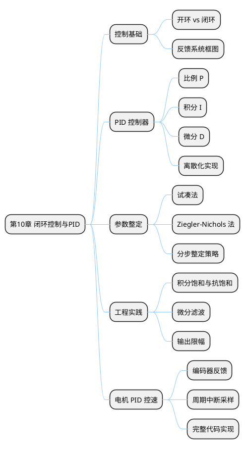

## 10 第 10 章 闭环控制与 PID

> 开环控制无法应对负载变化和外部扰动，闭环控制通过反馈信号自动调节输出，是嵌入式系统实现精确控制的核心方法。本章介绍 PID 控制器的原理、参数整定方法，并以直流电机转速控制为例给出 STM32 实现。

### 10.1 本章知识导图



**图 10-1** 本章知识导图：从控制基础到 PID 工程实现。
<!-- fig:ch10-1 本章知识导图：从控制基础到 PID 工程实现。 -->

### 10.2 开环与闭环控制

#### 10.2.1 开环控制

开环控制不检测实际输出，直接给定输入（如给PWM 50%占空比期望电机转500 RPM）。缺点是无法自动补偿负载变化和参数漂移。

#### 10.2.2 闭环控制

闭环控制引入反馈传感器（如编码器），将实际值与目标值的偏差作为控制器输入，自动调节输出：

```bob
  +-------+     e(t)   +------------+   u(t)   +-------+   y(t)
  |  r(t) +---->( - )-->| 控制器     |--------->| 被控  |--------+----> 输出
  | 目标值 |     ^       | PID        |          | 对象  |        |
  +-------+     |       +------------+          +-------+        |
                |                                                |
                |       +------------+                           |
                +-------| 反馈传感器  |<--------------------------+
                        +------------+
```

**图 10-2** 闭环控制系统框图：目标值 $r(t)$、偏差 $e(t) = r(t) - y(t)$、控制量 $u(t)$、输出 $y(t)$。
<!-- fig:ch10-2 闭环控制系统框图：目标值 $r(t)$、偏差 $e(t) = r(t) - y(t)$、控制量 $u(t)$、输出 $y(t)$。 -->

---

### 10.3 PID 控制器原理

PID 控制器通过 **比例（P）**、**积分（I）**、**微分（D）** 三个环节的组合来消除偏差：

$$u(t) = K_p e(t) + K_i \int_0^t e(\tau) d\tau + K_d \frac{de(t)}{dt}$$

#### 10.3.1 比例项（P）

$$u_P = K_p \cdot e(t)$$

- 偏差越大，输出越大——直接、迅速
- 单独使用会产生**稳态误差**（想象弹簧：拉力越大伸长越多，但总有剩余偏移）

#### 10.3.2 积分项（I）

$$u_I = K_i \int_0^t e(\tau) d\tau$$

- 对偏差进行累积——只要偏差存在，积分项持续增长，直到消除稳态误差
- 副作用：积累过大导致**积分饱和**（overshoot 和振荡）

#### 10.3.3 微分项（D）

$$u_D = K_d \frac{de(t)}{dt}$$

- 根据偏差变化率预测趋势——偏差在减小时提前减小输出，起阻尼作用
- 副作用：对噪声敏感，需配合低通滤波

**表 10-1** PID 各环节效果对比
<!-- tab:ch10-1 PID 各环节效果对比 -->

| 参数 | 上升时间 | 超调量 | 稳态误差 | 稳定性 |
|:----:|:-------:|:-----:|:-------:|:-----:|
| 增大 $K_p$ | 减小 | 增大 | 减小但不消除 | 变差 |
| 增大 $K_i$ | 减小 | 增大 | 消除 | 变差 |
| 增大 $K_d$ | 微变 | 减小 | 无影响 | 改善 |

---

### 10.4 PID 离散化

MCU 以固定周期 $T$ 采样，需将连续 PID 转化为离散形式：

$$u[k] = K_p \cdot e[k] + K_i \cdot T \sum_{j=0}^{k} e[j] + K_d \cdot \frac{e[k] - e[k-1]}{T}$$

为避免每次都计算完整累加和，使用**增量式 PID**更为常用：

$$\Delta u[k] = K_p (e[k] - e[k-1]) + K_i \cdot T \cdot e[k] + K_d \cdot \frac{e[k] - 2e[k-1] + e[k-2]}{T}$$

$$u[k] = u[k-1] + \Delta u[k]$$

增量式 PID 的优点：

- 只输出增量，不会因积分累积导致异常大输出
- 切换手动/自动模式时无扰动
- 便于实现输出限幅

---

### 10.5 工程实践要点

#### 10.5.1 积分抗饱和

当输出达到限幅值时，停止积分累积：

```c
/* 条件积分：输出未饱和时才累积 */
if (pid->output > -pid->out_max && pid->output < pid->out_max) {
    pid->integral += pid->error * pid->dt;
}
```

#### 10.5.2 微分滤波

添加一阶低通滤波抑制高频噪声：

$$D_{filtered}[k] = \alpha \cdot D_{raw}[k] + (1 - \alpha) \cdot D_{filtered}[k-1]$$

典型 $\alpha = 0.1 \sim 0.3$。

#### 10.5.3 输出限幅

防止 PWM 占空比越界（0~ARR）或电机过流：

```c
if (output > OUT_MAX)  output = OUT_MAX;
if (output < OUT_MIN)  output = OUT_MIN;
```

---

### 10.6 参数整定方法

#### 10.6.1 分步整定法（推荐初学者）

1. **先调 P**：将 $K_i = 0$、$K_d = 0$，逐步增大 $K_p$ 直到系统出现等幅振荡
2. **再调 I**：在 P 的基础上逐步增大 $K_i$，消除稳态误差，同时观察超调不超过 20%
3. **后调 D**：增大 $K_d$ 减小超调和振荡，提高响应速度

#### 10.6.2 Ziegler-Nichols 临界比例法

1. 仅用 P 控制，逐步增大 $K_p$ 至系统出现**持续等幅振荡**
2. 记录此时的 $K_{cr}$（临界增益）和 $T_{cr}$（振荡周期）
3. 按下表计算 PID 参数：

**表 10-2** Ziegler-Nichols 参数整定表
<!-- tab:ch10-2 Ziegler-Nichols 参数整定表 -->

| 控制器类型 | $K_p$ | $K_i$ | $K_d$ |
|:---------:|:-----:|:-----:|:-----:|
| P | $0.5 K_{cr}$ | — | — |
| PI | $0.45 K_{cr}$ | $1.2 K_p / T_{cr}$ | — |
| PID | $0.6 K_{cr}$ | $2 K_p / T_{cr}$ | $K_p T_{cr} / 8$ |

---

### 10.7 实例：直流电机 PID 调速

本节将第 9 章的电机驱动和编码器测速与 PID 控制器结合，实现转速闭环控制。

#### 10.7.1 PID 结构体定义

```c
typedef struct {
    float kp, ki, kd;
    float dt;           /* 采样周期（秒） */
    float target;       /* 目标值 */
    float error;        /* 当前偏差 */
    float last_error;   /* 上次偏差 */
    float integral;     /* 积分累积 */
    float output;       /* 输出值 */
    float out_max;      /* 输出上限 */
    float out_min;      /* 输出下限 */
    float d_filter;     /* 微分滤波值 */
} PID_TypeDef;

void PID_Init(PID_TypeDef *pid, float kp, float ki, float kd, float dt)
{
    pid->kp = kp;
    pid->ki = ki;
    pid->kd = kd;
    pid->dt = dt;
    pid->target = 0;
    pid->error = 0;
    pid->last_error = 0;
    pid->integral = 0;
    pid->output = 0;
    pid->out_max = 999;   /* 对应 TIM PWM ARR */
    pid->out_min = -999;
    pid->d_filter = 0;
}
```

#### 10.7.2 PID 计算函数

```c
float PID_Compute(PID_TypeDef *pid, float measured)
{
    pid->error = pid->target - measured;

    /* 积分抗饱和 */
    if (pid->output > pid->out_min && pid->output < pid->out_max) {
        pid->integral += pid->error * pid->dt;
    }

    /* 微分项 + 低通滤波（alpha = 0.2） */
    float d_raw = (pid->error - pid->last_error) / pid->dt;
    pid->d_filter = 0.2f * d_raw + 0.8f * pid->d_filter;

    /* PID 输出 */
    pid->output = pid->kp * pid->error
                + pid->ki * pid->integral
                + pid->kd * pid->d_filter;

    /* 输出限幅 */
    if (pid->output > pid->out_max) pid->output = pid->out_max;
    if (pid->output < pid->out_min) pid->output = pid->out_min;

    pid->last_error = pid->error;
    return pid->output;
}
```

#### 10.7.3 周期中断中调用

```c
/* 在 TIM6 中断中每 10ms 执行一次 */
PID_TypeDef motor_pid;

void HAL_TIM_PeriodElapsedCallback(TIM_HandleTypeDef *htim)
{
    if (htim->Instance == TIM6) {
        /* 1. 读取编码器，计算实际转速 */
        float rpm = Encoder_GetRPM(11);  /* 11 PPR 编码器 */

        /* 2. PID 计算 */
        float out = PID_Compute(&motor_pid, rpm);

        /* 3. 设置电机方向和速度 */
        if (out >= 0) {
            Motor_SetDir(MOTOR_FORWARD);
            Motor_SetSpeed((uint16_t)out);
        } else {
            Motor_SetDir(MOTOR_BACKWARD);
            Motor_SetSpeed((uint16_t)(-out));
        }
    }
}

int main(void)
{
    HAL_Init();
    SystemClock_Config();
    /* ... GPIO/TIM 初始化 ... */

    PID_Init(&motor_pid, 2.0f, 0.5f, 0.1f, 0.01f);
    motor_pid.target = 300.0f;  /* 目标 300 RPM */

    Encoder_Start();
    HAL_TIM_Base_Start_IT(&htim6);  /* 启动 10ms 定时中断 */
    HAL_TIM_PWM_Start(&htim3, TIM_CHANNEL_1);

    while (1) {
        /* 主循环可处理通信、显示等 */
    }
}
```

---

### 10.8 串级 PID 简介

某些场景需要更高控制精度，可使用串级（Cascade）PID——外环输出作为内环目标：

- **外环**：位置控制（目标位置 → 偏差 → PID → 输出目标转速）
- **内环**：速度控制（目标转速 → 偏差 → PID → 输出 PWM）

内环采样频率应高于外环（通常 5~10 倍），先调内环参数再调外环。

---

### 10.9 本章小结

- **闭环控制**通过反馈信号自动补偿扰动，是精确控制的基础
- **PID 控制器**由比例、积分、微分三个环节组成，应用最广泛
- 工程实现中需注意**积分抗饱和、微分滤波、输出限幅**
- 参数整定推荐**分步法**（先 P → 后 I → 再 D）
- 本章 PID 与第 9 章电机驱动、编码器测速结合，构成完整的转速闭环系统

---

### 10.10 习题

1. 比较开环控制和闭环控制的优缺点，举出各一个农业场景的例子。
2. 当系统存在稳态误差时，应调整 PID 的哪个参数？简述原因。
3. 什么是积分饱和？工程中如何处理？
4. 使用 Ziegler-Nichols 法整定参数：假设临界增益 $K_{cr} = 10$，振荡周期 $T_{cr} = 0.2s$，计算 PID 参数。
5. 设计一个温室温度控制系统方案：使用温度传感器（DS18B20）测量室温，PID 控制加热器功率，要求能在设定温度±0.5°C 内稳定。画出系统框图并给出关键代码思路。