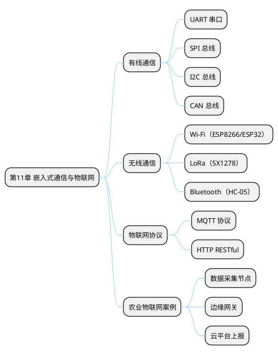

## 11 第 11 章 嵌入式通信与物联网

> 嵌入式系统很少独立工作，往往需要与上位机、云平台或其他节点通信。本章深入介绍 UART、SPI、I2C、CAN 四种常用总线协议，并扩展到 Wi-Fi、LoRa 等无线通信与 MQTT 物联网协议，最后结合农业物联网场景给出综合案例。

### 11.1 本章知识导图



**图 11-1** 本章知识导图：从有线总线到物联网协议的完整通信体系。
<!-- fig:ch11-1 本章知识导图：从有线总线到物联网协议的完整通信体系。 -->

### 11.2 有线通信总线对比

**表 11-1** 四种常用有线通信总线对比
<!-- tab:ch11-1 四种常用有线通信总线对比 -->

| 特性 | UART | SPI | I2C | CAN |
|------|------|-----|-----|-----|
| 信号线数 | 2（TX/RX） | 4（SCK/MOSI/MISO/CS） | 2（SCL/SDA） | 2（CANH/CANL） |
| 通信方式 | 异步全双工 | 同步全双工 | 同步半双工 | 异步半双工 |
| 主从关系 | 点对点 | 一主多从 | 多主多从 | 多主多从 |
| 典型速率 | 115200 bps | 数十 Mbps | 100/400 kbps | 1 Mbps |
| 传输距离 | 短（<15m） | 很短（<1m） | 短（<1m） | 长（可达 1km） |
| 典型应用 | 调试串口、GPS | Flash、LCD、ADC | 传感器、EEPROM | 汽车/工业网络 |

---

### 11.3 UART 串口通信

UART（Universal Asynchronous Receiver/Transmitter）是最常用的调试和通信接口。第 3 章已介绍基本配置，本节补充 DMA 收发和协议帧设计。

#### 11.3.1 DMA 接收不定长数据

利用 UART 空闲中断 + DMA 实现不定长数据接收，是工程中最常用的方案：

```c
/* 全局缓冲区 */
#define RX_BUF_SIZE  256
uint8_t rx_buf[RX_BUF_SIZE];
volatile uint16_t rx_len = 0;
volatile uint8_t rx_flag = 0;

/* 启动 DMA 接收 */
void UART_StartReceive(void)
{
    __HAL_UART_ENABLE_IT(&huart1, UART_IT_IDLE);
    HAL_UART_Receive_DMA(&huart1, rx_buf, RX_BUF_SIZE);
}

/* 空闲中断回调（在 USARTx_IRQHandler 中调用） */
void UART_IDLE_Handler(void)
{
    if (__HAL_UART_GET_FLAG(&huart1, UART_FLAG_IDLE)) {
        __HAL_UART_CLEAR_IDLEFLAG(&huart1);
        HAL_UART_DMAStop(&huart1);
        rx_len = RX_BUF_SIZE - __HAL_DMA_GET_COUNTER(huart1.hdmarx);
        rx_flag = 1;
        HAL_UART_Receive_DMA(&huart1, rx_buf, RX_BUF_SIZE);
    }
}
```

#### 11.3.2 自定义协议帧

工程通信需要定义帧结构保证数据完整性：

**表 11-2** 自定义通信协议帧格式
<!-- tab:ch11-2 自定义通信协议帧格式 -->

| 帧头 | 长度 | 命令 | 数据 | 校验 |
|:----:|:---:|:---:|:----:|:---:|
| 0xAA 0x55 | 1字节（数据域长度） | 1字节 | N字节 | 1字节（异或校验） |

```c
typedef struct __attribute__((packed)) {
    uint8_t header[2];  /* 0xAA, 0x55 */
    uint8_t length;     /* 数据域长度 */
    uint8_t cmd;        /* 命令码 */
    uint8_t data[64];   /* 数据域 */
    uint8_t checksum;   /* XOR 校验 */
} FrameTypeDef;

uint8_t Frame_CalcChecksum(const uint8_t *buf, uint16_t len)
{
    uint8_t xor_val = 0;
    for (uint16_t i = 0; i < len; i++) {
        xor_val ^= buf[i];
    }
    return xor_val;
}
```

---

### 11.4 CAN 总线深入

CAN（Controller Area Network）最初为汽车网络设计，因其高可靠性和长距离传输能力，在工业控制和农业装备中广泛应用。STM32F103 内置 bxCAN 控制器。

#### 11.4.1 CAN 帧结构

**表 11-3** CAN 标准数据帧各字段
<!-- tab:ch11-3 CAN 标准数据帧各字段 -->

| 字段 | 位数 | 说明 |
|------|:----:|------|
| SOF | 1 | 帧起始（显性位） |
| 标识符（ID） | 11 | 仲裁用，数值越小优先级越高 |
| RTR | 1 | 0=数据帧，1=远程帧 |
| 控制域 | 6 | 含DLC（数据长度 0~8） |
| 数据域 | 0~64 | 0~8字节有效数据 |
| CRC | 16 | 循环冗余校验 |
| ACK | 2 | 接收方确认 |
| EOF | 7 | 帧结束 |

#### 11.4.2 STM32 CAN 收发

```c
/* CAN 发送数据 */
CAN_TxHeaderTypeDef tx_header;
uint8_t tx_data[8];
uint32_t tx_mailbox;

void CAN_SendData(uint32_t id, uint8_t *data, uint8_t len)
{
    tx_header.StdId = id;
    tx_header.IDE   = CAN_ID_STD;
    tx_header.RTR   = CAN_RTR_DATA;
    tx_header.DLC   = len;

    HAL_CAN_AddTxMessage(&hcan, &tx_header, data, &tx_mailbox);
}

/* CAN 接收回调 */
void HAL_CAN_RxFifo0MsgPendingCallback(CAN_HandleTypeDef *hcan_inst)
{
    CAN_RxHeaderTypeDef rx_header;
    uint8_t rx_data[8];

    HAL_CAN_GetRxMessage(hcan_inst, CAN_RX_FIFO0, &rx_header, rx_data);

    /* 根据 ID 分发处理 */
    switch (rx_header.StdId) {
        case 0x101:  /* 温湿度节点 */
            Process_TempHumi(rx_data, rx_header.DLC);
            break;
        case 0x102:  /* 土壤湿度节点 */
            Process_Soil(rx_data, rx_header.DLC);
            break;
    }
}

/* 过滤器配置——只接收 0x100~0x1FF 的帧 */
void CAN_FilterConfig(void)
{
    CAN_FilterTypeDef filter;
    filter.FilterBank           = 0;
    filter.FilterMode           = CAN_FILTERMODE_IDMASK;
    filter.FilterScale          = CAN_FILTERSCALE_32BIT;
    filter.FilterIdHigh         = 0x100 << 5;
    filter.FilterIdLow          = 0;
    filter.FilterMaskIdHigh     = 0x700 << 5;
    filter.FilterMaskIdLow      = 0;
    filter.FilterFIFOAssignment = CAN_RX_FIFO0;
    filter.FilterActivation     = ENABLE;
    HAL_CAN_ConfigFilter(&hcan, &filter);
}
```

---

### 11.5 Wi-Fi 通信（ESP8266）

ESP8266 是低成本 Wi-Fi 模块，通过 AT 指令与 STM32 串口通信，可将嵌入式设备接入互联网。

#### 11.5.1 AT 指令基础

**表 11-4** 常用 ESP8266 AT 指令
<!-- tab:ch11-4 常用 ESP8266 AT 指令 -->

| 指令 | 功能 | 示例响应 |
|------|------|---------|
| `AT` | 测试连接 | OK |
| `AT+CWMODE=1` | 设为 Station 模式 | OK |
| `AT+CWJAP="SSID","PASS"` | 连接 Wi-Fi | WIFI CONNECTED |
| `AT+CIPSTART="TCP","IP",PORT` | 建立 TCP 连接 | CONNECT |
| `AT+CIPSEND=N` | 发送 N 字节数据 | > |

#### 11.5.2 STM32 驱动 ESP8266

```c
/* 发送 AT 指令并等待响应 */
uint8_t ESP_SendCmd(const char *cmd, const char *expected,
                    uint32_t timeout_ms)
{
    rx_flag = 0;
    HAL_UART_Transmit(&huart2, (uint8_t *)cmd, strlen(cmd), 100);
    HAL_UART_Transmit(&huart2, (uint8_t *)"\r\n", 2, 10);

    uint32_t start = HAL_GetTick();
    while (HAL_GetTick() - start < timeout_ms) {
        if (rx_flag) {
            rx_flag = 0;
            if (strstr((char *)rx_buf, expected)) return 1;
        }
    }
    return 0;
}

/* 初始化 ESP8266 并连接 Wi-Fi */
uint8_t ESP_Init(const char *ssid, const char *pass)
{
    char cmd[128];
    if (!ESP_SendCmd("AT", "OK", 2000)) return 0;
    if (!ESP_SendCmd("AT+CWMODE=1", "OK", 2000)) return 0;
    snprintf(cmd, sizeof(cmd), "AT+CWJAP=\"%s\",\"%s\"", ssid, pass);
    if (!ESP_SendCmd(cmd, "WIFI GOT IP", 10000)) return 0;
    return 1;
}
```

---

### 11.6 LoRa 远距离通信

LoRa（Long Range）是一种低功耗广域网（LPWAN）技术，适用于农业环境监测等远距离、低速率场景。

**表 11-5** LoRa 与 Wi-Fi 对比
<!-- tab:ch11-5 LoRa 与 Wi-Fi 对比 -->

| 特性 | LoRa | Wi-Fi |
|------|------|-------|
| 通信距离 | 1~15 km（开阔地） | 50~100 m |
| 数据速率 | 0.3~50 kbps | 数十 Mbps |
| 功耗 | 极低（电池供电数月~年） | 高（需持续供电） |
| 频段 | 免授权（433/470/868/915 MHz） | 2.4/5 GHz |
| 拓扑 | 星型 | 星型/Mesh |
| 适用场景 | 农田监测、水质检测 | 室内设备联网 |

SX1278 模块通过 SPI 接口与 STM32 通信，基本流程：配置频率/扩频因子/带宽 → 发送/接收数据包。

---

### 11.7 MQTT 物联网协议

MQTT（Message Queuing Telemetry Transport）是物联网中最流行的轻量级消息协议，基于发布/订阅模型。

#### 11.7.1 核心概念

```bob
  +----------+    PUBLISH     +----------+    PUBLISH     +----------+
  | 传感器   |   topic:       | MQTT     |   topic:       | 手机APP  |
  | 节点     |  "farm/temp"   | Broker   |  "farm/temp"   | 订阅者   |
  | (发布者)  |  ------------> | 服务器   |  ------------> | (订阅者)  |
  +----------+                +----------+                +----------+
                                   |
                              +----------+
                              | 云平台   |
                              | 订阅者   |
                              +----------+
```

**图 11-2** MQTT 发布/订阅模型：发布者和订阅者通过 Broker 解耦通信。
<!-- fig:ch11-2 MQTT 发布/订阅模型：发布者和订阅者通过 Broker 解耦通信。 -->

**表 11-6** MQTT QoS 等级
<!-- tab:ch11-6 MQTT QoS 等级 -->

| QoS | 语义 | 说明 |
|:---:|------|------|
| 0 | 最多一次（At most once） | 不确认，可能丢失 |
| 1 | 至少一次（At least once） | 确认机制，可能重复 |
| 2 | 恰好一次（Exactly once） | 四次握手，开销最大 |

#### 11.7.2 嵌入式 MQTT 报文构造

MQTT CONNECT 报文由固定头 + 可变头 + 有效载荷组成。嵌入式端通常使用轻量级 MQTT 库（如 MQTTPacket），或手动构造报文通过 TCP 发送：

```c
/* 简化的 MQTT PUBLISH 报文构造 */
uint16_t MQTT_BuildPublish(uint8_t *buf, const char *topic,
                           const char *payload)
{
    uint16_t topic_len = strlen(topic);
    uint16_t payload_len = strlen(payload);
    uint16_t remain_len = 2 + topic_len + payload_len;
    uint16_t idx = 0;

    buf[idx++] = 0x30;                     /* PUBLISH, QoS0 */
    buf[idx++] = (uint8_t)remain_len;      /* 剩余长度（<128） */
    buf[idx++] = (uint8_t)(topic_len >> 8);
    buf[idx++] = (uint8_t)(topic_len);
    memcpy(&buf[idx], topic, topic_len);
    idx += topic_len;
    memcpy(&buf[idx], payload, payload_len);
    idx += payload_len;

    return idx;
}
```

---

### 11.8 综合案例：农业物联网数据采集

将前面学习的技术整合，构建一个农业温室环境监测系统：

```bob
  ┌──────────────┐     CAN      ┌──────────────┐    UART/AT    ┌──────────┐
  │ 传感器节点A   │─────────────>│ 网关节点      │──────────────>│ ESP8266  │
  │ STM32+DHT11  │              │ STM32F103    │              │ Wi-Fi    │
  │ +土壤湿度     │              │ CAN接收       │              └────┬─────┘
  └──────────────┘              │ 数据汇聚      │                   │
                                │ OLED显示      │              MQTT PUBLISH
  ┌──────────────┐     CAN      │               │                   │
  │ 传感器节点B   │─────────────>│               │                   v
  │ STM32+超声波  │              └──────────────┘              ┌──────────┐
  │ +光照传感器   │                                            │ 云平台   │
  └──────────────┘                                            │ MQTT     │
                                                              │ Broker   │
                                                              └──────────┘
```

**图 11-3** 农业物联网系统架构：多个 CAN 节点采集数据，网关汇聚后通过 Wi-Fi/MQTT 上报云平台。
<!-- fig:ch11-3 农业物联网系统架构：多个 CAN 节点采集数据，网关汇聚后通过 Wi-Fi/MQTT 上报云平台。 -->

**系统特点：**

- CAN 总线连接多个传感器节点，距离可达数百米，适合温室大棚
- 网关节点汇聚数据，本地 OLED 显示，同时通过 ESP8266 上云
- MQTT 主题设计：`farm/{zone}/temp`、`farm/{zone}/humi`、`farm/{zone}/soil`
- 支持远程下发控制指令（如开启灌溉、调节通风）

---

### 11.9 本章小结

- **有线通信**：UART 用于调试和短距点对点；SPI 用于高速外设；I2C 用于低速传感器；CAN 用于长距离多节点网络
- **无线通信**：ESP8266 Wi-Fi 适合近距离联网；LoRa 适合远距离低功耗场景
- **MQTT 协议**：发布/订阅模型适合物联网的一对多通信
- **系统集成**：CAN 总线 + Wi-Fi 网关 + MQTT 云平台是农业物联网的典型架构

---

### 11.10 习题

1. 比较 UART、SPI、I2C、CAN 四种总线的适用场景，各举一个实际应用。
2. 设计一个通信协议帧格式，要求支持帧头检测、长度可变数据域和 CRC 校验。
3. CAN 总线仲裁机制如何保证高优先级消息先发送？
4. 比较 LoRa 和 Wi-Fi 在农业物联网中的优劣势。
5. 设计一个 3 节点的温室监测系统：节点 1 采集温湿度，节点 2 采集光照和土壤湿度，网关节点汇聚数据通过 MQTT 上报。画出系统架构图并设计 CAN ID 分配和 MQTT 主题规划。