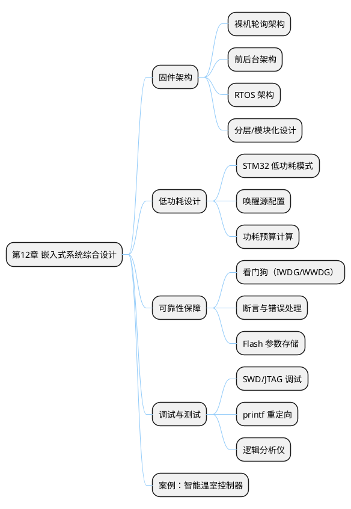
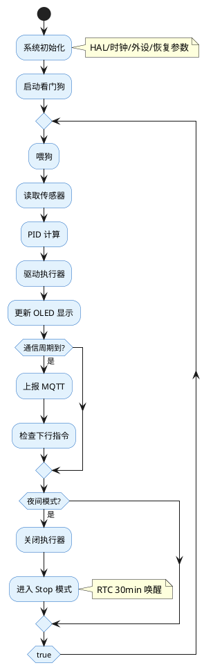

## 12 第 12 章 嵌入式系统综合设计

> 前面各章分别介绍了外设驱动、传感器、执行器、通信和控制。本章将从系统层面讨论嵌入式产品的设计方法论，包括低功耗设计、固件架构、可靠性保障和调试技术，帮助学生从"写一个外设驱动"提升到"设计一个完整的嵌入式产品"。

### 12.1 本章知识导图



**图 12-1** 本章知识导图：嵌入式系统综合设计的关键要素。
<!-- fig:ch12-1 本章知识导图：嵌入式系统综合设计的关键要素。 -->

### 12.2 固件架构设计

#### 12.2.1 三种典型架构

**表 12-1** 三种固件架构对比
<!-- tab:ch12-1 三种固件架构对比 -->

| 架构 | 结构 | 优点 | 缺点 | 适用场景 |
|------|------|------|------|---------|
| 裸机轮询 | `while(1)` 顺序执行 | 简单直观 | 无法响应实时事件 | LED 闪烁等极简应用 |
| 前后台 | 中断（前台）+ `while(1)`（后台） | 实时性好 | 中断中不宜执行耗时操作 | 大多数中小型项目 |
| RTOS | 多任务调度 | 模块化、可扩展 | 占用 RAM、学习成本高 | 复杂多任务系统 |

#### 12.2.2 前后台架构实践

前后台架构是嵌入式开发最常用的模式——中断中置标志位/存数据，主循环中处理逻辑：

```c
/* 全局标志 */
volatile uint8_t flag_uart_rx = 0;
volatile uint8_t flag_tim_10ms = 0;
volatile uint8_t flag_adc_done = 0;

/* 中断：置标志 + 快速存数据 */
void HAL_TIM_PeriodElapsedCallback(TIM_HandleTypeDef *htim)
{
    if (htim->Instance == TIM6)
        flag_tim_10ms = 1;
}

/* 主循环：依次处理各事件 */
int main(void)
{
    HAL_Init();
    SystemClock_Config();
    Periph_Init();

    while (1) {
        if (flag_tim_10ms) {
            flag_tim_10ms = 0;
            PID_Control_Task();    /* 10ms 周期控制 */
        }
        if (flag_uart_rx) {
            flag_uart_rx = 0;
            Command_Parse_Task();  /* 解析串口指令 */
        }
        if (flag_adc_done) {
            flag_adc_done = 0;
            Sensor_Process_Task(); /* 传感器数据处理 */
        }
        Display_Update_Task();     /* 低优先级刷新显示 */
    }
}
```

#### 12.2.3 分层模块化设计

```bob
  ┌─────────────────────────────────────────────┐
  │               应用层 (Application)           │
  │  main.c, task_xxx.c                         │
  ├─────────────────────────────────────────────┤
  │               服务层 (Service)               │
  │  pid.c, protocol.c, mqtt.c                  │
  ├─────────────────────────────────────────────┤
  │               驱动层 (Driver)                │
  │  motor.c, dht11.c, oled.c, esp8266.c       │
  ├─────────────────────────────────────────────┤
  │               硬件抽象层 (HAL)               │
  │  stm32f1xx_hal_xxx.c                        │
  ├─────────────────────────────────────────────┤
  │               硬件 (Hardware)                │
  │  STM32F103C8T6 + 外围电路                    │
  └─────────────────────────────────────────────┘
```

**图 12-2** 分层固件架构：上层调用下层接口，禁止跨层或反向调用。
<!-- fig:ch12-2 分层固件架构：上层调用下层接口，禁止跨层或反向调用。 -->

---

### 12.3 低功耗设计

电池供电的农业传感器节点需要极低功耗以延长工作时间。STM32F103 提供三种低功耗模式：

**表 12-2** STM32F103 低功耗模式对比
<!-- tab:ch12-2 STM32F103 低功耗模式对比 -->

| 模式 | 内核 | 外设 | RAM | 唤醒源 | 典型电流 |
|------|:----:|:----:|:---:|--------|:-------:|
| Sleep | 停止 | 运行 | 保持 | 任意中断 | ~1.5 mA |
| Stop | 停止 | 停止 | 保持 | EXTI/RTC | ~20 μA |
| Standby | 停止 | 停止 | 丢失 | WKUP/RTC/NRST | ~2 μA |

#### 12.3.1 Stop 模式实现

```c
/* 进入 Stop 模式，RTC 闹钟唤醒 */
void EnterStopMode(uint32_t wakeup_sec)
{
    /* 配置 RTC 闹钟 */
    HAL_RTC_SetAlarm_IT(&hrtc, &alarm, RTC_FORMAT_BIN);

    /* 进入 Stop 模式 */
    HAL_SuspendTick();
    HAL_PWR_EnterSTOPMode(PWR_LOWPOWERREGULATOR_ON, PWR_STOPENTRY_WFI);

    /* 唤醒后恢复时钟 */
    SystemClock_Config();
    HAL_ResumeTick();
}

/* 典型工作模式：采集 → 发送 → 休眠 */
while (1) {
    Sensor_ReadAll();          /* 采集传感器数据 */
    MQTT_PublishData();        /* 上报数据 */
    EnterStopMode(300);        /* 休眠 5 分钟 */
}
```

#### 12.3.2 功耗预算计算

以 3.7V/2000mAh 锂电池供电为例：

**表 12-3** 
<!-- tab:ch12-3  -->

| 阶段 | 时间 | 电流 | 能量消耗 |
|------|:----:|:----:|:-------:|
| 采集+发送 | 5s | 50 mA | 0.069 mAh |
| 休眠 | 295s | 20 μA | 0.0016 mAh |
| **一个周期（5min）** | **300s** | — | **0.071 mAh** |

$$寿命 = \frac{2000 \text{ mAh}}{0.071 \times 12} = 2347 \text{ 小时} \approx 98 \text{ 天}$$

---

### 12.4 可靠性保障

#### 12.4.1 独立看门狗（IWDG）

IWDG 使用独立的 LSI 时钟，即使主时钟失效也能复位 MCU：

```c
/* CubeMX 配置 IWDG：预分频 64，重载 625 → 超时约 1s */
void WDG_Init(void)
{
    hiwdg.Instance       = IWDG;
    hiwdg.Init.Prescaler = IWDG_PRESCALER_64;
    hiwdg.Init.Reload    = 625;
    HAL_IWDG_Init(&hiwdg);
}

/* 主循环中喂狗 */
while (1) {
    HAL_IWDG_Refresh(&hiwdg);  /* 必须在 1s 内执行 */
    /* ... 正常任务 ... */
}
```

#### 12.4.2 Flash 参数存储

将配置参数（PID 系数、传感器校准值、通信地址）存入 Flash 末页，断电不丢失：

```c
#define PARAM_ADDR  0x0800FC00  /* Flash 最后一页起始地址 */

void Param_Save(const uint8_t *data, uint16_t len)
{
    HAL_FLASH_Unlock();
    FLASH_EraseInitTypeDef erase;
    erase.TypeErase   = FLASH_TYPEERASE_PAGES;
    erase.PageAddress = PARAM_ADDR;
    erase.NbPages     = 1;
    uint32_t error;
    HAL_FLASHEx_Erase(&erase, &error);

    for (uint16_t i = 0; i < len; i += 2) {
        uint16_t half_word = data[i] | (data[i + 1] << 8);
        HAL_FLASH_Program(FLASH_TYPEPROGRAM_HALFWORD,
                          PARAM_ADDR + i, half_word);
    }
    HAL_FLASH_Lock();
}

void Param_Load(uint8_t *data, uint16_t len)
{
    memcpy(data, (const void *)PARAM_ADDR, len);
}
```

---

### 12.5 调试技术

#### 12.5.1 printf 重定向到串口

```c
/* 重定向 printf 到 USART1（需勾选 Use MicroLIB） */
int fputc(int ch, FILE *f)
{
    HAL_UART_Transmit(&huart1, (uint8_t *)&ch, 1, 10);
    return ch;
}

/* 使用示例 */
printf("RPM=%.1f, PID_out=%.1f\r\n", rpm, pid_output);
```

#### 12.5.2 关键调试手段

**表 12-4** 嵌入式系统调试手段
<!-- tab:ch12-4 嵌入式系统调试手段 -->

| 手段 | 工具 | 适用场景 |
|------|------|---------|
| 串口打印 | USART + 串口助手 | 运行时变量监控 |
| SWD 在线调试 | ST-Link + CubeIDE | 断点、单步、变量查看 |
| 逻辑分析仪 | Saleae / PulseView | 时序分析（I2C/SPI/UART 波形） |
| LED 指示 | 板载 LED | 快速定位程序是否运行到某阶段 |
| PicSimlab 仿真 | PicSimlab（第 6 章） | 无硬件条件下的全功能调试 |

---

### 12.6 综合案例：智能温室控制器

整合本书前 11 章的知识，设计一个完整的智能温室控制器系统：

**表 12-5** 系统功能需求
<!-- tab:ch12-5 系统功能需求 -->

| 模块 | 功能 | 涉及章节 |
|------|------|---------|
| 传感器采集 | DHT11 温湿度 + 光照 ADC + 土壤湿度 ADC | 第 7 章 |
| 本地显示 | OLED 显示当前参数和系统状态 | 第 8 章 |
| 执行控制 | 直流电机驱动风扇、步进电机控制遮阳帘 | 第 9 章 |
| 自动调温 | PID 控制风扇速度，维持目标温度 | 第 10 章 |
| 远程通信 | CAN 总线多节点 + Wi-Fi/MQTT 上云 | 第 11 章 |
| 低功耗 | 夜间进入 Stop 模式，RTC 定时唤醒 | 第 12 章 |
| 可靠性 | 看门狗、参数 Flash 存储、异常自恢复 | 第 12 章 |

**软件流程：**



**图 12-3** 智能温室控制器主程序流程。
<!-- fig:ch12-3 智能温室控制器主程序流程。 -->

---

### 12.7 本章小结

- **固件架构**：前后台架构适合大多数嵌入式项目，代码应分层组织（应用→服务→驱动→HAL）
- **低功耗设计**：Stop 模式 + RTC 唤醒可将功耗降至 μA 级，电池供电可达数月
- **可靠性**：看门狗防死机、Flash 存储防断电丢参数
- **调试**：printf 重定向 + SWD 调试 + PicSimlab 仿真是最实用的三板斧
- **系统集成**：综合设计需要从需求分析→架构设计→模块实现→联调测试系统化推进

---

### 12.8 习题

1. 比较裸机轮询、前后台和 RTOS 三种架构的优缺点，你的毕业设计项目适合哪种架构？
2. 计算：若传感器节点每 10 分钟采集并发送一次数据，采集发送阶段 3 秒、50mA，休眠 20μA。使用 18650 电池（3400mAh）能工作多久？
3. 独立看门狗（IWDG）和窗口看门狗（WWDG）的区别是什么？各适用于什么场景？
4. 为什么 STM32 的 Flash 编程必须先擦除后写入？最小擦除单位是什么？
5. 画出你设计的一个嵌入式产品（如智能鱼缸、自动浇花器等）的系统框图，标明传感器、执行器、通信方式和电源方案。