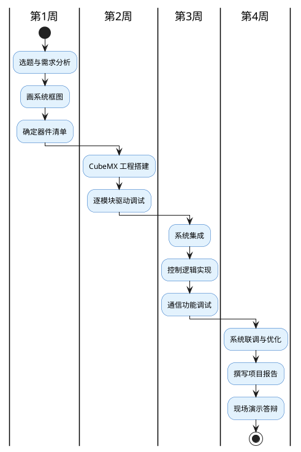

## 15 第 15 章 实验三：嵌入式系统综合项目

> 本实验是课程的综合实践环节，要求学生自主设计并实现一个完整的嵌入式系统项目，运用本学期所学的全部知识。

### 15.1 实验目的

1. 综合运用 STM32 外设驱动、传感器、执行器、PID 控制和通信技术
2. 体验嵌入式产品从需求分析到系统实现的完整流程
3. 培养团队协作和技术文档撰写能力

### 15.2 项目选题

从以下选题中任选一个（或自拟选题，需教师审批）：

**表 15-1** 推荐项目选题
<!-- tab:ch15-1 推荐项目选题 -->

| 选题 | 核心技术点 | 难度 |
|------|-----------|:----:|
| **智能温室环境监控** | DHT11+光照ADC+OLED+CAN+MQTT | ★★★ |
| **自动浇花系统** | 土壤湿度ADC+水泵DC电机+PID+定时 | ★★☆ |
| **智能停车引导** | 超声波测距+LED数码管+步进电机挡杆 | ★★☆ |
| **恒温培养箱** | DS18B20+加热器PWM+PID+OLED+串口上位机 | ★★★ |
| **农田气象站** | 多传感器+LoRa/Wi-Fi+太阳能+低功耗 | ★★★★ |

### 15.3 项目要求

#### 15.3.1 功能要求

- **最少含 2 种传感器**的数据采集
- **至少 1 个执行器**的驱动控制
- **本地显示**（OLED 或数码管）
- **通信功能**（UART 上位机 或 Wi-Fi/CAN）
- 具备一定的**自动控制逻辑**（阈值判断或 PID）

#### 15.3.2 技术要求

**表 15-2** 技术评价指标
<!-- tab:ch15-2 技术评价指标 -->

| 指标 | 要求 |
|------|------|
| CubeMX 配置 | 正确配置所有外设，时钟树合理 |
| 代码架构 | 分层设计，模块化封装 |
| 中断使用 | 合理使用中断（非全轮询） |
| 错误处理 | 传感器超时、通信失败等异常处理 |
| 看门狗 | 启用 IWDG |

### 15.4 项目实施流程



**图 15-1** 项目实施时间规划（4 周）。
<!-- fig:ch15-1 项目实施时间规划（4 周）。 -->

### 15.5 示例：智能温室环境监控

以"智能温室环境监控"为例说明项目的设计过程。

#### 15.5.1 系统框图

```bob
  ┌─────────────┐     ┌─────────────┐     ┌─────────────┐
  │ DHT11       │     │ 光照 ADC    │     │ 土壤湿度    │
  │ 温湿度      │     │ 光敏电阻    │     │ ADC         │
  └──────┬──────┘     └──────┬──────┘     └──────┬──────┘
         │                   │                   │
         v                   v                   v
  ┌──────────────────────────────────────────────────────┐
  │              STM32F103C8T6 主控制器                   │
  │                                                      │
  │  ┌──────────┐  ┌──────────┐  ┌─────────────────────┐│
  │  │ PID控制  │  │ 阈值判断  │  │ 数据打包与通信      ││
  │  └────┬─────┘  └────┬─────┘  └──────────┬──────────┘│
  └───────┼─────────────┼──────────────────┤─┼──────────┘
          │             │                  │ │
          v             v                  │ v
  ┌─────────────┐ ┌─────────────┐         │ ┌──────────┐
  │ DC风扇      │ │ 水泵/遮阳帘 │         │ │ ESP8266  │
  │ TB6612+PWM  │ │ 继电器/步进 │         │ │ MQTT     │
  └─────────────┘ └─────────────┘         │ └──────────┘
                                          v
                                   ┌─────────────┐
                                   │ SSD1306 OLED│
                                   │ 本地显示     │
                                   └─────────────┘
```

**图 15-2** 智能温室系统框图。
<!-- fig:ch15-2 智能温室系统框图。 -->

#### 15.5.2 关键代码结构

```
project/
├── Core/
│   ├── Inc/
│   │   ├── main.h
│   │   ├── dht11.h
│   │   ├── oled.h
│   │   ├── motor.h
│   │   ├── pid.h
│   │   └── esp8266.h
│   └── Src/
│       ├── main.c          /* 主循环与任务调度 */
│       ├── dht11.c         /* DHT11 驱动 */
│       ├── oled.c          /* OLED 驱动 */
│       ├── motor.c         /* 电机驱动 */
│       ├── pid.c           /* PID 控制器 */
│       └── esp8266.c       /* ESP8266 AT 指令驱动 */
├── Drivers/                /* HAL 库（CubeMX 生成） */
└── project.ioc             /* CubeMX 工程文件 */
```

---

### 15.6 评分标准

**表 15-3** 综合项目评分表
<!-- tab:ch15-3 综合项目评分表 -->

| 内容 | 分值 | 评价标准 |
|------|:----:|---------|
| 系统设计 | 15% | 框图清晰、方案合理 |
| 硬件配置 | 15% | CubeMX 配置正确、接线合理 |
| 软件实现 | 30% | 代码模块化、功能完整、运行正确 |
| 系统联调 | 15% | 各模块协同工作、异常处理完善 |
| 项目报告 | 15% | 结构完整、图表规范、分析深入 |
| 现场答辩 | 10% | 表述清楚、回答问题准确 |

### 15.7 项目报告模板

报告应包含以下章节：

1. **项目概述**：选题背景、功能需求
2. **系统设计**：硬件系统框图、软件架构图、引脚分配表
3. **模块实现**：各模块的驱动方法和关键代码（带注释）
4. **系统联调**：集成过程、遇到的问题及解决方法
5. **测试结果**：功能测试截图/录屏、性能数据
6. **总结与展望**：收获体会、改进方向