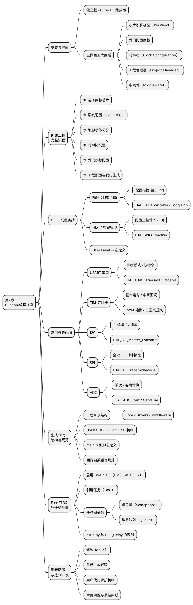

# 第2章 STM32CubeMX 编程指南

## 本章知识导图



---

## 1  CubeMX 简介与安装

### 1.1  工具定位

**STM32CubeMX** 是 ST 官方提供的**图形化初始化代码生成工具**。其核心作用是：

> 用鼠标点选完成芯片所有外设的初始化配置，然后一键生成可直接编译的 C 工程框架，开发者只需在框架中填写业务逻辑。

CubeMX 解决的核心痛点：

| 痛点 | 传统手写方式 | CubeMX 方式 |
| ---- | ------------ | ----------- |
| 时钟树配置 | 手动计算 PLL，易出错 | 填目标频率，自动计算 |
| 引脚复用冲突 | 翻数据手册逐一核查 | 图形界面实时检测并高亮冲突 |
| 外设初始化代码 | 手写数十行结构体赋值 | 图形配置后全部自动生成 |
| FreeRTOS 移植 | 手动复制源码、修改配置 | 勾选即可，自动配置调度器 |

### 1.2  安装方式

CubeMX 提供两种使用方式，功能完全相同：

```text
  方式一：STM32CubeIDE（推荐）
  ┌──────────────────────────────────┐
  │         STM32CubeIDE             │
  │  ┌────────────┐  ┌─────────────┐ │
  │  │  CubeMX    │  │  编译器      │ │
  │  │  （内置）   │  │  调试器      │ │
  │  └────────────┘  └─────────────┘ │
  │  一个软件包含全部开发功能           │
  └──────────────────────────────────┘
  下载：https://www.st.com/stm32cubeide

  方式二：STM32CubeMX 独立版
  ┌──────────────────┐      ┌────────────┐
  │   CubeMX 独立版  │ 生成  │  Keil MDK  │
  │  （仅图形配置）   ├─────► │  或其他IDE │
  └──────────────────┘      └────────────┘
  下载：https://www.st.com/stm32cubemx
```

> **本课程推荐使用 STM32CubeIDE**，因为它将 CubeMX 配置、代码编辑、编译、烧录、调试集成在同一窗口，无需在多个软件间切换。

### 1.3  主界面布局

STM32CubeMX（或 CubeIDE 的 .ioc 编辑界面）分为五个主要区域：

```text
  ┌─────────────────────────────────────────────────────────────────┐
  │  菜单栏：File / Window / Help                                    │
  ├────────────────────────────┬────────────────────────────────────┤
  │                            │  ② 外设配置面板                     │
  │                            │  ┌──────────────────────────────┐  │
  │   ① 芯片引脚视图            │  │  选中外设后，在此设置参数       │  │
  │      (Pin View)            │  │  例：GPIO mode / Speed        │  │
  │                            │  └──────────────────────────────┘  │
  │  引脚颜色含义：              │                                    │
  │  🟢 绿色 = 已配置            ├────────────────────────────────────┤
  │  🔴 红色 = 冲突              │  ③ 标签页切换                      │
  │  ⬜ 灰色 = 未使用            │  [Pinout & Config] [Clock Config]  │
  │                            │  [Project Manager] [Tools]         │
  ├────────────────────────────┴────────────────────────────────────┤
  │  ④ 时钟树（Clock Configuration 标签页）                          │
  │     HSE ──► PLL ──► SYSCLK ──► AHB / APB1 / APB2              │
  ├─────────────────────────────────────────────────────────────────┤
  │  ⑤ 工程管理器（Project Manager 标签页）                          │
  │     工程名称 / 路径 / IDE选择 / HAL库版本                         │
  └─────────────────────────────────────────────────────────────────┘
```

---

## 2  创建工程的完整流程

以 **Blue Pill（STM32F103C8T6）LED 闪烁** 为例，演示从零创建一个 CubeMX 工程的六个步骤。

### 步骤① 选择目标芯片

打开 STM32CubeIDE → `File → New → STM32 Project` → 在芯片选型界面：

```text
  芯片选型界面操作：

  搜索框输入：STM32F103C8
         ↓
  在结果列表中选择：STM32F103C8Tx
         ↓
  右侧显示芯片信息：
  ┌─────────────────────────────────────┐
  │  Core:      ARM Cortex-M3           │
  │  Freq:      72 MHz                  │
  │  Flash:     64 KB                   │
  │  RAM:       20 KB                   │
  │  Package:   LQFP48                  │
  └─────────────────────────────────────┘
         ↓
  点击 Next → 填写工程名（如 LED_Blink）→ Finish
```

### 步骤② 系统配置（SYS / RCC）

在 `Pinout & Configuration` 标签页左侧的 **System Core** 类别中：

**配置 SYS（调试接口）：**

```text
  SYS → Debug → Serial Wire (SWD)
  （启用 SWD 调试接口，否则无法用 ST-Link 烧录和调试）
```

**配置 RCC（时钟源）：**

```text
  RCC → HSE (High Speed External) → Crystal/Ceramic Resonator
  （启用外部 8MHz 晶振，为后续 PLL 倍频至 72MHz 提供精确时钟源）
```

> 完成后，芯片图上 PC14/PC15（晶振引脚）和 PA13/PA14（SWD 引脚）会自动变为绿色，无需手动分配。

### 步骤③ 引脚功能分配

在芯片引脚图上，**鼠标左键点击 PC13 引脚** → 从弹出菜单中选择 `GPIO_Output`：

```text
  PC13 引脚配置过程：

  点击 PC13 → 选择 GPIO_Output
       ↓
  左侧面板 → GPIO → PC13 出现在列表中
       ↓
  点击 PC13 行 → 配置详情：
  ┌──────────────────────────────────────┐
  │  GPIO output level:  High            │  ← 初始电平高（LED 默认灭）
  │  GPIO mode:          Output Push Pull│  ← 推挽输出
  │  GPIO Pull-up/down:  No pull-up...   │
  │  Maximum output speed: Low           │  ← 低速，驱动 LED 足够
  │  User Label:         LED             │  ← 自定义标签，生成宏定义
  └──────────────────────────────────────┘
```

### 步骤④ 时钟树配置

切换到 **Clock Configuration** 标签页：

```text
  时钟树配置（Blue Pill 72MHz 标准配置）：

  HSE(8MHz) → [PLLXTPRE: /1] → [PLLMUL: ×9] → PLL = 72MHz
                                                     │
                                        [SW: PLL] ───► SYSCLK = 72MHz
                                                     │
                              ┌──────────────────────┤
                              │                      │
                          AHB Presc              APB1 Presc
                             /1                      /2
                          HCLK=72MHz            PCLK1=36MHz
                                                     │
                                              （I2C1/USART2/SPI2）
  操作方法：
  → 在 "HCLK(MHz)" 输入框中直接填入 72，按回车
  → CubeMX 自动完成所有分频/倍频参数的计算与填充
```

### 步骤⑤ 外设参数配置

对于本示例（LED 闪烁），GPIO 已在步骤③配置完毕。若有其他外设（如 USART），在 `Pinout & Configuration` 左侧列表中展开对应类别进行配置（详见第4节）。

### 步骤⑥ 工程设置与代码生成

切换到 **Project Manager** 标签页：

```text
  Project Manager 关键设置：

  ┌─────────────────────────────────────────────────────┐
  │  Project Name:   LED_Blink                          │
  │  Project Location: C:\Users\...\STM32Projects\      │
  │  Toolchain/IDE:  STM32CubeIDE    ← 选择目标 IDE     │
  ├─────────────────────────────────────────────────────┤
  │  Code Generator 标签页（重要设置）：                   │
  │  ☑ Generate peripheral initialization as a pair    │
  │    of '.c/.h' files per peripheral                 │
  │    （每个外设生成独立的 .c/.h，结构更清晰）             │
  │  ☑ Keep User Code when re-generating               │
  │    （重新生成时保留 USER CODE 区块内的代码）            │
  └─────────────────────────────────────────────────────┘
       ↓
  点击右上角 "Generate Code" 按钮
       ↓
  弹出提示 "Open Project?" → 点击 Yes，自动在 CubeIDE 中打开工程
```

---

## 3  生成代码的结构与编写规范

### 3.1  工程目录结构

CubeMX 生成的工程具有固定目录结构：

```text
  LED_Blink/
  ├── Core/
  │   ├── Inc/
  │   │   ├── main.h              ← 引脚宏定义（LED_Pin / LED_GPIO_Port）
  │   │   ├── stm32f1xx_hal_conf.h← HAL 库功能开关配置
  │   │   └── stm32f1xx_it.h      ← 中断服务函数声明
  │   └── Src/
  │       ├── main.c              ← 主程序（用户主要编写此文件）
  │       ├── stm32f1xx_hal_msp.c ← HAL MSP（底层引脚/时钟初始化回调）
  │       ├── stm32f1xx_it.c      ← 中断服务函数（如 SysTick_Handler）
  │       └── system_stm32f1xx.c  ← SystemInit()，通常无需修改
  ├── Drivers/
  │   ├── STM32F1xx_HAL_Driver/   ← HAL 库源码（ST 官方，不要修改）
  │   │   ├── Inc/
  │   │   └── Src/
  │   └── CMSIS/                  ← ARM 内核接口（不要修改）
  ├── LED_Blink.ioc               ← CubeMX 配置文件（双击重新打开配置）
  └── LED_Blink.elf               ← 编译产物（二进制固件）
```

> **规则**：只在 `Core/Src/` 和 `Core/Inc/` 中编写用户代码，`Drivers/` 目录内容不要手动修改。

### 3.2  main.h 中的引脚宏定义

CubeMX 根据 **User Label** 在 `main.h` 中自动生成宏定义：

```c
/* main.h（CubeMX 自动生成，勿手动修改此区域） */
#define LED_Pin          GPIO_PIN_13   /* 来自 User Label: LED */
#define LED_GPIO_Port    GPIOC
```

在 `main.c` 中使用宏定义而非硬编码引脚，好处：

```c
/* 推荐写法（使用宏定义）*/
HAL_GPIO_TogglePin(LED_GPIO_Port, LED_Pin);

/* 不推荐写法（硬编码，电路改动后需逐处修改）*/
HAL_GPIO_TogglePin(GPIOC, GPIO_PIN_13);
```

### 3.3  USER CODE BEGIN / END 编写规范

CubeMX 生成的 `main.c` 中遍布成对的注释标记，**用户代码必须写在标记之间**：

```c
int main(void)
{
    /* USER CODE BEGIN 1 */
    /* 在 HAL_Init 之前的变量声明或早期初始化 */
    uint32_t tick_count = 0;
    /* USER CODE END 1 */

    HAL_Init();
    SystemClock_Config();
    MX_GPIO_Init();

    /* USER CODE BEGIN 2 */
    /* GPIO 初始化完成后，主循环之前的一次性操作 */
    HAL_GPIO_WritePin(LED_GPIO_Port, LED_Pin, GPIO_PIN_SET); /* LED 灭 */
    /* USER CODE END 2 */

    while (1)
    {
        /* USER CODE BEGIN WHILE */
        HAL_GPIO_TogglePin(LED_GPIO_Port, LED_Pin);
        HAL_Delay(500);
        /* USER CODE END WHILE */

        /* USER CODE BEGIN 3 */
        /* USER CODE END 3 */
    }
}
```

常见 USER CODE 区域说明：

| 区域标记 | 位置 | 适合写什么 |
| -------- | ---- | ---------- |
| `USER CODE BEGIN Includes` | 头文件区 | 添加自定义头文件 |
| `USER CODE BEGIN PD` | 宏定义区 | 添加 `#define` 常量 |
| `USER CODE BEGIN PV` | 全局变量区 | 声明全局变量 |
| `USER CODE BEGIN 0` | 函数实现前 | 定义辅助函数 |
| `USER CODE BEGIN 1` | main 开头 | 局部变量声明 |
| `USER CODE BEGIN 2` | 初始化后 | 一次性启动逻辑 |
| `USER CODE BEGIN WHILE` | while(1) 内 | 主循环业务逻辑 |

> ⚠️ **警告**：写在 `USER CODE BEGIN/END` **之外**的代码，在下次执行 "Generate Code" 时会被 CubeMX **覆盖删除**。

### 3.4  中断回调函数的编写规范

HAL 库采用**弱符号回调（weak callback）**机制：HAL 驱动内部定义了 `__weak` 修饰的空回调函数，用户在 `USER CODE BEGIN 0` 区域重写同名函数即可覆盖：

```c
/* 在 main.c 的 USER CODE BEGIN 0 区域重写 */

/* GPIO 外部中断回调（按键按下触发）*/
void HAL_GPIO_EXTI_Callback(uint16_t GPIO_Pin)
{
    if (GPIO_Pin == BTN_Pin)
    {
        HAL_GPIO_TogglePin(LED_GPIO_Port, LED_Pin);
    }
}

/* 定时器溢出回调 */
void HAL_TIM_PeriodElapsedCallback(TIM_HandleTypeDef *htim)
{
    if (htim->Instance == TIM2)
    {
        HAL_GPIO_TogglePin(LED_GPIO_Port, LED_Pin);
    }
}
```

---

## 4  常用外设配置实战

### 4.1  GPIO — 输出与输入

**LED 输出（推挽输出）：**

CubeMX 配置：`PC13 → GPIO_Output`，Mode = `Output Push Pull`，Label = `LED`

```c
/* 主循环中控制 LED */
HAL_GPIO_WritePin(LED_GPIO_Port, LED_Pin, GPIO_PIN_RESET); /* 低电平 → 亮 */
HAL_Delay(500);
HAL_GPIO_WritePin(LED_GPIO_Port, LED_Pin, GPIO_PIN_SET);   /* 高电平 → 灭 */
HAL_Delay(500);

/* 或使用翻转，更简洁 */
HAL_GPIO_TogglePin(LED_GPIO_Port, LED_Pin);
HAL_Delay(500);
```

**按键输入（上拉输入）：**

CubeMX 配置：`PA0 → GPIO_Input`，Pull = `Pull-up`，Label = `BTN`

```c
/* 轮询方式读取按键 */
if (HAL_GPIO_ReadPin(BTN_GPIO_Port, BTN_Pin) == GPIO_PIN_RESET)
{
    /* 按键按下（低电平有效，因为接了上拉） */
    HAL_GPIO_WritePin(LED_GPIO_Port, LED_Pin, GPIO_PIN_RESET);
}
else
{
    HAL_GPIO_WritePin(LED_GPIO_Port, LED_Pin, GPIO_PIN_SET);
}
```

### 4.2  USART — 串口通信

**CubeMX 配置步骤：**

```text
  Connectivity → USART1
  ├── Mode: Asynchronous（异步串口）
  └── Parameter Settings:
      ├── Baud Rate:   115200 Bits/s
      ├── Word Length: 8 Bits
      ├── Parity:      None
      └── Stop Bits:   1
  → 自动分配：PA9 = USART1_TX，PA10 = USART1_RX
```

生成代码中自动出现 `MX_USART1_UART_Init()`，用户调用 HAL API：

```c
/* USER CODE BEGIN Includes */
#include <string.h>  /* for strlen */
/* USER CODE END Includes */

/* USER CODE BEGIN 2 */
char msg[] = "Hello from STM32!\r\n";
HAL_UART_Transmit(&huart1, (uint8_t*)msg, strlen(msg), HAL_MAX_DELAY);
/* USER CODE END 2 */

/* 接收单字节（阻塞模式）*/
uint8_t rx_byte;
HAL_UART_Receive(&huart1, &rx_byte, 1, HAL_MAX_DELAY);

/* 接收完成后用中断回调（非阻塞，推荐）*/
HAL_UART_Receive_IT(&huart1, &rx_byte, 1); /* 启动中断接收 */

void HAL_UART_RxCpltCallback(UART_HandleTypeDef *huart) /* 接收完成回调 */
{
    if (huart->Instance == USART1)
    {
        /* 处理 rx_byte，然后重新启动接收 */
        HAL_UART_Receive_IT(&huart1, &rx_byte, 1);
    }
}
```

### 4.3  TIM — 定时器与 PWM

**基本定时（产生周期性中断）：**

```text
  Timers → TIM2
  ├── Clock Source: Internal Clock
  ├── Prescaler (PSC):    7199    → 72MHz ÷ (7199+1) = 10 kHz
  └── Counter Period (ARR): 9999  → 10kHz ÷ (9999+1) = 1 Hz（每秒溢出一次）
  → NVIC Settings: TIM2 global interrupt ☑ Enable
```

```c
/* USER CODE BEGIN 2 */
HAL_TIM_Base_Start_IT(&htim2);  /* 启动定时器中断 */
/* USER CODE END 2 */

/* 定时器溢出回调（每 1 秒触发一次）*/
void HAL_TIM_PeriodElapsedCallback(TIM_HandleTypeDef *htim)
{
    if (htim->Instance == TIM2)
    {
        HAL_GPIO_TogglePin(LED_GPIO_Port, LED_Pin);
    }
}
```

**PWM 输出（控制舵机 / LED 亮度）：**

```text
  Timers → TIM3 → Channel1: PWM Generation CH1
  ├── Prescaler:  71    → 72MHz ÷ 72 = 1 MHz
  └── Counter Period: 19999  → 周期 = 20ms（50Hz，标准舵机信号）
  → PA6 自动分配为 TIM3_CH1
```

```c
/* USER CODE BEGIN 2 */
HAL_TIM_PWM_Start(&htim3, TIM_CHANNEL_1); /* 启动 PWM 输出 */
/* USER CODE END 2 */

/* 修改占空比（舵机位置控制）*/
/* 脉宽 1ms(0°) ~ 2ms(180°)，对应 ARR=19999 时，CCR = 1000 ~ 2000 */
__HAL_TIM_SET_COMPARE(&htim3, TIM_CHANNEL_1, 1500); /* 中间位置 90° */
```

### 4.4  I2C — 总线通信

```text
  Connectivity → I2C1
  ├── Mode: I2C
  └── Speed Mode: Standard Mode（100 kHz）
  → PB6 = I2C1_SCL，PB7 = I2C1_SDA（自动分配，需外接 4.7kΩ 上拉）
```

```c
/* 向从设备地址 0x68（如 MPU6050）发送数据 */
uint8_t data[2] = {0x6B, 0x00};   /* 寄存器地址，数据 */
HAL_I2C_Master_Transmit(&hi2c1, 0x68 << 1, data, 2, HAL_MAX_DELAY);

/* 从从设备读取 6 字节 */
uint8_t buf[6];
HAL_I2C_Master_Receive(&hi2c1, 0x68 << 1, buf, 6, HAL_MAX_DELAY);

/* 读写指定寄存器（Mem 方式，更常用）*/
HAL_I2C_Mem_Read(&hi2c1, 0x68 << 1,   /* 设备地址 */
                  0x3B,                 /* 寄存器地址（加速度 X 高字节）*/
                  I2C_MEMADD_SIZE_8BIT,
                  buf, 6, HAL_MAX_DELAY);
```

### 4.5  ADC — 模拟信号采集

```text
  Analog → ADC1
  ├── IN0: 勾选（使能通道 0 → PA0 引脚）
  └── Parameter Settings:
      ├── Continuous Conversion Mode: Enabled
      └── Scan Conversion Mode:       Disabled（单通道）
```

```c
/* USER CODE BEGIN 2 */
HAL_ADC_Start(&hadc1);                /* 启动 ADC 转换 */
/* USER CODE END 2 */

/* 读取 ADC 值（阻塞轮询）*/
HAL_ADC_PollForConversion(&hadc1, HAL_MAX_DELAY);
uint32_t adc_val = HAL_ADC_GetValue(&hadc1);   /* 12位，0 ~ 4095 */

/* 换算为电压（参考电压 3.3V）*/
float voltage = adc_val * 3.3f / 4095.0f;
```

---

## 5  FreeRTOS 多任务配置

### 5.1  启用 FreeRTOS

在 CubeMX 中：`Middleware and Software Packs → FreeRTOS → CMSIS_V2`

```text
  FreeRTOS 配置界面：
  ├── Config Parameters（内核参数）
  │    ├── configTICK_RATE_HZ:    1000   （系统节拍 1ms）
  │    └── configTOTAL_HEAP_SIZE: 3072   （总堆大小，按需调整）
  └── Tasks and Queues（任务管理）
       ├── 默认任务 defaultTask 已自动创建
       └── 点击 Add 可添加更多任务
```

> ⚠️ 启用 FreeRTOS 后，CubeMX 会自动将 HAL 时基从 **SysTick** 改为 **TIM（如 TIM1）**，因为 FreeRTOS 自身需要独占 SysTick。

### 5.2  创建任务

在 CubeMX 的 FreeRTOS 配置页 → `Tasks and Queues` → `Add Task`：

```text
  任务配置参数：
  ┌─────────────────────────────────────────┐
  │  Task Name:    ledTask                  │
  │  Priority:     osPriorityNormal         │
  │  Stack Size:   128  (words = 512 bytes) │
  │  Entry Function: StartLedTask           │
  │  Code Generation Option: As weak       │
  └─────────────────────────────────────────┘
```

生成代码后，在 `freertos.c` 的 `USER CODE BEGIN` 区填写任务逻辑：

```c
/* freertos.c - USER CODE BEGIN Header_StartLedTask */
void StartLedTask(void *argument)
{
    /* USER CODE BEGIN StartLedTask */
    for (;;)
    {
        HAL_GPIO_TogglePin(LED_GPIO_Port, LED_Pin);
        osDelay(500);   /* FreeRTOS 延时：让出 CPU，其他任务可以运行 */
    }
    /* USER CODE END StartLedTask */
}
```

### 5.3  任务间通信

**信号量（二值信号量，用于任务同步）：**

在 CubeMX → FreeRTOS → `Timers & Semaphores` → `Add Binary Semaphore`，命名为 `btnSemaphore`。

```c
/* 中断回调中释放信号量（通知任务有按键事件）*/
void HAL_GPIO_EXTI_Callback(uint16_t GPIO_Pin)
{
    if (GPIO_Pin == BTN_Pin)
    {
        osSemaphoreRelease(btnSemaphoreHandle);
    }
}

/* 按键处理任务：等待信号量 */
void StartBtnTask(void *argument)
{
    for (;;)
    {
        osSemaphoreAcquire(btnSemaphoreHandle, osWaitForever); /* 阻塞等待 */
        HAL_GPIO_TogglePin(LED_GPIO_Port, LED_Pin);
    }
}
```

**消息队列（用于传递数据）：**

在 CubeMX → FreeRTOS → `Timers & Semaphores` → `Add Queue`，命名 `adcQueue`，长度 4，Item Size `uint32_t`。

```c
/* ADC 采集任务：发送数据到队列 */
void StartAdcTask(void *argument)
{
    for (;;)
    {
        HAL_ADC_Start(&hadc1);
        HAL_ADC_PollForConversion(&hadc1, HAL_MAX_DELAY);
        uint32_t val = HAL_ADC_GetValue(&hadc1);
        osMessageQueuePut(adcQueueHandle, &val, 0, 0);
        osDelay(10);
    }
}

/* 数据处理任务：从队列接收数据 */
void StartProcessTask(void *argument)
{
    uint32_t val;
    for (;;)
    {
        osMessageQueueGet(adcQueueHandle, &val, NULL, osWaitForever);
        /* 处理 val ... */
    }
}
```

### 5.4  osDelay 与 HAL_Delay 的区别

| 函数 | 底层实现 | 使用场景 |
| ---- | -------- | -------- |
| `HAL_Delay(ms)` | SysTick 忙等待（或 TIM 基准轮询）| **不可在 FreeRTOS 任务中使用**，会阻塞整个调度器 |
| `osDelay(ms)` | FreeRTOS `vTaskDelay()`，任务挂起 | **FreeRTOS 任务中必须使用此函数**，让出 CPU |

---

## 6  重新配置工程

### 6.1  修改配置的工作流

当硬件设计发生变化（如增加传感器、修改引脚）或需要启用新外设时：

```text
  迭代开发流程：

  双击 .ioc 文件重新打开 CubeMX
           ↓
  修改引脚 / 外设 / 时钟配置
           ↓
  点击 "Generate Code"
           ↓
  CubeMX 重新生成初始化代码
  （USER CODE BEGIN/END 内的用户代码自动保留）
           ↓
  在新生成的框架中继续编写业务逻辑
```

### 6.2  用户代码保护机制验证

以下场景演示 USER CODE 保护是否生效：

```text
  场景：在 main.c 的 while(1) 中写了业务代码，
        随后在 CubeMX 中新增了 USART1 外设，重新生成代码。

  重新生成后的 main.c：
  ┌────────────────────────────────────────────────────┐
  │  MX_GPIO_Init();                                   │
  │  MX_USART1_UART_Init();   ← CubeMX 自动添加        │
  │                                                    │
  │  /* USER CODE BEGIN 2 */                           │
  │  // 你之前写的启动代码    ← ✅ 保留                  │
  │  /* USER CODE END 2 */                             │
  │                                                    │
  │  while (1) {                                       │
  │      /* USER CODE BEGIN WHILE */                   │
  │      HAL_GPIO_TogglePin(...);  ← ✅ 保留            │
  │      HAL_Delay(500);           ← ✅ 保留            │
  │      /* USER CODE END WHILE */                     │
  │  }                                                 │
  └────────────────────────────────────────────────────┘
```

### 6.3  常见问题与最佳实践

| 问题 | 原因 | 解决方法 |
| ---- | ---- | -------- |
| 代码被覆盖 | 用户代码写在 USER CODE 标记之外 | 严格遵守 BEGIN/END 规范 |
| 引脚冲突（红色高亮）| 两个外设分配了同一引脚 | 在 CubeMX 中重新分配其中一个引脚 |
| 烧录后程序不运行 | SYS 未配置 SWD，或 BOOT0 未正确设置 | 确认 SYS→Debug→Serial Wire 已启用 |
| FreeRTOS 任务卡死 | 在任务中使用了 `HAL_Delay` | 全部替换为 `osDelay` |
| 堆栈溢出崩溃 | 任务栈空间不足 | 增大 Stack Size，或使用 `uxTaskGetStackHighWaterMark` 监控 |
| HAL_Delay 不准 | FreeRTOS 占用了 SysTick | CubeMX 已自动切换时基到 TIM，无需手动处理 |

---

### 6.4 使用 Coolify 配置容器运行 PicSimLab 仿真

PicSimLab 是一种用于嵌入式/传感器仿真的轻量化仿真环境。可通过 Coolify 将 PicSimLab 以容器形式部署，便于在云或本地服务器上提供仿真服务给学生和实验环境。

示例 docker-compose.yml（作为 Coolify 的仓库部署或本地测试）：

```yaml
version: "3.8"
services:
  picsimlab:
    image: picsimlab/picsimlab:latest    # 若无官方镜像，改为自己构建的镜像名
    restart: unless-stopped
    ports:
      - "8080:8080"                     # Web UI 或 API 端口
    volumes:
      - ./picsimlab-work:/home/picsimlab/work  # 持久化仿真工程与数据
    environment:
      - TZ=Asia/Shanghai
```

在 Coolify 中部署步骤（简要）：

1. 打开 Coolify 控制台，点击 Create → Application。
2. 选择 "Container"（容器）或使用 "Repository" 并指向包含 docker-compose.yml 的仓库（推荐）。
3. 如果选 Container：填写 Image（例如 picsimlab/picsimlab:latest），设置端口映射 8080，配置环境变量与卷挂载（将宿主路径映射到容器的 /home/picsimlab/work）。
4. 如果选 Repository：指定分支与 Docker Compose 文件路径，Coolify 会根据 docker-compose.yml 构建并部署服务。
5. 部署完成后，通过 Coolify 提供的域名或映射端口访问 PicSimLab Web 界面（例如 http://<coolify-host>:8080 或应用子域）。

注意：
- 若没有官方镜像，请在仓库中包含 Dockerfile 或 docker-compose.yml，由 Coolify 从源码构建镜像。
- 保证宿主机有必要的端口、磁盘和 CPU 权限来运行仿真。

---

## 7  本章在线测试（10 题）

<div id="exam-meta" data-exam-id="chapter2" data-exam-title="第二章 CubeMX编程测验" style="display:none"></div>

<!-- mkdocs-quiz intro -->

<quiz>
1) 在 CubeMX 中，若要使用 ST-Link 下载与调试，`SYS -> Debug` 应设置为哪一项？
- [x] Serial Wire (SWD)
- [ ] Disabled
- [ ] JTAG only

正确。课程中强调必须启用 SWD，否则会影响下载和调试。
</quiz>

<quiz>
2) Blue Pill 标准 72MHz 配置中，外部晶振通常设置为：
- [x] HSE = Crystal/Ceramic Resonator（8MHz）
- [ ] HSI = 72MHz
- [ ] LSE = 32MHz

正确。常见做法是 8MHz HSE 经过 PLL 倍频得到 72MHz。
</quiz>

<quiz>
3) 在引脚视图中，红色高亮通常表示：
- [ ] 引脚已成功配置
- [x] 引脚功能冲突
- [ ] 引脚未使用

正确。红色通常意味着两个外设占用了同一引脚。
</quiz>

<quiz>
4) 下列哪个步骤用于让 CubeMX 自动计算主频相关参数？
- [x] 在 Clock Configuration 中直接输入 HCLK=72 并回车
- [ ] 手工修改每个寄存器位
- [ ] 删除 .ioc 重新创建工程

正确。直接输入目标频率后，CubeMX 会自动联动计算。
</quiz>

<quiz>
5) 关于 `User Label`（例如给 PC13 标记为 LED），正确的是：
- [x] 会在 `main.h` 生成对应宏，便于代码维护
- [ ] 只影响 UI 显示，不会影响代码
- [ ] 会自动生成 FreeRTOS 任务

正确。`User Label` 会反映到宏定义中，减少硬编码。
</quiz>

<quiz>
6) 在 FreeRTOS 任务函数中应优先使用哪个延时函数？
- [ ] HAL_Delay(ms)
- [x] osDelay(ms)
- [ ] delay_us(ms)

正确。`osDelay()` 会让出 CPU，不会阻塞整个调度器。
</quiz>

<quiz>
7) 重新生成代码时，哪类代码最容易被覆盖？
- [x] 写在 `USER CODE BEGIN/END` 标记之外的手写代码
- [ ] 写在 `USER CODE BEGIN/END` 内的代码
- [ ] `main.h` 的自动生成宏定义

正确。用户逻辑必须放在 USER CODE 区域内。
</quiz>

<quiz>
8) 下列关于工程目录的说法哪些正确？
- [x] `Core/Src` 是主要用户代码编写位置
- [x] `Drivers/` 中 HAL 源码通常不建议手工改动
- [ ] `.ioc` 文件只是日志文件，可删除

正确。`.ioc` 是配置源文件，后续迭代离不开它。
</quiz>

<quiz>
9) 若新增 USART1 后重新 Generate Code，最合理的预期是：
- [x] CubeMX 自动补充 `MX_USART1_UART_Init()`，并尽量保留 USER CODE 区域内容
- [ ] 所有用户代码都会被清空
- [ ] 需要手动重装 HAL 库

正确。自动补充初始化并保留 USER CODE 是 CubeMX 的关键优势。
</quiz>

<quiz>
10) 当 CubeMX 中出现引脚冲突时，优先处理方式是：
- [ ] 直接修改 Drivers 下 HAL 源码
- [x] 在 CubeMX 中重新分配冲突引脚或调整外设映射
- [ ] 删除冲突外设对应中断向量

正确。引脚冲突应在图形配置层解决，而不是硬改底层库。
</quiz>

<!-- mkdocs-quiz results -->
