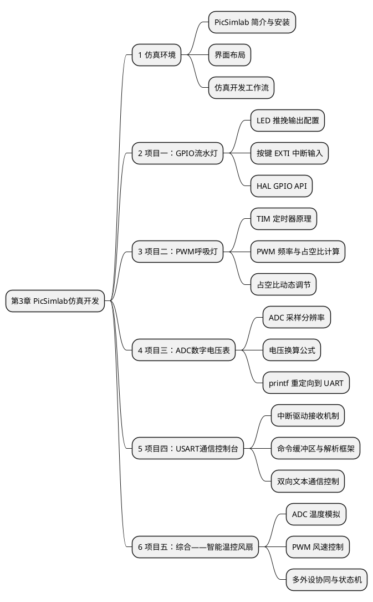
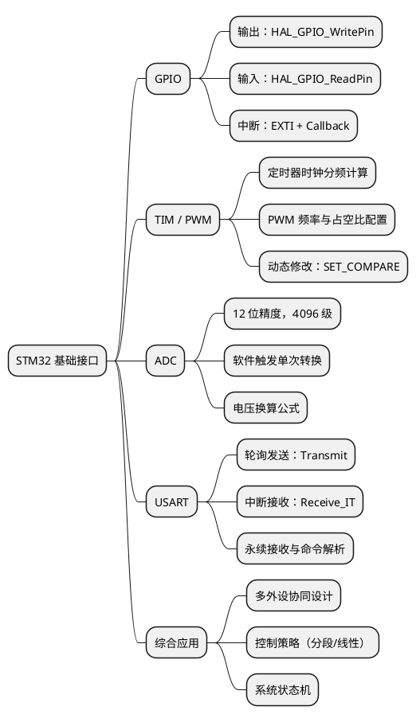

# 第3章 基于PicSimlab仿真器与CubeMX的典型软件开发

> 工欲善其事，必先利其器。在没有实物硬件的情况下，仿真器是学习嵌入式开发最高效的工具。本章将以 **PicSimlab** 仿真环境为舞台，结合 STM32CubeMX 与 STM32CubeIDE，通过五个典型项目，系统覆盖 STM32 最常用的基础接口编程——GPIO、定时器/PWM、ADC、USART 与多外设综合应用。

## 本章知识导图



---

## 1  PicSimlab 仿真器简介

### 1.1  为什么选择仿真器

嵌入式开发的学习门槛在于：**代码不能在普通计算机上直接运行**，必须依赖真实的硬件开发板。然而，硬件存在以下限制：

| 问题 | 说明 |
|------|------|
| 成本问题 | 开发板、传感器、杜邦线等器件需要一定费用 |
| 调试困难 | 硬件故障与代码 bug 难以区分，排查耗时 |
| 携带不便 | 外出或宿舍学习时不方便搭建硬件环境 |
| 烧录风险 | 操作不当可能损坏芯片或外设 |

**仿真器**（Simulator）能够在软件层面模拟真实硬件的行为，允许开发者在没有实物硬件的条件下：

- ✅ 编写并运行嵌入式程序
- ✅ 观察 GPIO 电平、PWM 波形、ADC 采样值
- ✅ 调试串口通信
- ✅ 验证控制逻辑的正确性

> 💡 仿真器不能完全替代真实硬件，但在**学习阶段**和**初期验证阶段**，仿真器是效率最高的工具。

### 1.2  PicSimlab 概述

**PicSimlab**（PIC Simulator Lab）是一款开源、跨平台的微控制器仿真软件，由巴西开发者 lcgamboa 主导开发。尽管名称中包含"PIC"，但它同样支持 **STM32 系列微控制器**的仿真，这正是本章使用它的原因。

**PicSimlab 的核心特性：**

| 特性 | 说明 |
|------|------|
| 开源免费 | GitHub 开源，完全免费使用 |
| 跨平台 | 支持 Windows、Linux、macOS |
| 支持 STM32 | 通过 QEMU 后端仿真 STM32F103C8T6（Blue Pill） |
| 可视化外设 | 提供 LED、按键、电位器、LCD、示波器等虚拟外设 |
| 直接加载固件 | 无需修改代码，直接加载 CubeIDE 编译产物 `.bin` |
| 串口终端 | 内置虚拟串口，可与 USART 实时交互 |
| 示波器 | 可观察 GPIO 电平变化和 PWM 波形 |

**官方资源：**

```
GitHub:  https://github.com/lcgamboa/picsimlab
文档:    https://lcgamboa.github.io/picsimlab_docs/
```

### 1.3  安装与界面

**下载安装（以 Windows 为例）：**

① 访问 GitHub Releases 页面，下载最新版 `picsimlab_win_XX.zip`  
② 解压后双击 `picsimlab.exe` 即可运行（无需安装）  
③ 首次运行会在 `%USERPROFILE%/.picsimlab/` 创建配置目录

**主界面布局：**

```
┌─────────────────────────────────────────────────────────────────┐
│  File  Edit  Board  View  Tools  About              [菜单栏]    │
├──────────────────┬──────────────────────────────────────────────┤
│                  │                                              │
│   [板卡视图]     │           [外设区域 / Parts]                 │
│                  │                                              │
│  ┌────────────┐  │   ┌──────┐  ┌──────┐  ┌──────────┐         │
│  │  STM32     │  │   │ LED  │  │ BTN  │  │   POT    │         │
│  │  Blue Pill │  │   │      │  │      │  │          │         │
│  │  (QEMU)    │  │   └──────┘  └──────┘  └──────────┘         │
│  └────────────┘  │                                              │
│                  │   ┌────────────────────────────────────┐     │
│  [运行/暂停/重置] │   │  虚拟示波器 / UART 终端              │     │
│                  │   └────────────────────────────────────┘     │
└──────────────────┴──────────────────────────────────────────────┘
```

**界面区域说明：**

| 区域 | 功能 |
|------|------|
| 板卡视图 | 显示仿真的微控制器芯片，可查看引脚状态 |
| 外设区域 | 拖入 LED、按键、电位器等虚拟组件并连接到引脚 |
| 示波器 | 实时显示选定引脚的电压波形 |
| UART 终端 | 与 MCU 的 USART 进行文本通信 |
| 控制栏 | 运行（▶）、暂停（⏸）、重置（⟳）仿真 |

### 1.4  选择 STM32 仿真板卡

启动 PicSimlab 后，需要先选择仿真目标板卡：

① 点击菜单 **Board → Change Board**  
② 在列表中找到并选择 **`stm32_blue_pill`**（基于 STM32F103C8T6）  
③ 确认后界面切换至 STM32 Blue Pill 仿真界面

> ⚠️ **注意：** PicSimlab 对 STM32 的仿真基于 QEMU，需要确保系统已安装 QEMU ARM 组件。在 Windows 下，PicSimlab 安装包通常已内置 QEMU，无需单独安装。

---

## 2  仿真开发工作流

### 2.1  完整开发流程

PicSimlab 与 CubeMX / CubeIDE 的联合开发工作流分为三个阶段：

```
  ┌──────────────┐     ┌──────────────────┐     ┌────────────────┐
  │   CubeMX     │────▶│    CubeIDE       │────▶│   PicSimlab    │
  │              │     │                  │     │                │
  │ · 芯片选型   │     │ · 编写业务逻辑   │     │ · 加载 .bin    │
  │ · 引脚配置   │     │ · 编译工程       │     │ · 连接虚拟外设 │
  │ · 外设初始化 │     │ · 生成 .bin      │     │ · 运行仿真     │
  │ · 生成代码   │     │                  │     │ · 观察结果     │
  └──────────────┘     └──────────────────┘     └────────────────┘
        ①                      ②                        ③
    配置与生成               编码与编译                仿真验证
```

**步骤 ① — CubeMX 配置**

1. 选择芯片 `STM32F103C8Tx`
2. 配置 RCC：HSE → Crystal/Ceramic Resonator
3. 配置 SYS：Debug → Serial Wire
4. 按项目需求配置外设（GPIO / TIM / ADC / USART）
5. 时钟树设置 HCLK = 72 MHz
6. 生成代码（Toolchain: STM32CubeIDE）

**步骤 ② — CubeIDE 编译**

1. 打开生成的工程
2. 在 `USER CODE BEGIN` 区域编写应用代码
3. 选择 **Debug** 或 **Release** 配置
4. 点击 **Build Project**（Ctrl+B）
5. 编译产物位于 `Debug/` 目录下，找到 `.bin` 文件

**步骤 ③ — PicSimlab 仿真**

1. 选择对应板卡（stm32_blue_pill）
2. 点击 **File → Load Hex/Bin**，选择编译出的 `.bin` 文件
3. 在外设区域添加所需虚拟组件（LED / 按键 / 电位器等）
4. 右键组件 → **Properties**，将组件引脚映射到 MCU 对应引脚
5. 点击 ▶ 运行仿真

### 2.2  常用虚拟外设对照表

| 组件名称 | 类型 | 典型用途 | 连接方式 |
|---------|------|---------|---------|
| LED | 输出显示 | 指示灯、流水灯 | 阳极接 GPIO，阴极接 GND |
| Push Button | 数字输入 | 按键触发 | 一端接 GPIO，一端接 GND（配合上拉） |
| Potentiometer | 模拟输入 | 模拟电压（ADC 测试）| 中间抽头接 ADC 引脚，两端接 VCC/GND |
| LCD 16×2 | 输出显示 | 文字信息显示 | 并口或 I2C 连接 |
| Buzzer | 输出 | 蜂鸣器（PWM 驱动）| 正极接 PWM 引脚，负极接 GND |
| Servo Motor | 输出 | 舵机角度控制 | 信号线接 PWM 引脚 |
| UART Terminal | 串口终端 | 串口收发调试 | TX/RX 连接 USART 引脚 |
| Oscilloscope | 观测工具 | 电平与波形观察 | 探针连接目标引脚 |

### 2.3  常见问题与调试技巧

| 问题 | 原因 | 解决方法 |
|------|------|---------|
| 程序不运行 | .bin 文件路径错误或格式不对 | 确认选择的是 Debug/.bin 文件 |
| LED 不亮 | 引脚映射错误 | 检查组件属性中的引脚编号是否与代码一致 |
| 串口无输出 | 波特率不匹配 | PicSimlab UART 终端波特率需与代码一致 |
| 仿真速度慢 | QEMU 仿真开销 | 调低系统时钟或关闭不必要的示波器通道 |
| ADC 值始终为 0 | 电位器未正确连接 | 检查 ADC 输入引脚编号，确认电位器两端有电源 |

---

## 3  项目一：GPIO 控制——八路流水灯与按键加速

### 3.1  项目目标

| 要素 | 内容 |
|------|------|
| **功能描述** | 8 个 LED 依次点亮形成流水灯效果；按下按键后在快速/慢速之间切换 |
| **涉及接口** | GPIO 输出（推挽）、GPIO 输入（上拉）、外部中断（EXTI） |
| **核心 API** | `HAL_GPIO_WritePin`、`HAL_GPIO_EXTI_Callback` |
| **学习重点** | 多引脚 GPIO 配置、EXTI 中断服务机制、软件消抖 |

### 3.2  硬件连接

**PicSimlab 中的连接方式（逻辑示意）：**

```
  STM32 引脚           虚拟组件
  ──────────           ──────────
  PA0  ─────────────── LED_0（红）
  PA1  ─────────────── LED_1（红）
  PA2  ─────────────── LED_2（红）
  PA3  ─────────────── LED_3（黄）
  PA4  ─────────────── LED_4（黄）
  PA5  ─────────────── LED_5（黄）
  PA6  ─────────────── LED_6（绿）
  PA7  ─────────────── LED_7（绿）
  PB0  ─────────────── Push Button（按键，另一端接 GND）
  GND  ─────────────── 所有 LED 阴极（公共地）
```

> 💡 PicSimlab 中 LED 高电平（3.3V）亮起，对应 `HAL_GPIO_WritePin(..., GPIO_PIN_SET)`。

### 3.3  CubeMX 配置

**① 引脚配置**

在 CubeMX 引脚视图中：

- `PA0` ~ `PA7`：设置为 `GPIO_Output`
  - 模式：Output Push Pull
  - 初始电平：Low
  - 用户标签：`LED_0` ~ `LED_7`
- `PB0`：设置为 `GPIO_EXTI0`（外部中断，下降沿触发）
  - Pull-up/Pull-down：Pull-up
  - 用户标签：`KEY_0`

**② NVIC 中断使能**

在 `System Core → NVIC` 中：

- 使能 `EXTI line0 interrupt`
- Preemption Priority = 0，Sub Priority = 0

**配置摘要：**

```
PA0 ~ PA7  →  GPIO_Output  (LED_0~7，推挽输出，初始低电平)
PB0        →  GPIO_EXTI0   (KEY_0，上拉输入，下降沿触发)
```

### 3.4  代码实现

```c
/* USER CODE BEGIN Includes */
#include <stdint.h>
/* USER CODE END Includes */

/* USER CODE BEGIN PV */
// 流水灯速度控制变量（单位：ms），volatile 保证中断与主循环间的可见性
volatile uint32_t g_speed = 200;
/* USER CODE END PV */

/* USER CODE BEGIN 0 */
/**
 * @brief 输出一个字节图案到 PA0~PA7，控制 8 路 LED
 * @param pattern  bit0 对应 PA0，bit7 对应 PA7
 */
void LED_Write(uint8_t pattern)
{
    // 直接操作寄存器：比循环调用 8 次 HAL_GPIO_WritePin 效率更高
    uint32_t odr = GPIOA->ODR;
    odr &= 0xFFFFFF00U;           // 清除低 8 位
    odr |= (uint32_t)pattern;     // 写入新图案
    GPIOA->ODR = odr;
}
/* USER CODE END 0 */

int main(void)
{
    /* HAL 初始化、时钟及外设初始化（CubeMX 自动生成，勿修改）*/

    /* USER CODE BEGIN WHILE */
    // 流水灯图案：依次点亮每个 LED
    const uint8_t patterns[] = {
        0x01, 0x02, 0x04, 0x08,
        0x10, 0x20, 0x40, 0x80
    };
    const uint8_t PATTERN_COUNT = sizeof(patterns);
    uint8_t idx = 0;

    while (1)
    {
        LED_Write(patterns[idx]);
        idx = (idx + 1) % PATTERN_COUNT;  // 循环步进
        HAL_Delay(g_speed);                // 延时由按键动态调节
    }
    /* USER CODE END WHILE */
}

/* USER CODE BEGIN 4 */
/**
 * @brief EXTI 中断回调函数（按键按下时触发）
 * @note  HAL 库中为弱定义（__weak），在此覆盖实现
 */
void HAL_GPIO_EXTI_Callback(uint16_t GPIO_Pin)
{
    if (GPIO_Pin == GPIO_PIN_0)   // PB0 → EXTI Line 0
    {
        HAL_Delay(20);  // 软件消抖：等待机械弹跳结束（约 10~20 ms）
        if (HAL_GPIO_ReadPin(GPIOB, GPIO_PIN_0) == GPIO_PIN_RESET)
        {
            // 低电平确认有效按键，切换速度
            g_speed = (g_speed == 200U) ? 50U : 200U;
        }
    }
}
/* USER CODE END 4 */
```

**代码关键点解析：**

| 代码片段 | 说明 |
|---------|------|
| `volatile uint32_t g_speed` | `volatile` 防止编译器将变量优化到寄存器，保证中断修改主循环可见 |
| `GPIOA->ODR` 直接操作 | 一次写操作同时更新 8 个引脚，比循环调用 HAL 函数效率高约 8 倍 |
| `(idx + 1) % PATTERN_COUNT` | 取模实现循环计数，无需 if 判断边界 |
| 软件消抖 20ms | 按键机械弹跳约 5~20ms，延迟后二次确认避免误触发 |

### 3.5  仿真验证步骤

1. 在 CubeIDE 中编译工程，获得 `Debug/project.bin`
2. 打开 PicSimlab，选择 `stm32_blue_pill` 板卡，加载 `.bin`
3. 添加 8 个 LED 组件，依次连接至 PA0~PA7
4. 添加 1 个 Push Button 组件，连接至 PB0（另一端接 GND）
5. 点击 ▶ 运行
6. **预期现象：** LED 以 200ms 间隔流水点亮；按键后切换至 50ms 高速流水

---

## 4  项目二：定时器与 PWM——呼吸灯效果

### 4.1  项目目标

| 要素 | 内容 |
|------|------|
| **功能描述** | 一个 LED 的亮度在 0%～100% 之间平滑渐变，形成"呼吸"效果 |
| **涉及接口** | TIM2 定时器、PWM 输出模式 |
| **核心 API** | `HAL_TIM_PWM_Start`、`__HAL_TIM_SET_COMPARE` |
| **学习重点** | PWM 频率与占空比的计算方法、定时器预分频参数的含义 |

### 4.2  PWM 原理简述

**PWM（Pulse Width Modulation，脉宽调制）** 通过改变方波的高电平持续时间（占空比）来等效改变平均电压，从而控制 LED 亮度：

```
占空比 = 高电平时间 / 周期时间 × 100%

100% 占空比：  ┌──────────────┐            （最亮）
              │              │
           ───┘              └───────────

 50% 占空比：  ┌──────┐        ┌──────
              │      │        │
           ───┘      └────────┘

  0% 占空比：  ────────────────────────    （熄灭）
```

**PWM 频率计算公式：**

```
PWM 频率 = 定时器时钟 / (Prescaler + 1) / (Period + 1)

以 72MHz 时钟、目标 1kHz PWM 为例：
  Prescaler = 71   →  分频后计数时钟 = 72MHz / 72 = 1MHz
  Period    = 999  →  PWM 频率 = 1MHz / 1000 = 1kHz
  占空比精度 = 1/1000 = 0.1%（共 1000 级）
```

### 4.3  CubeMX 配置

**TIM2 配置：**

① 在 **Timers → TIM2** 中：
- Clock Source：Internal Clock
- Channel 1：PWM Generation CH1

② **Parameter Settings：**

| 参数 | 值 | 说明 |
|------|-----|------|
| Prescaler | 71 | 预分频，使计数时钟 = 1MHz |
| Counter Period | 999 | 自动重载值，决定 PWM 频率 = 1kHz |
| Pulse（初始占空比）| 0 | 初始占空比 0%（LED 熄灭）|
| PWM Mode | PWM mode 1 | 标准 PWM 模式 1 |

③ TIM2_CH1 默认映射到引脚 **PA0**

**引脚配置摘要：**

```
PA0  →  TIM2_CH1  (PWM 输出，AF 推挽模式)
         连接 → LED（阳极接 PA0，阴极接 GND）
```

### 4.4  代码实现

```c
/* USER CODE BEGIN 2 */
// 启动 TIM2 通道 1 的 PWM 输出（调用后定时器持续运行）
HAL_TIM_PWM_Start(&htim2, TIM_CHANNEL_1);
/* USER CODE END 2 */

/* USER CODE BEGIN WHILE */
uint16_t duty = 0;    // 当前占空比（0 ~ 999，对应 0% ~ 99.9%）
int16_t  step = 5;    // 每步变化量（正向增大，负向减小）

while (1)
{
    // 实时修改比较寄存器（CCR）即可改变占空比，无需重启定时器
    __HAL_TIM_SET_COMPARE(&htim2, TIM_CHANNEL_1, duty);

    // 三角波反弹逻辑：到达边界时反转方向
    duty += step;
    if (duty >= 1000) { duty = 999; step = -5; }
    if (duty <= 0)    { duty = 0;   step =  5; }

    HAL_Delay(10);  // 10ms 刷新间隔，完整一次呼吸约 4 秒
}
/* USER CODE END WHILE */
```

**代码关键点解析：**

| 代码片段 | 说明 |
|---------|------|
| `HAL_TIM_PWM_Start` | 启动定时器 PWM 通道，之后硬件自动输出波形，CPU 无需干预 |
| `__HAL_TIM_SET_COMPARE` | 修改比较寄存器（CCR）的值即可实时改变占空比 |
| `duty += step` 反弹逻辑 | 简洁实现三角波式渐变，step 的正负决定渐亮或渐灭方向 |
| `HAL_Delay(10)` | 每 10ms 步进一次，1000/5×10ms = 2s 完成单程（亮→暗或暗→亮） |

**呼吸效果时序：**

```
亮度(%)
 100 |       ▲       ▲       ▲
     |      / \     / \     / \
  50 |     /   \   /   \   /   \
     |    /     \ /     \ /     \
   0 |───/       V       V       V───▶ 时间
     |<── 约4s ──>
```

### 4.5  仿真验证步骤

1. 编译工程，加载 `.bin` 到 PicSimlab
2. 添加 1 个 LED 组件，连接至 **PA0**
3. 添加 Oscilloscope 组件，探针接 **PA0**，观察 PWM 波形
4. 运行仿真
5. **预期现象：** LED 亮度平滑渐变；示波器显示占空比从 0% 到 100% 周期性变化

---

## 5  项目三：ADC 模拟采集——数字电压表

### 5.1  项目目标

| 要素 | 内容 |
|------|------|
| **功能描述** | 读取电位器的模拟电压值，通过 USART1 打印实时数字电压 |
| **涉及接口** | ADC1（软件触发单次转换）、USART1 |
| **核心 API** | `HAL_ADC_Start`、`HAL_ADC_PollForConversion`、`HAL_ADC_GetValue` |
| **学习重点** | ADC 分辨率、参考电压与换算公式、printf 重定向到串口 |

### 5.2  ADC 原理简述

STM32F103 内置 **12 位 ADC**，可将 0~3.3V 的模拟电压转换为 0~4095 的数字量：

```
电压换算公式：  V_in = ADC_Value × V_ref / 4095

  ADC_Value ∈ [0, 4095]（12 位精度，共 4096 级）
  V_ref     = 3.3V（参考电压）

  示例：
    ADC_Value = 0    →  V_in = 0.000V
    ADC_Value = 2048 →  V_in = 1.650V
    ADC_Value = 4095 →  V_in = 3.300V
```

**ADC 工作模式对比：**

| 模式 | 说明 | 适用场景 |
|------|------|---------|
| 单次转换（Software Trigger）| 软件触发一次后停止 | 低频采样，本项目使用 |
| 连续转换（Continuous）| 自动反复采样 | 实时监测 |
| DMA 模式 | 硬件自动写入内存，CPU 零参与 | 高速多通道采样 |

### 5.3  CubeMX 配置

**ADC1 配置：**

① **Analog → ADC1：** 使能 `IN0`（对应引脚 PA0）

② **Parameter Settings：**

| 参数 | 值 | 说明 |
|------|-----|------|
| Resolution | 12 Bits | 最高精度 |
| Data Alignment | Right alignment | 右对齐，数值直接可用 |
| Scan Conversion Mode | Disabled | 单通道无需扫描 |
| Continuous Conversion | Disabled | 单次转换模式 |
| External Trigger | Software Trigger | 软件触发 |

**USART1 配置：**

③ **Connectivity → USART1：**
- Mode：Asynchronous
- Baud Rate：115200
- Word Length：8 Bits，Parity：None，Stop Bits：1

**引脚配置摘要：**

```
PA0   →  ADC1_IN0   (模拟输入，连接电位器中间抽头)
PA9   →  USART1_TX  (串口发送)
PA10  →  USART1_RX  (串口接收)
```

### 5.4  代码实现

**printf 重定向（添加至 `main.c` 顶部）：**

```c
/* USER CODE BEGIN Includes */
#include <stdio.h>
#include <string.h>
/* USER CODE END Includes */

/* USER CODE BEGIN 0 */
/**
 * @brief 重定向 printf 到 USART1
 *        覆写 newlib 的底层输出函数，将每个字符通过串口发送
 */
int __io_putchar(int ch)
{
    HAL_UART_Transmit(&huart1, (uint8_t *)&ch, 1, 100);
    return ch;
}
/* USER CODE END 0 */
```

**主循环代码：**

```c
/* USER CODE BEGIN 2 */
printf("===== 数字电压表 =====\r\n");
printf("ADC 分辨率: 12-bit   参考电压: 3.3V\r\n\r\n");
/* USER CODE END 2 */

/* USER CODE BEGIN WHILE */
uint16_t adc_raw  = 0;      // ADC 原始值（0 ~ 4095）
float    voltage  = 0.0f;   // 换算后的电压（单位 V）
uint32_t sample_n = 0;      // 采样计数

while (1)
{
    // ① 触发一次 ADC 转换
    HAL_ADC_Start(&hadc1);

    // ② 等待转换完成（阻塞，超时 100ms）
    if (HAL_ADC_PollForConversion(&hadc1, 100) == HAL_OK)
    {
        // ③ 读取转换结果
        adc_raw = HAL_ADC_GetValue(&hadc1);

        // ④ 换算为电压（先强转为 float，避免整数截断）
        voltage = (float)adc_raw * 3.3f / 4095.0f;

        // ⑤ 打印结果
        printf("[%4lu] ADC = %4u   电压 = %.3f V\r\n",
               sample_n, adc_raw, voltage);
        sample_n++;
    }
    else
    {
        printf("ADC 转换超时！\r\n");
    }

    // ⑥ 停止 ADC（单次模式下建议调用，以便下次重新触发）
    HAL_ADC_Stop(&hadc1);

    HAL_Delay(500);  // 每 0.5 秒采样一次
}
/* USER CODE END WHILE */
```

**代码关键点解析：**

| 代码片段 | 说明 |
|---------|------|
| `HAL_ADC_Start` | 触发单次 ADC 转换 |
| `HAL_ADC_PollForConversion` | 轮询等待转换结束，有超时保护，返回值判断是否成功 |
| `HAL_ADC_GetValue` | 读取 ADC 数据寄存器（DR）中的原始值 |
| `(float)adc_raw * 3.3f / 4095.0f` | 必须先强转为 float，否则整数乘法可能溢出后再除，结果错误 |
| `__io_putchar` 重定向 | 覆写 newlib 底层输出函数，将 printf 路由到 USART1 |

### 5.5  仿真验证步骤

1. 编译工程，加载 `.bin` 到 PicSimlab
2. 添加 **Potentiometer**（电位器）组件，中间抽头连接 **PA0**，两端分别接 VCC 和 GND
3. 添加 **UART Terminal** 组件，连接至 **PA9/PA10**，设置波特率 115200
4. 运行仿真，旋转电位器
5. **预期现象：** 终端每 0.5s 打印一行，旋转电位器后电压值实时变化

**UART 终端输出示例：**

```
===== 数字电压表 =====
ADC 分辨率: 12-bit   参考电压: 3.3V

[   0] ADC = 2048   电压 = 1.650 V
[   1] ADC = 2050   电压 = 1.651 V
[   2] ADC = 3012   电压 = 2.426 V
[   3] ADC = 4095   电压 = 3.300 V
[   4] ADC =    0   电压 = 0.000 V
```

---

## 6  项目四：USART 通信——串口指令控制台

### 6.1  项目目标

| 要素 | 内容 |
|------|------|
| **功能描述** | PC 通过串口发送文本指令，控制 LED 亮灭与流水灯模式切换 |
| **涉及接口** | USART1（中断接收）、GPIO 输出 |
| **核心 API** | `HAL_UART_Transmit`、`HAL_UART_Receive_IT`、`HAL_UART_RxCpltCallback` |
| **学习重点** | 中断驱动的串口接收、命令缓冲区设计、"永续接收"模式 |

### 6.2  设计思路

**轮询接收 vs 中断接收对比：**

```
轮询接收（不推荐）：            中断接收（推荐）：

while(1) {                      HAL_UART_Receive_IT(...)  ← 启动一次，非阻塞
    接收字符;         VS
    if(超时) break;                    ↓（每收到 1 字节，硬件触发中断）
}
                                void HAL_UART_RxCpltCallback(...) {
主循环被完全阻塞！                  处理字符;
                                    HAL_UART_Receive_IT(...);  ← 再次启动
                                }
                                主循环完全不阻塞！
```

**指令协议设计（简单文本行协议）：**

| 指令 | 功能 |
|------|------|
| `LED ON` | 点亮板载 LED（PC13，低电平有效）|
| `LED OFF` | 熄灭板载 LED |
| `WATER START` | 启动八路流水灯 |
| `WATER STOP` | 停止流水灯 |
| `STATUS` | 查询当前系统状态 |

所有指令以 `\r\n` 结尾（串口助手"发送新行"模式）。

### 6.3  CubeMX 配置

**USART1 配置：**

① **Connectivity → USART1：**
- Mode：Asynchronous，Baud Rate：115200
- Word Length：8 Bits，Parity：None，Stop Bits：1

② **NVIC Settings：** 使能 `USART1 global interrupt`

**PC13 板载 LED（低电平点亮）：**

③ **PC13 → GPIO_Output**，初始电平：High，用户标签：`LED_BUILTIN`

**引脚配置摘要：**

```
PA9   →  USART1_TX   (串口发送，连接 UART Terminal)
PA10  →  USART1_RX   (串口接收，中断模式)
PC13  →  GPIO_Output (板载 LED，低电平点亮)
PA0~PA7 → GPIO_Output (流水灯)
```

### 6.4  代码实现

**全局变量与宏定义：**

```c
/* USER CODE BEGIN Includes */
#include <string.h>
#include <stdio.h>
/* USER CODE END Includes */

/* USER CODE BEGIN PD */
#define CMD_BUF_SIZE    64   // 命令缓冲区最大字节数
/* USER CODE END PD */

/* USER CODE BEGIN PV */
static uint8_t  s_rx_byte  = 0;                     // 单字节接收缓冲
static uint8_t  s_cmd_buf[CMD_BUF_SIZE] = {0};      // 命令行缓冲区
static uint8_t  s_cmd_len  = 0;                     // 当前已接收字节数
volatile uint8_t g_water_running = 0;               // 流水灯运行标志
/* USER CODE END PV */
```

**初始化与主循环：**

```c
/* USER CODE BEGIN 2 */
HAL_UART_Transmit(&huart1,
    (uint8_t *)"===== STM32 串口控制台 =====\r\n", 30, 100);
HAL_UART_Transmit(&huart1,
    (uint8_t *)"指令: LED ON/OFF | WATER START/STOP | STATUS\r\n", 47, 100);

// 启动首次中断接收（每次只接收 1 个字节，接收完成后触发回调）
HAL_UART_Receive_IT(&huart1, &s_rx_byte, 1);
/* USER CODE END 2 */

/* USER CODE BEGIN WHILE */
const uint8_t patterns[] = {
    0x01, 0x02, 0x04, 0x08,
    0x10, 0x20, 0x40, 0x80
};
uint8_t idx = 0;

while (1)
{
    if (g_water_running)
    {
        // 流水灯逻辑（直接操作寄存器）
        uint32_t odr = GPIOA->ODR;
        odr = (odr & 0xFFFFFF00U) | patterns[idx];
        GPIOA->ODR = odr;
        idx = (idx + 1) % 8;
        HAL_Delay(150);
    }
    else
    {
        GPIOA->ODR &= 0xFFFFFF00U;  // 熄灭所有流水灯
        HAL_Delay(10);              // 避免 CPU 空转
    }
}
/* USER CODE END WHILE */
```

**命令解析与中断回调：**

```c
/* USER CODE BEGIN 4 */
/**
 * @brief 解析并执行命令字符串
 */
static void Process_Command(const char *cmd)
{
    char reply[64] = {0};

    if (strcmp(cmd, "LED ON") == 0)
    {
        HAL_GPIO_WritePin(GPIOC, GPIO_PIN_13, GPIO_PIN_RESET);  // 低电平点亮
        snprintf(reply, sizeof(reply), "OK: LED 已点亮\r\n");
    }
    else if (strcmp(cmd, "LED OFF") == 0)
    {
        HAL_GPIO_WritePin(GPIOC, GPIO_PIN_13, GPIO_PIN_SET);    // 高电平熄灭
        snprintf(reply, sizeof(reply), "OK: LED 已熄灭\r\n");
    }
    else if (strcmp(cmd, "WATER START") == 0)
    {
        g_water_running = 1;
        snprintf(reply, sizeof(reply), "OK: 流水灯已启动\r\n");
    }
    else if (strcmp(cmd, "WATER STOP") == 0)
    {
        g_water_running = 0;
        snprintf(reply, sizeof(reply), "OK: 流水灯已停止\r\n");
    }
    else if (strcmp(cmd, "STATUS") == 0)
    {
        uint8_t led_on = !HAL_GPIO_ReadPin(GPIOC, GPIO_PIN_13);
        snprintf(reply, sizeof(reply),
                 "STATUS: LED=%s  流水灯=%s\r\n",
                 led_on ? "ON" : "OFF",
                 g_water_running ? "RUNNING" : "STOPPED");
    }
    else
    {
        snprintf(reply, sizeof(reply), "ERROR: 未知指令 '%s'\r\n", cmd);
    }

    HAL_UART_Transmit(&huart1, (uint8_t *)reply, strlen(reply), 200);
}

/**
 * @brief UART 接收完成中断回调（每接收 1 字节触发一次）
 */
void HAL_UART_RxCpltCallback(UART_HandleTypeDef *huart)
{
    if (huart->Instance == USART1)
    {
        uint8_t ch = s_rx_byte;

        if (ch == '\n')
        {
            // 收到换行符，命令结束；去除末尾的 '\r'
            if (s_cmd_len > 0 && s_cmd_buf[s_cmd_len - 1] == '\r')
                s_cmd_len--;

            s_cmd_buf[s_cmd_len] = '\0';  // 字符串终止

            if (s_cmd_len > 0)
                Process_Command((const char *)s_cmd_buf);

            s_cmd_len = 0;  // 重置缓冲区，准备接收下一条命令
        }
        else if (s_cmd_len < CMD_BUF_SIZE - 1)
        {
            s_cmd_buf[s_cmd_len++] = ch;
        }
        // 缓冲区满时丢弃当前字符（防溢出）

        // 重新启动下一次中断接收（必须！形成"永续接收"循环）
        HAL_UART_Receive_IT(&huart1, &s_rx_byte, 1);
    }
}
/* USER CODE END 4 */
```

**永续接收机制图解：**

```
HAL_UART_Receive_IT()          ← 初始化：启动第一次中断接收
        │
        ▼（每收到 1 字节，硬件触发中断）
HAL_UART_RxCpltCallback()      ← 中断层：将字节追加到缓冲区
        │
        │  收到 '\n' 时
        ▼
Process_Command()              ← 应用层：解析并执行命令
        │
        ▼
HAL_UART_Transmit()            ← 回复层：发送执行结果
        │
        ▼
HAL_UART_Receive_IT()          ← 再次启动，形成持续接收循环
```

### 6.5  仿真验证步骤

1. 编译工程，加载 `.bin` 到 PicSimlab
2. 添加 **UART Terminal**，连接 PA9/PA10，波特率 115200
3. 添加 8 个 LED（PA0~PA7）及板载 LED 指示（PC13）
4. 运行仿真，在终端输入指令
5. **预期现象：**

```
发送: LED ON         → 回复: OK: LED 已点亮
发送: WATER START    → 回复: OK: 流水灯已启动  （LED 开始流水）
发送: STATUS         → 回复: STATUS: LED=ON  流水灯=RUNNING
发送: WATER STOP     → 回复: OK: 流水灯已停止
发送: HELLO          → 回复: ERROR: 未知指令 'HELLO'
```

---

## 7  项目五：综合项目——智能温控风扇系统

### 7.1  项目目标

本项目是前四个项目的综合应用，将 ADC、PWM、USART 三个外设协同工作，实现一个具有实用价值的**智能温控风扇系统**。

| 要素 | 内容 |
|------|------|
| **功能描述** | 电位器模拟温度传感器，ADC 读取"温度"，根据温度自动调节 PWM 风扇转速，USART 打印实时数据 |
| **涉及接口** | ADC1、TIM3 PWM、USART1 |
| **核心知识** | 多外设协同、分段线性控制策略、系统状态机设计 |
| **扩展思考** | 如何接入真实温度传感器？如何引入 PID 控制器？|

### 7.2  系统设计

**系统框图：**

```
  ┌──────────────────────────────────────────────────────────────┐
  │                    智能温控风扇系统                           │
  │                                                              │
  │  [电位器] ──ADC──▶ [温度读取] ──▶ [控制逻辑]                │
  │   (PA1)              (0~100°C)        │                      │
  │                                       ├──PWM──▶ [风扇/LED]  │
  │                                       │          (PA0/TIM3)  │
  │                                       │                      │
  │                                  [USART1 监控]               │
  │                                    (PA9/PA10)                │
  └──────────────────────────────────────────────────────────────┘
```

**温度-转速映射规则（分段控制）：**

| 模拟温度（°C）| ADC 范围 | 风扇状态 | PWM 占空比 |
|-------------|---------|---------|----------|
| < 25°C | 0 ~ 1240 | 关闭 | 0% |
| 25 ~ 35°C | 1240 ~ 1860 | 低速 | 30% |
| 35 ~ 45°C | 1860 ~ 2480 | 中速 | 60% |
| > 45°C | 2480 ~ 4095 | 高速 | 100% |

**系统工作模式：**

- **自动模式（AUTO）：** 根据温度自动控制转速（默认启动）
- **手动模式（MANUAL）：** 通过串口 `SET <0-100>` 指令直接设定占空比

### 7.3  CubeMX 配置

**配置汇总：**

```
PA0   →  TIM3_CH1   (PWM 输出，控制风扇，1kHz)
PA1   →  ADC1_IN1   (模拟输入，读取温度电位器)
PA9   →  USART1_TX  (串口发送)
PA10  →  USART1_RX  (串口接收，中断模式)
```

**TIM3 参数（1kHz PWM，同项目二方法）：**

| 参数 | 值 |
|------|-----|
| Prescaler | 71 |
| Counter Period | 999 |
| Pulse（初始）| 0 |

**ADC1 参数：** 使能 `IN1`（PA1），其余同项目三。  
**USART1：** Baud Rate 115200，使能接收中断。

### 7.4  代码实现

**宏定义与全局变量：**

```c
/* USER CODE BEGIN Includes */
#include <stdio.h>
#include <string.h>
#include <stdlib.h>
/* USER CODE END Includes */

/* USER CODE BEGIN PD */
#define PWM_PERIOD          999U   // 与 CubeMX Period 一致

// 温度阈值（°C）
#define TEMP_LOW_THRESH     25U
#define TEMP_MID_THRESH     35U
#define TEMP_HIGH_THRESH    45U

// 各档 PWM 占空比（对应 0% / 30% / 60% / 100%）
#define DUTY_OFF            0U
#define DUTY_LOW            300U
#define DUTY_MID            600U
#define DUTY_HIGH           1000U
/* USER CODE END PD */

/* USER CODE BEGIN PV */
typedef enum { MODE_AUTO = 0, MODE_MANUAL = 1 } FanMode_t;

static FanMode_t s_mode        = MODE_AUTO;
static uint32_t  s_manual_duty = 0;

static uint8_t   s_rx_byte  = 0;
static uint8_t   s_cmd_buf[64] = {0};
static uint8_t   s_cmd_len  = 0;
/* USER CODE END PV */
```

**核心控制函数：**

```c
/* USER CODE BEGIN 0 */
int __io_putchar(int ch)
{
    HAL_UART_Transmit(&huart1, (uint8_t *)&ch, 1, 100);
    return ch;
}

/**
 * @brief 读取 ADC 并映射为模拟温度（0~100°C）
 */
static uint32_t Read_Temperature(void)
{
    HAL_ADC_Start(&hadc1);
    if (HAL_ADC_PollForConversion(&hadc1, 100) == HAL_OK)
    {
        uint16_t v = HAL_ADC_GetValue(&hadc1);
        HAL_ADC_Stop(&hadc1);
        // 线性映射：ADC 全量程 0~4095 对应 0~100°C
        return (uint32_t)v * 100UL / 4095UL;
    }
    HAL_ADC_Stop(&hadc1);
    return 0;
}

/**
 * @brief 分段控制：温度 → PWM 占空比
 */
static uint32_t Temp_To_Duty(uint32_t temp)
{
    if      (temp < TEMP_LOW_THRESH)  return DUTY_OFF;
    else if (temp < TEMP_MID_THRESH)  return DUTY_LOW;
    else if (temp < TEMP_HIGH_THRESH) return DUTY_MID;
    else                              return DUTY_HIGH;
}

/**
 * @brief 设置风扇 PWM 占空比
 */
static void Fan_Set_Duty(uint32_t duty)
{
    if (duty > PWM_PERIOD) duty = PWM_PERIOD;
    __HAL_TIM_SET_COMPARE(&htim3, TIM_CHANNEL_1, duty);
}
/* USER CODE END 0 */
```

**串口命令处理（AUTO / SET / STATUS）：**

```c
/* USER CODE BEGIN 4 */
static void Process_Command(const char *cmd)
{
    char reply[80] = {0};

    if (strcmp(cmd, "AUTO") == 0)
    {
        s_mode = MODE_AUTO;
        snprintf(reply, sizeof(reply), "OK: 切换为自动模式\r\n");
    }
    else if (strncmp(cmd, "SET ", 4) == 0)
    {
        int pct = atoi(cmd + 4);  // 解析百分比数值
        if (pct >= 0 && pct <= 100)
        {
            s_mode = MODE_MANUAL;
            s_manual_duty = (uint32_t)pct * PWM_PERIOD / 100U;
            Fan_Set_Duty(s_manual_duty);
            snprintf(reply, sizeof(reply),
                     "OK: 手动模式，占空比 = %d%%\r\n", pct);
        }
        else
        {
            snprintf(reply, sizeof(reply), "ERROR: 占空比范围 0~100\r\n");
        }
    }
    else if (strcmp(cmd, "STATUS") == 0)
    {
        uint32_t duty = __HAL_TIM_GET_COMPARE(&htim3, TIM_CHANNEL_1);
        snprintf(reply, sizeof(reply),
                 "MODE=%s  DUTY=%lu/%u (%.1f%%)\r\n",
                 s_mode == MODE_AUTO ? "AUTO" : "MANUAL",
                 duty, PWM_PERIOD,
                 (float)duty / PWM_PERIOD * 100.0f);
    }
    else
    {
        snprintf(reply, sizeof(reply), "ERROR: 未知指令 '%s'\r\n", cmd);
    }

    HAL_UART_Transmit(&huart1, (uint8_t *)reply, strlen(reply), 200);
}

void HAL_UART_RxCpltCallback(UART_HandleTypeDef *huart)
{
    if (huart->Instance == USART1)
    {
        uint8_t ch = s_rx_byte;
        if (ch == '\n')
        {
            if (s_cmd_len > 0 && s_cmd_buf[s_cmd_len - 1] == '\r')
                s_cmd_len--;
            s_cmd_buf[s_cmd_len] = '\0';
            if (s_cmd_len > 0)
                Process_Command((const char *)s_cmd_buf);
            s_cmd_len = 0;
        }
        else if (s_cmd_len < 63)
        {
            s_cmd_buf[s_cmd_len++] = ch;
        }
        HAL_UART_Receive_IT(&huart1, &s_rx_byte, 1);
    }
}
/* USER CODE END 4 */
```

**主函数初始化与控制主循环：**

```c
/* USER CODE BEGIN 2 */
HAL_TIM_PWM_Start(&htim3, TIM_CHANNEL_1);          // 启动 PWM 输出
HAL_UART_Receive_IT(&huart1, &s_rx_byte, 1);        // 启动中断接收
printf("===== 智能温控风扇系统 =====\r\n");
printf("指令: AUTO | SET <0-100> | STATUS\r\n\r\n");
/* USER CODE END 2 */

/* USER CODE BEGIN WHILE */
uint32_t last_report = 0;   // 上次打印时间戳

while (1)
{
    uint32_t now  = HAL_GetTick();      // 获取系统时间（ms）
    uint32_t temp = Read_Temperature(); // 读取模拟温度

    // 自动模式：根据温度查表更新 PWM
    if (s_mode == MODE_AUTO)
    {
        Fan_Set_Duty(Temp_To_Duty(temp));
    }

    // 每 1 秒打印一次状态
    if (now - last_report >= 1000U)
    {
        last_report = now;
        uint32_t cur_duty = __HAL_TIM_GET_COMPARE(&htim3, TIM_CHANNEL_1);
        printf("[%5lu ms] 温度: %2lu°C  转速: %5.1f%%  模式: %s\r\n",
               now, temp,
               (float)cur_duty / PWM_PERIOD * 100.0f,
               s_mode == MODE_AUTO ? "AUTO" : "MANUAL");
    }

    HAL_Delay(100);  // 100ms 控制周期
}
/* USER CODE END WHILE */
```

### 7.5  仿真验证步骤

1. 编译工程，加载 `.bin` 到 PicSimlab
2. 添加 **Potentiometer**（连接至 PA1，模拟温度传感器，两端接 VCC/GND）
3. 添加 **LED**（连接至 PA0，模拟风扇，PWM 亮度直观反映转速）
4. 添加 **Oscilloscope**（探针接 PA0，观察 PWM 占空比变化）
5. 添加 **UART Terminal**（连接 PA9/PA10，波特率 115200）
6. 运行仿真，旋转电位器模拟温度变化

**预期 UART 输出：**

```
===== 智能温控风扇系统 =====
指令: AUTO | SET <0-100> | STATUS

[  1000 ms] 温度: 20°C  转速:   0.0%  模式: AUTO
[  2000 ms] 温度: 30°C  转速:  30.0%  模式: AUTO
[  3000 ms] 温度: 40°C  转速:  60.0%  模式: AUTO
[  4000 ms] 温度: 55°C  转速: 100.0%  模式: AUTO
[  5000 ms] 温度: 55°C  转速:  50.0%  模式: MANUAL  ← 输入 SET 50 后
```

**扩展思考与练习：**

> 🔧 **思考题 1：** 当前控制策略为"分段开关量"，存在转速突变的问题。如何改为**连续线性映射**（如温度每升高 1°C，占空比增加 2%）？

> 🔧 **思考题 2：** 如果风扇有机械惯性，转速不能突变，应如何设计**斜坡函数**（Slew Rate Limiter）使占空比平滑过渡？

> 🔧 **思考题 3：** 现实中温度传感器 DS18B20 使用 **1-Wire 单总线协议**，LM75 使用 **I2C 协议**，如何用 STM32 对应接口驱动它们？下一章将讨论 I2C/SPI 总线的编程方法。

---

## 8  本章小结

本章以 PicSimlab 仿真平台为基础，通过五个由浅入深的项目，系统覆盖了 STM32 最常用的基础接口编程。

**各项目知识点汇总：**

| 项目 | 涉及接口 | 核心 API | 难度 |
|------|---------|---------|------|
| 项目一：流水灯 | GPIO 输出 + EXTI 中断 | `HAL_GPIO_WritePin`、`HAL_GPIO_EXTI_Callback` | ⭐⭐ |
| 项目二：呼吸灯 | TIM / PWM 输出 | `HAL_TIM_PWM_Start`、`__HAL_TIM_SET_COMPARE` | ⭐⭐⭐ |
| 项目三：电压表 | ADC + USART | `HAL_ADC_PollForConversion`、`HAL_ADC_GetValue` | ⭐⭐⭐ |
| 项目四：控制台 | USART 中断接收 | `HAL_UART_Receive_IT`、`HAL_UART_RxCpltCallback` | ⭐⭐⭐⭐ |
| 项目五：温控风扇 | ADC + PWM + USART | 多外设协同、控制逻辑状态机 | ⭐⭐⭐⭐⭐ |

**STM32 外设编程通用三步法：**

```
① 初始化（CubeMX 自动生成）
     MX_XXX_Init();

② 启动（代码中手动调用）
     HAL_XXX_Start(...)
     HAL_XXX_Receive_IT(...)

③ 使用（主循环或回调中操作）
     HAL_XXX_DoSomething(...)
     void HAL_XXX_Callback(...) { ... }
```

**本章知识体系回顾：**



> 🚀 **展望：** 下一章将在本章基础上引入 **I2C / SPI 总线**与 **FreeRTOS 实时操作系统**，学习如何用多任务架构管理更复杂的机器人控制逻辑——让 ADC 采样、PWM 控制、串口通信各跑在独立任务中，彻底解耦系统模块，迈向工程级嵌入式开发。

---

## 本章测验

<div id="exam-meta" data-exam-id="chapter3" data-exam-title="第三章 PicSimlab仿真开发测验" style="display:none"></div>

<!-- mkdocs-quiz intro -->

<quiz>
1) PicSimlab 仿真 STM32 时，其底层依赖的仿真引擎是：
- [ ] Proteus 内核
- [x] QEMU
- [ ] GDB Simulator
- [ ] VirtualBox

正确。PicSimlab 通过 QEMU 后端模拟 STM32F103C8T6 的指令执行与外设行为。
</quiz>

<quiz>
2) 在 CubeMX 中将 GPIO 配置为"推挽输出（Push-Pull）"，其含义是：
- [ ] 引脚只能输出高电平
- [ ] 引脚只能输出低电平
- [x] 引脚可主动输出高电平或低电平，驱动能力强
- [ ] 引脚处于高阻态，由外部上下拉决定电平

正确。推挽结构在上管导通时输出高，下管导通时输出低，双向均有主动驱动能力。
</quiz>

<quiz>
3) 项目一"GPIO流水灯"中，使用 HAL 库控制引脚翻转最简洁的函数是：
- [ ] HAL_GPIO_WritePin(GPIOx, Pin, GPIO_PIN_SET)
- [ ] HAL_GPIO_ReadPin(GPIOx, Pin)
- [x] HAL_GPIO_TogglePin(GPIOx, Pin)
- [ ] HAL_RCC_EnableClk(GPIOx)

正确。TogglePin 每次调用将当前电平翻转，不需要先读再写。
</quiz>

<quiz>
4) 配置 TIM2 输出 PWM，若系统时钟 72 MHz、预分频 PSC=71、自动重载 ARR=999，则 PWM 频率为：
- [ ] 72 kHz
- [ ] 7.2 kHz
- [x] 1 kHz
- [ ] 100 Hz

正确。f = 72MHz ÷ (PSC+1) ÷ (ARR+1) = 72MHz ÷ 72 ÷ 1000 = 1 kHz。
</quiz>

<quiz>
5) 在 PWM 呼吸灯项目中，动态改变占空比的正确 HAL 调用方式是：
- [ ] HAL_TIM_PWM_Start(&htim2, TIM_CHANNEL_1) 重复调用
- [x] __HAL_TIM_SET_COMPARE(&htim2, TIM_CHANNEL_1, value)
- [ ] HAL_GPIO_WritePin 直接写引脚
- [ ] TIM2->ARR = value

正确。SET_COMPARE 修改捕获/比较寄存器（CCR）的值，实时改变占空比，无需重启 PWM。
</quiz>

<quiz>
6) STM32F103 的 ADC 分辨率为 12 位，参考电压为 3.3V，若读取值为 2048，对应电压约为：
- [ ] 1.1 V
- [x] 1.65 V
- [ ] 2.0 V
- [ ] 3.3 V

正确。V = 3.3 × 2048 / 4095 ≈ 1.65 V（满量程 4095 对应 3.3V）。
</quiz>

<quiz>
7) 在 ADC 数字电压表项目中，将 printf 重定向到串口的关键做法是：
- [ ] 修改 HAL_UART_Transmit 源码
- [ ] 使用 sprintf 替代 printf
- [x] 重写 fputc，在其中调用 HAL_UART_Transmit
- [ ] 关闭标准库，直接操作 USART 寄存器

正确。重写 fputc（或 _write）是 C 标准库与 HAL 串口对接的标准做法。
</quiz>

<quiz>
8) USART 中断接收项目中，每次 HAL_UART_RxCpltCallback 回调触发后必须做的操作是：
- [ ] 重置 USART 外设
- [ ] 关闭中断后再开启
- [x] 再次调用 HAL_UART_Receive_IT 以重新挂起接收
- [ ] 清除 DMA 标志位

正确。HAL 的中断接收是"一次性"的，回调中必须重新调用 Receive_IT 才能持续接收。
</quiz>

<quiz>
9) 综合项目"智能温控风扇"中，PWM 占空比根据 ADC 采样温度值分段控制。以下哪种控制策略描述正确？
- [ ] 温度越高，占空比越低（风扇转速越慢）
- [ ] 无论温度高低，占空比固定为 50%
- [x] 温度超过阈值时提高占空比，低于阈值时降低或停止风扇
- [ ] ADC 值直接赋给 CCR，不做任何换算

正确。温控策略的核心是"温度-转速"正相关：温度越高，PWM 占空比越大，风扇转速越快。
</quiz>

<quiz>
10) 关于 PicSimlab 仿真环境的局限性，以下说法正确的是：
- [ ] PicSimlab 可以完全替代真实硬件，无需购买开发板
- [x] 仿真无法模拟真实硬件的时序误差、电气噪声和功耗特性
- [ ] PicSimlab 只支持 PIC 单片机，不支持 STM32
- [ ] 在 PicSimlab 中调试通过的程序烧录到实物后一定能正常运行

正确。仿真器是理想模型，无法复现电气噪声、上电时序抖动等真实物理现象，实物验证仍不可或缺。
</quiz>

<!-- mkdocs-quiz results -->
