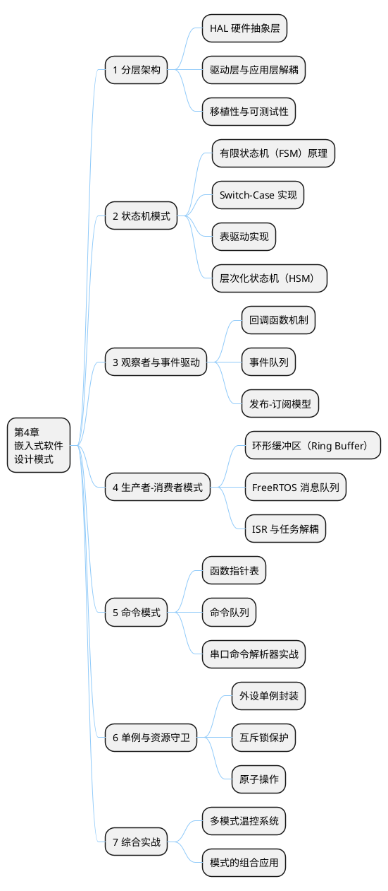
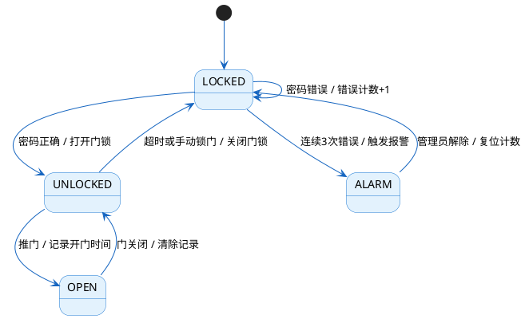
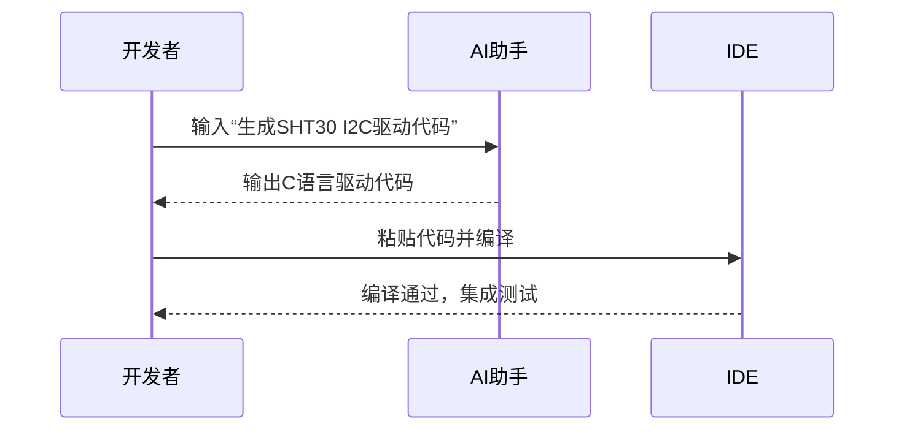
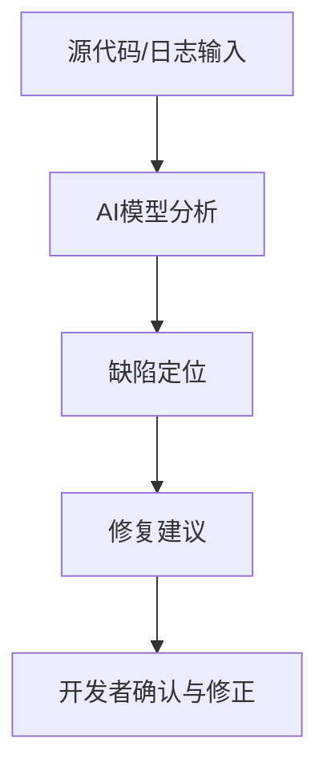
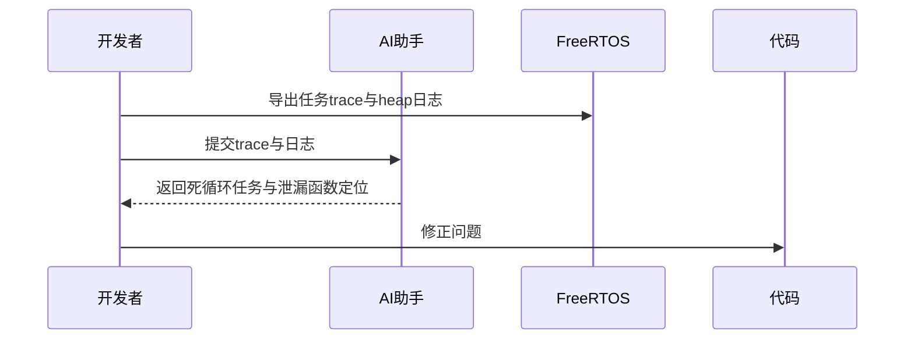

# 第4章 嵌入式软件的设计模式

> 嵌入式系统的软件质量不仅取决于代码能否运行，更取决于代码能否在资源受限、实时性要求严苛的环境下**长期稳定、可维护地运行**。设计模式是前人在解决反复出现的工程问题时总结出的可复用方案，掌握它们将使你的嵌入式代码从"能跑"走向"优雅"。

## 本章知识导图



---

## 1  分层架构模式

### 1.1  为什么需要分层

嵌入式项目的代码一旦规模扩大，最常见的问题是"**牵一发而动全身**"——换一块芯片，应用逻辑全部要改；修改一个外设的驱动，业务代码也跟着出错。分层架构通过**明确的职责边界**解决这一问题。

```
  ┌─────────────────────────────────────────────┐
  │               应用层  (Application)          │  ← 业务逻辑、状态机、任务
  ├─────────────────────────────────────────────┤
  │               服务层  (Service)              │  ← 传感器融合、协议解析
  ├─────────────────────────────────────────────┤
  │               驱动层  (Driver)               │  ← 外设操作、寄存器读写
  ├─────────────────────────────────────────────┤
  │         硬件抽象层  (HAL / BSP)              │  ← STM32 HAL、厂商库
  ├─────────────────────────────────────────────┤
  │               硬件  (Hardware)               │  ← MCU、传感器、执行器
  └─────────────────────────────────────────────┘
```

**各层职责对比：**

| 层次 | 职责 | 典型内容 | 允许依赖 |
|------|------|---------|---------|
| 应用层 | 实现系统功能与业务逻辑 | 任务调度、状态机、UI | 服务层 |
| 服务层 | 对驱动进行组合与封装 | 温度计算、滤波算法 | 驱动层 |
| 驱动层 | 操作具体外设 | 超声波驱动、OLED 驱动 | HAL 层 |
| HAL 层 | 屏蔽芯片差异 | STM32 HAL_GPIO_WritePin | 硬件 |

### 1.2  HAL 接口定义实践

定义统一的 HAL 接口是分层架构的关键。以 GPIO 为例：

```c
/* hal_gpio.h —— 硬件抽象接口定义 */
#ifndef HAL_GPIO_H
#define HAL_GPIO_H

#include <stdint.h>

typedef enum {
    GPIO_PIN_RESET = 0,
    GPIO_PIN_SET   = 1
} GPIO_PinState;

/* 纯接口声明，不依赖任何具体芯片头文件 */
void     hal_gpio_write(uint8_t port, uint8_t pin, GPIO_PinState state);
void     hal_gpio_toggle(uint8_t port, uint8_t pin);
GPIO_PinState hal_gpio_read(uint8_t port, uint8_t pin);

#endif
```

```c
/* hal_gpio_stm32.c —— STM32 平台实现 */
#include "hal_gpio.h"
#include "stm32f1xx_hal.h"

static GPIO_TypeDef* port_map[] = { GPIOA, GPIOB, GPIOC };

void hal_gpio_write(uint8_t port, uint8_t pin, GPIO_PinState state) {
    HAL_GPIO_WritePin(port_map[port], (1U << pin),
                      (GPIO_PinState)state);
}

void hal_gpio_toggle(uint8_t port, uint8_t pin) {
    HAL_GPIO_TogglePin(port_map[port], (1U << pin));
}

GPIO_PinState hal_gpio_read(uint8_t port, uint8_t pin) {
    return (GPIO_PinState)HAL_GPIO_ReadPin(port_map[port], (1U << pin));
}
```

> 💡 **分层原则：上层只调用接口，下层负责实现。** 这样在移植到不同芯片时，只需替换 `hal_gpio_stm32.c`，应用层代码零修改。

### 1.3  驱动层示例：LED 驱动封装

驱动层基于 HAL 接口，进一步封装语义化操作：

```c
/* led_driver.h */
#include "hal_gpio.h"

#define LED_PORT   2   /* PC 口 */
#define LED_PIN    13  /* PC13 */

static inline void led_on(void)     { hal_gpio_write(LED_PORT, LED_PIN, GPIO_PIN_RESET); }
static inline void led_off(void)    { hal_gpio_write(LED_PORT, LED_PIN, GPIO_PIN_SET);   }
static inline void led_toggle(void) { hal_gpio_toggle(LED_PORT, LED_PIN); }
```

---

## 2  状态机模式

### 2.1  有限状态机原理

**有限状态机（FSM, Finite State Machine）** 是嵌入式软件中最重要的设计模式之一。它将系统行为建模为：

- **状态（State）**：系统在某一时刻所处的情形
- **事件（Event）**：触发状态转移的外部或内部信号
- **转移（Transition）**：由一个状态迁移到另一个状态的过程
- **动作（Action）**：进入/离开状态或发生转移时执行的操作

以"智能门锁"为例：



### 2.2  Switch-Case 实现

最简单直接的 FSM 实现方式，适合状态数量较少（≤5）的情形：

```c
typedef enum {
    STATE_LOCKED,
    STATE_UNLOCKED,
    STATE_OPEN,
    STATE_ALARM
} LockState;

typedef enum {
    EVENT_PASSWORD_OK,
    EVENT_PASSWORD_ERR,
    EVENT_ERR_LIMIT,    /* 错误次数达到上限 */
    EVENT_TIMEOUT,
    EVENT_DOOR_PUSH,
    EVENT_DOOR_CLOSE,
    EVENT_ADMIN_RESET
} LockEvent;

static LockState s_state = STATE_LOCKED;
static uint8_t   s_err_count = 0;

void fsm_process(LockEvent event) {
    switch (s_state) {
        case STATE_LOCKED:
            if (event == EVENT_PASSWORD_OK) {
                lock_open();           /* 动作：打开门锁 */
                s_err_count = 0;
                s_state = STATE_UNLOCKED;
            } else if (event == EVENT_PASSWORD_ERR) {
                s_err_count++;
                if (s_err_count >= 3) {
                    alarm_trigger();   /* 动作：触发报警 */
                    s_state = STATE_ALARM;
                }
            }
            break;

        case STATE_UNLOCKED:
            if (event == EVENT_TIMEOUT) {
                lock_close();
                s_state = STATE_LOCKED;
            } else if (event == EVENT_DOOR_PUSH) {
                log_entry();
                s_state = STATE_OPEN;
            }
            break;

        case STATE_OPEN:
            if (event == EVENT_DOOR_CLOSE)
                s_state = STATE_UNLOCKED;
            break;

        case STATE_ALARM:
            if (event == EVENT_ADMIN_RESET) {
                alarm_stop();
                s_err_count = 0;
                s_state = STATE_LOCKED;
            }
            break;
    }
}
```

### 2.3  表驱动实现

当状态和事件数量较多时，Switch-Case 会变得臃肿。**表驱动 FSM** 将转移关系存储在二维表中，代码结构更清晰：

```c
typedef void (*ActionFn)(void);  /* 动作函数指针 */

typedef struct {
    LockState   next_state;   /* 转移后的状态 */
    ActionFn    action;       /* 执行的动作   */
} Transition;

/* 状态转移表 [当前状态][事件] */
static const Transition fsm_table[4][7] = {
    /* STATE_LOCKED */
    [STATE_LOCKED] = {
        [EVENT_PASSWORD_OK]  = { STATE_UNLOCKED, lock_open     },
        [EVENT_PASSWORD_ERR] = { STATE_LOCKED,   count_error   },
        [EVENT_ERR_LIMIT]    = { STATE_ALARM,     alarm_trigger },
    },
    /* STATE_UNLOCKED */
    [STATE_UNLOCKED] = {
        [EVENT_TIMEOUT]   = { STATE_LOCKED,  lock_close },
        [EVENT_DOOR_PUSH] = { STATE_OPEN,    log_entry  },
    },
    /* STATE_OPEN */
    [STATE_OPEN] = {
        [EVENT_DOOR_CLOSE] = { STATE_UNLOCKED, NULL },
    },
    /* STATE_ALARM */
    [STATE_ALARM] = {
        [EVENT_ADMIN_RESET] = { STATE_LOCKED, alarm_reset },
    },
};

void fsm_process_table(LockEvent event) {
    const Transition *t = &fsm_table[s_state][event];
    if (t->action != NULL)
        t->action();
    s_state = t->next_state;
}
```

**两种实现方式对比：**

| 特性 | Switch-Case | 表驱动 |
|------|------------|-------|
| 代码可读性 | 直观，适合简单 FSM | 结构化，一目了然 |
| 扩展性 | 新增状态需修改多处 | 只需扩展表格 |
| 性能 | 略高（无表查找）| 稍低（数组索引） |
| 适用场景 | ≤5 个状态 | 状态/事件较多 |

### 2.4  层次化状态机（HSM）简介

当多个状态共享相同的行为时，可以引入**层次化状态机（HSM）**，通过状态继承消除重复：

```
  ┌──────────────────────────────────────────┐
  │              OPERATIONAL（运行中）        │
  │  ┌────────────┐      ┌─────────────────┐ │
  │  │   NORMAL   │ ───▶ │    CHARGING     │ │
  │  │  （正常）   │      │    （充电中）    │ │
  │  └────────────┘      └─────────────────┘ │
  │        ↑ 均处理 ERROR 事件 → ERROR 状态  │
  └──────────────────────────────────────────┘
                    │ ERROR 事件
                    ▼
             ┌─────────────┐
             │    ERROR    │
             │  （故障）   │
             └─────────────┘
```

> 💡 HSM 的核心思想是：子状态可以**继承**父状态的事件处理，父状态定义公共行为，子状态只处理差异部分，避免重复代码。

---

## 3  观察者与事件驱动模式

### 3.1  回调函数机制

嵌入式中最常见的"观察者"形式是**回调函数（Callback）**。驱动层不知道上层应用的具体逻辑，但可以在事件发生时通过函数指针通知上层：

```c
/* uart_driver.h */
typedef void (*UartRxCallback)(uint8_t byte);

void uart_register_rx_callback(UartRxCallback cb);
void uart_send(const uint8_t *data, uint16_t len);
```

```c
/* uart_driver.c —— 驱动内部实现 */
static UartRxCallback s_rx_cb = NULL;

void uart_register_rx_callback(UartRxCallback cb) {
    s_rx_cb = cb;
}

/* 在串口中断服务函数中调用 */
void USART1_IRQHandler(void) {
    uint8_t byte = (uint8_t)(USART1->DR & 0xFF);
    if (s_rx_cb != NULL)
        s_rx_cb(byte);   /* 通知上层 */
}
```

```c
/* app.c —— 应用层注册回调 */
void on_uart_byte_received(uint8_t byte) {
    /* 处理接收到的字节 */
    cmd_buffer_push(byte);
}

void app_init(void) {
    uart_register_rx_callback(on_uart_byte_received);
}
```

### 3.2  事件队列

在 RTOS 环境下，回调通常在 ISR 中执行，不能直接进行复杂操作。**事件队列**将事件从 ISR 传递到任务上下文处理：

```
  ISR 上下文                    任务上下文
  ─────────────────────────    ─────────────────────────────
  按键中断触发                  事件处理任务（低优先级）
       │                              │
       ▼                              │
  ┌────────────┐   入队（非阻塞）  ┌──┴──────────────────────┐
  │ 按键事件   │ ──────────────▶  │  Event Queue (FIFO)      │
  └────────────┘                  │  [ BTN_PRESS, TIMEOUT,   │
                                  │    UART_RX, ADC_DONE ]   │
  传感器定时中断                  └──┬──────────────────────┘
       │                              │ 出队（阻塞等待）
       ▼                              ▼
  ┌────────────┐                  ┌──────────────────────────┐
  │ ADC 完成   │ ──────────────▶  │  状态机 / 业务逻辑处理    │
  └────────────┘                  └──────────────────────────┘
```

```c
/* 事件类型定义 */
typedef enum {
    EVT_BTN_PRESS,
    EVT_ADC_DONE,
    EVT_UART_RX,
    EVT_TIMEOUT
} EventType;

typedef struct {
    EventType type;
    uint32_t  data;   /* 携带的附加数据 */
} Event;

/* FreeRTOS 队列句柄 */
static QueueHandle_t s_event_queue;

void event_queue_init(void) {
    s_event_queue = xQueueCreate(16, sizeof(Event));
}

/* 在 ISR 中发布事件（使用 FromISR 版本） */
void HAL_GPIO_EXTI_Callback(uint16_t GPIO_Pin) {
    Event evt = { .type = EVT_BTN_PRESS, .data = GPIO_Pin };
    BaseType_t woken = pdFALSE;
    xQueueSendFromISR(s_event_queue, &evt, &woken);
    portYIELD_FROM_ISR(woken);
}

/* 事件处理任务 */
void task_event_handler(void *arg) {
    Event evt;
    for (;;) {
        if (xQueueReceive(s_event_queue, &evt, portMAX_DELAY) == pdTRUE) {
            switch (evt.type) {
                case EVT_BTN_PRESS: handle_button(evt.data); break;
                case EVT_ADC_DONE:  handle_adc(evt.data);    break;
                case EVT_UART_RX:   handle_uart(evt.data);   break;
                default: break;
            }
        }
    }
}
```

### 3.3  发布-订阅模型

当多个模块都需要响应同一事件时，可实现简单的**发布-订阅**机制：

```c
#define MAX_SUBSCRIBERS  4

typedef void (*EventHandler)(uint32_t data);

typedef struct {
    EventType    type;
    EventHandler handlers[MAX_SUBSCRIBERS];
    uint8_t      count;
} Topic;

static Topic s_topics[8];

void pubsub_subscribe(EventType type, EventHandler handler) {
    Topic *t = &s_topics[type];
    if (t->count < MAX_SUBSCRIBERS)
        t->handlers[t->count++] = handler;
}

void pubsub_publish(EventType type, uint32_t data) {
    Topic *t = &s_topics[type];
    for (uint8_t i = 0; i < t->count; i++)
        t->handlers[i](data);
}
```

---

## 4  生产者-消费者模式

### 4.1  环形缓冲区（Ring Buffer）

环形缓冲区是嵌入式中最常见的**线程安全数据结构**，用于在不同速率的生产者与消费者之间解耦：

```
  写指针 (head)                  读指针 (tail)
       ↓                               ↓
  ┌────┬────┬────┬────┬────┬────┬────┬────┐
  │ 0x41│ 0x42│ 0x43│ 0x44│ 空 │ 空 │ 空 │ 0x40│
  └────┴────┴────┴────┴────┴────┴────┴────┘
    ↑                                   ↑
  已写入数据 (生产者)             已读出位置 (消费者)
                  缓冲区循环使用
```

```c
#define RING_BUF_SIZE  64   /* 必须是 2 的幂次，便于取模 */

typedef struct {
    uint8_t  buf[RING_BUF_SIZE];
    volatile uint16_t head;   /* 写指针（生产者修改） */
    volatile uint16_t tail;   /* 读指针（消费者修改） */
} RingBuffer;

static inline void ring_buf_init(RingBuffer *rb) {
    rb->head = rb->tail = 0;
}

/* 返回 true 表示写入成功，false 表示缓冲区已满 */
static inline bool ring_buf_push(RingBuffer *rb, uint8_t byte) {
    uint16_t next_head = (rb->head + 1) & (RING_BUF_SIZE - 1);
    if (next_head == rb->tail) return false;  /* 满 */
    rb->buf[rb->head] = byte;
    rb->head = next_head;
    return true;
}

/* 返回 true 表示读取成功，false 表示缓冲区为空 */
static inline bool ring_buf_pop(RingBuffer *rb, uint8_t *byte) {
    if (rb->head == rb->tail) return false;   /* 空 */
    *byte = rb->buf[rb->tail];
    rb->tail = (rb->tail + 1) & (RING_BUF_SIZE - 1);
    return true;
}

static inline bool ring_buf_empty(const RingBuffer *rb) {
    return rb->head == rb->tail;
}
```

> ⚠️ **并发安全提示：** 在单生产者/单消费者场景下（ISR 写入，任务读取），只要 head/tail 的读写是原子的（32位 MCU 上通常满足），上述实现是安全的。多生产者或多消费者场景下需要加锁。

### 4.2  ISR 与任务解耦实战

以 USART 接收为例，展示生产者-消费者在实际项目中的完整应用：

```c
/* 全局接收缓冲区 */
static RingBuffer s_uart_rx_buf;

/* ── 生产者：USART 中断（ISR 上下文） ── */
void USART1_IRQHandler(void) {
    if (__HAL_UART_GET_FLAG(&huart1, UART_FLAG_RXNE)) {
        uint8_t byte = (uint8_t)(huart1.Instance->DR & 0xFF);
        ring_buf_push(&s_uart_rx_buf, byte);
        /* ISR 中不做任何解析，仅入队 */
    }
}

/* ── 消费者：串口处理任务（任务上下文） ── */
void task_uart_process(void *arg) {
    uint8_t byte;
    for (;;) {
        while (ring_buf_pop(&s_uart_rx_buf, &byte)) {
            cmd_parser_feed(byte);   /* 逐字节喂给命令解析器 */
        }
        osDelay(1);   /* 让出 CPU，1ms 轮询一次 */
    }
}
```

```
  USART 硬件                  环形缓冲区               命令解析任务
  ─────────────              ─────────────            ────────────────
  接收到字节                                           每 1ms 醒来一次
      │                                                     │
      ▼                       ┌──────────┐                  │
  USART1_IRQHandler  ──push──▶│ RingBuf  │──pop──▶  cmd_parser_feed()
  （高优先级，快速返回）        └──────────┘          （低优先级，可阻塞）
```

---

## 5  命令模式

### 5.1  函数指针表

**命令模式**将操作封装为对象（或函数指针），使得调用者无需知道具体操作的实现。函数指针表是嵌入式中最高效的实现形式：

```c
typedef void (*CmdHandler)(const char *args);

typedef struct {
    const char *name;     /* 命令名称字符串 */
    CmdHandler  handler;  /* 处理函数指针  */
    const char *help;     /* 帮助说明      */
} Command;

/* 命令处理函数实现 */
static void cmd_led(const char *args)  { /* 解析 args，控制 LED */ }
static void cmd_pwm(const char *args)  { /* 解析 args，设置 PWM */ }
static void cmd_adc(const char *args)  { /* 读取 ADC 值并打印   */ }
static void cmd_help(const char *args);

/* 命令注册表 */
static const Command cmd_table[] = {
    { "led",  cmd_led,  "led <on|off>        控制 LED"       },
    { "pwm",  cmd_pwm,  "pwm <0-100>         设置 PWM 占空比" },
    { "adc",  cmd_adc,  "adc                 读取 ADC 电压"   },
    { "help", cmd_help, "help                显示帮助信息"    },
};
#define CMD_COUNT  (sizeof(cmd_table) / sizeof(cmd_table[0]))

static void cmd_help(const char *args) {
    for (uint8_t i = 0; i < CMD_COUNT; i++)
        printf("  %s\r\n", cmd_table[i].help);
}
```

### 5.2  串口命令解析器实战

结合环形缓冲区与命令模式，构建完整的串口命令行接口：

```c
#define CMD_BUF_SIZE  64

typedef struct {
    char    buf[CMD_BUF_SIZE];
    uint8_t len;
} CmdParser;

static CmdParser s_parser;

/* 逐字节输入，遇到回车时执行命令 */
void cmd_parser_feed(uint8_t byte) {
    if (byte == '\r' || byte == '\n') {
        if (s_parser.len == 0) return;
        s_parser.buf[s_parser.len] = '\0';
        cmd_execute(s_parser.buf);
        s_parser.len = 0;
    } else if (byte == '\b' && s_parser.len > 0) {
        /* 退格 */
        s_parser.len--;
        printf("\b \b");
    } else if (s_parser.len < CMD_BUF_SIZE - 1) {
        s_parser.buf[s_parser.len++] = (char)byte;
        printf("%c", byte);   /* 本地回显 */
    }
}

/* 解析并分发命令 */
void cmd_execute(char *line) {
    /* 分离命令名和参数 */
    char *args = strchr(line, ' ');
    if (args != NULL) {
        *args = '\0';
        args++;
    } else {
        args = line + strlen(line);   /* 空字符串 */
    }

    for (uint8_t i = 0; i < CMD_COUNT; i++) {
        if (strcmp(line, cmd_table[i].name) == 0) {
            cmd_table[i].handler(args);
            return;
        }
    }
    printf("未知命令: %s，输入 help 查看帮助\r\n", line);
}
```

**交互示例：**

```
> help
  led <on|off>        控制 LED
  pwm <0-100>         设置 PWM 占空比
  adc                 读取 ADC 电压
  help                显示帮助信息

> led on
LED 已打开

> pwm 75
PWM 占空比设置为 75%

> adc
ADC 读数: 2048, 电压: 1.65V
```

---

## 6  单例与资源守卫模式

### 6.1  外设单例封装

嵌入式系统中每个外设在物理上是唯一的，应当通过**单例模式**防止重复初始化或并发访问冲突：

```c
/* i2c_bus.h —— I2C 总线单例封装 */
#ifndef I2C_BUS_H
#define I2C_BUS_H

#include <stdint.h>
#include <stdbool.h>

typedef struct I2CBus I2CBus;

/* 获取单例（首次调用时初始化） */
I2CBus *i2c_bus_get_instance(void);

bool i2c_bus_write(I2CBus *bus, uint8_t addr, const uint8_t *data, uint16_t len);
bool i2c_bus_read(I2CBus *bus, uint8_t addr, uint8_t *data, uint16_t len);

#endif
```

```c
/* i2c_bus.c */
#include "i2c_bus.h"
#include "stm32f1xx_hal.h"

struct I2CBus {
    I2C_HandleTypeDef *handle;
    bool               initialized;
};

static I2CBus s_instance = { .initialized = false };

I2CBus *i2c_bus_get_instance(void) {
    if (!s_instance.initialized) {
        s_instance.handle = &hi2c1;
        s_instance.initialized = true;
    }
    return &s_instance;
}
```

### 6.2  互斥锁保护共享资源

在 FreeRTOS 多任务环境下，多个任务访问同一外设时必须使用**互斥锁（Mutex）**保护：

```c
static MutexHandle_t  s_i2c_mutex;
static I2CBus        *s_bus;

void peripheral_init(void) {
    s_i2c_mutex = xSemaphoreCreateMutex();
    s_bus = i2c_bus_get_instance();
}

/* 任务 A：读取温度传感器 */
void task_read_temperature(void *arg) {
    for (;;) {
        if (xSemaphoreTake(s_i2c_mutex, pdMS_TO_TICKS(100)) == pdTRUE) {
            /* 临界区：安全访问 I2C */
            uint8_t temp_data[2];
            i2c_bus_read(s_bus, 0x48, temp_data, 2);
            xSemaphoreGive(s_i2c_mutex);
            /* 处理温度数据 */
        }
        osDelay(500);
    }
}

/* 任务 B：读取气压传感器 */
void task_read_pressure(void *arg) {
    for (;;) {
        if (xSemaphoreTake(s_i2c_mutex, pdMS_TO_TICKS(100)) == pdTRUE) {
            uint8_t pres_data[3];
            i2c_bus_read(s_bus, 0x77, pres_data, 3);
            xSemaphoreGive(s_i2c_mutex);
        }
        osDelay(1000);
    }
}
```

### 6.3  原子操作与临界区

对于简单的标志变量，可以用**临界区保护**而非互斥锁，开销更小：

```c
/* 方式一：关中断（最轻量，适合裸机） */
uint32_t save = __get_PRIMASK();
__disable_irq();

/* —— 临界区开始 —— */
g_shared_flag = new_value;
/* —— 临界区结束 —— */

__set_PRIMASK(save);

/* 方式二：FreeRTOS 临界区（适合 RTOS 任务，不影响 ISR） */
taskENTER_CRITICAL();
g_shared_counter++;
taskEXIT_CRITICAL();
```

**选择指南：**

| 场景 | 推荐方案 | 原因 |
|------|---------|------|
| 裸机，简单标志 | `__disable_irq()` | 最轻量，无 RTOS 依赖 |
| RTOS 任务间 | `xSemaphoreCreateMutex()` | 支持优先级继承，防止优先级反转 |
| RTOS 任务 + ISR | `xSemaphoreCreateBinary()` | ISR 安全版本 |
| 计数类资源 | `xSemaphoreCreateCounting()` | 如缓冲区槽位管理 |

---

## 7  综合实战：多模式温控系统

本节将前述所有模式组合，实现一个具有**手动/自动/节能三种工作模式**的温控风扇系统。

### 7.1  系统架构

```
  ┌──────────────────────────────────────────────────────────────┐
  │                        应用层                                 │
  │   ┌─────────────────────┐    ┌───────────────────────────┐   │
  │   │   温控状态机 (FSM)   │    │  串口命令解析器 (命令模式) │   │
  │   └──────────┬──────────┘    └─────────────┬─────────────┘   │
  └──────────────┼─────────────────────────────┼─────────────────┘
                 │                             │
  ┌──────────────┼─────────────────────────────┼─────────────────┐
  │              │         服务层              │                   │
  │   ┌──────────▼──────────┐    ┌─────────────▼─────────────┐   │
  │   │   温度滤波服务       │    │    事件队列（观察者模式）   │   │
  │   └──────────┬──────────┘    └─────────────┬─────────────┘   │
  └──────────────┼─────────────────────────────┼─────────────────┘
                 │                             │
  ┌──────────────┼─────────────────────────────┼─────────────────┐
  │              │         驱动层              │                   │
  │   ┌──────────▼──────────┐    ┌─────────────▼─────────────┐   │
  │   │  ADC 驱动（生产者）  │    │   UART 驱动（生产者）      │   │
  │   │  PWM 驱动（消费者）  │    │   RingBuffer（缓冲区）     │   │
  │   └─────────────────────┘    └───────────────────────────┘   │
  └─────────────────────────────────────────────────────────────┘
```

### 7.2  状态机定义

```c
/* 工作模式 */
typedef enum {
    MODE_MANUAL,   /* 手动：串口直接设置风速 */
    MODE_AUTO,     /* 自动：根据温度 PID 控制 */
    MODE_ECO       /* 节能：低于阈值时关闭风扇 */
} WorkMode;

/* 系统状态 */
typedef enum {
    SYS_IDLE,       /* 空闲：温度正常，风扇停转 */
    SYS_COOLING,    /* 制冷：风扇运转中 */
    SYS_OVERHEAT,   /* 过热：全速运转并报警 */
    SYS_ERROR       /* 故障：传感器异常 */
} SysState;

typedef struct {
    SysState  state;
    WorkMode  mode;
    float     temperature;
    uint8_t   fan_speed;    /* 0–100% */
    float     setpoint;     /* 目标温度 */
} ThermoCtrl;

static ThermoCtrl s_ctrl = {
    .state       = SYS_IDLE,
    .mode        = MODE_AUTO,
    .setpoint    = 30.0f,
    .fan_speed   = 0,
};
```

### 7.3  各模式的状态转移

```c
void thermo_update(float new_temp) {
    s_ctrl.temperature = new_temp;

    /* 全局过热检测（各模式均适用） */
    if (new_temp > 60.0f) {
        fan_set_speed(100);
        alarm_beep(true);
        s_ctrl.state = SYS_OVERHEAT;
        return;
    }
    if (s_ctrl.state == SYS_OVERHEAT && new_temp < 55.0f) {
        alarm_beep(false);
        s_ctrl.state = SYS_COOLING;
    }

    switch (s_ctrl.mode) {
        case MODE_AUTO: {
            float err = new_temp - s_ctrl.setpoint;
            uint8_t spd = (err > 0) ? (uint8_t)(err * 5.0f) : 0;
            spd = (spd > 100) ? 100 : spd;
            fan_set_speed(spd);
            s_ctrl.state = (spd > 0) ? SYS_COOLING : SYS_IDLE;
            break;
        }
        case MODE_ECO:
            if (new_temp > s_ctrl.setpoint + 2.0f) {
                fan_set_speed(40);
                s_ctrl.state = SYS_COOLING;
            } else {
                fan_set_speed(0);
                s_ctrl.state = SYS_IDLE;
            }
            break;

        case MODE_MANUAL:
            /* 手动模式：不自动修改风速，仅更新状态显示 */
            s_ctrl.state = (s_ctrl.fan_speed > 0) ? SYS_COOLING : SYS_IDLE;
            break;
    }
}
```

### 7.4  串口命令集成

```c
static void cmd_mode(const char *args) {
    if      (strcmp(args, "auto")   == 0) s_ctrl.mode = MODE_AUTO;
    else if (strcmp(args, "manual") == 0) s_ctrl.mode = MODE_MANUAL;
    else if (strcmp(args, "eco")    == 0) s_ctrl.mode = MODE_ECO;
    else { printf("用法: mode <auto|manual|eco>\r\n"); return; }
    printf("模式已切换为: %s\r\n", args);
}

static void cmd_fan(const char *args) {
    if (s_ctrl.mode != MODE_MANUAL) {
        printf("请先切换到手动模式: mode manual\r\n");
        return;
    }
    uint8_t spd = (uint8_t)atoi(args);
    spd = (spd > 100) ? 100 : spd;
    fan_set_speed(spd);
    s_ctrl.fan_speed = spd;
    printf("风速设置为: %d%%\r\n", spd);
}

static void cmd_status(const char *args) {
    static const char *state_str[] = { "空闲", "制冷中", "过热!", "故障" };
    static const char *mode_str[]  = { "手动", "自动",   "节能"         };
    printf("温度: %.1f°C | 设定值: %.1f°C | 风速: %d%% | "
           "状态: %s | 模式: %s\r\n",
           s_ctrl.temperature, s_ctrl.setpoint, s_ctrl.fan_speed,
           state_str[s_ctrl.state], mode_str[s_ctrl.mode]);
}
```

### 7.5  设计模式应用总结

| 使用的模式 | 在本项目中的体现 | 解决的问题 |
|-----------|----------------|-----------|
| **分层架构** | HAL → 驱动 → 服务 → 应用 | 驱动与逻辑解耦，可独立替换 |
| **状态机** | SysState + WorkMode 双状态机 | 清晰描述系统行为，避免 if-else 混乱 |
| **观察者/回调** | UART 中断注册回调 | ISR 不直接调用业务逻辑 |
| **生产者-消费者** | RingBuffer + 处理任务 | 中断安全，速率解耦 |
| **命令模式** | cmd_table 函数指针表 | 扩展命令无需修改分发逻辑 |
| **单例 + 互斥锁** | ADC/PWM 单例封装 | 防止并发访问外设冲突 |

---

## 本章小结

嵌入式软件设计模式的本质，是在**资源受限**与**实时性要求**的约束下，找到**可维护性、可扩展性与性能**之间的平衡点：

```
  可维护性  ◀─────────────────────▶  性能
       ▲              ▲
       │              │
       │         实时性要求
       ▼
  可扩展性
```

**各模式适用场景速查：**

| 场景 | 推荐模式 |
|------|---------|
| 系统有多种工作状态和转换逻辑 | 状态机（FSM / HSM） |
| 驱动层需要通知上层但不依赖上层 | 回调函数 / 观察者 |
| ISR 与任务处理速率不匹配 | 生产者-消费者 + 环形缓冲区 |
| 需要动态扩展操作集合 | 命令模式（函数指针表） |
| 多任务共享外设 | 单例 + 互斥锁 |
| 需要跨平台移植 | 分层架构 + HAL 接口 |

> 💡 **学习建议：** 设计模式不是教条，应根据项目规模灵活选用。对于简单的单任务裸机程序，状态机 + 环形缓冲区已足够；随着项目引入 RTOS，逐步加入事件队列和互斥锁。过度设计与设计不足同样有害。

---

---

## 本章测验

<div id="exam-meta" data-exam-id="chapter4" data-exam-title="第四章 嵌入式软件设计模式测验" style="display:none"></div>

<!-- mkdocs-quiz intro -->

<quiz>
1) 在分层架构模式中，HAL（硬件抽象层）的核心作用是：
- [ ] 直接实现业务逻辑，减少代码量
- [ ] 替代操作系统的任务调度功能
- [x] 屏蔽芯片硬件差异，使上层代码在移植时无需修改
- [ ] 提高程序运行速度，减少函数调用开销

正确。HAL 层定义统一接口并由平台相关代码实现，上层只调用接口，换芯片时仅替换 HAL 实现即可。
</quiz>

<quiz>
2) 有限状态机（FSM）由哪四个核心要素构成？
- [ ] 线程、队列、信号量、互斥锁
- [x] 状态、事件、转移、动作
- [ ] 输入、处理、输出、反馈
- [ ] 初始化、运行、暂停、终止

正确。FSM 的四要素是：状态（系统当前情形）、事件（触发信号）、转移（状态迁移）、动作（转移时执行的操作）。
</quiz>

<quiz>
3) 相比 Switch-Case 实现，表驱动 FSM 的主要优势是：
- [ ] 运行时性能更高，没有任何额外开销
- [ ] 代码量更少，适合状态极少的简单场景
- [x] 状态转移关系集中在表格中，新增状态只需扩展表格而无需修改分发逻辑
- [ ] 不需要定义状态枚举，直接用整数表示状态

正确。表驱动将"数据"与"逻辑"分离，扩展性更强；Switch-Case 在状态增多时需要修改多处，维护困难。
</quiz>

<quiz>
4) 在回调函数机制中，驱动层将函数指针保存后在中断中调用，这体现了哪种设计原则？
- [ ] 单一职责原则：每个模块只做一件事
- [ ] 开闭原则：对扩展开放，对修改关闭
- [x] 依赖倒置原则：高层模块定义接口，低层模块依赖该接口而非具体实现
- [ ] 里氏替换原则：子类可以替换父类

正确。驱动层不依赖应用层的具体函数，而是依赖上层注册的函数指针（接口），体现了依赖倒置。
</quiz>

<quiz>
5) 环形缓冲区（Ring Buffer）在嵌入式中最常用于解决的问题是：
- [ ] 减少动态内存分配，避免堆碎片
- [x] 在生产者（如 ISR）和消费者（如任务）速率不匹配时进行安全的数据缓冲
- [ ] 替代 FreeRTOS 的消息队列，提高实时性
- [ ] 实现双向链表，便于插入和删除节点

正确。Ring Buffer 是 FIFO 结构，允许 ISR（生产者）快速写入、任务（消费者）慢速处理，两者速率解耦且无需阻塞。
</quiz>

<quiz>
6) 以下关于环形缓冲区"缓冲区已满"判断条件的描述，正确的是：
- [ ] head == tail
- [x] (head + 1) % SIZE == tail
- [ ] head > tail
- [ ] tail - head == SIZE

正确。Ring Buffer 通常保留一个空槽用于区分"满"与"空"，满的条件是下一个 head 追上了 tail。head == tail 表示空。
</quiz>

<quiz>
7) 在 FreeRTOS 中断服务函数（ISR）里向队列发送事件，应使用哪个 API？
- [ ] xQueueSend()
- [ ] xQueueSendToBack()
- [x] xQueueSendFromISR()
- [ ] xQueuePeek()

正确。ISR 中必须使用带 FromISR 后缀的 API，它不会导致任务阻塞，并通过 pxHigherPriorityTaskWoken 参数触发上下文切换。
</quiz>

<quiz>
8) 命令模式中使用函数指针表（cmd_table）相比大量 if-else 链的优势是：
- [ ] 函数指针调用比直接调用速度更快
- [ ] 减少了程序占用的 Flash 空间
- [x] 新增命令只需在表格中追加一行，无需修改命令分发逻辑，符合开闭原则
- [ ] 可以在运行时动态修改函数指针，实现热更新

正确。函数指针表将命令注册与命令分发解耦，扩展时只修改数据（表格），不修改逻辑（遍历与调用代码）。
</quiz>

<quiz>
9) 在 FreeRTOS 多任务环境中，两个任务同时访问同一个 I2C 外设，最推荐的同步机制是：
- [ ] 关闭全局中断（__disable_irq）
- [ ] 使用二值信号量（Binary Semaphore）
- [x] 使用互斥锁（Mutex），因为它支持优先级继承，可防止优先级反转
- [ ] 使用计数信号量（Counting Semaphore）

正确。互斥锁（Mutex）专为保护共享资源设计，内置优先级继承机制，可避免低优先级任务长期占用资源导致高优先级任务饥饿。
</quiz>

<quiz>
10) 关于嵌入式软件设计模式的使用原则，以下说法最为恰当的是：
- [ ] 应尽可能多地使用设计模式，以保证代码的可扩展性
- [ ] 裸机程序不需要任何设计模式，只有 RTOS 项目才需要
- [ ] 设计模式会显著增加代码体积，在资源受限的 MCU 上应完全避免
- [x] 应根据项目规模和需求灵活选用，过度设计与设计不足同样有害

正确。设计模式是工具而非教条。简单项目用状态机+环形缓冲区足矣，复杂项目再逐步引入事件队列、互斥锁等机制。
</quiz>

<quiz>
1) AI自动生成嵌入式代码的主要优势包括哪些？（多选）
- [x] 提高开发效率，减少重复劳动
- [x] 降低初学者入门门槛
- [x] 能自动补全常见外设驱动与协议栈
- [ ] 可完全替代人工审核与测试

答案解析：AI可极大提升效率，但生成代码仍需人工审核与系统测试，不能完全替代工程师责任。
</quiz>

<quiz>
2) 下列关于AI辅助自动化调试的说法，正确的是：
- [ ] AI可自动修复所有嵌入式系统缺陷
- [x] AI可通过分析trace和日志，辅助定位死循环、内存泄漏等问题
- [ ] AI只能用于桌面软件调试，无法应用于嵌入式系统
- [ ] AI调试结果无需人工确认

答案解析：AI可辅助定位问题，但最终修复与确认仍需工程师参与。
</quiz>

<quiz>
3) 工程实践中，AI生成的嵌入式代码集成时应重点关注哪些方面？（多选）
- [x] 硬件兼容性与寄存器配置正确性
- [x] 代码安全性与规范性
- [x] 与现有工程结构的集成方式
- [ ] 只要能编译通过即可，无需测试

答案解析：AI代码需结合硬件手册、行业规范与工程结构综合审核，确保系统稳定可靠。
</quiz>

<!-- mkdocs-quiz results -->


---

## 8  AI辅助嵌入式编程方法

### 8.1  本节导入

随着人工智能技术的快速发展，AI辅助编程已成为嵌入式系统开发的重要前沿工具。AI不仅能自动生成高质量嵌入式代码，还能辅助自动化调试、代码优化与缺陷检测，极大提升开发效率与系统可靠性。本节将系统讲解AI在嵌入式编程中的典型应用方法、核心原理与工程实践，助力学生掌握AI赋能下的现代嵌入式开发新范式。

#### 学习目标与重难点

- 理解AI辅助代码生成与调试的基本原理与流程
- 掌握主流AI编程工具链在嵌入式开发中的集成与应用
- 能够结合工程实例，利用AI提升嵌入式系统开发效率与质量

---

### 8.2  AI自动生成嵌入式代码

#### 8.2.1  原理与流程

AI代码生成本质上是利用大规模预训练模型（如GPT-4、Copilot等）对嵌入式开发需求进行语义理解，自动输出结构化、可编译的C/C++/Python等代码。典型流程如下：


#### 8.2.2  主流AI代码生成工具对比

| 工具/平台         | 支持语言      | 嵌入式适配性 | 典型功能           | 集成方式         |
|------------------|--------------|--------------|--------------------|------------------|
| GitHub Copilot   | C/C++/Python | ★★★★☆        | 代码补全/注释生成  | VSCode插件       |
| ChatGPT          | 多语言       | ★★★☆☆        | 代码片段/算法设计  | Web/API          |
| STM32Cube.AI     | C            | ★★★★★        | 神经网络代码生成   | STM32CubeIDE集成 |
| Keil MDK AI助手  | C            | ★★★★☆        | 代码模板/外设配置  | IDE插件          |

> **工程实践建议：** 结合AI代码生成与传统IDE（如STM32CubeIDE、Keil MDK）协同开发，能显著提升外设驱动、协议栈、算法实现等模块的开发效率。

---

#### 8.2.3  工程案例：AI自动生成外设驱动代码

**应用场景：** 工业物联网终端的多传感器数据采集模块开发。

**工程价值：** 利用AI自动生成I2C温湿度传感器驱动代码，减少手工查阅数据手册与调试时间。

**核心流程图：**



**核心代码示例：**
```c
// SHT30 I2C初始化与数据读取（AI自动生成，已适配HAL库）
void SHT30_Init(void) {
    // ...初始化代码...
}
float SHT30_ReadTemperature(void) {
    // ...I2C读写与数据解析...
}
```
> // 代码注释：AI生成代码需由开发者审核，重点关注I2C地址、时序、异常处理等细节。

---

### 8.3  AI辅助自动化调试与缺陷检测

#### 8.3.1  原理与典型流程

AI自动化调试通过分析源代码、编译日志、运行时trace等信息，智能定位潜在缺陷、性能瓶颈与安全隐患。典型流程如下：



#### 8.3.2  AI调试工具功能对比

| 工具/平台         | 支持对象      | 主要功能           | 适用场景           |
|------------------|--------------|--------------------|--------------------|
| Copilot Chat     | C/C++/Python | 错误分析/修复建议  | 代码调试/重构      |
| ChatGPT          | 多语言       | 日志分析/异常定位  | 运行时故障排查     |
| STM32CubeMonitor | STM32 MCU    | 实时数据可视化     | 在线调试/性能分析  |
| Keil MDK AI助手  | C            | 编译错误解释       | 编译期问题定位     |

---

#### 8.3.3  工程案例：AI辅助定位嵌入式死循环与内存泄漏

**应用场景：** 智能设备固件升级后出现系统卡死与内存异常。

**工程价值：** 利用AI分析FreeRTOS任务trace与内存分配日志，快速定位死循环与内存泄漏根因。

**核心流程图：**



**AI分析建议示例：**
- “检测到task_sensor_loop任务CPU占用100%，建议检查循环退出条件。”
- “heap日志显示函数foo_malloc未释放内存，建议补充free操作。”

---

### 8.4  AI辅助嵌入式开发的工程集成与注意事项

#### 8.4.1  工程集成流程


#### 8.4.2  典型注意事项

- **代码安全性：** AI生成代码需严格审核，防止引入安全漏洞或不符合行业规范的实现。
- **硬件适配性：** 需结合具体芯片手册与外设特性，校验AI生成的寄存器配置与时序逻辑。
- **工程可维护性：** 建议将AI生成代码与手工代码分层管理，便于后续维护与升级。

---

### 8.5  本节小结

AI辅助嵌入式编程已成为提升开发效率与系统质量的重要手段。研究生应系统掌握AI代码生成、自动化调试等核心方法，结合工程实践，提升嵌入式系统开发的智能化与自动化水平。

---


如需进一步扩展AI辅助嵌入式开发的前沿案例或深度原理，可随时补充。
