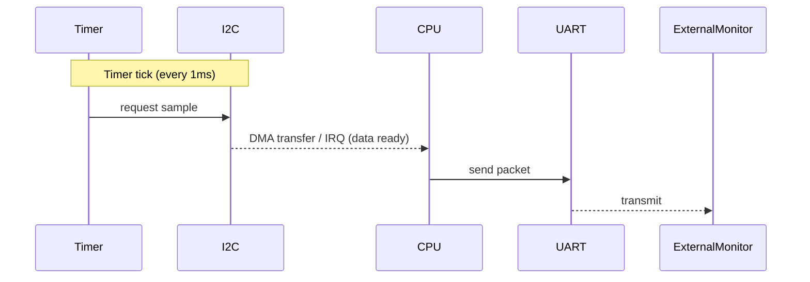
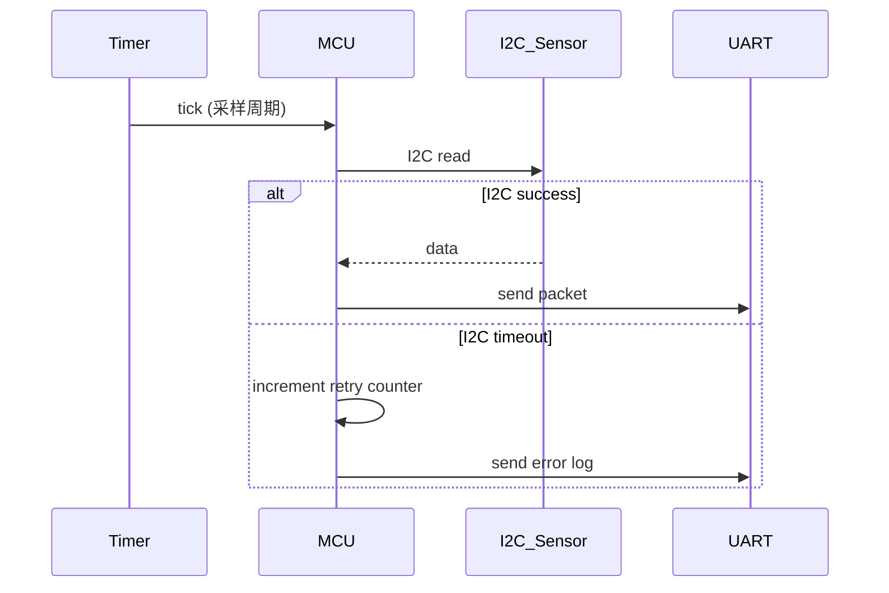

# 第五章 嵌入式基于 Renode 仿真器的高级仿真编程

本章核心内容：介绍 Renode 仿真器的体系结构与高级特性，深入讲解面向研究生层次的高保真嵌入式仿真方法、可重复性测试与自动化验证流程，并通过工程实例说明如何用 Renode 建立端到端仿真环境来开展固件验证、外设注入与系统级时序分析。章节以“导入—讲解—总结—测试”结构组织，强调图形化呈现与精炼理论推导，并提供可运行的脚本与核心代码，便于工程复现与拓展。

学习目标
- 掌握 Renode 的核心架构、组件模型与仿真工作流，能够在研究级实验中基于 Renode 构建可重复、可观察的仿真平台。
- 理解仿真中时序、外设模型、非确定性行为与断点/检查点技术，能够进行高保真外设注入、时序验证与性能测量。
- 熟悉 Renode 的 RESC 脚本与 Python 控制接口（Renode Python API），能够编写自动化测试用例、集成 CI/CD 验证流程，并将仿真用于固件回归测试与故障注入实验。
- 能够将 Renode 与调试器（GDB）、测试框架和网络代理（如 MQTT Broker）联动，完成复杂工程场景下的联合验证。

本章重点与难点
- 重点：外设建模与时序验证方法、RESC/ Python 自动化脚本、仿真与调试链的集成、可重复性与检查点机制。
- 难点：高保真时钟/中断时序建模、跨域（外设/CPU/总线）事件注入与同步验证、保证仿真可重现性的实践技巧。

章节结构
5.0 引言与目标（本节）  
5.1 Renode 概述与体系（架构图 + 表格对比）  
5.2 高级仿真概念与时序建模（时序图、时钟/中断、总线争用）  
5.3 Renode 脚本与 Python 自动化（RESC 语法要点、Python API 模式）  
5.4 仿真外设注入与故障注入策略（流程图 + 代码）  
5.5 工程实例：工业物联网网关仿真（背景、架构图、流程、核心代码、时序图）  
5.6 与调试与 CI 集成（GDB/CI 流程表）  
5.7 本章小结与拓展方向  
5.8 测试题（mkdocs-quiz 风格，含答案与解释）

——

## 5.1 Renode 概述与体系

5.1.1 Renode 的定位
- Renode 是面向嵌入式系统的系统级仿真与验证平台，适合跨主机架构（ARM Cortex-M、RISC-V、Intel 等）进行多外设、多片上系统（SoC）联合仿真，强调可观察性、可脚本化与自动化验证能力。  
- 研究与工程价值：在固件开发周期中替代或补充实物验证，以低成本、可重复、可注入故障的方式实现系统级测试、回归测试与研究性试验。

5.1.2 体系结构（图形优先）
- 建议插图：Renode 架构组件图（仿真内核、设备模型库、RESC 脚本解析器、Python 控制接口、GDB/串口/网络桥接、监测/日志模块）。

Mermaid 流程图（表示组件关系，课堂中请配合图像资源）
```mermaid
flowchart LR
  A[RESC / Python Controller] --> B[Renode Core]
  B --> C{Machine Model}
  C --> D[CPU Model]
  C --> E[Peripheral Models]
  C --> F[Bus / Interconnect]
  B --> G[Monitors / Analyzers]
  B --> H[Debug Bridges (GDB, OpenOCD)]
  B --> I[External Connectors (TCP/Serial/Socket)]
```

5.1.3 与其他仿真器对比（表格次之）
- 下表比较 Renode、QEMU 与基于硬件的仿真/仿真加速器的典型特性（供教学对比分析）：

| 特性 | Renode | QEMU | 硬件在环 / FPGA 仿真 |
|---:|:---:|:---:|:---:|
| 外设建模灵活性 | 高（可自定义模型、脚本注入） | 中（需修改源码或设备模型） | 取决于外设实现 |
| 脚本化/自动化能力 | 强（RESC + Python） | 弱/需扩展 | 中等（需自定义接口） |
| 多节点 / 多总线仿真 | 易（支持虚拟网络/总线） | 受限 | 需要硬件设计 |
| 调试桥接（GDB 等） | 支持 | 支持 | 支持/需适配 |
| 可重复性（检查点） | 支持 | 部分支持 | 依赖硬件能力 |
| 学术/教学便捷性 | 高 | 较高 | 低（成本高） |

5.1.4 小结
- Renode 的优势在于“外设可脚本化”、“高可观察性”与“便于自动化验证”，适用于研究生层次开展系统级固件验证、协议验证与故障注入研究。

——

## 5.2 高级仿真概念与时序建模

5.2.1 时钟与定时（图形优先）
- 关键点：仿真中需要明确主时钟、外设时钟与软件定时源（SysTick、定时器）；不同时钟域间的同步与漂移会影响中断到处理的延迟。  
- 推荐图形：多时钟域时序图，标注时钟频率、tick 到达、外设就绪信号与中断触发点。

Mermaid 时序图（定时器触发 I2C 采样 -> 中断 -> UART 发送）


5.2.2 中断处理与优先级（文字补充 + 时序图）
- 说明：需建模硬件中断延迟（从外设事件到中断线上升的延迟）、优先级抢占、ISR 执行时间与中断嵌套的影响。使用时序图展示“外设事件 -> NVIC -> ISR -> DSR/Deferred work”。

5.2.3 总线与外设争用
- 关键点：在多主设备或 DMA 存在的系统中，总线争用会引入额外的访问延时，影响系统实时性。应在仿真中配置带宽、突发传输与仲裁策略以逼近真实行为。

5.2.4 非确定性与可重复性
- 方法要点：使用固定随机种子、禁用/控制非确定性事件（如系统时间源）、使用检查点（snapshot）和回放机制保证回归测试可复现。

5.2.5 性能与量化指标
- 建议监测项：中断响应时间分布、任务切换延时、外设传输吞吐与错误率等，使用 Renode 的监测器（analyzers）和日志导出后做统计分析。

——

## 5.3 Renode 脚本与 Python 自动化

5.3.1 RESC（Renode Script）语言要点（图表+代码）
- RESC 是 Renode 的主脚本语言，用于定义机器、加载固件、连接外设、启用分析器与断点。RESC 脚本常用于场景初始化与一次性仿真配置。

示例 RESC（简化平台加载与串口连接）
```resc
# RESC 脚本：创建机器，加载平台描述与固件，导出 UART 到 TCP
using sysbus

mach create "stm32-sim"
machine LoadPlatformDescription @platforms/cpus/stm32f4.repl

# 加载固件（本地路径或相对路径）
sysbus LoadELF @./build/firmware.elf

# 启用串口分析器，将 uart1 输出映射到 TCP 方便外部监听
showAnalyzer sysbus.uart1
connector Connect sysbus.uart1 tcp:127.0.0.1:2000

# 启动仿真
start
```
注：平台描述文件路径（@platforms/...）取决于 Renode 安装与平台库；上述脚本展示典型工作流，真实使用时按本地平台文件调整路径。

5.3.2 Python 控制接口（自动化、断言、回归）
- Renode 提供 Python 接口（Renode as a service / Python API），用于在测试框架中驱动仿真、注入数据、收集 trace 并断言行为。下述示例示范用 Python 驱动仿真、注入 I2C 数据并断言 UART 输出。

示例 Python 自动化（伪代码，需按环境安装 renode-python bindings 或通过 subprocess 调用 renode-cli）
```python
"""
Python 测试示例（伪代码，适配具体 Renode Python API）
功能：启动仿真、注入 I2C 传感器读数、等待 UART 输出并断言包含预期数据
"""
from renode import Renode  # 视具体绑定而定
import time
import re

r = Renode()
r.execute_script("scripts/init_stm32.resc")  # 载入 RESC 场景
r.start()

# 注入 I2C 传感器数据（通过仿真注入接口）
sensor_payload = [0x01, 0x02, 0x03, 0x04]
r.inject_i2c("sysbus.i2c0", address=0x50, data=sensor_payload)

# 等待 UART 输出并收集
uart_output = r.read_uart("sysbus.uart1", timeout=2.0)
assert re.search(r"sensor: 0x01020304", uart_output), "UART 输出不包含传感器数据"

# 生成检查点（snapshot）
r.create_snapshot("post_sample")

r.stop()
```
说明：上例展示了测试断言与检查点使用的范式，实际 API 名称请参照所用 Renode 版本的 Python binding 文档。

5.3.3 调试桥与 GDB 集成  
- 说明：通过 Renode 可以暴露 GDB server 端口，允许在 IDE（如 VSCode）或命令行 GDB 上进行断点调试、寄存器查看与单步执行，便于定位复杂时序或外设交互问题。

示意 RESC 命令（打开 GDB）
```resc
# 启用 GDB server（默认 3333）
gdbServerStart 3333
```
在本地使用 `arm-none-eabi-gdb` 或 `riscv64-unknown-elf-gdb` 连接到该端口并调试固件。

——

## 5.4 仿真外设注入与故障注入策略

5.4.1 注入类型与目的（表格）
| 注入类型 | 目标 | 常见用途 |
|---:|:---:|:---:|
| 时序偏移注入 | 测试实时性 | 验证系统在延迟/抖动下的鲁棒性 |
| 位翻转/数据错误 | 验证容错 | 验证校验与重传策略 |
| 外设失效（丢失响应） | 验证异常处理 | 检验超时与降级逻辑 |
| 总线争用/带宽限制 | 验证性能极限 | 测量任务延迟增长 |

5.4.2 注入流程（图形优先）
- 推荐流程图：注入场景设计 -> 编写注入脚本 -> 执行仿真并收集指标 -> 自动断言（通过/失败）-> 生成报告并回退检查点。

Mermaid 流程图
```mermaid
flowchart TD
  A[设计注入场景] --> B[实现注入脚本 (RESC/Python)]
  B --> C[运行仿真并开始采样]
  C --> D[收集日志、trace、指标]
  D --> E[断言 & 评估]
  E --> F{通过?}
  F -- yes --> G[保存结果/检查点]
  F -- no --> H[回退/重试/记录失败]
```

5.4.3 实施示例：注入 I2C 超时
RESC + Python 混合使用示例伪代码：
- RESC：配置机器、映射 I2C
- Python：在关键时刻禁用 I2C 响应（模拟外设挂起），观察固件的超时处理逻辑并断言

——

## 5.5 工程实例：基于 Renode 的工业物联网（IIoT）采集网关仿真

5.5.1 实例背景（工程价值）
- 场景：工业现场有多路传感器（通过 I2C/ADC）、周期性采样并通过串口转发给上层网关，同时通过以太网或 MQTT 上报云端。固件需保证在外设异常（I2C 时序错误、突发总线延迟）下的鲁棒性，并在采样失败时正确记录错误并重试。  
- 工程价值：通过 Renode 完成端到端仿真，可以在无实物或在硬件不可达条件下验证固件策略、实现自动化回归测试，并进行故障注入实验来评估系统可靠性。

5.5.2 系统架构（图形优先）
Mermaid 架构图（简化）
```mermaid
graph LR
  A[模拟传感器群 (I2C)] -->|I2C| B[MCU (Cortex-M)]
  B -->|UART| C[Serial to TCP Bridge]
  C -->|MQTT| D[MQTT Broker (模拟)]
  B -->|SPI| E[外部 Flash / DMA]
  subgraph Renode Host
    B
    C
  end
  subgraph 外部测试脚本
    F[Python Test Harness]
  end
  F -->|控制/注入| A
  F -->|检查| C
```

5.5.3 核心设计思路
- MCU 固件模块划分：采样任务（定时器触发）、数据打包与发送模块、错误处理模块（超时/重试/告警）、持久化与回退（外部 flash）。  
- 仿真角度聚焦：准确建模 I2C 读取时序、注入 I2C 超时、验证 UART 输出格式与上报逻辑，以及在出现超时后固件的恢复/重试行为。

5.5.4 关键流程（流程图）


5.5.5 核心固件代码（C，示例聚焦中断/采样与 UART 发送）
- 代码风格遵循嵌入式 C 规范（注释、边界检查、错误处理）

```c
/* sample_core.c
 * 功能：定时器 ISR 触发采样，通过 I2C 读取传感器并经 UART 发出
 * 适配：基于 HAL 风格接口抽象（伪代码，便于移植）
 */

#include <stdint.h>
#include <stdbool.h>
#include "hal_timer.h"
#include "hal_i2c.h"
#include "hal_uart.h"
#include "hal_flash.h"

#define SENSOR_I2C_ADDR 0x50
#define SAMPLE_RETRY_MAX 3
#define SAMPLE_BUF_SIZE 8

static uint8_t sample_buffer[SAMPLE_BUF_SIZE];

void timer_isr(void) {
    /* 计时中断：触发采样任务的调度（可设置为 ISR 中直接执行短任务或置位信号量） */
    // 注意：ISR 应尽量短小，重试/IO 操作应在线程上下文或 DSR 中完成
    schedule_sample_task();
}

/* 采样任务（在线程上下文中执行） */
void sample_task(void) {
    int attempt = 0;
    bool success = false;
    while(attempt < SAMPLE_RETRY_MAX && !success) {
        if (hal_i2c_read(SENSOR_I2C_ADDR, sample_buffer, SAMPLE_BUF_SIZE) == HAL_OK) {
            success = true;
            /* 将数据打包并发送到上层（UART） */
            char out[64];
            int len = snprintf(out, sizeof(out), "sensor: 0x%02x%02x%02x%02x\n",
                               sample_buffer[0], sample_buffer[1],
                               sample_buffer[2], sample_buffer[3]);
            hal_uart_write((uint8_t*)out, len);
        } else {
            attempt++;
            if (attempt >= SAMPLE_RETRY_MAX) {
                /* 记录错误并发送告警 */
                const char *err = "sensor read error\n";
                hal_uart_write((uint8_t*)err, strlen(err));
                /* 可选：持久化错误日志 */
                hal_flash_log_error(ERR_SENSOR_TIMEOUT);
            }
            /* 间隔重试（非阻塞等待，使用任务延时接口） */
            task_delay_ms(10);
        }
    }
}
```

代码说明（要点）
- 在 ISR 中仅做最小工作（唤醒/通知任务），避免阻塞外设操作。
- 采样重试在任务上下文处理，支持非阻塞等待与持久化日志。
- UART 输出用于与外部测试脚本断言通信。

5.5.6 Renode 场景脚本（RESC，加载固件、注入 I2C 模拟器并连接 MQTT 代理的简化实现）
```resc
# init_iot_gateway.resc
using sysbus

# 创建并加载平台（基于 STM32F4 平台举例）
mach create "iio-gateway"
machine LoadPlatformDescription @platforms/cpus/stm32f4.repl

# 加载编译好的固件 ELF
sysbus LoadELF @./build/iio_gateway.elf

# 将 uart1 映射为 TCP，供外部测试脚本监听
showAnalyzer sysbus.uart1
connector Connect sysbus.uart1 tcp:127.0.0.1:4001

# 添加虚拟 I2C 传感器设备并配置初始响应
i2c_sensor Create sysbus.i2c0 0x50 4  # 假设语法：Create <i2c> <addr> <bytes>
i2c_sensor SetResponse sysbus.i2c0 0x50 01 02 03 04

# 可选：开启 GDB 用于固件调试
gdbServerStart 3333

# 启动仿真
start
```
说明：i2c_sensor 的具体创建与设置命令依赖于 Renode 外设模型扩展，上述为示意性命令；真实使用请参照本地 Renode 外设模型 API。

5.5.7 Python 测试驱动（注入 I2C 超时并校验固件响应）
```python
# test_iio_gateway.py (伪代码)
from renode import Renode
import time

r = Renode()
r.execute_script("init_iot_gateway.resc")
r.start()

# 验证正常数据流
out = r.read_uart("sysbus.uart1", timeout=1.0)
assert "sensor: 0x01020304" in out

# 注入超时（禁用 I2C 响应）
r.set_i2c_response("sysbus.i2c0", 0x50, response=None)  # 若 API 支持，表示不响应

# 触发下一次采样（可以通过 advance 或者等待定时器）
r.advance_time_ms(10)

# 检查告警输出（重试耗尽后的错误日志）
out = r.read_uart("sysbus.uart1", timeout=2.0)
assert "sensor read error" in out

r.create_snapshot("after_i2c_timeout")
r.stop()
```

5.5.8 时序验证（时序图）
- 在注入超时时，对比“期望时序（重试次数、重试间隔）”与“实际仿真时序”，利用 Renode 的 trace 与 analyzer 导出时间戳做统计。

——

## 5.6 与调试与 CI 集成

5.6.1 GDB / IDE 联动
- 实践要点：在 RESC 中启用 gdbServerStart，并在 IDE 中配置远程 GDB 连接；使用符号化 ELF 以支持源代码级调试与断点回放。

5.6.2 CI / 回归测试流程（表格与流程）
流程示例：代码提交 -> 构建固件 -> 启动 Renode 场景并运行 Python 测试套件 -> 生成测试报告 -> 触发告警或合并。

表：CI 集成要点

| 步骤 | 关键配置 | 输出 |
|---|---:|:---|
| 构建固件 | 可复现的交叉编译脚本 | 固件 ELF / HEX |
| 启动仿真场景 | RESC 脚本（受版本控制） | 可复现的仿真环境 |
| 自动化测试 | Python 测试用例 + 断言 | PASS/FAIL, trace |
| 报告 | 导出日志与波形（UART, traces） | HTML/JSON 报告 |

5.6.3 报告与可追溯性
- 要保证仿真可复现，需在 CI 中记录：Renode 版本、平台描述、固件 ELF 的 commit hash 与测试脚本版本，以及用于注入的随机种子。

——

## 5.7 本章小结与拓展方向

小结（要点整理）
- Renode 提供强大的系统级仿真能力，适用于研究生层次开展高保真固件验证、时序分析与故障注入研究。  
- 有效使用 RESC 脚本与 Python API，可实现自动化测试流水线与 CI 集成。  
- 仿真中的时钟域、总线争用与中断建模是实现逼真验证的关键；通过检查点与回放机制可保证测试可重复性。

拓展建议
- 深入学习 Renode 自定义设备模型开发（C# / .NET 环境），用于实现研究级外设行为模型；  
- 将 Renode 与形式化工具（如模型检测器）结合，开展协议验证或状态空间探索；  
- 在仿真中集成功耗模型与热模型，开展系统级能耗与热稳定性研究。

——

## 5.8 章节测试题（mkdocs-quiz 风格：题目、答案与解析）

注意：以下题目均包含答案与解析，便于导入 mkdocs-quiz 插件后直接用于在线测验。使用 ::: quiz 包裹题目块（兼容 MkDocs 插件）。每题后给出“【答案】”与“【解析】”段落，方便教师与同学核对。

::: quiz
Q1（单选）: Renode 在系统级仿真中相比 QEMU 的显著优势是下列哪项？  
- [ ] A. 更快的 CPU 仿真性能（指每秒指令数）  
- [x] B. 更灵活的外设模型与脚本化注入能力  
- [ ] C. 更低的内存占用  
- [ ] D. 原生支持所有操作系统内核的仿真

【答案】B

【解析】Renode 的核心优势之一是其可脚本化的外设模型和强大的注入/分析能力，便于进行故障注入与系统级测试；QEMU 更侧重于 CPU 仿真性能和通用系统仿真。
:::

::: quiz
Q2（多选）: 在使用 Renode 进行高保真实时性验证时，应关注哪些关键建模要素？（可多选）  
- [x] A. 时钟域与定时器 tick 精度  
- [x] B. 外设到中断线的硬件延迟与 ISR 执行时间  
- [ ] C. 文件系统的挂载选项（与实时性无直接关系）  
- [x] D. 总线带宽与 DMA 争用

【答案】A, B, D

【解析】实时性验证依赖于精确的时钟域、外设到中断的延迟和系统总线争用等因素；文件系统挂载选项通常不直接影响嵌入式系统的硬实时性质（除非涉及 I/O 调度）。
:::

::: quiz
Q3（简答）: 说明如何在 Renode 中保证一次故障注入实验的可重复性？列出至少三项措施并简要说明。  

【答案（示例）】  
1) 固定随机种子，确保随机性可重现；2) 使用检查点(snapshot)在注入前保存系统状态，失败后回退重试；3) 在测试记录中保存 Renode 版本、平台描述文件与固件 ELF 的版本信息。

【解析】通过固定随机种子可以保证生成的随机事件序列一致；检查点允许在相同初态下重复注入；记录工具与固件版本可确保环境一致，从而达到可重复性要求。
:::

::: quiz
Q4（综合应用）: 基于本章工程实例，假设在一次 I2C 超时注入测试中，固件未按预期在重试耗尽后发送错误日志，请分析可能的三类原因并提出排查步骤（要求结合 Renode 仿真能力给出具体验证方法）。  

【答案（示例）】  
可能原因（及排查方法）：  
1) 固件逻辑缺陷：在仿真中启用 GDB（gdbServerStart）并在采样任务处设置断点，观察重试计数与错误处理分支是否被触达；  
2) 仿真外设注入未成功：使用 Renode 的 analyzer/trace 查看 I2C 请求与响应（或 lack of response），并使用脚本强制注入无响应以复现；  
3) UART 映射/输出未连接：检查 RESC 中的 connector 配置（showAnalyzer sysbus.uart1）并在 host 上 telnet 或 tcp 监听端口查看原始输出，确认是否存在日志但未被捕获。

【解析】该题考查对仿真与调试工具的综合运用能力：通过 GDB 定位逻辑路径、通过 analyzer 确认外设注入行为、通过连接器确认通信链路，逐步排查问题根源。
:::

——

章节练习题答案与解析均已给出，便于教师批阅或学生自测。建议在课堂实践环节让学生基于提供的 RESC 与 Python 脚本完成实验，并要求提交测试报告（包含仿真日志、检查点、失败重现步骤与改进建议）。

---

参考延伸（便于后续扩展）
- 建议后续章节或附录加入：Renode 自定义外设模型开发实战（包含示例 C# 模型代码）、如何用 Renode 复现复杂总线拓扑（多主、多DMA）、在 Renode 中集成能耗模型与热模型的研究范例。

本章生成遵循“图形优先、表格次之、文字补充”原则；代码示例聚焦核心功能模块（定时采样 / I2C 读取 / UART 发送 / 注入与断言），并保留扩展点以便在后续课堂上结合真实平台进行实操验证。若需要，本章可进一步拆分为讲授用 PPT 幻灯片、实验指导书与 CI 示例仓库（含可执行 RESC/Python Test Runner），可继续扩展。
