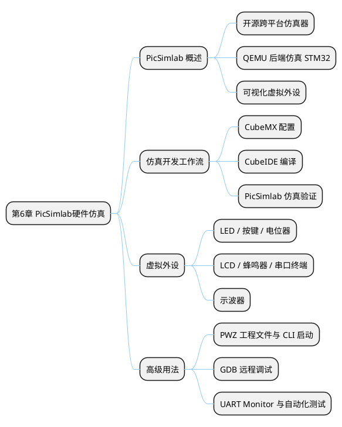

## 6 第 6 章 PicSimlab 硬件仿真

> 硬件仿真是嵌入式开发的利器，允许在没有实物硬件的情况下进行软件开发、调试与测试。本章介绍面向教学的 PicSimlab 仿真环境，使学员在无实物 Blue Pill 开发板的条件下也能完成大部分实验。

### 6.1 本章知识导图



**图 6-1** 本章知识导图：PicSimlab 仿真环境的核心概念、开发流程与高级用法。
<!-- fig:ch6-1 本章知识导图：PicSimlab 仿真环境的核心概念、开发流程与高级用法。 -->

### 6.2 为什么需要仿真器

嵌入式开发的学习门槛在于：**代码不能在普通计算机上直接运行**，必须依赖真实的硬件开发板。然而硬件存在以下限制：

**表 6-1** 真实硬件的局限性
<!-- tab:ch6-1 真实硬件的局限性 -->

| 问题 | 说明 |
|------|------|
| 成本问题 | 开发板、传感器、杜邦线等器件需要一定费用 |
| 调试困难 | 硬件故障与代码 bug 难以区分，排查耗时 |
| 携带不便 | 学员在工作场所或远程学习时不方便搭建硬件环境 |
| 烧录风险 | 操作不当可能损坏芯片或外设 |

**仿真器**（Simulator）能够在软件层面模拟真实硬件的行为，允许开发者在没有实物硬件的条件下：

- 编写并运行嵌入式程序
- 观察 GPIO 电平、PWM 波形、ADC 采样值
- 调试串口通信
- 验证控制逻辑的正确性

> 仿真器不能完全替代真实硬件，但在**学习阶段**和**初期验证阶段**，仿真器是效率最高的工具。对于研究生的远程教学场景尤为重要。

### 6.3 PicSimlab 概述

**PicSimlab**（PIC Simulator Lab）是一款开源、跨平台的微控制器仿真软件。尽管名称中包含"PIC"，但它同样支持 **STM32 系列微控制器**的仿真，通过 QEMU 后端仿真 STM32F103C8T6（Blue Pill）。

**表 6-2** PicSimlab 核心特性
<!-- tab:ch6-2 PicSimlab 核心特性 -->

| 特性 | 说明 |
|------|------|
| 开源免费 | GitHub 开源，完全免费使用 |
| 跨平台 | 支持 Windows、Linux、macOS |
| 支持 STM32 | 通过 QEMU 后端仿真 STM32F103C8T6（Blue Pill） |
| 可视化外设 | 提供 LED、按键、电位器、LCD、示波器等虚拟外设 |
| 直接加载固件 | 无需修改代码，直接加载 CubeIDE 编译产物 `.bin` |
| 串口终端 | 内置虚拟串口，可与 USART 实时交互 |
| 示波器 | 可观察 GPIO 电平变化和 PWM 波形 |

**官方资源：**

- GitHub: https://github.com/lcgamboa/picsimlab
- 文档: https://lcgamboa.github.io/picsimlab_docs/

#### 6.3.1 安装与界面

**下载安装（以 Windows 为例）：**

1. 访问 GitHub Releases 页面，下载最新版 `picsimlab_win_XX.zip`
2. 解压后双击 `picsimlab.exe` 即可运行（无需安装）
3. 首次运行会在 `%USERPROFILE%/.picsimlab/` 创建配置目录

**主界面布局：**

```bob
┌─────────────────────────────────────────────────────────────────┐
│  File  Edit  Board  View  Tools  About              [菜单栏]    │
├──────────────────┬──────────────────────────────────────────────┤
│                  │                                              │
│   [板卡视图]     │           [外设区域 / Parts]                 │
│                  │                                              │
│  ┌────────────┐  │   ┌──────┐  ┌──────┐  ┌──────────┐         │
│  │  STM32     │  │   │ LED  │  │ BTN  │  │   POT    │         │
│  │  Blue Pill │  │   │      │  │      │  │          │         │
│  │  (QEMU)    │  │   └──────┘  └──────┘  └──────────┘         │
│  └────────────┘  │                                              │
│                  │   ┌──────────────┐  ┌──────────────┐        │
│  [▶ 运行/暂停] │   │ UART Terminal│  │ Oscilloscope │        │
│  [⬛ 停止]     │   │              │  │              │        │
│                  │   └──────────────┘  └──────────────┘        │
├──────────────────┴──────────────────────────────────────────────┤
│  Status: Running  |  Clock: 72MHz  |  GDB: port 1234  [状态栏]│
└─────────────────────────────────────────────────────────────────┘
```

**图 6-2** PicSimlab 主界面布局：左侧板卡视图，右侧虚拟外设区域，底部状态栏。
<!-- fig:ch6-2 PicSimlab 主界面布局：左侧板卡视图，右侧虚拟外设区域，底部状态栏。 -->

---

### 6.4 仿真开发工作流

PicSimlab 与 CubeMX/CubeIDE 的联合开发工作流分为三个阶段：

```bob
  ┌──────────────┐     ┌──────────────────┐     ┌────────────────┐
  │   CubeMX     │────▶│    CubeIDE       │────▶│   PicSimlab    │
  │              │     │                  │     │                │
  │ . 芯片选型   │     │ . 编写业务逻辑   │     │ . 加载 .bin    │
  │ . 引脚配置   │     │ . 编译工程       │     │ . 连接虚拟外设 │
  │ . 外设初始化 │     │ . 生成 .bin      │     │ . 运行仿真     │
  │ . 生成代码   │     │                  │     │ . 观察结果     │
  └──────────────┘     └──────────────────┘     └────────────────┘
        ①                      ②                        ③
    配置与生成               编码与编译                仿真验证
```

**图 6-3** CubeMX → CubeIDE → PicSimlab 三阶段仿真开发流程。
<!-- fig:ch6-3 CubeMX → CubeIDE → PicSimlab 三阶段仿真开发流程。 -->

**步骤 ① — CubeMX 配置**

1. 选择芯片 `STM32F103C8Tx`
2. 配置 RCC：HSE → Crystal/Ceramic Resonator
3. 配置 SYS：Debug → Serial Wire
4. 按项目需求配置外设（GPIO / TIM / ADC / USART）
5. 时钟树设置 HCLK = 72 MHz
6. 生成代码（Toolchain: STM32CubeIDE）

**步骤 ② — CubeIDE 编译**

1. 打开生成的工程
2. 在 `USER CODE BEGIN` 区域编写应用代码
3. 选择 **Debug** 配置
4. 点击 **Build Project**（Ctrl+B）
5. 编译产物位于 `Debug/` 目录下，找到 `.bin` 文件

**步骤 ③ — PicSimlab 仿真**

1. 选择对应板卡（stm32_blue_pill）
2. 点击 **File → Load Hex/Bin**，选择编译出的 `.bin` 文件
3. 在外设区域添加所需虚拟组件（LED / 按键 / 电位器等）
4. 右键组件 → **Properties**，将组件引脚映射到 MCU 对应引脚
5. 点击 ▶ 运行仿真

#### 6.4.1 常用虚拟外设对照表

**表 6-3** PicSimlab 常用虚拟外设
<!-- tab:ch6-3 PicSimlab 常用虚拟外设 -->

| 组件名称 | 类型 | 典型用途 | 连接方式 |
|---------|------|---------|---------|
| LED | 输出显示 | 指示灯、流水灯 | 阳极接 GPIO，阴极接 GND |
| Push Button | 数字输入 | 按键触发 | 一端接 GPIO，一端接 GND（配合上拉） |
| Potentiometer | 模拟输入 | 模拟电压（ADC 测试）| 中间抽头接 ADC 引脚，两端接 VCC/GND |
| LCD 16×2 | 输出显示 | 文字信息显示 | 并口或 I2C 连接 |
| Buzzer | 输出 | 蜂鸣器（PWM 驱动）| 正极接 PWM 引脚，负极接 GND |
| UART Terminal | 串口终端 | 串口收发调试 | TX/RX 连接 USART 引脚 |
| Oscilloscope | 观测工具 | 电平与波形观察 | 探针连接目标引脚 |

#### 6.4.2 常见问题与调试技巧

**表 6-4** PicSimlab 常见问题排查
<!-- tab:ch6-4 PicSimlab 常见问题排查 -->

| 问题 | 原因 | 解决方法 |
|------|------|---------|
| 程序不运行 | .bin 文件路径错误或格式不对 | 确认选择的是 Debug/.bin 文件 |
| LED 不亮 | 引脚映射错误 | 检查组件属性中的引脚编号是否与代码一致 |
| 串口无输出 | 波特率不匹配 | PicSimlab UART 终端波特率需与代码一致 |
| 仿真速度慢 | QEMU 仿真开销 | 调低系统时钟或关闭不必要的示波器通道 |
| ADC 值始终为 0 | 电位器未正确连接 | 检查 ADC 输入引脚编号，确认电位器两端有电源 |

---

### 6.5 PWZ 工程文件与命令行启动

PicSimlab 支持通过命令行直接启动仿真，显著加快开发-调试循环。

**PWZ 文件**（PicSimlab Workspace ZIP）是 PicSimlab 的项目打包格式，包含板卡配置、外设布局、固件和仿真参数。

**命令行启动语法：**

```bash
# 直接加载 PWZ 工程文件启动仿真
picsimlab --file=my_project.pwz

# 指定板卡 + 固件（不使用 PWZ）
picsimlab --board=stm32_blue_pill --firmware=Debug/project.bin

# 无头模式（用于 CI 自动化测试）
picsimlab --file=my_project.pwz --nogui
```

**创建 PWZ 文件的步骤：**

1. 在 GUI 中完成板卡选择、外设布局和固件加载
2. 确认仿真运行正常
3. 点击 **File → Save Workspace** 保存为 `.pwz` 文件
4. 此后每次开发只需双击 `.pwz` 即可恢复完整仿真环境

> CLI + PWZ 模式将每次调试的仿真启动时间从数分钟缩短到秒级。在团队协作中，PWZ 文件可纳入 Git 版本控制，确保所有开发者使用相同的仿真环境。

---

### 6.6 GDB 远程调试与 CubeIDE 集成

PicSimlab 内置 GDB Server 功能，可通过 TCP 连接到 CubeIDE 或 VSCode，实现**源代码级单步调试**。

```bob
  ┌──────────────────┐     TCP:1234     ┌──────────────────┐
  │   "CubeIDE"      │<───────────────>│   "PicSimlab"    │
  │                  │                  │                  │
  │ . 源码编辑       │  GDB RSP 协议    │ . QEMU 仿真引擎 │
  │ . 断点设置       │<───────────────>│ . GDB Server     │
  │ . 变量监视       │                  │ . 虚拟外设       │
  └──────────────────┘                  └──────────────────┘
```

**图 6-4** CubeIDE 通过 TCP 连接 PicSimlab GDB Server 实现源码级仿真调试。
<!-- fig:ch6-4 CubeIDE 通过 TCP 连接 PicSimlab GDB Server 实现源码级仿真调试。 -->

**配置步骤：**

**① PicSimlab 端 — 启用 GDB Server**

1. 加载工程后点击 **Debug → Enable Remote Control**
2. GDB Server 默认监听端口 **1234**
3. 状态栏显示 `GDB: listening on port 1234`

**② CubeIDE 端 — 配置远程 GDB 调试**

**表 6-5** CubeIDE GDB 调试配置参数
<!-- tab:ch6-5 CubeIDE GDB 调试配置参数 -->

| 配置项 | 值 | 说明 |
|--------|-----|------|
| C/C++ Application | `Debug/project.elf` | 含调试符号的 ELF 文件 |
| GDB Command | `arm-none-eabi-gdb` | ARM GDB 路径 |
| Remote Target | `localhost:1234` | PicSimlab GDB Server 地址 |
| Load image | 取消勾选 | 固件已由 PicSimlab 加载 |

连接成功后可执行：设置断点、单步执行（F5/F6/F7）、变量监视、寄存器查看、内存查看等操作。也可在终端中直接使用 GDB 命令行：

```bash
arm-none-eabi-gdb Debug/project.elf
(gdb) target remote localhost:1234
(gdb) break main
(gdb) continue
(gdb) print counter_value
(gdb) info registers
```

> 无需任何调试硬件（ST-Link/J-Link），即可在仿真环境中进行完整的源码级调试，特别适合学员的远程学习场景。

---

### 6.7 UART Monitor 与自动化测试

PicSimlab 的 UART Terminal 组件可将仿真串口输出通过 TCP 转发，结合 Python 脚本实现**自动化固件测试**。

```bob
  ┌──────────────┐   UART TX   ┌──────────────┐  TCP:5000  ┌──────────┐
  │  "STM32 固件" │───────────>│  "PicSimlab"  │──────────>│ "Python"  │
  │  printf()    │             │  UART→TCP    │            │ 自动测试 │
  │  HAL_UART.. │             │  Bridge      │            │ 断言验证 │
  └──────────────┘             └──────────────┘            └──────────┘
```

**图 6-5** UART 通过 TCP 桥接实现仿真串口的自动化测试。
<!-- fig:ch6-5 UART 通过 TCP 桥接实现仿真串口的自动化测试。 -->

**配置步骤：**

1. 在 PicSimlab 中添加 UART Terminal 组件，连接到 USART1 的 TX/RX 引脚
2. 右键 UART Terminal → Properties → 启用 TCP Server 模式，设置端口 5000
3. 使用 Python 脚本连接并验证输出：

```python
import socket

def test_uart_output():
    """自动化测试：验证固件串口输出"""
    sock = socket.socket(socket.AF_INET, socket.SOCK_STREAM)
    sock.connect(('localhost', 5000))
    sock.settimeout(5.0)

    collected = b''
    try:
        while True:
            data = sock.recv(1024)
            if not data:
                break
            collected += data
            output = collected.decode('utf-8', errors='ignore')
            if 'System Init OK' in output:
                print('[PASS] 系统初始化成功')
    except socket.timeout:
        pass
    finally:
        sock.close()

    output = collected.decode('utf-8', errors='ignore')
    assert 'System Init OK' in output, '未检测到初始化消息'
    print('[ALL PASSED] 测试通过')

if __name__ == '__main__':
    test_uart_output()
```

**CI 自动化流程：**

**表 6-6** CI 自动化测试流程
<!-- tab:ch6-6 CI 自动化测试流程 -->

| 步骤 | 命令/操作 | 说明 |
|------|----------|------|
| ① 编译固件 | `make -C project/ all` | 生成 .bin 文件 |
| ② 启动仿真 | `picsimlab --file=test.pwz --nogui &` | 无头模式后台运行 |
| ③ 等待就绪 | `sleep 3` | 等待 QEMU 启动完成 |
| ④ 运行测试 | `python3 test_uart.py` | TCP 连接并验证输出 |
| ⑤ 清理进程 | `kill %1` | 终止 PicSimlab |

---

### 6.8 本章小结

本章介绍了 PicSimlab 硬件仿真环境的核心功能与使用方法。通过 CubeMX → CubeIDE → PicSimlab 的三阶段工作流，学员可以在没有实物 Blue Pill 开发板的条件下完成 GPIO、定时器、ADC、UART 等外设的仿真验证。GDB 远程调试和 UART TCP 桥接功能进一步支持了源码级调试和自动化测试，是学员远程学习的核心工具。

---

### 6.9 习题

1. 说明 PicSimlab 仿真器的工作原理及其使用 QEMU 作为后端的意义。
2. 描述 CubeMX → CubeIDE → PicSimlab 的完整开发流程。
3. 什么是 PWZ 工程文件？它如何加快开发-调试循环？
4. 配置 PicSimlab GDB Server 与 CubeIDE 连接的关键参数有哪些？
5. 设计一个基于 UART TCP 桥接的自动化测试方案，验证温度采集固件的串口输出是否正确。
