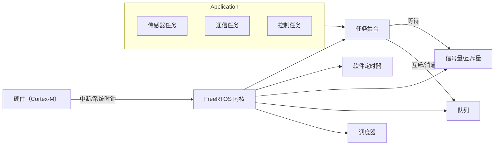
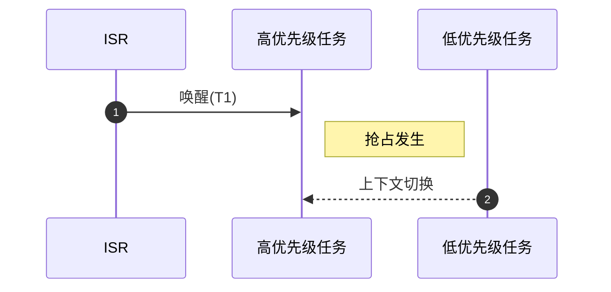
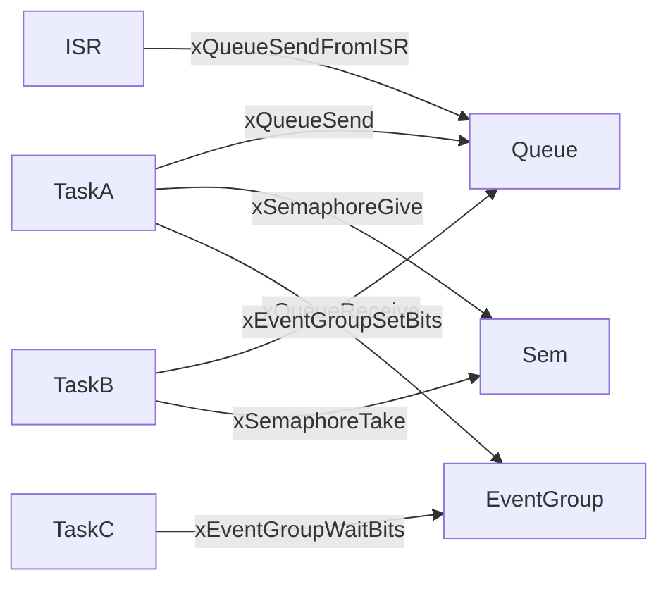
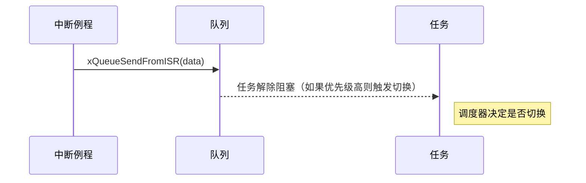
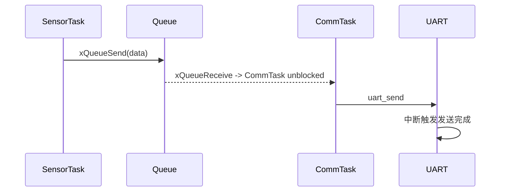

# 第6章 嵌入式实时操作系统 — FreeRTOS

本章核心内容：嵌入式实时操作系统（RTOS）概念、FreeRTOS 内核架构与组件、任务调度原理、进程间通信与同步、内存管理策略、中断与 ISR 安全 API、移植与配置、调试与性能分析，以及基于 FreeRTOS 的工程实例。目标读者为研究生，要求具备嵌入式系统基础（C 语言、MCU 架构）并能够在此基础上掌握 RTOS 的设计思想与工程实现能力。

学习目标：

- 理解实时操作系统的基本概念与调度策略，掌握 FreeRTOS 的内核结构与关键对象（任务、队列、信号量、互斥量、事件组、软件定时器、内存管理）。
- 能够在 FreeRTOS 上设计并实现合理的任务划分、优先级策略与资源同步机制，处理优先级反转与中断交互场景。
- 掌握 FreeRTOS 的移植与配置要点，能基于典型 Cortex-M 平台完成一个小型工程（含任务/ISR/通信/调度验证），并理解性能调优与调试工具的使用。

本章重难点：

- 优先级设计与任务调度（优先级反转与互斥解决方案）。
- 中断上下文与 RTOS API 的安全使用（FromISR 系列）。
- 内存管理模式对实时性的影响与选择（heap_x 系列）。
- 工程实例中的时序分析与系统级调试方法。

---

## 6.1 实时操作系统与 FreeRTOS 概述

- 实时操作系统（RTOS）在嵌入式系统中的定位：保证任务在确定的时间约束内完成；区别于通用操作系统的调度目标与资源管理策略。
- FreeRTOS 是一个轻量级、可移植、开源（MIT 许可）的嵌入式 RTOS，广泛用于工业控制、物联网终端、消费电子及车载子系统等场景。

### 6.1.1 FreeRTOS 的设计目标与应用场景

- 设计目标：最小化内核开销、可裁剪性、高可移植性、确定性（低抖动）。
- 适用场景示例：边缘传感器网关（低功耗实时采样）、运动控制闭环（严格周期性控制）、车载 ECUs（任务隔离与故障控制）等。

---

## 6.2 FreeRTOS 内核架构与主要对象

图形优先：下图为简化的 FreeRTOS 内核组件交互图。



### 6.2.1 关键对象与作用（图形 + 文字）

- 任务（Task / Thread）：执行上下文单元，包含栈、寄存器保存区、控制块（TCB）。
- 调度器（Scheduler）：基于优先级的抢占式或协作式调度；Tick 中断触发心跳（除 Tickless 模式）。
- 队列（Queue）：用于任务间或 ISR 与任务间传递消息，线程安全。优先使用队列来替代共享内存与锁，便于时序分析。
- 信号量/互斥量（Semaphore/Mutex）：用于事件通知与互斥访问；互斥量支持优先级继承以缓解优先级反转。
- 事件组（EventGroup）：用于多事件位组合等待/通知场景。
- 软件定时器（Software Timer）：以任务上下文回调的形式执行定时回调，适合延后处理与周期性任务触发。
- 内存管理（heap_1..heap_5）：多种内存分配策略以平衡时间确定性与内存利用率。

---

## 6.3 任务与调度策略

### 6.3.1 调度模型

- 抢占式优先级调度（Preemptive Priority Scheduling）：常用配置，具有快速响应高优先级任务的能力。
- 协作式调度（Cooperative / Non-preemptive）：通过任务显式放弃 CPU 实现切换，适合简单软实时场景。
- 时间片（Round-Robin）在同一优先级的任务之间可配置时间片轮转。
- Tickless Idle：降低空闲功耗，通过禁止系统 Tick 来进入低功耗模式（适用于能接受更大唤醒延迟的场景）。

图示：任务调度时序图（抢占示意）



### 6.3.2 优先级设计与优先级反转

- 优先级设计原则：按响应时延/功能关键性划分优先级；避免所有临界段阻塞高优先级任务。
- 优先级反转问题：低优先级任务持有互斥资源阻塞高优先级任务，若中优先级任务抢占，导致高优先级长期等待。
- 解决：使用互斥量（Mutex）与优先级继承（Priority Inheritance）机制；必要时调整任务划分或使用临界区最小化策略。

表格对比：调度模式对比

| 模式 | 优点 | 缺点 | 适用场景 |
|---|---:|---|---|
| 抢占式优先级 | 响应快、确定性高 | 复杂度高、需防止优先级反转 | 严格实时控制 |
| 协作式 | 实现简单、可预测 | 需任务配合、易阻塞 | 小型嵌入式设备 |
| Tickless | 降低功耗 | 唤醒延迟不确定 | 低功耗终端 |

---

## 6.4 任务间通信与同步

图形优先：通信/同步对象及其关系示意图



### 6.4.1 队列（Queue）

- 用法：用于字节、结构体或指针的安全传递；FIFO 顺序保证。
- 性能注意：队列拷贝开销（配置项可使用指针传递减少拷贝），深度与元素大小影响内存消耗。

### 6.4.2 信号量与互斥量

- 二值信号量（Binary Semaphore）：事件通知语义。
- 互斥量（Mutex）：带优先级继承，用于保护短临界段。
- 表：通信/同步原语对比

| 原语 | 线程安全 | 支持优先级继承 | 适合场景 |
|---|---:|---:|---|
| Queue | 是 | 否 | 数据传递 |
| Binary Semaphore | 是 | 否 | 事件通知 |
| Mutex | 是 | 是 | 互斥保护（带优先级继承） |
| EventGroup | 是 | 否 | 多位事件组合 |

---

## 6.5 内存管理机制

- FreeRTOS 提供多种 heap 实现（heap_1 到 heap_5），分别适配不同的需求：
  - heap_1：简单的静态分配，无释放（适合静态系统）。
  - heap_2：简单堆分配，支持释放，但非线程安全。 (注：早期版本)
  - heap_3：封装 libc malloc/free（依赖平台实现）。
  - heap_4：内存合并算法，支持碎片整理与释放，常用。
  - heap_5：支持多个内存区域，适合非连续内存区域的系统。

- 实时性考虑：动态内存分配可能带来不可预测的抖动，建议对关键路径使用静态/预分配策略或选择确定性较好的 heap 实现。

---

## 6.6 中断与 ISR 安全 API

- 在中断上下文调用 RTOS API 时，必须使用 FromISR 后缀的接口（如 xQueueSendFromISR、xSemaphoreGiveFromISR）以保证中断安全性；并在需要时使用 portYIELD_FROM_ISR 或宏触发上下文切换。

时序图：ISR 到任务的唤醒路径



关键注意事项：

- 在 ISR 中避免长时运行或阻塞调用；尽量将复杂处理交由任务完成。
- ISR 中使用的 API 必须是线程安全且为 FromISR 版本。
- 如果 ISR 解除阻塞了更高优先级任务，必须在 ISR 末尾请求切换（portYIELD_FROM_ISR 或相关宏）。

---

## 6.7 移植层与配置要点（FreeRTOSConfig.h）

- 关键宏说明（示例）：
  - configUSE_PREEMPTION：是否启用抢占。
  - configUSE_TIME_SLICING：同优先级时间片开关。
  - configCPU_CLOCK_HZ、configTICK_RATE_HZ：时钟与 Tick 配置。
  - configMINIMAL_STACK_SIZE：默认最小任务栈。
  - configTOTAL_HEAP_SIZE：若使用内部 heap 实现则定义堆大小。
  - configUSE_MUTEXES、configUSE_COUNTING_SEMAPHORES、configUSE_TIMERS 等用于启用内核特性。

- 移植层（port.c/portmacro.h）需实现从硬件角度的上下文切换、临界区管理与 Tick 中断处理，移植时需关注编译器寄存器约定与中断入口/退出序列。

---

## 6.8 调试、追踪与性能分析

- 软件追踪：FreeRTOS 提供 trace宏（configUSE_TRACE_FACILITY）与 run-time stats（configGENERATE_RUN_TIME_STATS）用于任务运行时间统计。
- 第三方工具：FreeRTOS+Trace、Segger SystemView 等可以进行高精度的时序采样和可视化分析。
- 常用调试策略：启用堆栈溢出检查（configCHECK_FOR_STACK_OVERFLOW）、任务断言与内存使用监控。

---

## 6.9 工程实例：基于 FreeRTOS 的低功耗传感器网关（Cortex-M）

### 实例背景

场景：物联网边缘节点采集多路传感器数据，做本地预处理并通过串口/无线模块上报到网关。要求：周期性采样、实时事件（外部中断）响应、最低化睡眠功耗。

工程价值：展示任务划分、互斥/队列通信、ISR 与任务交互、软件定时器与低功耗（Tickless）策略的综合应用。

### 系统架构（简化）

```mermaid
flowchart LR
  SensorTask[传感器采集任务]
  ProcessTask[数据处理任务]
  CommTask[通信任务]
  UART_ISR[串口中断]
  Main[主控(Core)]
  SensorTask -->|queue| DataQ(Ordered)
  ProcessTask -->|mutex| Resource
  ProcessTask -->|queue| TxQ
  CommTask -->|send| UART
  UART_ISR -->|xQueueSendFromISR| RxQ
```

### 核心流程与关键代码片段（精简、可运行风格）

说明：以下代码为核心片段，省略硬件初始化细节，仅示范任务、队列、ISR 与通信。

```c
/* FreeRTOS 头文件 */
#include "FreeRTOS.h"
#include "task.h"
#include "queue.h"
#include "semphr.h"

/* 任务句柄与队列 */
static TaskHandle_t xSensorTaskHandle = NULL;
static TaskHandle_t xCommTaskHandle = NULL;
static QueueHandle_t xDataQueue = NULL;
static SemaphoreHandle_t xResourceMutex = NULL;

/* 传感器数据结构 */
typedef struct {
    uint32_t seq;
    int16_t  value;
    TickType_t timestamp;
} SensorMsg_t;

/* 传感器采集任务：周期性采样并发送到队列 */
void vSensorTask(void *pvParameters) {
    SensorMsg_t msg;
    TickType_t xLastWakeTime = xTaskGetTickCount();
    const TickType_t xPeriod = pdMS_TO_TICKS(100); // 100 ms

    for (;;) {
        // 模拟采样
        msg.seq = xTaskGetTickCount();
        msg.value = read_sensor_raw();
        msg.timestamp = xTaskGetTickCount();

        // 非阻塞发送或有限等待
        xQueueSend(xDataQueue, &msg, pdMS_TO_TICKS(10));
        vTaskDelayUntil(&xLastWakeTime, xPeriod);
    }
}

/* 数据处理/发送任务 */
void vCommTask(void *pvParameters) {
    SensorMsg_t recv;
    for (;;) {
        if (xQueueReceive(xDataQueue, &recv, portMAX_DELAY) == pdPASS) {
            // 使用互斥资源保护共享外设
            if (xSemaphoreTake(xResourceMutex, pdMS_TO_TICKS(50)) == pdPASS) {
                uart_send_formatted(&recv);
                xSemaphoreGive(xResourceMutex);
            }
        }
    }
}

/* 串口中断示例：接收数据并通知任务 */
void USART_IRQHandler(void) {
    BaseType_t xHigherPriorityTaskWoken = pdFALSE;
    uint8_t byte = uart_hw_read_byte();

    // 将接收字节发送到队列（从 ISR）
    xQueueSendFromISR(xRxQueue, &byte, &xHigherPriorityTaskWoken);

    // 如果有更高优先级任务被唤醒，则请求上下文切换
    portYIELD_FROM_ISR(xHigherPriorityTaskWoken);
}

/* main 函数创建资源并启动调度 */
int main(void) {
    platform_hw_init();

    xDataQueue = xQueueCreate(16, sizeof(SensorMsg_t));
    xRxQueue   = xQueueCreate(64, sizeof(uint8_t));
    xResourceMutex = xSemaphoreCreateMutex();

    xTaskCreate(vSensorTask, "Sensor", configMINIMAL_STACK_SIZE+128, NULL, tskIDLE_PRIORITY+2, &xSensorTaskHandle);
    xTaskCreate(vCommTask, "Comm", configMINIMAL_STACK_SIZE+256, NULL, tskIDLE_PRIORITY+1, &xCommTaskHandle);

    vTaskStartScheduler();
    for(;;);
}
```

代码要点说明：

- 任务优先级分配：采样任务优先级高于通信任务以保证周期性采样及时进行；通信任务抢占性较低以避免占用长时间串口发送影响采样。
- ISR 使用 xQueueSendFromISR 以确保中断安全；使用 portYIELD_FROM_ISR 请求调度器决定是否切换到更高优先级任务。
- 互斥资源保护共享外设（xResourceMutex），减少并发操作导致的竞态。

时序图（传感器采样到发送）



工程验证建议：

- 使用 Segger SystemView 或 FreeRTOS+Trace 验证任务切换时序与阻塞分布；
- 在不同负载下测试优先级分配与最大响应延迟；
- 对关键路径使用静态分析与栈深度测量，启用堆栈溢出检测以避免运行时异常。

---

## 6.10 本章小结

- FreeRTOS 提供了轻量、可移植且工程化的实时内核，适合资源受限的嵌入式实时系统。核心技能包括任务划分与优先级设计、线程安全的通信同步、ISR 与任务的协同、以及合理的内存分配策略。
- 工程实现中需关注优先级反转、内存碎片、ISR 执行时间以及调试/追踪策略，以保证系统的确定性与可靠性。

---

## 6.11 参考资料与延伸阅读

- FreeRTOS 官方文档与 API 参考（https://www.freertos.org）
- Real Time Concepts for Embedded Systems — Qing Li（参考实时系统理论）
- Segger SystemView / FreeRTOS+Trace 用户手册

---

## 6.12 本章测试题（符合 mkdocs-quiz 格式）

::: quiz

# 单项选择题（每题 1 分）

Q1: FreeRTOS 中哪一种对象适合用于保护对共享外设的互斥访问并支持优先级继承？
- A: Queue
- B: Binary Semaphore
- C: Mutex
- D: EventGroup

Answer: C
解析: Mutex 专门用于互斥保护且支持优先级继承，二值信号量用于事件通知，队列用于数据传递，事件组用于多位事件同步。

---

# 多项选择题（每题 2 分）

Q2: 以下哪些说法关于 FreeRTOS 的 heap_4 内存管理是正确的？（可多选）
- A: 支持释放内存
- B: 不合并空闲块
- C: 适合存在内存碎片问题的系统
- D: 提供内存合并功能以减少碎片

Answer: A;D
解析: heap_4 实现了释放与内存合并，能在一定程度上减少碎片；因此 A 与 D 正确，B 错误，C 表述不严谨（heap_4 是为减少碎片设计的）。

---

# 简答题（每题 6 分）

Q3: 说明在 ISR 中调用 FreeRTOS API 时需要注意的三点要素，并简要说明原因。

Answer:
1) 只能使用 FromISR 后缀的 API：这些 API 为中断上下文设计，确保线程安全；
2) 避免长时间阻塞或复杂处理：中断应尽快返回，复杂处理应交由任务完成以减小中断占用时间；
3) 如果 ISR 唤醒了更高优先级任务需显式请求上下文切换（portYIELD_FROM_ISR）：否则不会立即切换，可能导致实时性损失。

解析: 以上三点直接关系到系统稳定性与实时性，错误使用会导致竞态、死锁或延迟增加。

---

# 综合应用题（每题 10 分）

Q4: 针对本章工程实例（传感器网关），假设系统出现偶发性数据丢失，描述排查思路并给出三项可能的改进措施（每项需说明实现方式与原理）。

Answer (示例要点):

排查思路：
1) 使用任务追踪工具（SystemView/FreeRTOS+Trace）捕获任务切换与队列操作时序，定位是生产者（SensorTask）丢失数据还是消费者（CommTask）处理不过来；
2) 检查队列长度、队列发送返回值与丢弃策略，确认是否存在队列溢出；
3) 检查 ISR 执行时间、串口发送阻塞导致的临界资源占用、以及互斥量使用是否可能引起阻塞或优先级反转。

改进措施示例：
- 增大队列深度或改用指针传递以减少内存拷贝开销（实现：xQueueCreate 使用更大长度并在消息中传指针）；
- 调整任务优先级或拆分串口发送策略（实现：降低串口发送在高优先级任务中的占用，或将发送拆分到专门的低优先级缓冲任务）；
- 在 ISR 中尽量只做数据缓存并尽快退出，复杂解析交由任务完成（实现：ISR 将字节放入环形缓冲区并通知任务处理）。

解析: 以上措施从容量、优先级与中断响应三方面缓解数据丢失，便于定位与修复。

:::

---

*注：本章中所有图形使用 Mermaid 语法描述，便于在 mkdocs-material 等支持 Mermaid 的主题中直接渲染。如需矢量图（SVG/PNG）或更精细的时序图，可在后续版本中补齐工程级图像资源。*