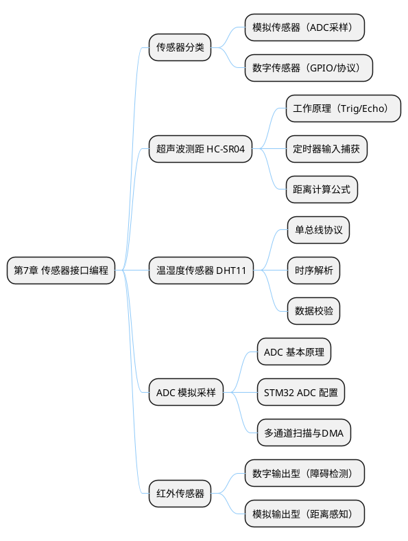

## 7 第 7 章 传感器接口编程

> 传感器是嵌入式系统感知外部世界的"眼睛和耳朵"。本章介绍超声波测距、温湿度检测、ADC 模拟采样和红外传感器等常用传感器在 STM32 上的接口编程方法，所有实验均可在 PicSimlab 中完成仿真验证。

### 7.1 本章知识导图



**图 7-1** 本章知识导图：传感器分类与四种常用传感器的接口编程。
<!-- fig:ch7-1 本章知识导图：传感器分类与四种常用传感器的接口编程。 -->

### 7.2 传感器分类与接口概述

传感器按输出信号类型可分为两大类：

**表 7-1** 传感器分类
<!-- tab:ch7-1 传感器分类 -->

| 类型 | 输出信号 | STM32 接口 | 典型传感器 |
|------|---------|-----------|-----------|
| 模拟传感器 | 连续电压（0~3.3V） | ADC | 热敏电阻、光敏电阻、气体传感器 |
| 数字传感器（电平型）| 高/低电平 | GPIO 输入 | 红外避障、限位开关、霍尔传感器 |
| 数字传感器（协议型）| 特定通信协议 | GPIO/I2C/SPI | DHT11（单总线）、BMP280（I2C） |
| 数字传感器（脉冲型）| 脉冲宽度/频率 | 定时器输入捕获 | HC-SR04（超声波）、编码器 |

```bob
  ┌─────────────────┐
  │    外部物理量    │
  │  温度/距离/光照  │
  └────────┬────────┘
           │ 传感器转换
           ▼
  ┌────────────────────────────────────────┐
  │          传感器输出信号                  │
  ├──────────┬──────────┬──────────────────┤
  │ 模拟电压 │ 数字电平 │ 数字脉冲/协议    │
  │ 0~3.3V   │ HIGH/LOW │ PWM/单总线/I2C   │
  ├──────────┼──────────┼──────────────────┤
  │  ADC     │  GPIO    │ TIM/GPIO/I2C     │
  │  采样    │  读取    │ 捕获/解析        │
  └──────────┴──────────┴──────────────────┘
           │ STM32 处理
           ▼
  ┌─────────────────┐
  │  数据 → 应用层  │
  │  显示/控制/上报  │
  └─────────────────┘
```

**图 7-2** 传感器信号从物理量到 STM32 数据处理的转换链路。
<!-- fig:ch7-2 传感器信号从物理量到 STM32 数据处理的转换链路。 -->

---

### 7.3 超声波测距传感器（HC-SR04）

HC-SR04 是最常用的超声波测距模块，可测量 2cm~400cm 范围内的距离，广泛用于障碍检测和液位监测。

#### 7.3.1 工作原理

```bob
     STM32                    HC-SR04
  ┌──────────┐            ┌──────────────┐
  │  Trig(PA0)├───────────►│  Trig        │
  │          │            │              │───── 超声波发射 ─────►
  │  Echo(PA1)│◄───────────┤  Echo        │
  │          │            │              │◄──── 超声波回波 ─────
  │  VCC     ├───────────►│  VCC (5V)    │
  │  GND     ├───────────►│  GND         │
  └──────────┘            └──────────────┘
```

**图 7-3** HC-SR04 与 STM32 的连接示意图。
<!-- fig:ch7-3 HC-SR04 与 STM32 的连接示意图。 -->

**测距流程：**

1. STM32 向 Trig 引脚发送 ≥10μs 的高电平脉冲
2. HC-SR04 自动发射 8 个 40kHz 超声波脉冲
3. 发射后 Echo 引脚拉高，等待回波
4. 收到回波后 Echo 拉低，高电平持续时间即为超声波往返时间

**距离计算公式：**

$$d = \frac{v \times t}{2} = \frac{340 \times t_{echo}}{2} \text{ (m)}$$

其中 $t_{echo}$ 为 Echo 高电平持续时间（秒），声速取 340 m/s。

#### 7.3.2 STM32 实现（定时器输入捕获）

使用定时器输入捕获测量 Echo 脉冲宽度：

**CubeMX 配置：**

- PA0 → GPIO_Output（Trig）
- PA1 → TIM2_CH2（Echo，输入捕获模式）
- TIM2 PSC = 71，ARR = 65535（计数周期 1μs，最大 65.535ms）

```c
/* 超声波测距驱动 */
#include "main.h"

static volatile uint32_t echo_start = 0;
static volatile uint32_t echo_end   = 0;
static volatile uint8_t  capture_done = 0;

/* 发送 Trig 脉冲 */
void HC_SR04_Trigger(void)
{
    HAL_GPIO_WritePin(GPIOA, GPIO_PIN_0, GPIO_PIN_SET);
    uint32_t tick = SysTick->VAL;
    while ((tick - SysTick->VAL) < 720) {}   /* 约 10us @72MHz */
    HAL_GPIO_WritePin(GPIOA, GPIO_PIN_0, GPIO_PIN_RESET);
}

/* 定时器输入捕获回调 */
void HAL_TIM_IC_CaptureCallback(TIM_HandleTypeDef *htim)
{
    if (htim->Channel == HAL_TIM_ACTIVE_CHANNEL_2) {
        if (!capture_done) {
            if (echo_start == 0) {
                echo_start = HAL_TIM_ReadCapturedValue(htim, TIM_CHANNEL_2);
                /* 切换为下降沿捕获 */
                __HAL_TIM_SET_CAPTUREPOLARITY(htim, TIM_CHANNEL_2,
                                               TIM_INPUTCHANNELPOLARITY_FALLING);
            } else {
                echo_end = HAL_TIM_ReadCapturedValue(htim, TIM_CHANNEL_2);
                capture_done = 1;
                /* 恢复上升沿捕获 */
                __HAL_TIM_SET_CAPTUREPOLARITY(htim, TIM_CHANNEL_2,
                                               TIM_INPUTCHANNELPOLARITY_RISING);
            }
        }
    }
}

/* 获取距离（单位：cm） */
float HC_SR04_GetDistance(void)
{
    echo_start = 0;
    echo_end   = 0;
    capture_done = 0;

    HAL_TIM_IC_Start_IT(&htim2, TIM_CHANNEL_2);
    HC_SR04_Trigger();

    uint32_t timeout = HAL_GetTick();
    while (!capture_done && (HAL_GetTick() - timeout < 50)) {}

    HAL_TIM_IC_Stop_IT(&htim2, TIM_CHANNEL_2);

    if (!capture_done) return -1.0f;  /* 超时 */

    uint32_t pulse_us = (echo_end >= echo_start)
                        ? (echo_end - echo_start)
                        : (65536 - echo_start + echo_end);
    return (float)pulse_us * 0.034f / 2.0f;  /* cm */
}
```

> 在 PicSimlab 中可使用 Ultrasonic 虚拟组件模拟 HC-SR04，通过滑块调节模拟距离值。

---

### 7.4 温湿度传感器（DHT11）

DHT11 是一款低成本的温湿度传感器，通过单总线协议与 MCU 通信，适用于农业温室环境监测等场景。

#### 7.4.1 单总线协议时序

DHT11 仅需一根数据线（DATA），通信流程如下：

1. **MCU 发送起始信号**：拉低 DATA ≥18ms，然后拉高 20~40μs
2. **DHT11 响应**：拉低 80μs → 拉高 80μs
3. **数据传输**：40 位数据（湿度整数+小数 + 温度整数+小数 + 校验和），每位以脉冲宽度编码：
   - "0"：低电平 50μs + 高电平 26~28μs
   - "1"：低电平 50μs + 高电平 70μs
4. **校验**：校验和 = 湿度整数 + 湿度小数 + 温度整数 + 温度小数

#### 7.4.2 STM32 实现

```c
/* DHT11 驱动 */
#include "main.h"

#define DHT11_PORT GPIOB
#define DHT11_PIN  GPIO_PIN_0

typedef struct {
    uint8_t humidity;       /* 湿度整数部分 */
    uint8_t temperature;    /* 温度整数部分 */
    uint8_t valid;          /* 数据是否有效 */
} DHT11_Data;

/* 微秒延时（基于 DWT） */
static void delay_us(uint32_t us)
{
    uint32_t start = DWT->CYCCNT;
    uint32_t ticks = us * (SystemCoreClock / 1000000);
    while ((DWT->CYCCNT - start) < ticks) {}
}

/* 设置引脚方向 */
static void DHT11_SetOutput(void)
{
    GPIO_InitTypeDef g = {0};
    g.Pin   = DHT11_PIN;
    g.Mode  = GPIO_MODE_OUTPUT_PP;
    g.Speed = GPIO_SPEED_FREQ_HIGH;
    HAL_GPIO_Init(DHT11_PORT, &g);
}

static void DHT11_SetInput(void)
{
    GPIO_InitTypeDef g = {0};
    g.Pin  = DHT11_PIN;
    g.Mode = GPIO_MODE_INPUT;
    g.Pull = GPIO_PULLUP;
    HAL_GPIO_Init(DHT11_PORT, &g);
}

/* 读取一个字节 */
static uint8_t DHT11_ReadByte(void)
{
    uint8_t byte = 0;
    for (int i = 0; i < 8; i++) {
        while (HAL_GPIO_ReadPin(DHT11_PORT, DHT11_PIN) == GPIO_PIN_RESET) {}
        delay_us(40);  /* 超过 28us 则为 '1' */
        if (HAL_GPIO_ReadPin(DHT11_PORT, DHT11_PIN) == GPIO_PIN_SET) {
            byte |= (1 << (7 - i));
        }
        while (HAL_GPIO_ReadPin(DHT11_PORT, DHT11_PIN) == GPIO_PIN_SET) {}
    }
    return byte;
}

/* 读取完整数据 */
DHT11_Data DHT11_Read(void)
{
    DHT11_Data data = {0};
    uint8_t buf[5];

    /* 发送起始信号 */
    DHT11_SetOutput();
    HAL_GPIO_WritePin(DHT11_PORT, DHT11_PIN, GPIO_PIN_RESET);
    HAL_Delay(20);  /* 拉低 20ms */
    HAL_GPIO_WritePin(DHT11_PORT, DHT11_PIN, GPIO_PIN_SET);
    delay_us(30);

    /* 等待 DHT11 响应 */
    DHT11_SetInput();
    if (HAL_GPIO_ReadPin(DHT11_PORT, DHT11_PIN) == GPIO_PIN_SET) return data;

    while (HAL_GPIO_ReadPin(DHT11_PORT, DHT11_PIN) == GPIO_PIN_RESET) {}
    while (HAL_GPIO_ReadPin(DHT11_PORT, DHT11_PIN) == GPIO_PIN_SET) {}

    /* 读取 5 字节数据 */
    for (int i = 0; i < 5; i++) {
        buf[i] = DHT11_ReadByte();
    }

    /* 校验 */
    if (buf[4] == (uint8_t)(buf[0] + buf[1] + buf[2] + buf[3])) {
        data.humidity    = buf[0];
        data.temperature = buf[2];
        data.valid       = 1;
    }
    return data;
}
```

---

### 7.5 ADC 模拟采样

STM32F103 内置 12 位 ADC，最大采样率 1 MSPS，可将 0~3.3V 模拟电压转换为 0~4095 的数字值。

#### 7.5.1 ADC 基本原理

$$V_{input} = \frac{ADC\_Value}{4095} \times V_{ref} = \frac{ADC\_Value}{4095} \times 3.3 \text{ (V)}$$

**CubeMX 配置：**

- PA0 → ADC1_IN0
- ADC1：12 位分辨率，连续转换模式
- 采样时间：239.5 cycles（采样时间越长精度越高）

#### 7.5.2 单通道轮询采样

```c
/* ADC 单通道采样 */
uint16_t ADC_Read(void)
{
    HAL_ADC_Start(&hadc1);
    HAL_ADC_PollForConversion(&hadc1, 10);
    uint16_t value = HAL_ADC_GetValue(&hadc1);
    HAL_ADC_Stop(&hadc1);
    return value;
}

float ADC_ReadVoltage(void)
{
    return (float)ADC_Read() / 4095.0f * 3.3f;
}
```

#### 7.5.3 多通道 DMA 扫描

当需要同时采集多路模拟信号（如温度+光照+土壤湿度）时，使用 DMA 扫描模式避免 CPU 等待：

```c
/* DMA 多通道采样 */
#define ADC_CHANNELS 3
static uint16_t adc_buf[ADC_CHANNELS];

/* 启动 DMA 连续采样 */
void ADC_DMA_Start(void)
{
    HAL_ADC_Start_DMA(&hadc1, (uint32_t *)adc_buf, ADC_CHANNELS);
}

/* 读取各通道电压 */
float ADC_GetChannel(uint8_t ch)
{
    if (ch >= ADC_CHANNELS) return 0.0f;
    return (float)adc_buf[ch] / 4095.0f * 3.3f;
}
```

---

### 7.6 红外传感器

红外避障传感器以数字电平输出为主，常用于障碍物检测。

- **数字输出型**（如 TCRT5000）：检测到障碍物时输出低电平，否则高电平
- **模拟输出型**（如 GP2Y0A21）：输出与距离成反比的模拟电压

```c
/* 红外避障传感器 — GPIO 数字读取 */
uint8_t IR_IsObstacle(void)
{
    return (HAL_GPIO_ReadPin(GPIOB, GPIO_PIN_1) == GPIO_PIN_RESET) ? 1 : 0;
}
```

在农业信息化应用中，红外传感器可用于农产品计数、传送带物体检测等场景。

---

### 7.7 本章小结

本章介绍了嵌入式系统中四类常用传感器的接口编程方法：

- **超声波 HC-SR04**：定时器输入捕获测量 Echo 脉冲宽度，计算距离
- **温湿度 DHT11**：单总线协议时序解析，40 位数据读取与校验
- **ADC 模拟采样**：12 位 ADC 单通道轮询与多通道 DMA 扫描
- **红外传感器**：GPIO 数字电平读取

这些传感器构成了嵌入式系统"输入"环节的核心，为后续的数据处理、显示和控制提供原始数据源。

---

### 7.8 习题

1. 说明 HC-SR04 的测距原理，写出距离计算公式。
2. DHT11 单总线协议如何区分数据位 "0" 和 "1"？
3. STM32 ADC 的分辨率为 12 位，当 ADC 值为 2048 时对应的电压是多少？
4. 设计一个农业温室环境监测方案，需要采集温度、湿度和土壤含水量（模拟量），说明传感器选型和 STM32 接口配置。
5. 比较轮询采样与 DMA 采样的优缺点，说明在多传感器场景下为什么推荐 DMA 方式。
