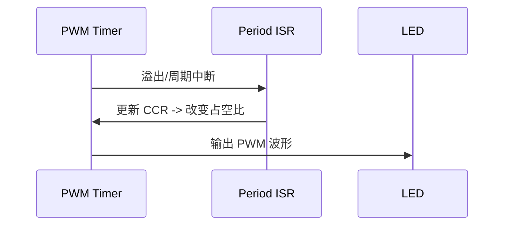
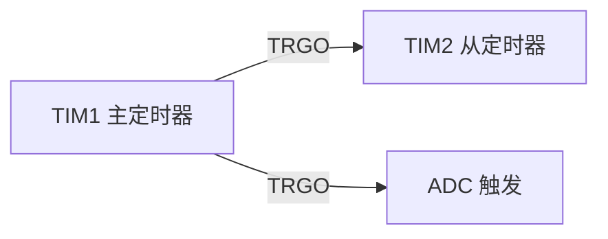

# 第七章 - STM32 定时器的应用

## 7.1 简介
定时器（Timer）是 STM32 外设中非常重要的部分，用于产生精确的时间基准、PWM 信号、输入捕获、编码器接口、事件触发以及与中断/DMA 协同工作。通过调整时钟分频（Prescaler）和自动重装值（ARR），可以灵活地控制计数周期与分辨率。

## 7.2 定时器基础概念
- 时钟来源：APB1 / APB2 总线时钟，经预分频后进入定时器。注意不同系列定时器的时钟倍频特性。
- 预分频器（Prescaler）：决定计数器时钟频率。计数器时钟 = 定时器时钟 / (Prescaler + 1)。
- 自动重装载寄存器（ARR）：决定计数周期，当计数器达到 ARR 时产生更新事件（Update Event）。
- 捕获/比较寄存器（CCR）：用于输入捕获或输出比较/PWM 的占空比设置。

## 7.3 计数模式
- 向上计数（Upcounting）
- 向下计数（Downcounting）
- 中心对齐模式（Center-aligned）：用于生成对称 PWM 或定时同步场景

## 7.4 输出比较与 PWM
输出比较 (Output Compare) 可用于生成 PWM 信号和定时输出。PWM 的占空比由 CCRx 与 ARR 的比值决定。

示例：基于 HAL 的简要 PWM 初始化与启动（伪代码）：

```c
// 假设使用 TIM2, 计数频率为 1MHz, 周期 1000 -> 1kHz PWM
TIM_HandleTypeDef htim2;
htim2.Instance = TIM2;
htim2.Init.Prescaler = 79;           // 如果 APB1 时钟 80MHz -> 计数时钟 1MHz
htim2.Init.CounterMode = TIM_COUNTERMODE_UP;
htim2.Init.Period = 999;             // ARR
HAL_TIM_PWM_Init(&htim2);

TIM_OC_InitTypeDef sConfigOC = {0};
sConfigOC.OCMode = TIM_OCMODE_PWM1;
sConfigOC.Pulse = 500;               // CCRx -> 占空比 50%
sConfigOC.OCPolarity = TIM_OCPOLARITY_HIGH;
HAL_TIM_PWM_ConfigChannel(&htim2, &sConfigOC, TIM_CHANNEL_1);

HAL_TIM_PWM_Start(&htim2, TIM_CHANNEL_1);
```

注意在实际工程中通常使用 STM32CubeMX 生成初始化代码并在此基础上修改 CCR 值实现占空比控制。

## 7.5 输入捕获（Input Capture）
输入捕获用于测量外部信号的频率、占空比或脉宽。基本思路是将外部事件捕获到 CCR 寄存器并读取捕获值，结合定时器时钟与预分频器计算真实时间。

示例流程（伪算法）：
1. 配置通道为输入捕获，设置触发边沿（上升沿/下降沿/双边沿）。
2. 在捕获中断或 DMA 回调中读取 CCR 值并计算时间间隔。
3. 根据计数器溢出与预分频计算最终频率/占空比。

```c
// 简单使用 HAL 获取两次上升沿计数差值
uint32_t last = 0, now = 0;
void HAL_TIM_IC_CaptureCallback(TIM_HandleTypeDef *htim) {
    if (htim->Channel == HAL_TIM_ACTIVE_CHANNEL_1) {
        now = HAL_TIM_ReadCapturedValue(htim, TIM_CHANNEL_1);
        uint32_t diff = (now >= last) ? (now - last) : (now + (htim->Init.Period + 1) - last);
        // diff 对应计数器刻度, 乘以刻度时间得脉宽
        last = now;
    }
}
```

## 7.6 编码器接口（Encoder Interface）
STM32 提供专用的编码器接口模式（Encoder Mode），可直接把两相正交编码器信号连接到定时器通道，从而高效读取旋转角度和速度。

配置要点：
- 将两个通道配置为 TI1/TI2 输入
- 选择合适的捕获极性和滤波器
- 使用 16/32 位定时器以满足计数范围需求

## 7.7 定时器中断与 DMA
- 更新中断（Update Interrupt）：ARR 溢出或手动更新时触发，常用于周期性任务。
- 捕获/比较中断（CCx）：在捕获或比较事件发生时触发，适用于精确定时处理。
- DMA：用于高频数据搬运（例如连续捕获、DAC 波形输出），减少 CPU 负担。

## 7.8 多定时器同步与高级功能
- 主从模式（Master/Slave）用于定时器间同步触发（例如同步 PWM 或采样同步）。
- 死区时间（Dead-time）与互补输出：用于半桥/全桥驱动，防止上下桥同时导通。
- 触发 ADC：定时器可作为 ADC 触发源实现精确采样同步。

## 7.9 调试与常见问题
- 时钟配置错误会导致定时器频率偏差，检查 RCC 与 APB 分频设置。
- 中断优先级与中断处理耗时会影响高频事件的可靠性，必要时采用 DMA。
- ARR/Prescaler 设置需避免计数器溢出并兼顾时间分辨率。

## 7.10 实验与练习（扩展）

下面列出若干针对定时器的教学与工程实验，涵盖从基础到进阶的应用：自制延迟函数、输出比较与呼吸灯、输入捕获与占空比测量、超声波测距、定时器主/从模式（从模式控制器）、编码器实验与占空比测量。每个实验均给出背景、关键实现要点、简化代码与时序/交互图，便于课堂演示与实验室练习。

### 实验1：基于定时器的自制延迟函数（精确延时）

目的：使用定时器提供比软件循环更精确且低抖动的延时函数，用于有确定性需求的短延时场景。

要点：使用 32 位计数器或配合溢出处理，避免被中断长时间占用影响精度；若需在低功耗下延时，结合睡眠模式并用定时器唤醒更合适。

示例（裸机 HAL 风格）：

```c
/* 返回以微秒为单位的延时，使用 TIMx 的 1MHz 计数 */
void delay_us(uint32_t us) {
    __HAL_TIM_SET_COUNTER(&htimx, 0);
    HAL_TIM_Base_Start(&htimx);
    while (__HAL_TIM_GET_COUNTER(&htimx) < us) {
        // 可在此检查并允许中断发生
    }
    HAL_TIM_Base_Stop(&htimx);
}
```

注意：当延时较长（数 ms 以上）时优先使用 tick/systicks 或任务延时以避免占用 CPU。

---

### 实验2：输出比较与呼吸灯（PWM 占空比渐变）

目的：掌握 PWM 的动态占空比调整与软硬件结合产生呼吸灯效果。

实现思路：使用定时器 PWM 输出并在定时器中断或软件定时器回调中周期性调整 CCR 值；对于平滑效果，采用三角/正弦波形表或分段线性插值。

示例：基于 HAL 的周期性占空比更新（使用 DMA 或定时器中断）

```c
// 在 TIM 回调中更新占空比
void HAL_TIM_PeriodElapsedCallback(TIM_HandleTypeDef *htim) {
    static int dir = 1;
    static uint32_t duty = 0;
    if (htim->Instance == TIMx) {
        duty += dir ? 1 : -1;
        if (duty == 0 || duty == 1000) dir = !dir;
        __HAL_TIM_SET_COMPARE(&htim_pwm, TIM_CHANNEL_1, duty);
    }
}
```

时序图：



优化建议：为平滑视觉效果可在占空比更新中使用非线性（伽马校正或正弦表）映射。

---

### 实验3：输入捕获与占空比测量

目的：测量外部方波的周期与高电平时间，从而计算频率与占空比（Duty Cycle）。

实现要点：使用捕获上升沿记录周期、捕获下降沿记录高电平时间；处理计数器溢出。可使用双通道捕获或在单通道上交替配置边沿捕获。

代码示例（HAL 回调）：

```c
volatile uint32_t t_rise = 0, t_fall = 0, period = 0, high_time = 0;
void HAL_TIM_IC_CaptureCallback(TIM_HandleTypeDef *htim) {
    static uint8_t state = 0; // 0: 等待上升, 1: 等待下降
    uint32_t capture = HAL_TIM_ReadCapturedValue(htim, TIM_CHANNEL_1);
    if (state == 0) {
        t_rise = capture; // 上升沿
        // 切换为捕获下降
        __HAL_TIM_SET_CAPTUREPOLARITY(htim, TIM_CHANNEL_1, TIM_INPUTCHANNELPOLARITY_FALLING);
        state = 1;
    } else {
        t_fall = capture; // 下降沿
        // 计算 high_time
        high_time = (t_fall >= t_rise) ? (t_fall - t_rise) : (t_fall + (htim->Init.Period + 1) - t_rise);
        // 下一步捕获上升沿以测周期
        __HAL_TIM_SET_CAPTUREPOLARITY(htim, TIM_CHANNEL_1, TIM_INPUTCHANNELPOLARITY_RISING);
        state = 0;
        // 若需要再计算周期，可保存上一个上升时间并求差
    }
}
```

输出计算：频率 = timer_clock / (period_counts); 占空比 = high_time / period.

---

### 实验4：超声波测距（HC-SR04 类）

目的：使用定时器输出一个 10us 的触发脉冲并用输入捕获测量回波脉宽，从而计算距离。

流程：
1) 将 TRIG 引脚产生 10us 高脉冲（可通过 GPIO + delay_us 或使用输出比较短脉冲）；
2) 触发后开启输入捕获，测量 ECHO 引脚高电平持续时间；
3) 距离 = (echo_time_us) * (声速约 343 m/s) / 2。

示例代码（伪代码）：

```c
void hc_sr04_trigger(void) {
    HAL_GPIO_WritePin(TRIG_PORT, TRIG_PIN, GPIO_PIN_SET);
    delay_us(10);
    HAL_GPIO_WritePin(TRIG_PORT, TRIG_PIN, GPIO_PIN_RESET);
    // 启动输入捕获以测量 ECHO
}

// 捕获回调中计算时间
void HAL_TIM_IC_CaptureCallback(TIM_HandleTypeDef *htim) {
    static uint32_t t_start = 0;
    uint32_t cap = HAL_TIM_ReadCapturedValue(htim, TIM_CHANNEL_1);
    if (HAL_GPIO_ReadPin(ECHO_PORT, ECHO_PIN) == GPIO_PIN_SET) {
        t_start = cap;
    } else {
        uint32_t t_end = cap;
        uint32_t delta = (t_end >= t_start) ? (t_end - t_start) : (t_end + (htim->Init.Period + 1) - t_start);
        uint32_t time_us = delta; // 依计数器刻度为 1us
        float distance_m = (time_us * 1e-6f) * 343.0f / 2.0f;
    }
}
```

注意：回波时间可能达到数十 ms，需选择合适的计数器位宽与预分频以避免溢出；处理异常回波与超时。

---

### 实验5：定时器主/从（从模式控制器）——同步触发与级联

目的：学习使用定时器主/从模式（Master/Slave）实现多通道同步、采样对齐或扩展计数位宽。

要点：
- 主定时器产生触发输出（TRGO），从定时器配置为触发输入（Trigger Input）并在触发时重载或启动；
- 可用于：多路 PWM 同步、ADC 多通道同步采样、级联定时器扩展计数深度（例如将两个 16 位定时器组合成 32 位计数）。

示意图：



简要配置思路（伪代码）：

```c
// 主：配置 TRGO 为更新事件
hdtim_master.Init...;
HAL_TIM_Base_Init(&hdtim_master);
// 从：配置触发输入为 ITRx（对应主定时器）并选择 SlaveMode
hdtim_slave.Init...;
__HAL_TIM_SET_TRIGGER_SOURCE(&hdtim_slave, TIM_TS_ITR0);
__HAL_TIM_SET_SLAVE_MODE(&hdtim_slave, TIM_SLAVEMODE_TRIGGER);
```

应用示例：使用 TIM1 作为主时钟生成 1kHz 触发，TIM2 在触发时采样或累加计数。

---

### 实验6：占空比测量的进阶：双通道捕获法

目的：在复杂信号或高频场合提升测量可靠性，使用两个通道分别捕获上升与下降沿或用两路滤波独立采样。

实现提示：
- 将信号接到 TIM 的 CH1(上升) 和 CH2(下降)；在同一周期捕获两个通道值直接计算高/低时间，减小切换配置带来的延迟。示例代码与输入捕获类似。

---

### 实验7：编码器实验（增量编码器实战）

目的：使用定时器编码器模式读取增量编码器位移与速度，并结合滤波/微分计算速度。

步骤要点：
1) 将编码器 A/B 相连接到 TIM 的两个通道，启用编码器接口模式；
2) 定期读取计数器（CNT）并处理溢出以获得累积计数；
3) 通过差分计数除以采样周期计算速度；
4) 对低速范围使用降速滤波或累积法提高分辨率。

代码片段（读取累积计数）：

```c
uint32_t last_cnt = 0;
int32_t total = 0;
void encoder_task(void *arg) {
    for (;;) {
        uint32_t cnt = __HAL_TIM_GET_COUNTER(&htim_enc);
        int32_t diff = (int32_t)(cnt - last_cnt);
        // 处理计数器向下/向上溢出
        if (diff > 32767) diff -= 65536;
        if (diff < -32768) diff += 65536;
        total += diff;
        last_cnt = cnt;
        vTaskDelay(pdMS_TO_TICKS(10));
    }
}
```

实验扩展：实现速度闭环（将编码器读数作为反馈）与滤波、分辨率提升技术（插值、高速采样）。

---

以上实验可单独作为课堂练习或组合成综合项目（例如：用编码器与占空比测量实现闭环速度控制，并用超声波测距作为避障信号）。


## 参考资料
- ST 官方参考手册（RM 系列）
- STM32 HAL/LL 库 API 文档
- 《STM32 嵌入式系统开发实战》 相关章节

---

（本章为概览性草稿，建议结合目标 MCU 数据手册与 HAL/LL 示例移植并补充具体芯片型号的寄存器细节与代码示例。）
