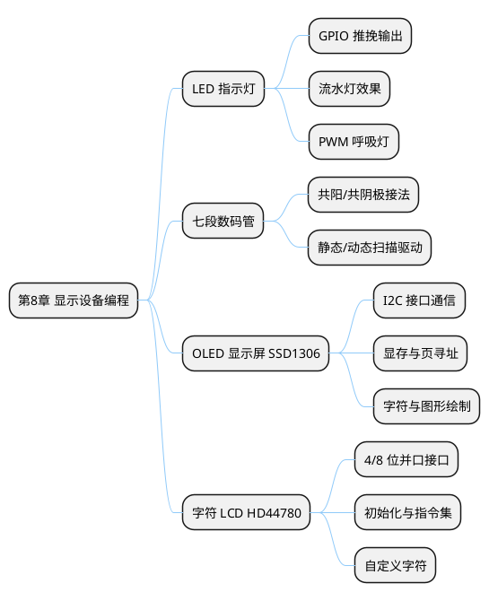

## 8 第 8 章 显示设备编程

> 显示设备是嵌入式系统向用户呈现信息的主要手段。本章介绍 LED 指示灯、七段数码管、OLED 显示屏（SSD1306）和字符 LCD（HD44780）在 STM32 上的驱动编程。

### 8.1 本章知识导图



**图 8-1** 本章知识导图：四种常用显示设备的驱动编程。
<!-- fig:ch8-1 本章知识导图：四种常用显示设备的驱动编程。 -->

### 8.2 LED 指示灯与流水灯

LED 是最简单的输出设备，通过 GPIO 推挽输出控制点亮/熄灭。

#### 8.2.1 单 LED 控制

Blue Pill 板载 LED 连接在 PC13，低电平点亮：

```c
/* 板载 LED 控制 */
HAL_GPIO_WritePin(GPIOC, GPIO_PIN_13, GPIO_PIN_RESET);  /* 点亮 */
HAL_GPIO_WritePin(GPIOC, GPIO_PIN_13, GPIO_PIN_SET);     /* 熄灭 */
HAL_GPIO_TogglePin(GPIOC, GPIO_PIN_13);                  /* 翻转 */
```

#### 8.2.2 八路流水灯

使用 PA0~PA7 驱动 8 个外接 LED：

```c
/* 流水灯效果 */
void LED_Waterfall(void)
{
    for (int i = 0; i < 8; i++) {
        /* 熄灭所有 LED */
        HAL_GPIO_WritePin(GPIOA, 0x00FF, GPIO_PIN_SET);
        /* 点亮第 i 个 LED */
        HAL_GPIO_WritePin(GPIOA, (1 << i), GPIO_PIN_RESET);
        HAL_Delay(200);
    }
}
```

#### 8.2.3 PWM 呼吸灯

利用定时器 PWM 输出实现 LED 亮度渐变（详见第 5 章定时器 PWM 内容）：

```c
/* PWM 呼吸灯 — 占空比 0→100%→0 循环 */
void LED_Breathe(TIM_HandleTypeDef *htim, uint32_t channel)
{
    for (uint16_t duty = 0; duty < 1000; duty += 10) {
        __HAL_TIM_SET_COMPARE(htim, channel, duty);
        HAL_Delay(10);
    }
    for (uint16_t duty = 1000; duty > 0; duty -= 10) {
        __HAL_TIM_SET_COMPARE(htim, channel, duty);
        HAL_Delay(10);
    }
}
```

---

### 8.3 七段数码管

七段数码管由 7 个 LED 段（a~g）和 1 个小数点（dp）组成，可显示 0~9 和部分字母。

**表 8-1** 共阴极数码管段码表
<!-- tab:ch8-1 共阴极数码管段码表 -->

| 数字 | dp g f e d c b a | 十六进制 |
|:----:|:----------------:|:--------:|
| 0 | 0 0 1 1 1 1 1 1 | 0x3F |
| 1 | 0 0 0 0 0 1 1 0 | 0x06 |
| 2 | 0 1 0 1 1 0 1 1 | 0x5B |
| 3 | 0 1 0 0 1 1 1 1 | 0x4F |
| 4 | 0 1 1 0 0 1 1 0 | 0x66 |
| 5 | 0 1 1 0 1 1 0 1 | 0x6D |
| 6 | 0 1 1 1 1 1 0 1 | 0x7D |
| 7 | 0 0 0 0 0 1 1 1 | 0x07 |
| 8 | 0 1 1 1 1 1 1 1 | 0x7F |
| 9 | 0 1 1 0 1 1 1 1 | 0x6F |

```c
/* 数码管段码表（共阴极） */
static const uint8_t seg_table[] = {
    0x3F, 0x06, 0x5B, 0x4F, 0x66,  /* 0~4 */
    0x6D, 0x7D, 0x07, 0x7F, 0x6F   /* 5~9 */
};

/* 显示一位数字 */
void SEG_Display(uint8_t digit)
{
    if (digit > 9) return;
    /* 假设 a~g 连接 PA0~PA6 */
    GPIOA->ODR = (GPIOA->ODR & 0xFF80) | seg_table[digit];
}
```

多位数码管使用动态扫描（逐位轮流点亮，利用人眼视觉暂留效应）驱动。

---

### 8.4 OLED 显示屏（SSD1306）

SSD1306 是一款 128×64 像素的单色 OLED 驱动芯片，支持 I2C 和 SPI 接口。本节以 I2C 接口为例。

#### 8.4.1 I2C 接口连接

**表 8-2** SSD1306 OLED 与 STM32 的 I2C 连接
<!-- tab:ch8-2 SSD1306 OLED 与 STM32 的 I2C 连接 -->

| OLED 引脚 | STM32 引脚 | 说明 |
|-----------|-----------|------|
| VCC | 3.3V | 电源 |
| GND | GND | 地线 |
| SCL | PB6 (I2C1_SCL) | I2C 时钟 |
| SDA | PB7 (I2C1_SDA) | I2C 数据 |

SSD1306 的 I2C 地址通常为 **0x3C**（7 位地址）。

#### 8.4.2 显存结构

SSD1306 的 128×64 显存按页（Page）组织，共 8 页（Page 0~7），每页 128 列，每列 1 字节（8 像素，LSB 在上）。

```bob
  列 0    列 1    ...   列 127
  ┌────┐  ┌────┐       ┌────┐
  │b0  │  │b0  │       │b0  │  Page 0（行 0~7）
  │b1  │  │b1  │       │b1  │
  │... │  │... │       │... │
  │b7  │  │b7  │       │b7  │
  ├────┤  ├────┤       ├────┤
  │b0  │  │b0  │       │b0  │  Page 1（行 8~15）
  │... │  │... │       │... │
  ├────┤  ├────┤       ├────┤
  │    │  │    │       │    │  ...
  ├────┤  ├────┤       ├────┤
  │b0  │  │b0  │       │b0  │  Page 7（行 56~63）
  │... │  │... │       │... │
  └────┘  └────┘       └────┘
```

**图 8-2** SSD1306 显存页寻址结构，128×64 像素分为 8 页。
<!-- fig:ch8-2 SSD1306 显存页寻址结构，128×64 像素分为 8 页。 -->

#### 8.4.3 驱动实现

```c
/* SSD1306 I2C OLED 驱动（简化版） */

#define SSD1306_ADDR  0x3C << 1  /* HAL 使用 8 位地址 */

/* 发送命令 */
static void SSD1306_WriteCmd(uint8_t cmd)
{
    uint8_t buf[2] = {0x00, cmd};  /* Co=0, D/C#=0 */
    HAL_I2C_Master_Transmit(&hi2c1, SSD1306_ADDR, buf, 2, 10);
}

/* 发送数据 */
static void SSD1306_WriteData(uint8_t *data, uint16_t len)
{
    uint8_t buf[129];
    buf[0] = 0x40;  /* Co=0, D/C#=1 */
    for (uint16_t i = 0; i < len && i < 128; i++) {
        buf[i + 1] = data[i];
    }
    HAL_I2C_Master_Transmit(&hi2c1, SSD1306_ADDR, buf, len + 1, 10);
}

/* 帧缓冲区 */
static uint8_t framebuf[1024];  /* 128 * 8 pages */

/* 初始化 */
void SSD1306_Init(void)
{
    HAL_Delay(100);
    SSD1306_WriteCmd(0xAE);  /* Display OFF */
    SSD1306_WriteCmd(0x20);  /* 寻址模式 */
    SSD1306_WriteCmd(0x00);  /* 水平寻址 */
    SSD1306_WriteCmd(0xB0);  /* 起始页 0 */
    SSD1306_WriteCmd(0xC8);  /* COM 扫描方向 */
    SSD1306_WriteCmd(0x00);  /* 低列地址 */
    SSD1306_WriteCmd(0x10);  /* 高列地址 */
    SSD1306_WriteCmd(0x40);  /* 起始行 0 */
    SSD1306_WriteCmd(0x81);  /* 对比度 */
    SSD1306_WriteCmd(0xFF);
    SSD1306_WriteCmd(0xA1);  /* 段重映射 */
    SSD1306_WriteCmd(0xA6);  /* 正常显示 */
    SSD1306_WriteCmd(0xA8);  /* 多路复用 */
    SSD1306_WriteCmd(0x3F);  /* 64 行 */
    SSD1306_WriteCmd(0xD3);  /* 显示偏移 */
    SSD1306_WriteCmd(0x00);
    SSD1306_WriteCmd(0xD5);  /* 时钟分频 */
    SSD1306_WriteCmd(0x80);
    SSD1306_WriteCmd(0xD9);  /* 预充电 */
    SSD1306_WriteCmd(0xF1);
    SSD1306_WriteCmd(0xDA);  /* COM 引脚配置 */
    SSD1306_WriteCmd(0x12);
    SSD1306_WriteCmd(0xDB);  /* VCOMH 电压 */
    SSD1306_WriteCmd(0x40);
    SSD1306_WriteCmd(0x8D);  /* 电荷泵 */
    SSD1306_WriteCmd(0x14);
    SSD1306_WriteCmd(0xAF);  /* Display ON */

    memset(framebuf, 0, sizeof(framebuf));
}

/* 刷新显示（将帧缓冲写入 OLED） */
void SSD1306_Update(void)
{
    for (uint8_t page = 0; page < 8; page++) {
        SSD1306_WriteCmd(0xB0 + page);
        SSD1306_WriteCmd(0x00);
        SSD1306_WriteCmd(0x10);
        SSD1306_WriteData(&framebuf[page * 128], 128);
    }
}

/* 设置像素点 */
void SSD1306_SetPixel(uint8_t x, uint8_t y, uint8_t on)
{
    if (x >= 128 || y >= 64) return;
    if (on)
        framebuf[x + (y / 8) * 128] |=  (1 << (y % 8));
    else
        framebuf[x + (y / 8) * 128] &= ~(1 << (y % 8));
}

/* 显示字符（6×8 字体） */
void SSD1306_PutChar(uint8_t x, uint8_t y, char ch)
{
    /* 使用 6×8 ASCII 字模表（需要外部字模数组 font6x8） */
    extern const uint8_t font6x8[][6];
    if (ch < 32 || ch > 126) ch = ' ';
    for (int i = 0; i < 6; i++) {
        framebuf[(y / 8) * 128 + x + i] = font6x8[ch - 32][i];
    }
}

/* 显示字符串 */
void SSD1306_PutStr(uint8_t x, uint8_t y, const char *str)
{
    while (*str) {
        SSD1306_PutChar(x, y, *str++);
        x += 6;
        if (x > 122) { x = 0; y += 8; }
    }
}
```

#### 8.4.4 应用示例：显示传感器数据

```c
/* 在 OLED 上显示温湿度信息 */
void Display_SensorData(uint8_t temp, uint8_t humi, float dist)
{
    char line[22];

    memset(framebuf, 0, sizeof(framebuf));

    SSD1306_PutStr(0, 0,  "=== Sensor Data ===");

    snprintf(line, sizeof(line), "Temp: %d C", temp);
    SSD1306_PutStr(0, 16, line);

    snprintf(line, sizeof(line), "Humi: %d %%", humi);
    SSD1306_PutStr(0, 24, line);

    snprintf(line, sizeof(line), "Dist: %.1f cm", dist);
    SSD1306_PutStr(0, 32, line);

    SSD1306_Update();
}
```

---

### 8.5 字符 LCD（HD44780）

HD44780 是经典的字符 LCD 控制芯片，支持 16×2 或 20×4 字符显示，使用 4 位或 8 位并口通信。

#### 8.5.1 接口定义

**表 8-3** HD44780 LCD 引脚定义（4 位模式）
<!-- tab:ch8-3 HD44780 LCD 引脚定义（4 位模式） -->

| LCD 引脚 | 功能 | STM32 连接 |
|----------|------|-----------|
| RS | 寄存器选择（0=命令, 1=数据） | PA4 |
| RW | 读/写选择（通常接 GND 只写） | GND |
| E | 使能信号（下降沿锁存数据） | PA5 |
| D4~D7 | 4 位数据线 | PA0~PA3 |
| V0 | 对比度调节 | 电位器中间抽头 |

#### 8.5.2 初始化与常用操作

```c
/* HD44780 4-bit 模式驱动（简化版） */

static void LCD_SendNibble(uint8_t nibble)
{
    GPIOA->ODR = (GPIOA->ODR & 0xFFF0) | (nibble & 0x0F);
    HAL_GPIO_WritePin(GPIOA, GPIO_PIN_5, GPIO_PIN_SET);   /* E=1 */
    delay_us(1);
    HAL_GPIO_WritePin(GPIOA, GPIO_PIN_5, GPIO_PIN_RESET); /* E=0 */
    delay_us(50);
}

static void LCD_SendByte(uint8_t data, uint8_t is_data)
{
    HAL_GPIO_WritePin(GPIOA, GPIO_PIN_4,
                      is_data ? GPIO_PIN_SET : GPIO_PIN_RESET);
    LCD_SendNibble(data >> 4);    /* 高 4 位 */
    LCD_SendNibble(data & 0x0F);  /* 低 4 位 */
}

void LCD_Init(void)
{
    HAL_Delay(50);
    LCD_SendNibble(0x03); HAL_Delay(5);
    LCD_SendNibble(0x03); HAL_Delay(1);
    LCD_SendNibble(0x03);
    LCD_SendNibble(0x02);         /* 切换到 4-bit 模式 */
    LCD_SendByte(0x28, 0);        /* 4-bit, 2 行, 5x8 字体 */
    LCD_SendByte(0x0C, 0);        /* 显示开，光标关 */
    LCD_SendByte(0x06, 0);        /* 光标右移 */
    LCD_SendByte(0x01, 0);        /* 清屏 */
    HAL_Delay(2);
}

void LCD_SetCursor(uint8_t row, uint8_t col)
{
    uint8_t addr = (row == 0) ? col : (0x40 + col);
    LCD_SendByte(0x80 | addr, 0);
}

void LCD_Print(const char *str)
{
    while (*str) LCD_SendByte(*str++, 1);
}
```

> 在 PicSimlab 中可直接添加 LCD 16×2 虚拟组件进行仿真验证。

---

### 8.6 本章小结

本章介绍了四种嵌入式常用显示设备的驱动编程：

- **LED 指示灯**：GPIO 推挽输出控制，PWM 呼吸灯效果
- **七段数码管**：段码编码与动态扫描驱动
- **SSD1306 OLED**：I2C 通信、页寻址显存、帧缓冲区图形绘制
- **HD44780 字符 LCD**：4 位并口模式初始化与字符显示

这些显示设备构成了嵌入式系统"输出"环节的重要组成部分，与传感器（第 7 章）配合可实现完整的数据采集-显示链路。

---

### 8.7 习题

1. 说明共阳极和共阴极数码管的区别，各自的段码有何不同？
2. SSD1306 OLED 采用页寻址模式时，如何在屏幕坐标 (30, 20) 处设置一个像素？
3. 比较 I2C 接口 OLED 和 SPI 接口 OLED 的优缺点。
4. 设计一个温室监控显示方案：在 OLED 上显示温度、湿度和超声波液位值，要求每秒刷新一次。
5. HD44780 LCD 的 4 位模式比 8 位模式节省了哪些 GPIO？在引脚资源紧张时这有何意义？
