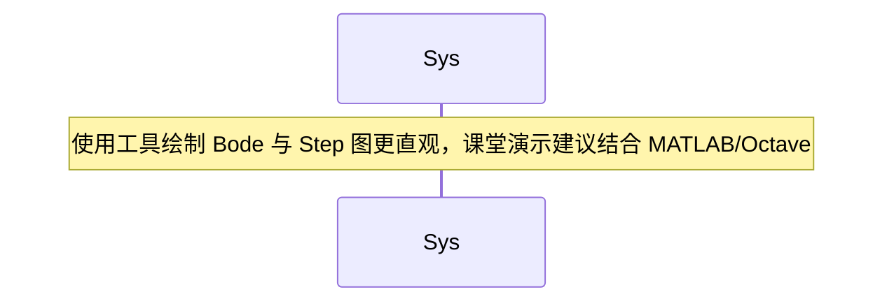
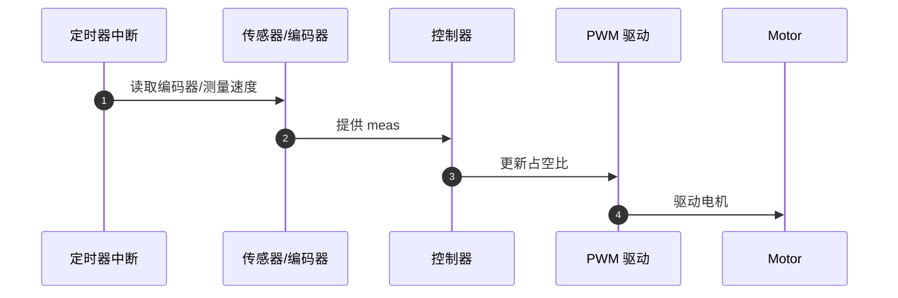

# 第9章 闭环控制与 PID

本章核心内容：闭环反馈控制基本理论、PID 控制器原理与分析方法、离散化与嵌入式实现要点、控制器调参方法、以及工程实例（直流电机速度闭环控制）。本章目标面向研究生层次，注重理论推导与工程实现结合，提供必要的图形与表格辅助理解，并包含可运行的核心代码片段与习题。

学习目标：

- 理解闭环控制系统的基本结构、传递函数表示与稳态/瞬态性能指标。
- 掌握 PID 控制器的作用原理、频域与时域分析以及常用调参方法（如 Ziegler–Nichols、频域整定）。
- 能够在资源受限的嵌入式平台上实现离散 PID，处理采样、反风（anti-windup）、滤波与定点实现问题。
- 能够设计并验证一个基于嵌入式系统的闭环控制工程（例：直流电机速度控制），并进行性能评估与调整。

---

## 9.1 闭环反馈控制基础

图形优先：闭环控制标准框图

```mermaid
flowchart TD
  R[参考输入 R(s)] -->|误差 e(s)=R(s)-Y(s)| Summing[Σ]
  Summing --> C[控制器 C(s)]
  C --> U[控制量 U(s)]
  U --> Plant[G(s)]
  G --> Y[被控对象 Y(s)]
  Y -->|反馈| Summing
  Dist[干扰 D(s)] -->|加到被控对象| G
```

关键概念：误差、控制器、被控对象（对象模型常以传递函数 G(s) 表达）、闭环传递函数 H_cl(s) = C(s)G(s) / (1 + C(s)G(s))。性能指标包括响应时间、稳态误差、过冲、相位裕度与增益裕度等。

短文补充：通过极点-零点分析可以判断系统的稳定性与瞬态响应；Nyquist、Bode 与根轨迹是频域与复平面分析的主要工具，适合用于控制器设计与鲁棒性分析。

---

## 9.2 PID 控制器原理

PID（比例-积分-微分）控制器是工程上最常用的控制器之一，其连续时间形式为：

C(s) = K_p + K_i / s + K_d * s

图形：PID 算法功能分解

```mermaid
flowchart LR
  E[误差 e(t)] -->|比例| P[Kp*e(t)]
  E -->|积分| I[K_i * \int e(t) dt]
  E -->|微分| D[K_d * de(t)/dt]
  P --> SUM
  I --> SUM
  D --> SUM
  SUM --> U[控制量 u(t)]
```

- 比例项 (P)：提供与误差成比例的控制作用，能减小稳态误差但可能产生稳态偏差；
- 积分项 (I)：累积误差以消除稳态误差，但会降低相位裕度并可能引起超调与振荡；
- 微分项 (D)：对误差变化率反应，改善稳态前的阻尼与响应速度，但对噪声敏感。

表格：PID 参数对系统作用简述

| 参数 | 主效应 | 风险/注意事项 |
|---|---:|---|
| Kp | 增强响应速度，降低稳态误差 | 过大引起超调或振荡 |
| Ki | 消除稳态误差 | 增大系统低频增益，可能导致震荡、积分饱和 |
| Kd | 增加阻尼，改善超调 | 对高频噪声敏感，需要滤波 |

---

## 9.3 PID 的时域与频域分析

- 时域指标：上升时间、峰值时间、过冲、调节时间、稳态误差。
- 频域指标：相位裕度与增益裕度用于衡量系统鲁棒性。

图示：典型二阶系统的阶跃响应对比（增益/阻尼变化）



短文补充：在设计 PID 时需要在性能（快速响应）与鲁棒性（相位裕度）之间折中，频域方法便于控制器设计满足相位/增益裕度约束。

---

## 9.4 调参方法概述

表格：常用整定方法对比

| 方法 | 优点 | 缺点 | 适用场景 |
|---|---:|---|---|
| Ziegler–Nichols（临界比例）| 快速获得初始参数 | 常导致较大超调，不适合高精度控制 | 经验初始整定 |
| Cohen–Coon | 适用于具有显著迟滞的系统 | 需实验识别一阶加时滞模型 | 流程工业间歇调试 |
| 频域整定（相位/增益裕度） | 可保证鲁棒性 | 需要频域模型与工具 | 要求鲁棒性的场景 |
| 优化方法（LQR/鲁棒优化） | 最优或鲁棒性能 | 计算复杂度高 | 高级研究或性能优化 |

Ziegler–Nichols (闭环) 简要步骤：
1) 将 Ki、Kd 设为 0，增大 Kp 直到系统出现持续振荡，记录临界增益 K_u 与振荡周期 T_u；
2) 根据表格设置 Kp、Ki、Kd 的初值（经验公式）。

---

## 9.5 离散化与嵌入式实现关键问题

- 离散化：实际嵌入式控制器以采样周期 T_s 运行，PID 需离散化。常用差分形式（前向欧拉/后向欧拉/双线性）示例：

差分实现（增量形式）:

u[k] = u[k-1] + Kp*(e[k]-e[k-1]) + Ki*T_s*e[k] + Kd*(e[k]-2e[k-1]+e[k-2])/T_s

- 抗积分饱和（Anti-windup）：当控制器输出受限（饱和）时，积分器应停止积累或采取回退策略，避免积分风up导致的长时间越调。
- 微分滤波：真实系统含测量噪声，直接差分放大会放大量高频噪声，推荐使用带滤波器的微分项（如一阶低通滤波）或在测量端滤波。
- 定点/浮点实现：嵌入式 MCU 资源受限，定点实现需注意溢出与量化误差；浮点实现（FPU）若可用则更简单、精度更高。
- 采样周期选择：采样频率要远高于被控对象带宽（通常 10~20 倍）以保证稳定性与控制精度。

表格：嵌入式实现关注点

| 项目 | 要点 |
|---|---|
| 采样周期 T_s | 选取需确保 Nyquist 与控制带宽要求 |
| Anti-windup | 限制积分项累积或回退策略 |
| 微分滤波 | 使用低通滤波器降低噪声敏感性 |
| 数值实现 | 定点需缩放与饱和检测，浮点需注意性能 |

---

## 9.6 工程实例：DC 电机速度闭环控制

### 实例背景

目标：通过嵌入式控制器实现直流电机的速度闭环控制，传感器为增量编码器，执行器为 PWM 驱动 H 桥，要求低稳态误差、合适的上升时间并鲁棒对负载扰动。

系统简化模型（近似一阶）：

G(s) = K/(τ s + 1)

图形：控制系统框图

```mermaid
flowchart TD
  Ref[目标速度 ω_ref] -->|误差 e| SUM[Σ]
  SUM --> PID[离散 PID]
  PID --> PWM[占空比 u]
  PWM --> Motor[电机 + 驱动 G(z)]
  Motor --> Encoder[编码器测量]
  Encoder -->|采样| Feedback[量化成 ω_meas]
  Feedback --> SUM
```

### 核心代码（嵌入式 C，FreeRTOS 或裸机皆可）

```c
/* 简化离散 PID 实现（增量式），在定时器中断或控制任务运行 */
typedef struct {
    float Kp, Ki, Kd;    // 控制器参数（浮点示例）
    float Ts;            // 采样周期（秒）
    float e_prev[2];     // 误差缓存 e[k-1], e[k-2]
    float u_prev;        // 上一次控制量 u[k-1]
    float u_min, u_max;  // 输出饱和限制
} PID_t;

void pid_init(PID_t *pid, float Kp, float Ki, float Kd, float Ts, float umin, float umax) {
    pid->Kp = Kp; pid->Ki = Ki; pid->Kd = Kd; pid->Ts = Ts;
    pid->e_prev[0] = pid->e_prev[1] = 0.0f;
    pid->u_prev = 0.0f;
    pid->u_min = umin; pid->u_max = umax;
}

float pid_update(PID_t *pid, float ref, float meas) {
    float e = ref - meas;
    // 增量式 PID：u[k] = u[k-1] + P + I + D
    float P = pid->Kp * (e - pid->e_prev[0]);
    float I = pid->Ki * pid->Ts * e; // 简单积分项
    float D = pid->Kd * ( (e - 2*pid->e_prev[0] + pid->e_prev[1]) / pid->Ts );

    float u = pid->u_prev + P + I + D;

    // 饱和与 anti-windup（反向回退积分）
    if (u > pid->u_max) u = pid->u_max;
    if (u < pid->u_min) u = pid->u_min;

    // 更新状态
    pid->e_prev[1] = pid->e_prev[0];
    pid->e_prev[0] = e;
    pid->u_prev = u;
    return u;
}

/* 在定时中断/控制循环中调用 */
void control_loop(void) {
    float ref = desired_rpm;
    float meas = encoder_get_rpm();
    float duty = pid_update(&g_pid, ref, meas);
    pwm_set_duty(duty);
}
```

代码要点说明：
- 使用增量式 PID 减少积分风up 风险并便于实现 anti-windup；
- 在资源受限平台上可将浮点改为定点实现（固定小数点缩放），并注意溢出保护；
- 建议将控制循环放在定时中断或高优先级控制任务中，确保采样周期稳定。

时序图：采样与控制执行



实验验证建议：
- 初步按经验整定（如 Ziegler–Nichols）获取初始参数，随后在实际系统上微调以满足过冲与稳态误差要求；
- 使用阶跃响应与扰动响应评估闭环性能，记录上升时间、过冲、稳态误差和稳态功耗；
- 若系统含噪声，考虑对速度测量滤波并为微分项增加滤波器。

---

## 9.7 高级主题与扩展

- 前馈控制（Feedforward）：结合模型预补偿减少稳态与瞬态误差，常与 PID 结合使用。
- 鲁棒控制与自适应控制：适用于参数不确定或环境变化大的系统。
- 数字控制理论：Z 变换、离散域频率响应与样本保持（ZOH）分析。

---

## 9.8 本章测试题（mkdocs-quiz 格式）

::: quiz

# 单项选择题（1 分）

Q1: 在离散 PID 的实现中，为减少微分项对测量噪声的敏感性，通常采取的措施是：
- A: 增大 Ki
- B: 在微分项上加入低通滤波
- C: 增大采样周期
- D: 使用更高分辨率 ADC

Answer: B
解析: 微分项对高频噪声敏感，常在微分路径上加入一阶低通滤波以抑制噪声影响。

---

# 多项选择题（2 分）

Q2: 关于积分风up（integrator windup），下列哪些措施可用来缓解？（多选）
- A: 输出饱和时停止积分累积
- B: 使用增量式 PID
- C: 增大 Kp
- D: 使用 anti-windup 回退策略

Answer: A;B;D
解析: 输出饱和时停止积分、增量形式可减小风up，anti-windup 回退策略直接限制或修正积分项；增大 Kp 并不能缓解反而可能加剧问题。

---

# 简答题（6 分）

Q3: 简述 Ziegler–Nichols 闭环整定法的基本步骤，并说明其局限性。

Answer: 步骤：将 Ki、Kd 置零，增大 Kp 直到系统出现持续振荡，记录临界增益 K_u 与振荡周期 T_u，然后根据 Z–N 表格计算 Kp、Ki、Kd 的初值。局限性：通常会得到较为激进的参数，导致较大超调，不适合对超调敏感或需要高精度控制的场合，只能作为初始整定参考。

---

# 综合应用题（10 分）

Q4: 在示例的直流电机速度控制中，若系统在负载突增时出现较大的超调和振荡，请给出三项可能的改进措施并说明原理。

Answer 要点示例：
- 降低 Kp 或增加 Kd，以提高阻尼；
- 引入前馈控制（根据负载或参考变化提供预补偿）；
- 对速度测量进行滤波并为微分项添加滤波器，减少噪声放大导致的不稳定性。

:::

---

本章参考资料：控制系统工程教材（Ogata）、数字控制与 MATLAB/Octave 仿真工具、嵌入式控制实战文献及 FreeRTOS/裸机实现指南。

*注：本章图形均使用 Mermaid 语法以便于 mkdocs 渲染；工程实践建议结合仿真工具（MATLAB/Octave）与示波器/逻辑分析仪验证真实时序。*