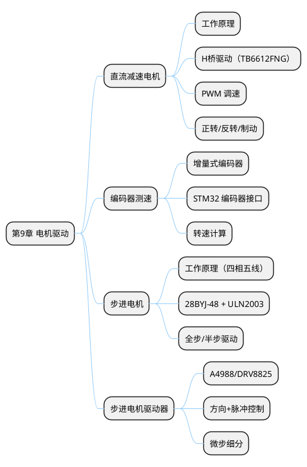

## 9 第 9 章 电机驱动

> 电机是嵌入式系统中最常用的执行器，将电信号转化为机械运动。本章介绍直流减速电机与步进电机的驱动原理及 STM32 实现，涵盖 H 桥驱动芯片 TB6612FNG、PWM 调速、步进电机驱动和编码器测速。

### 9.1 本章知识导图



**图 9-1** 本章知识导图：直流减速电机与步进电机的驱动编程。
<!-- fig:ch9-1 本章知识导图：直流减速电机与步进电机的驱动编程。 -->

### 9.2 直流减速电机

直流减速电机由直流电机和减速齿轮箱组成，以较低转速输出较大扭矩，广泛用于传送带驱动、阀门控制和小型车辆等场景。

#### 9.2.1 PWM 调速原理

电机转速与施加电压成正比。PWM（Pulse Width Modulation）通过快速开关控制平均电压实现无级调速：

$$V_{avg} = V_{supply} \times D$$

其中 $D = \frac{t_{on}}{T}$ 为占空比（0%~100%）。

**表 9-1** PWM 占空比与电机行为
<!-- tab:ch9-1 PWM 占空比与电机行为 -->

| 占空比 | 平均电压（12V供电） | 电机行为 |
|:------:|:------------------:|---------|
| 0% | 0V | 停止 |
| 25% | 3V | 低速运转 |
| 50% | 6V | 中速运转 |
| 75% | 9V | 高速运转 |
| 100% | 12V | 全速运转 |

#### 9.2.2 H 桥驱动原理

MCU 的 GPIO 无法直接驱动电机（GPIO 输出电流仅 20mA，电机通常需要 100mA~数 A）。H 桥驱动电路作为功率放大器，将 MCU 的控制信号转化为大电流驱动：

```bob
         VCC
          │
    ┌─────┼─────┐
    │     │     │
  ┌─┴─┐       ┌─┴─┐
  │ Q1 │       │ Q2 │
  │PMOS│       │PMOS│
  └─┬─┘       └─┬─┘
    │   ┌─────┐  │
    ├───┤Motor├──┤
    │   └─────┘  │
  ┌─┴─┐       ┌─┴─┐
  │ Q3 │       │ Q4 │
  │NMOS│       │NMOS│
  └─┬─┘       └─┬─┘
    │     │     │
    └─────┼─────┘
          │
         GND
```

**图 9-2** H 桥驱动电路原理：通过四个开关管控制电流方向，实现电机正转、反转和制动。
<!-- fig:ch9-2 H 桥驱动电路原理：通过四个开关管控制电流方向，实现电机正转、反转和制动。 -->

**表 9-2** H 桥控制逻辑
<!-- tab:ch9-2 H 桥控制逻辑 -->

| Q1 | Q2 | Q3 | Q4 | 电机状态 |
|:--:|:--:|:--:|:--:|---------|
| ON | OFF | OFF | ON | 正转（电流 VCC→Q1→Motor→Q4→GND） |
| OFF | ON | ON | OFF | 反转（电流 VCC→Q2→Motor→Q3→GND） |
| OFF | OFF | OFF | OFF | 滑行（自由停止） |
| ON | OFF | ON | OFF | 制动（电机短路刹车） |

#### 9.2.3 TB6612FNG 驱动芯片

TB6612FNG 是东芝推出的双 H 桥电机驱动芯片，可同时驱动两路直流电机，是嵌入式领域最常用的小型电机驱动方案。

**表 9-3** TB6612FNG 关键参数
<!-- tab:ch9-3 TB6612FNG 关键参数 -->

| 参数 | 值 |
|------|-----|
| 电机电压范围 | 2.5V ~ 13.5V |
| 单路持续电流 | 1.2A（峰值 3.2A） |
| 逻辑电平 | 2.7V ~ 5.5V |
| 内置续流二极管 | 是 |
| 控制引脚 | AIN1/AIN2/PWMA（通道A）+ BIN1/BIN2/PWMB（通道B）+ STBY |

**STM32 与 TB6612FNG 连接：**

**表 9-4** TB6612FNG 接线表（通道 A）
<!-- tab:ch9-4 TB6612FNG 接线表（通道 A） -->

| TB6612 引脚 | STM32 引脚 | 功能 |
|------------|-----------|------|
| AIN1 | PA4 (GPIO) | 方向控制 1 |
| AIN2 | PA5 (GPIO) | 方向控制 2 |
| PWMA | PA6 (TIM3_CH1) | PWM 调速 |
| STBY | 3.3V | 使能（高电平有效） |
| VM | 外部电机电源 | 电机供电（如 12V） |
| GND | GND（共地） | 必须与 STM32 共地 |

```c
/* TB6612FNG 电机驱动 */

typedef enum {
    MOTOR_STOP = 0,
    MOTOR_FORWARD,
    MOTOR_BACKWARD,
    MOTOR_BRAKE
} MotorDir;

void Motor_SetDir(MotorDir dir)
{
    switch (dir) {
        case MOTOR_FORWARD:
            HAL_GPIO_WritePin(GPIOA, GPIO_PIN_4, GPIO_PIN_SET);
            HAL_GPIO_WritePin(GPIOA, GPIO_PIN_5, GPIO_PIN_RESET);
            break;
        case MOTOR_BACKWARD:
            HAL_GPIO_WritePin(GPIOA, GPIO_PIN_4, GPIO_PIN_RESET);
            HAL_GPIO_WritePin(GPIOA, GPIO_PIN_5, GPIO_PIN_SET);
            break;
        case MOTOR_BRAKE:
            HAL_GPIO_WritePin(GPIOA, GPIO_PIN_4, GPIO_PIN_SET);
            HAL_GPIO_WritePin(GPIOA, GPIO_PIN_5, GPIO_PIN_SET);
            break;
        default:  /* MOTOR_STOP */
            HAL_GPIO_WritePin(GPIOA, GPIO_PIN_4, GPIO_PIN_RESET);
            HAL_GPIO_WritePin(GPIOA, GPIO_PIN_5, GPIO_PIN_RESET);
            break;
    }
}

void Motor_SetSpeed(uint16_t duty)
{
    /* duty: 0~999, 对应 TIM3 ARR=999 */
    __HAL_TIM_SET_COMPARE(&htim3, TIM_CHANNEL_1, duty);
}

/* 使用示例 */
void Motor_Run(MotorDir dir, uint16_t speed)
{
    Motor_SetDir(dir);
    Motor_SetSpeed(speed);
}
```

---

### 9.3 编码器测速

增量式光电编码器输出 A/B 两路正交脉冲信号，可同时检测转速和旋转方向。STM32 定时器内置编码器接口，可硬件计数无需 CPU 干预。

#### 9.3.1 编码器原理

编码器盘上均匀分布光栅，A/B 两路信号相位差 90°。通过判断 A 相超前还是 B 相超前确定旋转方向：

```bob
  正转 (A 超前 B):           反转 (B 超前 A):
           ┌──┐  ┌──┐              ┌──┐  ┌──┐
  A ───────┘  └──┘  └──     A ───┘  └──┘  └──────
        ┌──┐  ┌──┐              ┌──┐  ┌──┐
  B ────┘  └──┘  └──────     B ────────┘  └──┘  └──
```

**图 9-3** 
<!-- fig:ch9-3  -->

转速计算（M 法，测频法）：

$$n = \frac{\Delta Count}{C_{ppr} \times 4 \times \Delta t} \times 60 \text{ (RPM)}$$

其中 $C_{ppr}$ 为编码器每转脉冲数，×4 为四倍频（STM32 编码器接口默认四倍频）。

#### 9.3.2 STM32 编码器接口配置

**CubeMX 配置：**

- TIM4 → Encoder Mode → Encoder Mode TI1 and TI2
- PA6 (TIM4_CH1) → Encoder A 相
- PA7 (TIM4_CH2) → Encoder B 相
- Counter Period (ARR) = 65535
- Encoder Mode: TI1 and TI2（四倍频）

```c
/* 编码器初始化与读取 */
void Encoder_Start(void)
{
    HAL_TIM_Encoder_Start(&htim4, TIM_CHANNEL_ALL);
}

int32_t Encoder_GetCount(void)
{
    return (int16_t)__HAL_TIM_GET_COUNTER(&htim4);
}

void Encoder_ResetCount(void)
{
    __HAL_TIM_SET_COUNTER(&htim4, 0);
}

/* 每 100ms 采样一次计算转速（RPM） */
float Encoder_GetRPM(uint16_t ppr)
{
    int32_t count = Encoder_GetCount();
    Encoder_ResetCount();
    /* 100ms 采样间隔，四倍频 */
    return (float)count / (ppr * 4.0f) * 600.0f;  /* ×60/0.1 = ×600 */
}
```

---

### 9.4 步进电机

步进电机将电脉冲信号转化为精确的角位移，每接收一个脉冲旋转一个固定步距角，适用于需要精确定位的场景（如 3D 打印机、CNC、灌溉阀门定位）。

#### 9.4.1 28BYJ-48 + ULN2003 驱动

28BYJ-48 是常见的 5V 四相五线步进电机，配合 ULN2003 达林顿管驱动板使用。

**表 9-5** 28BYJ-48 参数
<!-- tab:ch9-5 28BYJ-48 参数 -->

| 参数 | 值 |
|------|-----|
| 工作电压 | 5V DC |
| 步距角 | 5.625°/64（减速比 1:64） |
| 每转步数 | 4096 步（半步模式）/ 2048 步（全步模式） |
| 驱动方式 | ULN2003 达林顿管阵列 |

**全步驱动时序（四拍）：**

**表 9-6** 全步驱动时序
<!-- tab:ch9-6 全步驱动时序 -->

| 步序 | IN1 | IN2 | IN3 | IN4 |
|:----:|:---:|:---:|:---:|:---:|
| 1 | 1 | 1 | 0 | 0 |
| 2 | 0 | 1 | 1 | 0 |
| 3 | 0 | 0 | 1 | 1 |
| 4 | 1 | 0 | 0 | 1 |

```c
/* 28BYJ-48 步进电机驱动（全步模式） */

/* IN1~IN4 连接到 PB12~PB15 */
static const uint8_t step_seq[4] = {0x03, 0x06, 0x0C, 0x09};
static uint8_t step_index = 0;

static void Stepper_SetPhase(uint8_t phase)
{
    HAL_GPIO_WritePin(GPIOB, GPIO_PIN_12,
                      (phase & 0x01) ? GPIO_PIN_SET : GPIO_PIN_RESET);
    HAL_GPIO_WritePin(GPIOB, GPIO_PIN_13,
                      (phase & 0x02) ? GPIO_PIN_SET : GPIO_PIN_RESET);
    HAL_GPIO_WritePin(GPIOB, GPIO_PIN_14,
                      (phase & 0x04) ? GPIO_PIN_SET : GPIO_PIN_RESET);
    HAL_GPIO_WritePin(GPIOB, GPIO_PIN_15,
                      (phase & 0x08) ? GPIO_PIN_SET : GPIO_PIN_RESET);
}

/* 转动指定步数（正数正转，负数反转） */
void Stepper_Move(int32_t steps, uint16_t delay_ms)
{
    int8_t dir = (steps > 0) ? 1 : -1;
    int32_t abs_steps = (steps > 0) ? steps : -steps;

    for (int32_t i = 0; i < abs_steps; i++) {
        step_index = (step_index + dir + 4) % 4;
        Stepper_SetPhase(step_seq[step_index]);
        HAL_Delay(delay_ms);
    }
    /* 停止后关闭所有相（降低功耗） */
    Stepper_SetPhase(0x00);
}

/* 转动指定角度 */
void Stepper_MoveAngle(float angle, uint16_t delay_ms)
{
    /* 28BYJ-48 全步模式每步 = 5.625°/64 ≈ 0.0879° */
    int32_t steps = (int32_t)(angle / 0.0879f);
    Stepper_Move(steps, delay_ms);
}
```

#### 9.4.2 A4988 步进电机驱动器

A4988 适用于 NEMA 17 等双极步进电机，支持最高 1/16 微步细分，仅需两根控制线（STEP + DIR）。

**表 9-7** A4988 驱动器控制接口
<!-- tab:ch9-7 A4988 驱动器控制接口 -->

| 引脚 | 功能 | STM32 连接 |
|------|------|-----------|
| STEP | 脉冲输入（每个上升沿走一步） | PA8 (TIM1_CH1 PWM) |
| DIR | 方向控制（高/低电平） | PA9 (GPIO) |
| ENABLE | 使能（低电平有效） | PA10 (GPIO) |
| MS1/MS2/MS3 | 微步选择 | GPIO 或固定电平 |

```c
/* A4988 步进电机驱动 */

void A4988_Enable(uint8_t en)
{
    HAL_GPIO_WritePin(GPIOA, GPIO_PIN_10,
                      en ? GPIO_PIN_RESET : GPIO_PIN_SET);
}

void A4988_SetDir(uint8_t forward)
{
    HAL_GPIO_WritePin(GPIOA, GPIO_PIN_9,
                      forward ? GPIO_PIN_SET : GPIO_PIN_RESET);
}

/* 使用 TIM1 PWM 输出步进脉冲 */
void A4988_SetSpeed(uint32_t steps_per_sec)
{
    if (steps_per_sec == 0) {
        HAL_TIM_PWM_Stop(&htim1, TIM_CHANNEL_1);
        return;
    }
    /* PSC=71, ARR 根据频率计算 */
    uint32_t arr = 1000000 / steps_per_sec - 1;
    __HAL_TIM_SET_AUTORELOAD(&htim1, arr);
    __HAL_TIM_SET_COMPARE(&htim1, TIM_CHANNEL_1, arr / 2);
    HAL_TIM_PWM_Start(&htim1, TIM_CHANNEL_1);
}
```

---

### 9.5 本章小结

本章介绍了嵌入式系统中两类主要电机的驱动方法：

- **直流减速电机**：PWM 调速原理、H 桥驱动电路、TB6612FNG 驱动芯片的接线与编程
- **编码器测速**：增量式编码器原理、STM32 硬件编码器接口、转速计算
- **步进电机**：全步/半步驱动时序、28BYJ-48 + ULN2003、A4988 驱动器

电机驱动是嵌入式系统"输出"环节的核心，与传感器（第 7 章）和 PID 控制器（第 10 章）配合，可构建完整的闭环控制系统。

---

### 9.6 习题

1. 说明 PWM 调速的原理，为什么改变占空比可以改变电机转速？
2. 画出 H 桥电路原理图，说明如何实现正转、反转和制动。
3. TB6612FNG 的 AIN1、AIN2 和 PWMA 三个引脚如何配合控制电机的方向和速度？
4. STM32 编码器接口的"四倍频"是什么意思？对转速测量精度有何影响？
5. 设计一个智能灌溉阀门控制方案：使用步进电机精确控制阀门开度（0~90°），要求支持串口指令设置目标角度。
