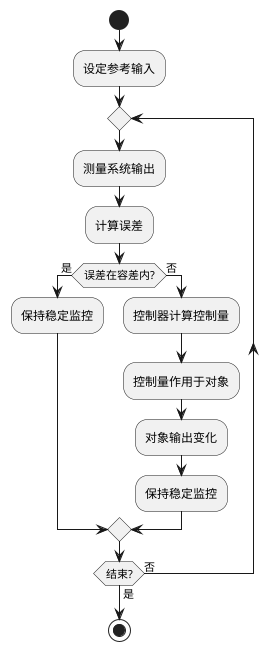
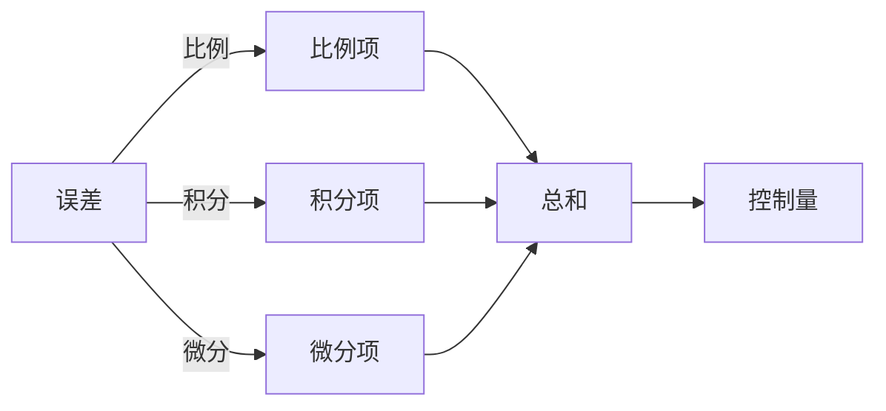

# 第9章 闭环控制与 PID

本章核心内容：闭环反馈控制基本理论、PID 控制器原理与分析方法、离散化与嵌入式实现要点、控制器调参方法、以及工程实例（直流电机速度闭环控制）。本章目标面向研究生层次，注重理论推导与工程实现结合，提供必要的图形与表格辅助理解，并包含可运行的核心代码片段与习题。

学习目标：

- 理解闭环控制系统的基本结构、传递函数表示与稳态/瞬态性能指标。
- 掌握 PID 控制器的作用原理、频域与时域分析以及常用调参方法（如 Ziegler–Nichols、频域整定）。
- 能够在资源受限的嵌入式平台上实现离散 PID，处理采样、反风（anti-windup）、滤波与定点实现问题。
- 能够设计并验证一个基于嵌入式系统的闭环控制工程（例：直流电机速度控制），并进行性能评估与调整。

---

## 9.1 闭环反馈控制基础

图形优先：闭环控制标准框图

```text
                       ┌─────────────────┐
                       │   参考输入 r(t)  │
                       │   (设定值)       │
                       └────────┬────────┘
                                │
                                ▼
                       ┌─────────────────┐
                       │     -  Σ  +     │◄──────────────────┐
                       └────────┬────────┘                   │
                                │                            │
                                ▼                            │
                       ┌─────────────────┐                   │
                       │   控制器 C(s)    │                   │
                       └────────┬────────┘                   │
                                │                            │
                                ▼                            │
                       ┌─────────────────┐                   │
                       │   控制信号 u(t)  │                   │
                       └────────┬────────┘                   │
                                │                            │
                                ▼                            │
                       ┌─────────────────┐                   │
                  ┌───►│  被控对象 G(s)  │                   │
                  │    └────────┬────────┘                   │
                  │             │                            │
                  │             ▼                            │
                  │    ┌─────────────────┐                   │
                  │    │  系统输出 y(t)   │                   │
                  │    └────────┬────────┘                   │
                  │             │                            │
                  │             └────────────────────────────┘
                  │
           ┌──────┴──────┐
           │   干扰 d(t) │
           └─────────────┘
```

### 框图详细解释

1. **参考输入 r(t)**：这是系统期望达到的目标值，也称为设定值。例如，在电机速度控制中，参考输入就是我们想要电机达到的转速（如1000 RPM）；在温度控制中，参考输入就是设定的目标温度（如60°C）。

2. **求和节点 Σ**：这个节点将参考输入与反馈信号进行比较，计算出误差信号。误差 e(t) = r(t) - y(t)。如果系统输出与目标值完全一致，误差为零。这里的负号表示反馈是负反馈，这是保证系统稳定的关键。

3. **控制器 C(s)**：控制器接收误差信号，根据特定的控制算法（如PID算法）计算出控制量。控制器的作用是根据误差大小来决定如何调整系统，使输出接近参考输入。在频域分析中，控制器用传递函数 C(s) 表示。

4. **控制信号 u(t)**：这是控制器的输出信号，直接作用于被控对象。例如，在PWM电机控制中，控制量就是PWM的占空比（0-100%）；在电压控制中，控制量就是输出电压值。

5. **被控对象 G(s)**：这是我们实际要控制的物理系统或过程。例如：直流电机、加热炉、机械臂、液压系统等。被控对象接收控制量并产生相应的输出响应。在频域分析中，被控对象用传递函数 G(s) 表示。

6. **系统输出 y(t)**：这是被控对象的实际输出值，通过传感器测量得到。例如：电机的实际转速、加热器的实际温度、机械臂的实际位置等。

7. **反馈路径**：系统输出通过反馈路径回到求和节点，与参考输入进行比较。这是闭环控制系统区别于开环控制系统的关键特征。通过反馈，系统可以根据实际输出与期望输出的差异来自动调整控制策略。

8. **干扰 d(t)**：这是外部或内部的扰动因素，会影响被控对象的输出。例如：电机负载变化、电源电压波动、环境温度变化等。闭环控制的一个主要优势就是能够抑制干扰的影响，使系统输出保持在期望值附近。

### 闭环控制的工作原理



### 闭环控制流程详细说明

1. **开始**：闭环控制循环的起点。

2. **设定参考输入**：确定系统的目标值 r(t)，例如电机期望转速、温度设定值等。这是控制系统的期望输出。

3. **测量系统输出**：通过传感器实时测量被控对象的实际输出 y(t)，例如电机的实际转速、当前温度等。精确的测量是闭环控制的基础。

4. **计算误差**：将参考输入与实际输出进行比较，计算误差信号 e(t) = r(t) - y(t)。误差反映了系统当前状态与目标状态的差距。

5. **误差判断**：判断误差是否在可接受的容差范围内：
   - **是**：如果误差很小或为零，说明系统输出已经接近或达到目标值，此时保持输出稳定，继续监控。
   - **否**：如果误差较大，需要控制器进行调节。

6. **控制器计算控制量**：控制器（如 PID）根据误差信号 e(t)，按照预设的控制算法计算出控制量 u(t)。控制算法决定了系统的响应特性。

7. **控制量作用于被控对象**：将计算出的控制量 u(t) 施加到被控对象上，例如改变 PWM 占空比、调整电压等。

8. **被控对象输出变化**：被控对象接收控制信号后，其输出发生相应变化，向目标值靠近。

9. **反馈与循环**：新的输出值被反馈回来，系统回到测量步骤，重复上述过程，形成持续的闭环控制循环。

10. **结束判断**：根据应用需求，判断是否需要停止控制循环。如果需要，退出循环；否则继续运行。

通过这种持续的反馈和调整，闭环控制系统能够：
- 减小或消除稳态误差
- 提高系统响应速度
- 增强系统抗干扰能力
- 改善系统稳定性

关键概念：误差、控制器、被控对象（对象模型常以传递函数 G(s) 表达）、闭环传递函数 H_cl(s) = C(s)G(s) / (1 + C(s)G(s))。性能指标包括响应时间、稳态误差、过冲、相位裕度与增益裕度等。

短文补充：通过极点-零点分析可以判断系统的稳定性与瞬态响应；Nyquist、Bode 与根轨迹是频域与复平面分析的主要工具，适合用于控制器设计与鲁棒性分析。

---

## 9.2 PID 控制器原理

PID（比例-积分-微分）控制器是工程上最常用的控制器之一，其连续时间形式为：

C(s) = K_p + K_i / s + K_d * s

图形：PID 算法功能分解



- 比例项 (P)：提供与误差成比例的控制作用，能减小稳态误差但可能产生稳态偏差；
- 积分项 (I)：累积误差以消除稳态误差，但会降低相位裕度并可能引起超调与振荡；
- 微分项 (D)：对误差变化率反应，改善稳态前的阻尼与响应速度，但对噪声敏感。

表格：PID 参数对系统作用简述

| 参数 | 主效应 | 风险/注意事项 |
|---|---:|---|
| Kp | 增强响应速度，降低稳态误差 | 过大引起超调或振荡 |
| Ki | 消除稳态误差 | 增大系统低频增益，可能导致震荡、积分饱和 |
| Kd | 增加阻尼，改善超调 | 对高频噪声敏感，需要滤波 |

---

## 9.3 PID 的时域与频域分析

- 时域指标：上升时间、峰值时间、过冲、调节时间、稳态误差。
- 频域指标：相位裕度与增益裕度用于衡量系统鲁棒性。
