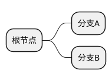

# 教材书写规范

本文档定义了《机器人系统》课程教材的书写标准与格式约定。所有对 `docs/` 目录下 Markdown 文件的修改都应遵循本规范。本规范从实际编写经验中提炼而来，目的是保持全书 19 章 + 3 附录的风格一致性，同时降低多人协作时的审查成本。

---

## 1. 文件结构

### 1.1 Frontmatter

每个章节文件**必须**以如下 YAML frontmatter 开头：

```yaml
---
number headings: first-level 2, start-at N
---
```

其中 `N` 为该章的编号（如第 6 章则 `start-at 6`）。

### 1.2 章节骨架

标准章节的结构如下（以第 N 章为例）：

```
---
number headings: first-level 2, start-at N
---

## N 第N章 章节标题

### N.1 本章知识导图（可选）

### N.2 第一节内容

### N.3 第二节内容

...

### N.X 本章小结

### N.Y 本章测验
```

### 1.3 文件命名

文件名决定了 URL 路径和 nav 配置中的引用方式，须保持统一命名风格：

| 类型 | 命名规则 | 示例 |
|------|---------|------|
| 正文章节 | `chapterN.md` | `chapter3.md` |
| 附录 | `appendix_x.md`（小写字母） | `appendix_a.md` |
| 其他页面 | 英文小写，短横线分隔 | `contributing.md` |

---

## 2. 标题层级与编号

标题层级直接影响站点目录（TOC）生成和页面内导航体验。本教材采用手动编号而非自动编号插件，以确保 PDF 导出和离线阅读时编号仍然清晰可见。各层级的用法如下表所示：

| Markdown 语法 | 用途 | 格式 | 示例 |
|-------------|------|------|------|
| `##` | 章标题 | `## N 第N章 标题` | `## 3 第3章 单片机编程` |
| `###` | 节标题 | `### N.M 标题` | `### 3.10 STM32 核心接口与外设` |
| `####` | 小节标题 | `#### N.M.K 标题` 或 `#### 标题` | `#### 3.10.4 CAN 总线编程实战` |
| `#####` | 子标题（少用） | `##### 标题` | `##### CubeMX 配置 CAN` |

**规则**：

- **禁用** `#`（H1），MkDocs Material 保留 H1 给页面标题
- 大节之间使用 `---` 分隔线
- 章节编号**手动**写在标题文本中（非自动生成）
- 编号连续递增，不跳号

---

## 3. 中英文混排

本教材面向中文读者，但机器人领域的术语以英文为主。处理好中英文混排对可读性至关重要——排版不统一会让读者频繁"换挡"，影响阅读节奏。

### 3.1 空格规则

- 中文与英文/数字之间**加一个空格**：`使用 STM32 芯片`
- 中文与行内代码之间**加一个空格**：`` 调用 `HAL_CAN_Init()` 函数 ``
- 英文与半角标点之间**不加空格**：`PID, MPC, LQR`

### 3.2 标点符号

- 中文语境使用**全角标点**：，。；：！？（）
- 英文缩写、代码中使用**半角标点**
- 括号内为纯英文时使用半角括号：`(Differential Drive)`
- 括号内含中文时使用全角括号：`（如图所示）`

### 3.3 专有名词

- 首次出现时标注英文全称：`卡尔曼滤波（Kalman Filter, KF）`
- 后续使用时可只写缩写或中文名
- 通用术语保持英文：`ROS2`、`STM32`、`PID`、`CAN`、`SLAM`
- 不翻译的缩写全大写，不加点号：`PWM`（非 `P.W.M.`）

---

## 4. 图表规范

### 4.1 svgbob 框图

使用 **` ```bob `** 围栏代码块（⚠️ **不是** ` ```svgbob `，后者会静默失败）：

````markdown
```bob
┌────────┐       ┌────────┐
│  模块A  │ ────> │  模块B  │
└────────┘       └────────┘
```
````

**关键规则**：

- 使用 Unicode Box Drawing 字符：`┌ ┐ └ ┘ │ ─ ├ ┤ ┬ ┴ ┼ ▶ ▼`
- 编程符号（函数名、路径、下划线、括号等）须用双引号包裹：`"HAL_CAN_Init()"` `"src/main.c"`
- CJK 字符占 2 列宽度，竖线对齐时须注意列宽计算
- 框图最小宽度 80 字符（`mkdocs.yml` 中 `min_char_width: 80`）

### 4.2 PlantUML

当框图逻辑较复杂（如时序图、思维导图、类图）时，svgbob 的纯文本方式可能难以维护。此时推荐使用 PlantUML，它通过声明式语法描述结构关系，由远程服务器渲染为 SVG：

````markdown

````

### 4.3 Markdown 表格

表格是本教材的**核心信息承载方式**——对比表、参数表、选型表贯穿全书各章。编写表格时须注意以下几点：

- 表头与内容对齐
- 列宽适中，避免单行过长
- 对比表、参数表、选型表是本教材的**核心表达方式**，鼓励多用

---

## 5. 代码块

### 5.1 语言标注

代码块必须标注语言类型，这不仅启用语法高亮（帮助读者区分关键字、字符串、注释），还能让 IDE 和 AI 工具正确理解代码上下文。禁止使用无语言标注的裸代码块。常用语言标注如下：

| 语言 | 标注 | 示例 |
|------|------|------|
| C/C++ | `c` 或 `cpp` | ` ```c ` |
| Python | `python` | ` ```python ` |
| YAML | `yaml` | ` ```yaml ` |
| XML | `xml` | ` ```xml ` |
| Shell | `bash` | ` ```bash ` |
| 伪代码 | `text` | ` ```text ` |

### 5.2 代码质量

- 单个代码块**不超过 60 行**，过长则拆分并加文字说明
- 关键逻辑行加**中文注释**
- 代码应可编译/运行（伪代码除外，需标注 `text`）
- 代码中的变量名使用英文，注释使用中文

### 5.3 代码上下文

- 代码块前须有**文字引导**，说明代码目的
- 代码块后须有**关键点解读**或**运行结果说明**

---

## 6. 数学公式

机器人学涉及大量数学推导（运动学矩阵、滤波方程、控制律等），公式是不可或缺的表达工具。本教材使用 KaTeX 渲染数学公式，它比 MathJax 更快且兼容性好。基本语法如下：

- **行内公式**：`$...$`，如 `速度 $v = r\omega$`
- **块级公式**：`$$...$$` 独占行

```markdown
$$
T = \begin{bmatrix} R & p \\ 0 & 1 \end{bmatrix}
$$
```

**规则**：

- `$$` 标记必须**独占一行**
- 公式中的变量首次出现时须在文字中释义
- 矩阵使用 `\begin{bmatrix}...\end{bmatrix}`
- 多行公式使用 `\begin{aligned}...\end{aligned}`

---

## 7. 引用与提示框

正文中经常需要对读者发出提示、警告或补充说明。统一使用 Markdown 引用语法（`> `），配合加粗的前缀标识来区分类型。以下是三种常用的提示框写法：

```markdown
> **注意**：这是一条重要提示。

> ⚠️ **警告**：此操作不可逆，请谨慎执行。

> 💡 **提示**：可以参考第 8 章的 PID 调参方法。
```

---

## 8. 测验编写

本教材使用 `mkdocs_quiz` 插件。

**整体结构**（用 `QUIZ_START` / `QUIZ_END` 代替实际标签）：

```text
### N.X 本章测验

EXAM_META: id="chapterN", title="第N章 章节标题测验"

QUIZ_START

1) 问题文本？

   错误选项 A       （用 - [ ] 标记）
   正确选项 B       （用 - [x] 标记）
   错误选项 C       （用 - [ ] 标记）
   错误选项 D       （用 - [ ] 标记）

   解析：解释为什么 B 正确。（用 > **解析**：标记）

2) 下一道题？

   正确答案         （用 - [x] 标记）
   干扰项           （用 - [ ] 标记）

   解析：补充说明。

QUIZ_END
```

> **说明**：上方 `QUIZ_START` 对应 HTML 标签 `<` + `quiz` + `>`，`QUIZ_END` 对应 `<` + `/quiz` + `>`。`EXAM_META` 对应一个 `div` 标签（含 `data-exam-id` 和 `data-exam-title` 属性）。请参考现有章节（如 chapter2.md 的测验节）获取实际格式。

**规则**：

- 题号使用 `N)` 格式（半角右括号）
- 选项使用 checkbox 语法：`[x]` 表示正确、`[ ]` 表示错误（前缀 `- `）
- 每题附 `> **解析**：` 块
- `data-exam-id` 与 `data-exam-title` 须匹配章节

---

## 9. 内部链接与资源

教材各章内容高度关联——控制章节引用运动学公式、导航章节依赖 SLAM 概念、实验章节调用多个理论章节的知识。合理的内部链接能帮助读者快速跳转到相关内容，避免重复叙述。链接约定如下：

- 章节间引用使用**相对路径**：`参见 [第 8 章](chapter8.md)`
- 章节内锚点链接：`详见 [3.10.4 节](#3104-can-总线编程实战)`
- 图片存放路径：`docs/assets/images/`
- JavaScript/CSS：`docs/assets/javascripts/`、`docs/assets/stylesheets/`

---

## 10. Git 提交与 PR 流程

### 10.1 分支命名

```
docs/chapter3-can-bus      # 章节内容修改
fix/chapter6-typo          # 修复错别字
feat/contributing-guide    # 新增功能页面
```

### 10.2 提交信息

遵循 **Conventional Commits** 规范：

```
docs(chapter3): 添加 CAN 总线编程实战节
fix(chapter6): 修正差速驱动公式中的符号错误
feat(contributing): 新增教材书写规范
```

### 10.3 PR 要求

- **单章节单 PR**：每个 PR 只修改一个章节（除非是全局修改）
- PR 描述须说明：修改了什么、为什么修改
- 提交前完成本地验证（见第 11 节）

---

## 11. 本地验证清单

提交 PR 前，请在本地完成以下验证流程。MkDocs 的本地预览功能可以发现绝大多数格式问题——从公式渲染失败到链接 404，都能在浏览器中直接看到。

```bash
# 1. 启动本地预览
mkdocs serve

# 2. 浏览器打开 http://127.0.0.1:8000 检查修改的页面
```

| # | 检查项 | 要点 |
|---|--------|------|
| 1 | **frontmatter** | 存在且 `start-at` 值正确 |
| 2 | **标题编号** | 连续递增，无跳号 |
| 3 | **bob 框图** | 使用 ` ```bob `（非 ` ```svgbob `），渲染正常 |
| 4 | **PlantUML** | 图表渲染正常 |
| 5 | **KaTeX 公式** | 渲染正常，`$$` 独占行 |
| 6 | **代码块** | 有语言标注，语法高亮正常 |
| 7 | **表格** | 对齐正确，表头完整 |
| 8 | **内部链接** | 可点击跳转 |
| 9 | **测验** | quiz 标签格式正确，选项可交互 |
| 10 | **中英文空格** | 符合第 3 节规则 |
| 11 | **构建** | `mkdocs build` 零错误 |

---

## 12. 常见错误与避坑

以下是过往编写和审查过程中反复出现的问题。每个错误都有明确的触发条件和修复方法——提交前快速浏览此表，可以避开大部分常见陷阱：

| 错误 | 现象 | 修复 |
|------|------|------|
| ` ```svgbob ` 替代 ` ```bob ` | 框图静默不渲染，无报错 | 改为 ` ```bob ` |
| frontmatter 缺失 | 标题编号异常 | 添加 `number headings` 元数据 |
| CJK 字符对齐 | bob 框图竖线错位 | CJK 字符占 2 列，调整空格补齐 |
| bob 中未包裹编程符号 | 下划线、括号被 svgbob 解释为图形 | 用 `"..."` 包裹 |
| `$$` 未独占行 | KaTeX 公式不渲染 | `$$` 上下各空一行 |
| 裸代码块 | 无语法高亮 | 添加语言标注 |
| quiz 标签嵌套错误 | 测验不交互 | 检查 quiz 开始/结束标签配对 |
