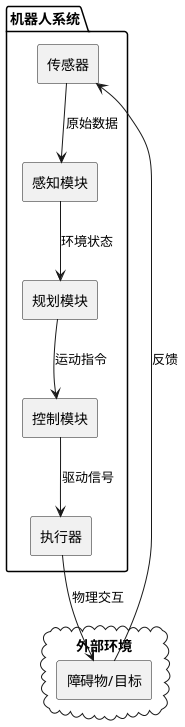

# 机器人系统课程

欢迎来到大学研究生《机器人系统》课程网站。本课程将介绍机器人系统的基础理论、关键技术与应用实践。

## 课程教师

**卢军** 教授 JLu Prof.

## 课程信息

- 课程目标：掌握机器人系统的设计、控制与应用。
- 适用对象：研究生、工程师、科研人员。

## 机器人系统架构示例

```plantuml
@startuml
skinparam componentStyle rectangle

package "机器人系统" {
  [感知模块] as Perception
  [规划模块] as Planning
  [控制模块] as Control
  [执行器]   as Actuator
  [传感器]   as Sensor
}

cloud "外部环境" {
  [障碍物/目标] as Environment
}

Sensor --> Perception : 原始数据
Perception --> Planning : 环境状态
Planning --> Control : 运动指令
Control --> Actuator : 驱动信号
Actuator --> Environment : 物理交互
Environment --> Sensor : 反馈
@enduml
```
